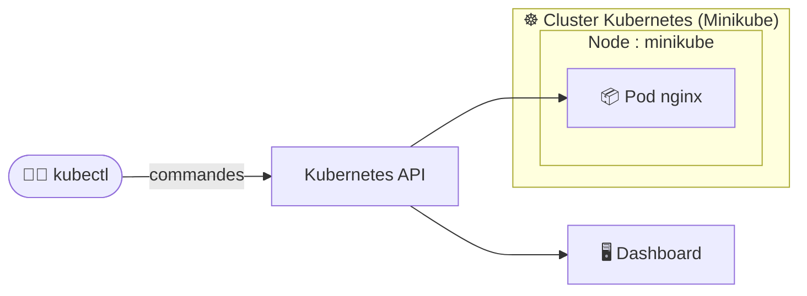
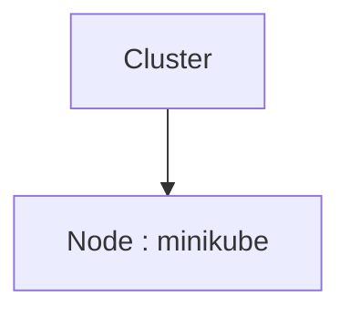
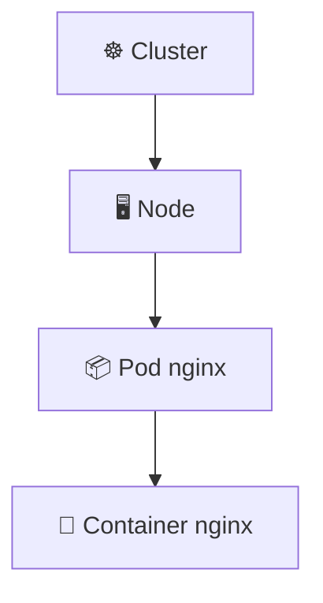
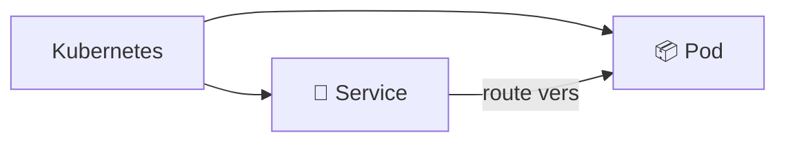
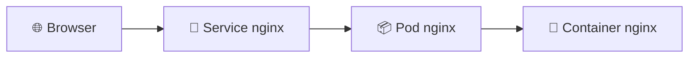
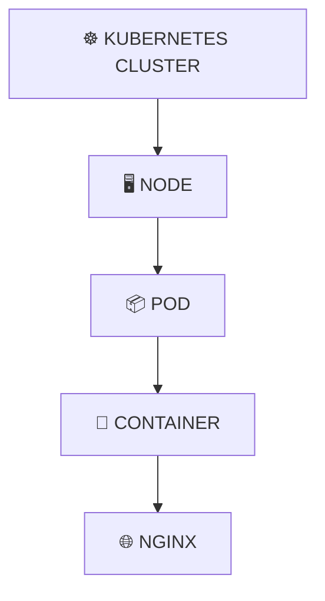
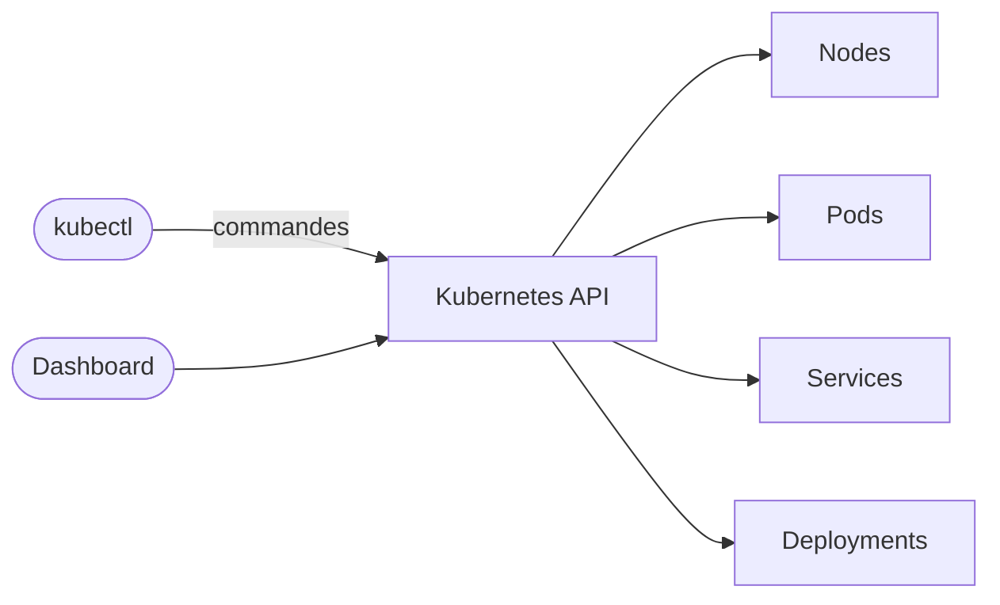

<div align="center">

# ☸️ TD 101 — Premier contact avec Kubernetes & Minikube


**Objectif :** passer de *« Kubernetes, c'est quoi ? »* → *« mon cluster tourne, j'ai créé mon premier Pod, je le vois dans le Dashboard, je sais l'interroger et le supprimer »*

</div>

---

## 📋 Sommaire

- [🎯 Objectifs pédagogiques](#-objectifs-pédagogiques)
- [🏗️ Architecture](#️-architecture)
- [Partie 1 — Installation](#partie-1--installation)
- [Partie 2 — Premier contact avec le cluster](#partie-2--premier-contact-avec-le-cluster)
- [Partie 3 — Premier Pod](#partie-3--premier-pod)
- [Partie 4 — Exposer l'application](#partie-4--exposer-lapplication)
- [Partie 5 — Le Dashboard](#partie-5--le-dashboard)
- [Partie 6 — Nettoyage](#partie-6--nettoyage)
- [🏆 Challenge](#-challenge)
- [❓ Quiz de fin](#-quiz-de-fin)
- [📝 Mémo](#-mémo)
- [🧠 À retenir](#-à-retenir)

---

## 🎯 Objectifs pédagogiques

À la fin du TD, vous devez savoir :

- [ ] installer et vérifier `kubectl`
- [ ] installer et démarrer Minikube
- [ ] comprendre les notions de **Cluster / Node / Namespace / Pod**
- [ ] accéder au Kubernetes Dashboard
- [ ] créer votre premier Pod
- [ ] consulter ses informations et ses logs
- [ ] exécuter une commande dans un Pod
- [ ] exposer temporairement un Pod
- [ ] supprimer un Pod
- [ ] utiliser les commandes Kubernetes de base

---

## 🏗️ Architecture

Une architecture volontairement très simple :



> [!IMPORTANT]
> **Minikube** nous permet de faire tourner un petit cluster Kubernetes **localement** sur notre ordinateur.

---

## Partie 1 — Installation

### 1.1 Vérifier le système

<details>
<summary>🍎 macOS / 🐧 Linux</summary>

```bash
uname -a
```
</details>

<details>
<summary>🪟 Windows PowerShell</summary>

```powershell
systeminfo
```
</details>

Puis vérifier que la **virtualisation** est disponible.

### 1.2 Installer `kubectl`

`kubectl` est le client en ligne de commande permettant de communiquer avec Kubernetes.

```bash
brew install kubectl
kubectl version --client
```

Résultat attendu :

```
Client Version: ...
```

> [!TIP]
> **Q1. À quoi sert `kubectl` ?**
> <details><summary>Réponse</summary>
>
> `kubectl` permet d'envoyer des commandes au cluster Kubernetes via l'**API Kubernetes**.
> </details>

### 1.3 Installer Minikube

```bash
brew install minikube
minikube version
```

### 1.4 Démarrer Kubernetes

```bash
minikube start
```

Minikube va :

1. 🧱 créer une VM ou un environnement de conteneur selon le driver ;
2. ☸️ installer Kubernetes ;
3. ⚙️ démarrer les composants du cluster ;
4. 🔧 configurer `kubectl`.

Résultat attendu :

```
Done! kubectl is now configured to use "minikube" cluster
```

---

## Partie 2 — Premier contact avec le cluster

### 2.1 Vérifier le contexte

```bash
kubectl config current-context   # → minikube
kubectl cluster-info
```

### 2.2 Découvrir les Nodes

```bash
kubectl get nodes
```

```
NAME       STATUS   ROLES           AGE   VERSION
minikube   Ready    control-plane   2m    v1.xx.x
```

> [!TIP]
> **Q2. Qu'est-ce qu'un Node ?**
> <details><summary>Réponse</summary>
>
> Un Node est une machine qui participe au cluster Kubernetes et sur laquelle Kubernetes peut exécuter des workloads.
> </details>



### 2.3 Première commande Kubernetes

```bash
kubectl get pods
```

```
No resources found in default namespace.
```

> [!NOTE]
> C'est normal : nous avons un cluster… mais **aucun Pod applicatif**.

### 2.4 Comprendre le Namespace

```bash
kubectl get namespaces
```

```
NAME              STATUS
default           Active
kube-node-lease   Active
kube-public       Active
kube-system       Active
```

Le Namespace `default` sera notre espace de travail.

---

## Partie 3 — Premier Pod

### 3.1 Créer le Pod

```bash
kubectl run nginx --image=nginx
# pod/nginx created
```

### 3.2 Observer le Pod

```bash
kubectl get pods
```

| Étape | Sortie |
|---|---|
| ⏳ Au début | `nginx   0/1   ContainerCreating   0   5s` |
| ✅ Quelques secondes plus tard | `nginx   1/1   Running   0   20s` |

🎉 **Vous venez de déployer votre premier workload Kubernetes.**

### 3.3 Comprendre ce qui vient de se passer



> [!WARNING]
> **Un Pod n'est pas un container.** Le Pod est une unité Kubernetes qui **encapsule** un ou plusieurs containers.

### 3.4 Informations détaillées

```bash
kubectl describe pod nginx
```

Chercher : `Name`, `Namespace`, `Node`, `Status`, `IP`, `Containers`, `Image`, `Events`.

> [!TIP]
> **Q3. Sur quel Node notre Pod tourne-t-il ?**
> <details><summary>Réponse</summary>
>
> ```bash
> kubectl get pod nginx -o wide
> ```
> ```
> NAME    READY   STATUS    IP           NODE
> nginx   1/1     Running   10.244.0.2   minikube
> ```
> </details>

### 3.5 Voir l'IP du Pod

```bash
kubectl get pod nginx -o wide
kubectl get pod nginx -o json
kubectl get pod nginx -o jsonpath='{.status.podIP}'
```

### 3.6 Consulter les logs

```bash
kubectl logs nginx
kubectl logs -f nginx   # -f = follow, CTRL+C pour arrêter
```

### 3.7 Entrer dans le Pod

```bash
kubectl exec -it nginx -- /bin/bash
```

À l'intérieur du container :

```bash
hostname
ls
cat /etc/os-release
ps
curl localhost   # → HTML de NGINX
exit
```

---

## Partie 4 — Exposer l'application

### 4.1 Pod ≠ Service

Pour l'instant, NGINX tourne dans le cluster mais **n'est pas accessible depuis votre navigateur**.



- Le **Pod** exécute l'application.
- Le **Service** fournit un mécanisme **stable** pour y accéder.

### 4.2 Exposer le Pod

```bash
kubectl expose pod nginx --port=80 --type=NodePort
kubectl get services
```

```
NAME         TYPE       CLUSTER-IP      PORT(S)
kubernetes   ClusterIP  10.96.0.1       443/TCP
nginx        NodePort   10.96.xxx.xxx   80:xxxxx/TCP
```

### 4.3 Accéder à NGINX

```bash
minikube service nginx
```

🎉 Le navigateur s'ouvre sur NGINX.



---

## Partie 5 — Le Dashboard

### 5.1 Lancer le Dashboard

```bash
minikube dashboard
```

```
Workloads
├── Pods
├── Deployments
└── ReplicaSets
Discovery and Load Balancing
└── Services
Cluster
├── Nodes
└── Namespaces
```

### 5.2 Faire le lien CLI ↔ Dashboard

| Commande | Dashboard |
|---|---|
| `kubectl get pods` | Workloads → Pods |
| `kubectl get services` | Discovery and Load Balancing → Services |
| `kubectl get nodes` | Cluster → Nodes |
| `kubectl describe pod nginx` | Pods → nginx → Details |

### 5.3 Explorer le Pod

Dans **Pods → nginx**, retrouver : Namespace, Node, Pod IP, Container, Image, Status, Restart count, Logs.

---

## Partie 6 — Nettoyage

```bash
kubectl delete pod nginx
kubectl get pods   # le Pod a disparu
```

> [!TIP]
> **Q4. Pourquoi Kubernetes ne recrée-t-il pas automatiquement notre Pod ?**
> <details><summary>Réponse</summary>
>
> Parce que nous avons créé directement un Pod, **sans Deployment** chargé de maintenir un nombre souhaité de replicas. 👉 Transition vers le TD suivant.
> </details>

---

## 🏆 Challenge

⏱️ **15–20 minutes en autonomie.** Créer un Pod `web` avec l'image `nginx:latest`, puis :

| # | Action | Solution |
|---|---|---|
| A | Créer le Pod | <details><summary>👁️</summary><code>kubectl run web --image=nginx:latest</code></details> |
| B | Vérifier qu'il fonctionne | <details><summary>👁️</summary><code>kubectl get pod</code></details> |
| C | Trouver son IP | <details><summary>👁️</summary><code>kubectl get pod -o wide</code></details> |
| D | Afficher ses informations | <details><summary>👁️</summary><code>kubectl describe pod web</code></details> |
| E | Afficher ses logs | <details><summary>👁️</summary><code>kubectl logs web</code></details> |
| F | Entrer dans le container | <details><summary>👁️</summary><code>kubectl exec -it web -- /bin/bash</code></details> |
| G | Tester NGINX | <details><summary>👁️</summary><code>curl localhost</code></details> |
| H | Quitter le container | <details><summary>👁️</summary><code>exit</code></details> |
| I | Supprimer le Pod | <details><summary>👁️</summary><code>kubectl delete pod web</code></details> |

---

## ❓ Quiz de fin

<details>
<summary><b>1. Quel outil permet de communiquer avec Kubernetes ?</b></summary>

`kubectl`
</details>

<details>
<summary><b>2. Qu'est-ce qu'un Node ?</b></summary>

Une machine faisant partie du cluster Kubernetes et capable d'exécuter des workloads.
</details>

<details>
<summary><b>3. Qu'est-ce qu'un Pod ?</b></summary>

La plus petite unité déployable de Kubernetes, pouvant contenir un ou plusieurs containers.
</details>

<details>
<summary><b>4. Quelle commande permet de voir les Pods ?</b></summary>

`kubectl get pods`
</details>

<details>
<summary><b>5. Pourquoi le Pod disparaît définitivement après <code>kubectl delete pod nginx</code> ?</b></summary>

Parce qu'il n'est contrôlé par aucun Deployment/ReplicaSet qui demanderait à Kubernetes de maintenir son existence.
</details>

---

## 📝 Mémo

| Commande | Fonction |
|---|---|
| `kubectl cluster-info` | Informations sur le cluster |
| `kubectl get nodes` | Liste des Nodes |
| `kubectl get pods` | Liste des Pods |
| `kubectl get pods -o wide` | Pods + IP + Node |
| `kubectl describe pod X` | Détails d'un Pod |
| `kubectl logs X` | Logs du Pod |
| `kubectl exec -it X -- /bin/bash` | Entrer dans le container |
| `kubectl get services` | Liste des Services |
| `kubectl delete pod X` | Supprimer un Pod |
| `minikube start` | Démarrer Kubernetes |
| `minikube stop` | Arrêter Kubernetes |
| `minikube status` | État de Minikube |
| `minikube dashboard` | Ouvrir le Dashboard |
| `minikube service X` | Accéder à un Service |

---

## 🧠 À retenir





> [!NOTE]
> **Dashboard et `kubectl` sont simplement deux façons différentes d'observer et de piloter le même cluster.**

---

<div align="center">

**Progression du cours :** Pod ➜ Deployment ➜ Service ➜ Configuration ➜ Application complète

➡️ [TD 102 — Deployments & ReplicaSets](../day2/intro.md)

</div>