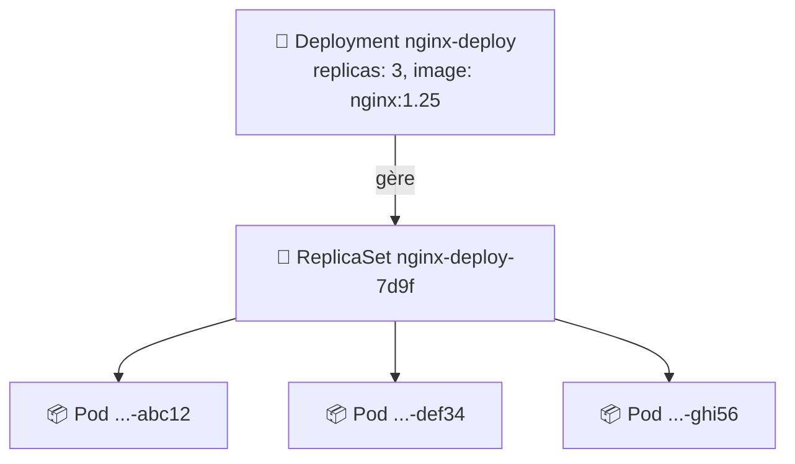
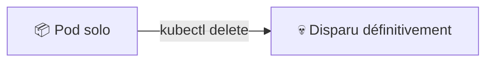
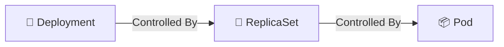
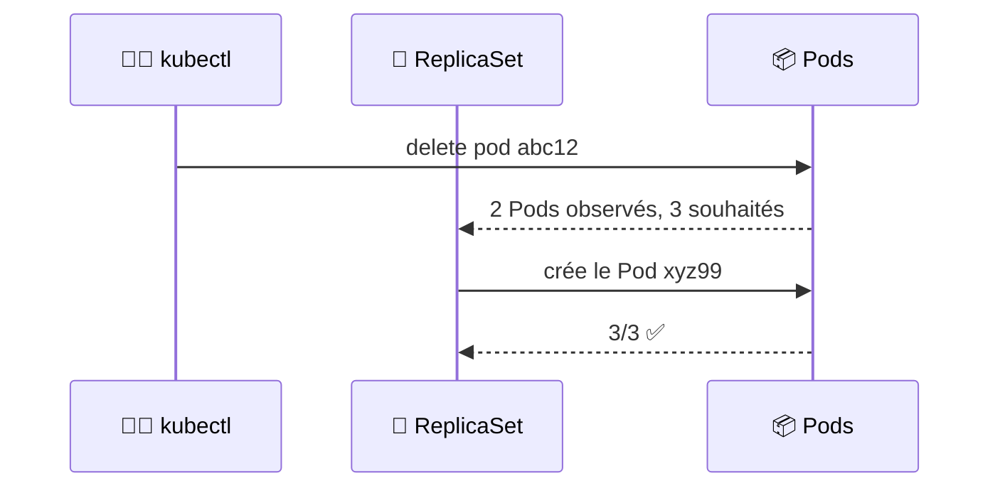
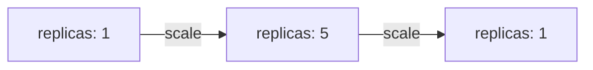
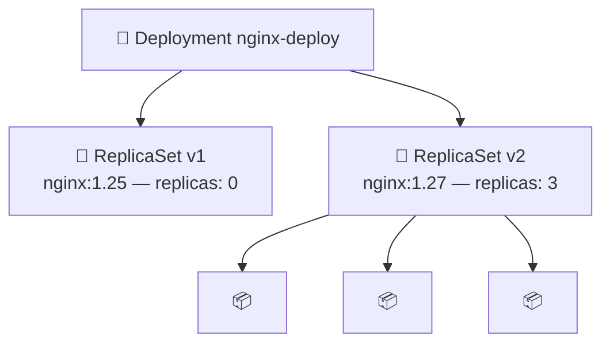
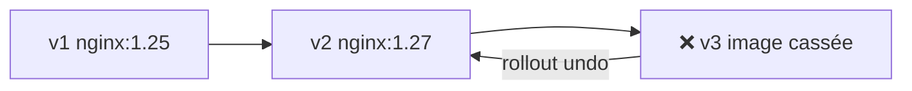
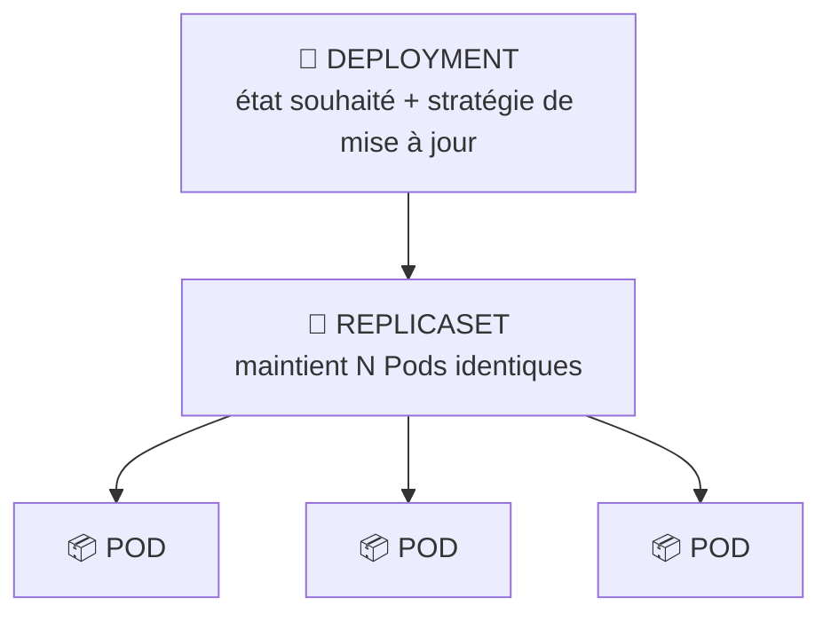
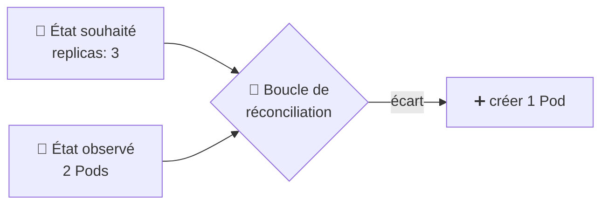

<div align="center">

# 🔁 TD 102 — Deployments & ReplicaSets


**Objectif :** passer de *« j'ai créé un Pod à la main »* → *« Kubernetes maintient mes Pods en vie, je scale, je mets à jour sans coupure et je reviens en arrière »*

</div>

---

## 📋 Sommaire

- [🎯 Objectifs pédagogiques](#-objectifs-pédagogiques)
- [🏗️ Architecture](#️-architecture)
- [Partie 0 — Prérequis](#partie-0--prérequis)
- [Partie 1 — Le problème du Pod seul](#partie-1--le-problème-du-pod-seul)
- [Partie 2 — Premier Deployment](#partie-2--premier-deployment)
- [Partie 3 — Le ReplicaSet](#partie-3--le-replicaset)
- [Partie 4 — Self-healing](#partie-4--self-healing)
- [Partie 5 — Scaling](#partie-5--scaling)
- [Partie 6 — Rolling update](#partie-6--rolling-update)
- [Partie 7 — Rollback](#partie-7--rollback)
- [Partie 8 — Le manifeste YAML](#partie-8--le-manifeste-yaml)
- [Partie 9 — Dashboard](#partie-9--dashboard)
- [Partie 10 — Nettoyage](#partie-10--nettoyage)
- [🏆 Challenge](#-challenge)
- [❓ Quiz de fin](#-quiz-de-fin)
- [📝 Mémo](#-mémo)
- [🧠 À retenir](#-à-retenir)

---

## 🎯 Objectifs pédagogiques

À la fin du TD, vous devez savoir :

- [ ] expliquer pourquoi on ne crée **jamais** un Pod seul en production
- [ ] créer un **Deployment** en ligne de commande et en **YAML**
- [ ] comprendre la chaîne **Deployment → ReplicaSet → Pods**
- [ ] observer le **self-healing** (Kubernetes recrée un Pod supprimé)
- [ ] **scaler** une application (up / down)
- [ ] réaliser un **rolling update** (changement d'image sans coupure)
- [ ] faire un **rollback** vers une version précédente
- [ ] lire un manifeste YAML et utiliser `kubectl apply`

---

## 🏗️ Architecture



> [!IMPORTANT]
> Le **Deployment** décrit l'état **souhaité**. Le **ReplicaSet** s'assure que le bon **nombre** de Pods tourne. Les **Pods** exécutent réellement l'application.

---

## Partie 0 — Prérequis

```bash
minikube status          # Running
kubectl get nodes        # minikube Ready
kubectl get pods         # No resources found
```

> [!NOTE]
> Si Minikube est arrêté : `minikube start`.

---

## Partie 1 — Le problème du Pod seul

Rappel du TD 101 : on crée un Pod, on le supprime… il **disparaît pour toujours**.

```bash
kubectl run solo --image=nginx
kubectl get pods
kubectl delete pod solo
kubectl get pods         # → No resources found
```



> [!TIP]
> **Q1. Qui est responsable de recréer le Pod ?**
> <details><summary>Réponse</summary>
>
> Personne. Un Pod créé directement n'a **aucun contrôleur** au-dessus de lui. C'est exactement le rôle du **Deployment**.
> </details>

---

## Partie 2 — Premier Deployment

### 2.1 Créer le Deployment

```bash
kubectl create deployment nginx-deploy --image=nginx:1.25 --replicas=3
# deployment.apps/nginx-deploy created
```

### 2.2 Observer

```bash
kubectl get deployments
```

```
NAME           READY   UP-TO-DATE   AVAILABLE   AGE
nginx-deploy   3/3     3            3           30s
```

| Colonne | Signification |
|---|---|
| `READY` | Pods prêts / Pods souhaités |
| `UP-TO-DATE` | Pods avec la dernière version du template |
| `AVAILABLE` | Pods disponibles pour le trafic |

### 2.3 Voir les Pods créés

```bash
kubectl get pods -o wide
```

```
NAME                            READY   STATUS    IP           NODE
nginx-deploy-7d9f8c6b5d-abc12   1/1     Running   10.244.0.5   minikube
nginx-deploy-7d9f8c6b5d-def34   1/1     Running   10.244.0.6   minikube
nginx-deploy-7d9f8c6b5d-ghi56   1/1     Running   10.244.0.7   minikube
```

> [!TIP]
> **Q2. D'où vient le nom `nginx-deploy-7d9f8c6b5d-abc12` ?**
> <details><summary>Réponse</summary>
>
> `<nom du Deployment>-<hash du ReplicaSet>-<suffixe aléatoire du Pod>`.
> Le hash identifie la **version du template** de Pod.
> </details>

---

## Partie 3 — Le ReplicaSet

### 3.1 Découvrir l'objet intermédiaire

```bash
kubectl get replicasets     # ou : kubectl get rs
```

```
NAME                      DESIRED   CURRENT   READY   AGE
nginx-deploy-7d9f8c6b5d   3         3         3       2m
```

### 3.2 Comprendre la chaîne

```bash
kubectl describe deployment nginx-deploy | grep -i "NewReplicaSet"
kubectl describe rs nginx-deploy-7d9f8c6b5d | grep -i "Controlled By"
kubectl describe pod nginx-deploy-7d9f8c6b5d-abc12 | grep -i "Controlled By"
```



### 3.3 Voir tout d'un coup

```bash
kubectl get all
```

> [!WARNING]
> On ne manipule **jamais** un ReplicaSet directement. C'est le Deployment qui le pilote.

---

## Partie 4 — Self-healing

### 4.1 Supprimer un Pod… et observer

Ouvrir un **second terminal** :

```bash
kubectl get pods -w      # -w = watch
```

Dans le premier terminal :

```bash
kubectl delete pod nginx-deploy-7d9f8c6b5d-abc12
```

Observez dans le second terminal :

```
nginx-deploy-7d9f8c6b5d-abc12   1/1     Terminating         0   5m
nginx-deploy-7d9f8c6b5d-xyz99   0/1     Pending             0   0s
nginx-deploy-7d9f8c6b5d-xyz99   0/1     ContainerCreating   0   0s
nginx-deploy-7d9f8c6b5d-xyz99   1/1     Running             0   3s
```

🎉 **Kubernetes a recréé le Pod tout seul.**



### 4.2 Supprimer TOUS les Pods

```bash
kubectl delete pods --all
kubectl get pods
```

> [!TIP]
> **Q3. Combien de Pods retrouvez-vous quelques secondes plus tard ? Pourquoi ?**
> <details><summary>Réponse</summary>
>
> **3**. Le ReplicaSet compare en permanence l'état **souhaité** (3) à l'état **observé** et corrige l'écart : c'est la **boucle de réconciliation**.
> </details>

---

## Partie 5 — Scaling

### 5.1 Scale up

```bash
kubectl scale deployment nginx-deploy --replicas=5
kubectl get pods
```

### 5.2 Scale down

```bash
kubectl scale deployment nginx-deploy --replicas=1
kubectl get pods
```

### 5.3 Vérifier le ReplicaSet

```bash
kubectl get rs
```

```
NAME                      DESIRED   CURRENT   READY
nginx-deploy-7d9f8c6b5d   1         1         1
```



> [!NOTE]
> Le scaling ne crée **pas** de nouveau ReplicaSet : seul `DESIRED` change.

Remettre 3 replicas pour la suite :

```bash
kubectl scale deployment nginx-deploy --replicas=3
```

---

## Partie 6 — Rolling update

### 6.1 Changer l'image

Terminal 2 :

```bash
kubectl get pods -w
```

Terminal 1 :

```bash
kubectl set image deployment/nginx-deploy nginx=nginx:1.27
kubectl rollout status deployment/nginx-deploy
```

```
Waiting for deployment "nginx-deploy" rollout to finish: 1 out of 3 new replicas have been updated...
Waiting for deployment "nginx-deploy" rollout to finish: 2 out of 3 new replicas have been updated...
deployment "nginx-deploy" successfully rolled out
```

### 6.2 Deux ReplicaSets !

```bash
kubectl get rs
```

```
NAME                      DESIRED   CURRENT   READY
nginx-deploy-7d9f8c6b5d   0         0         0      ← ancien (nginx:1.25)
nginx-deploy-5b8c7d9e4f   3         3         3      ← nouveau (nginx:1.27)
```



> [!TIP]
> **Q4. Pourquoi l'ancien ReplicaSet est-il conservé avec 0 replica ?**
> <details><summary>Réponse</summary>
>
> Pour permettre le **rollback** : il suffit de le remonter à 3 et de descendre le nouveau à 0.
> </details>

### 6.3 Vérifier l'image

```bash
kubectl describe deployment nginx-deploy | grep Image
kubectl rollout history deployment/nginx-deploy
```

---

## Partie 7 — Rollback

### 7.1 Simuler une mauvaise version

```bash
kubectl set image deployment/nginx-deploy nginx=nginx:version-inexistante
kubectl get pods
```

```
nginx-deploy-5b8c7d9e4f-...   1/1   Running            ← anciens toujours là
nginx-deploy-9a1b2c3d4e-...   0/1   ImagePullBackOff   ← nouveau bloqué
```

> [!NOTE]
> Kubernetes **ne casse pas** l'application : il attend que le nouveau Pod soit prêt avant de supprimer un ancien.

### 7.2 Revenir en arrière

```bash
kubectl rollout undo deployment/nginx-deploy
kubectl rollout status deployment/nginx-deploy
kubectl get pods
kubectl describe deployment nginx-deploy | grep Image   # → nginx:1.27
```



---

## Partie 8 — Le manifeste YAML

### 8.1 Générer le YAML de l'existant

```bash
kubectl get deployment nginx-deploy -o yaml
```

### 8.2 Écrire son propre manifeste

Créer `web-deployment.yaml` :

```yaml
apiVersion: apps/v1
kind: Deployment
metadata:
  name: web
  labels:
    app: web
spec:
  replicas: 2
  selector:
    matchLabels:
      app: web
  template:
    metadata:
      labels:
        app: web
    spec:
      containers:
        - name: nginx
          image: nginx:1.27
          ports:
            - containerPort: 80
```

| Bloc | Rôle |
|---|---|
| `replicas` | Nombre de Pods souhaités |
| `selector.matchLabels` | Comment le ReplicaSet **retrouve** ses Pods |
| `template` | Le **modèle** de Pod à créer |
| `template.metadata.labels` | Doit **correspondre** au `selector` |

### 8.3 Appliquer

```bash
kubectl apply -f web-deployment.yaml
kubectl get deploy,rs,pods -l app=web
```

### 8.4 Modifier et ré-appliquer

Changer `replicas: 2` → `replicas: 4`, puis :

```bash
kubectl apply -f web-deployment.yaml
kubectl get pods -l app=web
```

> [!IMPORTANT]
> `kubectl apply` est **déclaratif** : vous décrivez l'état voulu, Kubernetes fait le nécessaire. C'est la méthode à privilégier (et à versionner dans Git).

---

## Partie 9 — Dashboard

```bash
minikube dashboard
```

| Commande | Dashboard |
|---|---|
| `kubectl get deployments` | Workloads → Deployments |
| `kubectl get rs` | Workloads → Replica Sets |
| `kubectl scale ...` | Deployments → ⋮ → Scale |
| `kubectl set image ...` | Deployments → ⋮ → Edit |
| `kubectl rollout undo ...` | *(pas disponible, CLI uniquement)* |

Dans **Deployments → nginx-deploy**, observez : *Replica Sets* (ancien et nouveau), *New Replica Set*, *Events*.

---

## Partie 10 — Nettoyage

```bash
kubectl delete deployment nginx-deploy
kubectl delete -f web-deployment.yaml
kubectl get all
```

> [!TIP]
> **Q5. Que se passe-t-il pour les ReplicaSets et les Pods quand on supprime le Deployment ?**
> <details><summary>Réponse</summary>
>
> Ils sont supprimés en **cascade** : le Deployment possède les ReplicaSets, qui possèdent les Pods.
> </details>

---

## 🏆 Challenge

⏱️ **20 minutes en autonomie.** Créer un Deployment `api` avec `httpd:2.4` et 2 replicas, puis :

| # | Action | Solution |
|---|---|---|
| A | Créer le Deployment | <details><summary>👁️</summary><code>kubectl create deployment api --image=httpd:2.4 --replicas=2</code></details> |
| B | Vérifier Deployment, RS et Pods | <details><summary>👁️</summary><code>kubectl get deploy,rs,pods</code></details> |
| C | Supprimer un Pod et constater sa recréation | <details><summary>👁️</summary><code>kubectl delete pod &lt;nom&gt; && kubectl get pods</code></details> |
| D | Passer à 4 replicas | <details><summary>👁️</summary><code>kubectl scale deployment api --replicas=4</code></details> |
| E | Mettre à jour vers `httpd:2.4-alpine` | <details><summary>👁️</summary><code>kubectl set image deployment/api httpd=httpd:2.4-alpine</code></details> |
| F | Suivre le rollout | <details><summary>👁️</summary><code>kubectl rollout status deployment/api</code></details> |
| G | Afficher l'historique | <details><summary>👁️</summary><code>kubectl rollout history deployment/api</code></details> |
| H | Revenir à la version précédente | <details><summary>👁️</summary><code>kubectl rollout undo deployment/api</code></details> |
| I | Exporter en YAML dans `api.yaml` | <details><summary>👁️</summary><code>kubectl get deployment api -o yaml > api.yaml</code></details> |
| J | Supprimer le Deployment | <details><summary>👁️</summary><code>kubectl delete deployment api</code></details> |

---

## ❓ Quiz de fin

<details>
<summary><b>1. Quelle est la différence entre un Pod et un Deployment ?</b></summary>

Le Pod exécute les containers ; le Deployment décrit l'état souhaité (nombre de replicas, image) et le maintient dans le temps.
</details>

<details>
<summary><b>2. Quel objet compte réellement les Pods et les recrée ?</b></summary>

Le **ReplicaSet**.
</details>

<details>
<summary><b>3. Que fait <code>kubectl scale deployment X --replicas=5</code> ?</b></summary>

Met à jour le champ `replicas` du Deployment ; le ReplicaSet crée ou supprime des Pods pour atteindre 5.
</details>

<details>
<summary><b>4. Pourquoi un rolling update crée-t-il un second ReplicaSet ?</b></summary>

Parce que le template de Pod a changé (nouvelle image). Chaque version du template correspond à un ReplicaSet distinct, ce qui permet la transition progressive et le rollback.
</details>

<details>
<summary><b>5. Différence entre <code>kubectl create</code> et <code>kubectl apply</code> ?</b></summary>

`create` est impératif (crée, échoue si l'objet existe) ; `apply` est déclaratif (crée ou met à jour à partir d'un fichier YAML).
</details>

<details>
<summary><b>6. À quoi doit correspondre <code>spec.selector.matchLabels</code> ?</b></summary>

Aux labels définis dans `spec.template.metadata.labels`, sinon le Deployment est rejeté.
</details>

---

## 📝 Mémo

| Commande | Fonction |
|---|---|
| `kubectl create deployment X --image=I --replicas=N` | Créer un Deployment |
| `kubectl get deployments` / `kubectl get deploy` | Lister les Deployments |
| `kubectl get replicasets` / `kubectl get rs` | Lister les ReplicaSets |
| `kubectl get all` | Tout voir |
| `kubectl get pods -w` | Observer en temps réel |
| `kubectl get pods -l app=web` | Filtrer par label |
| `kubectl describe deployment X` | Détails d'un Deployment |
| `kubectl scale deployment X --replicas=N` | Scaler |
| `kubectl set image deployment/X C=I` | Changer l'image du container `C` |
| `kubectl rollout status deployment/X` | Suivre un déploiement |
| `kubectl rollout history deployment/X` | Historique des révisions |
| `kubectl rollout undo deployment/X` | Rollback |
| `kubectl apply -f fichier.yaml` | Appliquer un manifeste |
| `kubectl delete -f fichier.yaml` | Supprimer via un manifeste |
| `kubectl delete deployment X` | Supprimer un Deployment (cascade) |

---

## 🧠 À retenir





> [!NOTE]
> **Kubernetes ne fait pas ce que vous lui dites de faire, il fait en sorte que la réalité ressemble à ce que vous avez décrit.**

---

<div align="center">

**Progression du cours :** Pod ✅ ➜ **Deployment ✅** ➜ Service ➜ Configuration ➜ Application complète

⬅️ [TD 101 — Premier contact](101-k8s-minikube.md) · ➡️ [TD 103 — Services & réseau](../day3/intro.md)

</div>
````