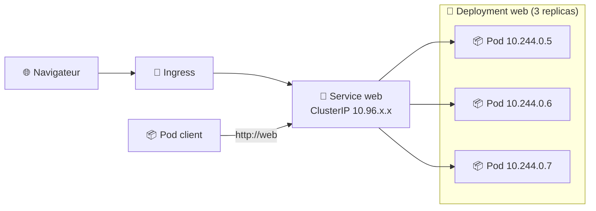
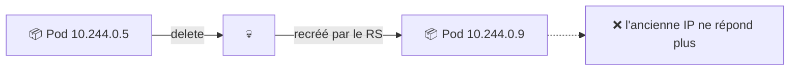
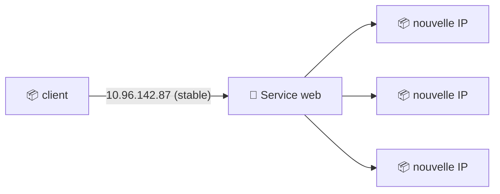
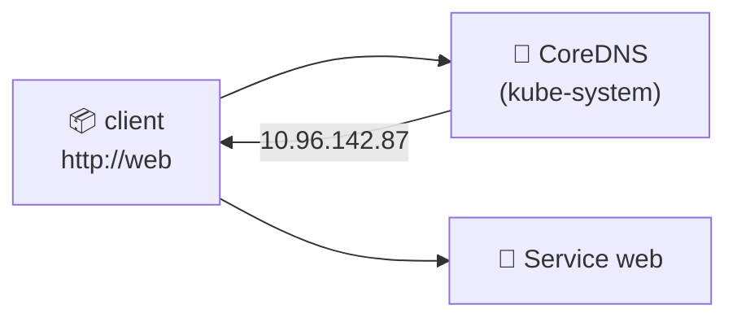
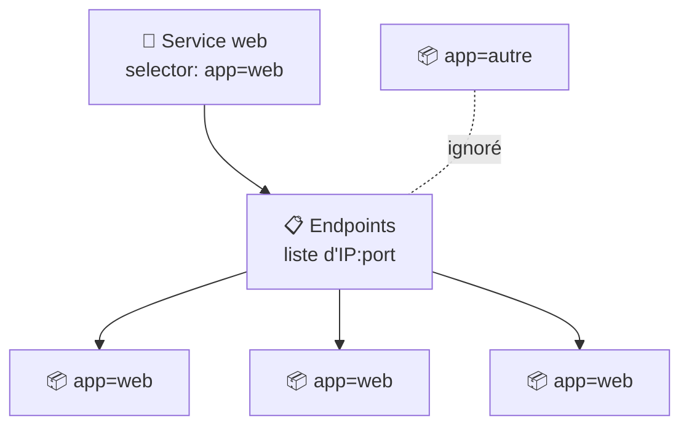
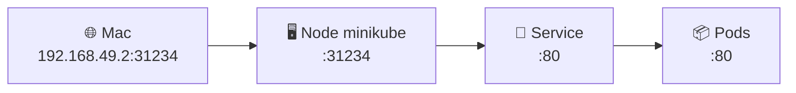
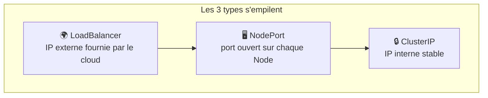
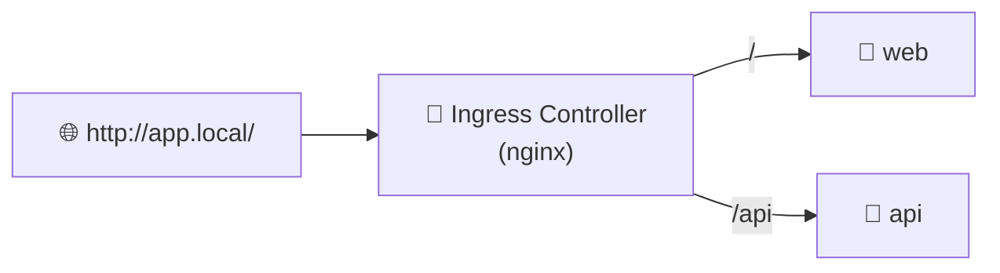
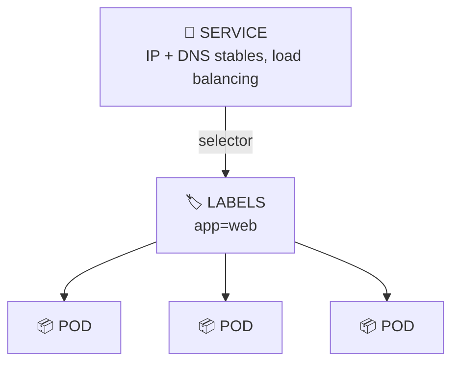
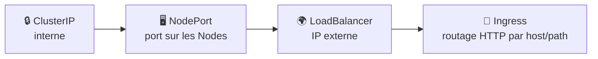

<div align="center">

# 🔀 TD 103 — Services & réseau


**Objectif :** passer de *« mes Pods tournent mais changent d'IP tout le temps »* → *« mes applications se parlent par un nom DNS stable et je sais les exposer à l'extérieur du cluster »*

</div>

---

## 📋 Sommaire

- [🎯 Objectifs pédagogiques](#-objectifs-pédagogiques)
- [🏗️ Architecture](#️-architecture)
- [Partie 0 — Prérequis](#partie-0--prérequis)
- [Partie 1 — Le problème des IP éphémères](#partie-1--le-problème-des-ip-éphémères)
- [Partie 2 — ClusterIP](#partie-2--clusterip)
- [Partie 3 — DNS interne](#partie-3--dns-interne)
- [Partie 4 — Labels, selectors & Endpoints](#partie-4--labels-selectors--endpoints)
- [Partie 5 — NodePort](#partie-5--nodeport)
- [Partie 6 — LoadBalancer](#partie-6--loadbalancer)
- [Partie 7 — Le manifeste YAML](#partie-7--le-manifeste-yaml)
- [Partie 8 — Ingress](#partie-8--ingress)
- [Partie 9 — Dashboard](#partie-9--dashboard)
- [Partie 10 — Nettoyage](#partie-10--nettoyage)
- [🏆 Challenge](#-challenge)
- [❓ Quiz de fin](#-quiz-de-fin)
- [📝 Mémo](#-mémo)
- [🧠 À retenir](#-à-retenir)

---

## 🎯 Objectifs pédagogiques

À la fin du TD, vous devez savoir :

- [ ] expliquer pourquoi on ne s'appuie **jamais** sur l'IP d'un Pod
- [ ] créer un **Service** en ligne de commande et en **YAML**
- [ ] distinguer **ClusterIP / NodePort / LoadBalancer**
- [ ] comprendre le lien **selector → labels → Endpoints**
- [ ] appeler un Service par son **nom DNS** depuis un autre Pod
- [ ] observer le **load balancing** entre plusieurs Pods
- [ ] exposer une application à l'extérieur du cluster
- [ ] découvrir l'**Ingress** pour le routage HTTP

---

## 🏗️ Architecture



> [!IMPORTANT]
> Un **Service** est une **adresse IP et un nom DNS stables** placés devant un ensemble de Pods sélectionnés par leurs **labels**. Les Pods changent, le Service reste.

---

## Partie 0 — Prérequis

```bash
minikube status          # Running
kubectl get all          # seul le service "kubernetes" doit rester
```

Créer l'application de travail :

```bash
kubectl create deployment web --image=nginx:1.27 --replicas=3
kubectl get pods -l app=web -o wide
```

> [!NOTE]
> `kubectl create deployment` ajoute automatiquement le label `app=web` sur les Pods. Nous allons nous en servir.

---

## Partie 1 — Le problème des IP éphémères

### 1.1 Noter l'IP d'un Pod

```bash
kubectl get pods -l app=web -o wide
```

### 1.2 Tester depuis un Pod client

Lancer un Pod « client » interactif :

```bash
kubectl run client --image=busybox:1.36 -it --rm --restart=Never -- sh
```

À l'intérieur :

```sh
wget -qO- http://10.244.0.5      # ← remplacer par l'IP relevée
exit
```

✅ Ça fonctionne… pour l'instant.

### 1.3 Casser l'IP

```bash
kubectl delete pod -l app=web
kubectl get pods -l app=web -o wide
```



> [!TIP]
> **Q1. Pourquoi une application ne doit-elle jamais mémoriser l'IP d'un Pod ?**
> <details><summary>Réponse</summary>
>
> Un Pod est **éphémère** : à chaque recréation (crash, scale, rolling update) il obtient une **nouvelle IP**. Il faut une abstraction stable : le **Service**.
> </details>

---

## Partie 2 — ClusterIP

### 2.1 Créer le Service

```bash
kubectl expose deployment web --port=80 --target-port=80
# service/web exposed
```

### 2.2 Observer

```bash
kubectl get services      # ou : kubectl get svc
```

```
NAME         TYPE        CLUSTER-IP      EXTERNAL-IP   PORT(S)   AGE
kubernetes   ClusterIP   10.96.0.1       <none>        443/TCP   1h
web          ClusterIP   10.96.142.87    <none>        80/TCP    10s
```

| Colonne | Signification |
|---|---|
| `TYPE` | Mode d'exposition (`ClusterIP` par défaut) |
| `CLUSTER-IP` | IP **virtuelle et stable**, interne au cluster |
| `PORT(S)` | Port du Service |

| Option | Rôle |
|---|---|
| `--port` | Port sur lequel le **Service** écoute |
| `--target-port` | Port du **container** vers lequel il envoie |

### 2.3 Tester

```bash
kubectl run client --image=busybox:1.36 -it --rm --restart=Never -- sh
```

```sh
wget -qO- http://10.96.142.87    # ← IP du Service
exit
```

### 2.4 Casser les Pods… le Service tient

```bash
kubectl delete pod -l app=web
```

Puis relancer le test du 2.3 : ✅ **la même IP répond toujours.**



> [!WARNING]
> Un **ClusterIP** n'est joignable **que depuis l'intérieur du cluster**. Depuis votre Mac, `curl 10.96.142.87` ne répondra pas.

---

## Partie 3 — DNS interne

### 3.1 Appeler par le nom

Même l'IP du Service ne mérite pas d'être mémorisée : Kubernetes fournit un **DNS**.

```bash
kubectl run client --image=busybox:1.36 -it --rm --restart=Never -- sh
```

```sh
nslookup web
wget -qO- http://web
wget -qO- http://web.default.svc.cluster.local
exit
```

### 3.2 Comprendre le nom complet

```
web . default . svc . cluster.local
 │       │       │        │
 │       │       │        └─ domaine du cluster
 │       │       └─ type d'objet (Service)
 │       └─ Namespace
 └─ nom du Service
```



### 3.3 Qui répond ?

```bash
kubectl get pods -n kube-system -l k8s-app=kube-dns
```

> [!TIP]
> **Q2. Un Pod du Namespace `prod` veut joindre le Service `web` du Namespace `default`. Quelle URL ?**
> <details><summary>Réponse</summary>
>
> `http://web.default` (ou `http://web.default.svc.cluster.local`). Le nom court `web` ne fonctionne que **dans le même Namespace**.
> </details>

---

## Partie 4 — Labels, selectors & Endpoints

### 4.1 Voir le selector

```bash
kubectl describe service web
```

```
Selector:  app=web
Endpoints: 10.244.0.9:80,10.244.0.10:80,10.244.0.11:80
```

### 4.2 Les Endpoints

```bash
kubectl get endpoints web
kubectl get pods -l app=web -o wide
```

Les IP correspondent : le Service **suit** les Pods portant `app=web`.



### 4.3 Scaler et observer

Terminal 2 :

```bash
kubectl get endpoints web -w
```

Terminal 1 :

```bash
kubectl scale deployment web --replicas=5
kubectl scale deployment web --replicas=2
```

🎉 **Les Endpoints se mettent à jour tout seuls.**

### 4.4 Casser le lien label ↔ selector

```bash
POD=$(kubectl get pods -l app=web -o jsonpath='{.items[0].metadata.name}')
kubectl label pod $POD app=debug --overwrite
kubectl get endpoints web
kubectl get pods --show-labels
```

> [!TIP]
> **Q3. Que s'est-il passé pour le Pod relabellisé ? Et pour le Deployment ?**
> <details><summary>Réponse</summary>
>
> Le Pod **sort des Endpoints** (il ne reçoit plus de trafic) mais continue de tourner. Le ReplicaSet ne le « voit » plus non plus et **crée un Pod de remplacement** pour rester à 2 replicas. Technique classique pour **isoler un Pod à déboguer** sans le tuer.
> </details>

Nettoyer le Pod isolé :

```bash
kubectl delete pod -l app=debug
```

### 4.5 Observer le load balancing

Rendre chaque Pod identifiable :

```bash
for p in $(kubectl get pods -l app=web -o name); do
  kubectl exec $p -- sh -c 'echo "Bonjour depuis $(hostname)" > /usr/share/nginx/html/index.html'
done
```

```bash
kubectl run client --image=busybox:1.36 -it --rm --restart=Never -- sh
```

```sh
for i in 1 2 3 4 5 6; do wget -qO- http://web; done
exit
```

Le `hostname` change d'une requête à l'autre : le Service **répartit** le trafic.

---

## Partie 5 — NodePort

### 5.1 Exposer vers l'extérieur

```bash
kubectl expose deployment web --name=web-nodeport --port=80 --type=NodePort
kubectl get svc
```

```
NAME           TYPE        CLUSTER-IP      PORT(S)
web            ClusterIP   10.96.142.87    80/TCP
web-nodeport   NodePort    10.96.201.14    80:31234/TCP
```

`80:31234/TCP` → le port **31234** est ouvert sur **chaque Node** et redirige vers le port 80 du Service.

### 5.2 Accéder depuis le Mac

```bash
minikube ip                          # ex. 192.168.49.2
curl http://$(minikube ip):31234
# ou
minikube service web-nodeport
```



> [!NOTE]
> Plage par défaut des NodePorts : **30000–32767**. Un NodePort **inclut** un ClusterIP : il est aussi joignable en interne.

> [!TIP]
> **Q4. Pourquoi NodePort est-il rarement utilisé tel quel en production ?**
> <details><summary>Réponse</summary>
>
> Port « exotique », un port par Service, dépend de l'IP des Nodes, pas de TLS ni de routage par nom de domaine. On lui préfère **LoadBalancer** ou **Ingress**.
> </details>

---

## Partie 6 — LoadBalancer

### 6.1 Créer le Service

```bash
kubectl expose deployment web --name=web-lb --port=80 --type=LoadBalancer
kubectl get svc web-lb
```

```
NAME     TYPE           CLUSTER-IP     EXTERNAL-IP   PORT(S)
web-lb   LoadBalancer   10.96.55.10    <pending>     80:30567/TCP
```

`<pending>` : sur un cloud (AWS, GCP…), le fournisseur créerait un vrai load balancer. En local, il n'y en a pas.

### 6.2 Simuler avec Minikube

Dans un **terminal dédié** (laisser tourner, demande le mot de passe sudo) :

```bash
minikube tunnel
```

Puis :

```bash
kubectl get svc web-lb        # EXTERNAL-IP renseignée (ex. 10.96.55.10 ou 127.0.0.1)
curl http://<EXTERNAL-IP>
```



> [!IMPORTANT]
> `LoadBalancer` ⊃ `NodePort` ⊃ `ClusterIP`. Chaque type ajoute une porte d'entrée au précédent.

---

## Partie 7 — Le manifeste YAML

### 7.1 Générer l'existant

```bash
kubectl get svc web -o yaml
```

### 7.2 Écrire son propre manifeste

Créer `web-service.yaml` :

```yaml
apiVersion: v1
kind: Service
metadata:
  name: web-svc
  labels:
    app: web
spec:
  type: ClusterIP
  selector:
    app: web
  ports:
    - name: http
      port: 80
      targetPort: 80
      protocol: TCP
```

| Bloc | Rôle |
|---|---|
| `type` | `ClusterIP` (défaut), `NodePort`, `LoadBalancer` |
| `selector` | Labels des Pods ciblés |
| `ports.port` | Port du Service |
| `ports.targetPort` | Port du container (peut être un **nom** de port) |
| `ports.nodePort` | *(NodePort uniquement)* port fixe 30000–32767 |

### 7.3 Appliquer et vérifier

```bash
kubectl apply -f web-service.yaml
kubectl get svc,endpoints web-svc
```

### 7.4 Passer en NodePort par édition

Modifier `type: ClusterIP` → `type: NodePort`, puis :

```bash
kubectl apply -f web-service.yaml
kubectl get svc web-svc
```

> [!TIP]
> **Q5. Le Service et le Deployment sont deux objets indépendants. Que se passe-t-il si on supprime le Deployment ?**
> <details><summary>Réponse</summary>
>
> Le Service **reste** mais ses **Endpoints deviennent vides** : il ne pointe plus vers rien. Aucune cascade ici, contrairement à Deployment → ReplicaSet → Pods.
> </details>

---

## Partie 8 — Ingress

### 8.1 Le besoin

Un site = un nom de domaine + un chemin, pas un port 31234. L'**Ingress** est un routeur HTTP(S) devant les Services.



### 8.2 Activer le contrôleur

```bash
minikube addons enable ingress
kubectl get pods -n ingress-nginx
```

### 8.3 Écrire l'Ingress

Créer `web-ingress.yaml` :

```yaml
apiVersion: networking.k8s.io/v1
kind: Ingress
metadata:
  name: web-ingress
spec:
  ingressClassName: nginx
  rules:
    - host: app.local
      http:
        paths:
          - path: /
            pathType: Prefix
            backend:
              service:
                name: web
                port:
                  number: 80
```

```bash
kubectl apply -f web-ingress.yaml
kubectl get ingress
```

### 8.4 Tester

Ajouter la résolution locale :

```bash
echo "$(minikube ip) app.local" | sudo tee -a /etc/hosts
curl http://app.local
```

> [!NOTE]
> Sur macOS avec le driver Docker, l'IP de Minikube n'est pas toujours routable : lancer `minikube tunnel` et utiliser `127.0.0.1 app.local` dans `/etc/hosts`.

> [!WARNING]
> L'**Ingress** est une règle de routage ; il ne fait rien sans **Ingress Controller** (ici l'addon nginx). Sur un cloud, le controller est souvent fourni.

---

## Partie 9 — Dashboard

```bash
minikube dashboard
```

| Commande | Dashboard |
|---|---|
| `kubectl get svc` | Service → Services |
| `kubectl get endpoints` | Services → web → *Endpoints* |
| `kubectl get ingress` | Service → Ingresses |
| `kubectl describe svc web` | Services → web → *Details* |

Dans **Services → web**, observez : *Type*, *Cluster IP*, *Selector*, *Endpoints*, *Pods*.

---

## Partie 10 — Nettoyage

```bash
kubectl delete -f web-ingress.yaml
kubectl delete -f web-service.yaml
kubectl delete svc web web-nodeport web-lb
kubectl delete deployment web
kubectl get all
```

Arrêter `minikube tunnel` (CTRL+C) et retirer la ligne `app.local` de `/etc/hosts`.

---

## 🏆 Challenge

⏱️ **25 minutes en autonomie.** Déployer deux applications qui se parlent :

- `frontend` : image `nginx:1.27`, 2 replicas
- `backend` : image `hashicorp/http-echo`, argument `-text=hello-from-backend`, port `5678`

| # | Action | Solution |
|---|---|---|
| A | Créer le Deployment backend | <details><summary>👁️</summary><code>kubectl create deployment backend --image=hashicorp/http-echo --port=5678 -- /http-echo -text=hello-from-backend</code></details> |
| B | L'exposer en ClusterIP sur le port 80 | <details><summary>👁️</summary><code>kubectl expose deployment backend --port=80 --target-port=5678</code></details> |
| C | Créer le Deployment frontend (2 replicas) | <details><summary>👁️</summary><code>kubectl create deployment frontend --image=nginx:1.27 --replicas=2</code></details> |
| D | Depuis un Pod frontend, appeler le backend par DNS | <details><summary>👁️</summary><code>kubectl exec deploy/frontend -- curl -s http://backend</code></details> |
| E | Exposer le frontend en NodePort | <details><summary>👁️</summary><code>kubectl expose deployment frontend --port=80 --type=NodePort</code></details> |
| F | Ouvrir le frontend dans le navigateur | <details><summary>👁️</summary><code>minikube service frontend</code></details> |
| G | Vérifier les Endpoints des deux Services | <details><summary>👁️</summary><code>kubectl get endpoints backend frontend</code></details> |
| H | Scaler backend à 3 et vérifier les Endpoints | <details><summary>👁️</summary><code>kubectl scale deployment backend --replicas=3 && kubectl get endpoints backend</code></details> |
| I | Exporter le Service backend en YAML | <details><summary>👁️</summary><code>kubectl get svc backend -o yaml > backend-svc.yaml</code></details> |
| J | Tout supprimer | <details><summary>👁️</summary><code>kubectl delete deploy,svc frontend backend</code></details> |

---

## ❓ Quiz de fin

<details>
<summary><b>1. Pourquoi a-t-on besoin d'un Service alors que les Pods ont déjà une IP ?</b></summary>

Les IP de Pods sont éphémères et multiples ; le Service fournit une IP et un nom DNS **stables** et répartit la charge.
</details>

<details>
<summary><b>2. Comment un Service sait-il vers quels Pods envoyer le trafic ?</b></summary>

Via son `selector` : tous les Pods dont les labels correspondent sont inscrits dans les **Endpoints**.
</details>

<details>
<summary><b>3. Différence entre <code>port</code> et <code>targetPort</code> ?</b></summary>

`port` = port d'écoute du Service ; `targetPort` = port du container vers lequel le trafic est envoyé.
</details>

<details>
<summary><b>4. Quel type de Service permet d'accéder à l'application depuis l'extérieur du cluster ?</b></summary>

`NodePort` (port sur les Nodes) et `LoadBalancer` (IP externe). `ClusterIP` est interne uniquement.
</details>

<details>
<summary><b>5. Quel nom DNS complet pour le Service <code>db</code> du Namespace <code>data</code> ?</b></summary>

`db.data.svc.cluster.local` (ou `db.data` en raccourci).
</details>

<details>
<summary><b>6. Quelle différence entre Service de type LoadBalancer et Ingress ?</b></summary>

Le LoadBalancer expose **un** Service en L4 (TCP) avec une IP dédiée ; l'Ingress route en L7 (HTTP) plusieurs Services selon l'hôte et le chemin, derrière un seul point d'entrée.
</details>

---

## 📝 Mémo

| Commande | Fonction |
|---|---|
| `kubectl expose deployment X --port=P --target-port=T` | Créer un Service ClusterIP |
| `kubectl expose deployment X --port=P --type=NodePort` | Créer un Service NodePort |
| `kubectl expose deployment X --port=P --type=LoadBalancer` | Créer un Service LoadBalancer |
| `kubectl get services` / `kubectl get svc` | Lister les Services |
| `kubectl describe svc X` | Détails (selector, endpoints) |
| `kubectl get endpoints X` | Pods derrière un Service |
| `kubectl get pods --show-labels` | Voir les labels |
| `kubectl label pod X clé=valeur --overwrite` | Modifier un label |
| `kubectl run client --image=busybox:1.36 -it --rm --restart=Never -- sh` | Pod client jetable |
| `kubectl get ingress` | Lister les Ingress |
| `minikube service X` | Ouvrir un NodePort dans le navigateur |
| `minikube ip` | IP du Node Minikube |
| `minikube tunnel` | Simuler un LoadBalancer |
| `minikube addons enable ingress` | Activer le contrôleur Ingress |

---

## 🧠 À retenir





> [!NOTE]
> **Les Pods vont et viennent ; le Service est le point de rendez-vous. Ne parlez jamais à un Pod, parlez à son Service.**

---

<div align="center">

**Progression du cours :** Pod ✅ ➜ Deployment ✅ ➜ **Service ✅** ➜ Configuration ➜ Application complète

⬅️ [TD 102 — Deployments & ReplicaSets](102-deployments-replicatSets.md) · ➡️ [TD 104 — ConfigMaps & Secrets](./configmaps-secrets.md)

</div>