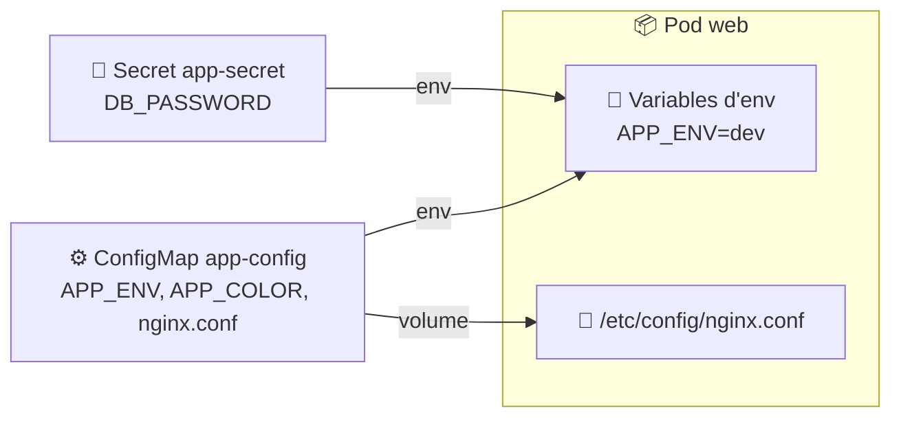
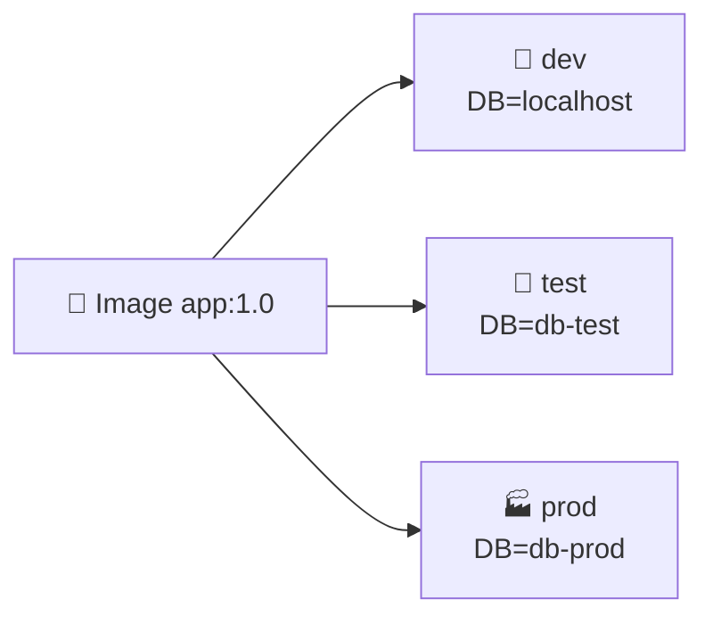
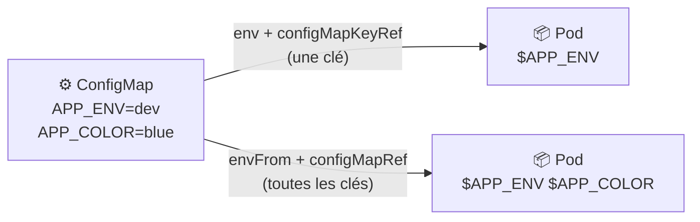
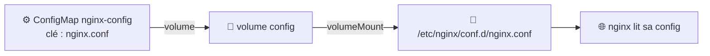
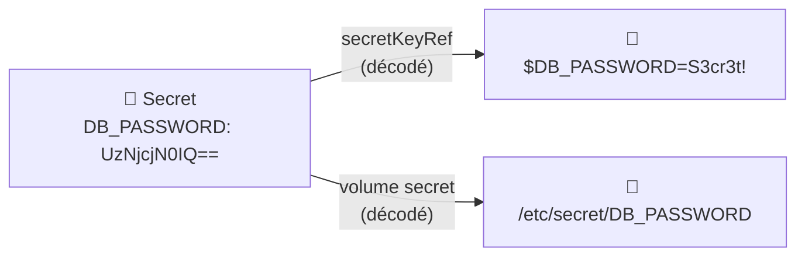
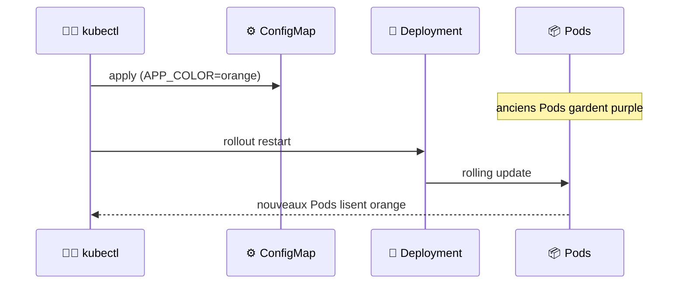
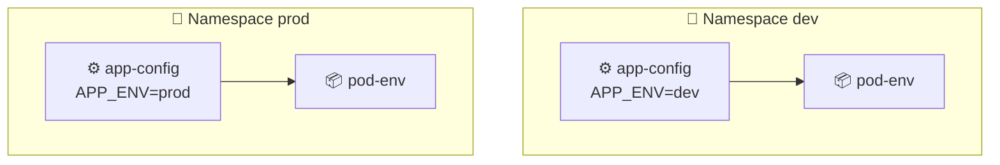
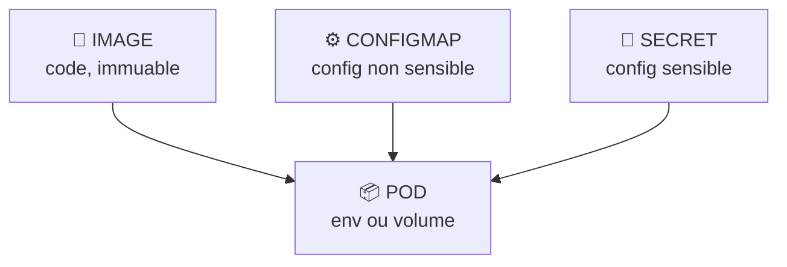
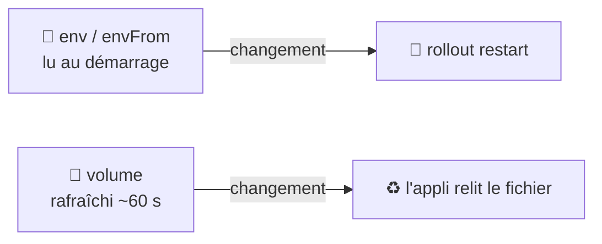

<div align="center">

# ⚙️ TD 104 — ConfigMaps & Secrets


**Objectif :** passer de *« ma config est écrite en dur dans l'image Docker »* → *« la même image tourne en dev, test et prod avec une configuration injectée par Kubernetes »*

</div>

---

## 📋 Sommaire

- [🎯 Objectifs pédagogiques](#-objectifs-pédagogiques)
- [🏗️ Architecture](#️-architecture)
- [Partie 0 — Prérequis](#partie-0--prérequis)
- [Partie 1 — Le problème de la config en dur](#partie-1--le-problème-de-la-config-en-dur)
- [Partie 2 — ConfigMap en ligne de commande](#partie-2--configmap-en-ligne-de-commande)
- [Partie 3 — Injecter en variables d'environnement](#partie-3--injecter-en-variables-denvironnement)
- [Partie 4 — Monter en fichiers (volume)](#partie-4--monter-en-fichiers-volume)
- [Partie 5 — Secrets](#partie-5--secrets)
- [Partie 6 — Le manifeste YAML](#partie-6--le-manifeste-yaml)
- [Partie 7 — Mettre à jour la configuration](#partie-7--mettre-à-jour-la-configuration)
- [Partie 8 — Namespaces](#partie-8--namespaces)
- [Partie 9 — Dashboard](#partie-9--dashboard)
- [Partie 10 — Nettoyage](#partie-10--nettoyage)
- [🏆 Challenge](#-challenge)
- [❓ Quiz de fin](#-quiz-de-fin)
- [📝 Mémo](#-mémo)
- [🧠 À retenir](#-à-retenir)

---

## 🎯 Objectifs pédagogiques

À la fin du TD, vous devez savoir :

- [ ] expliquer pourquoi on **sépare** le code de la configuration
- [ ] créer une **ConfigMap** depuis des littéraux, un fichier ou un dossier
- [ ] injecter une ConfigMap en **variables d'environnement**
- [ ] monter une ConfigMap en **fichiers** dans un container
- [ ] créer et utiliser un **Secret**
- [ ] comprendre ce que le **base64** protège… et ne protège pas
- [ ] mettre à jour une configuration et déclencher un **redéploiement**
- [ ] isoler des environnements avec les **Namespaces**

---

## 🏗️ Architecture



> [!IMPORTANT]
> Une **ConfigMap** stocke de la configuration **non sensible** (clé/valeur ou fichiers). Un **Secret** stocke des données **sensibles** (mots de passe, tokens, certificats). Les deux sont **injectés** dans les Pods sans modifier l'image.

---

## Partie 0 — Prérequis

```bash
minikube status          # Running
kubectl get all          # seul le service "kubernetes" doit rester
```

Créer un dossier de travail :

```bash
mkdir -p ~/td104 && cd ~/td104
```

---

## Partie 1 — Le problème de la config en dur

### 1.1 Une image, plusieurs environnements



Si la config est **dans l'image**, il faut **trois images**… ou rebuild à chaque changement de mot de passe.

### 1.2 Observer un Pod sans config

```bash
kubectl run demo --image=busybox:1.36 --restart=Never -- sh -c 'env; sleep 3600'
kubectl logs demo
```

Seules les variables Kubernetes par défaut apparaissent (`KUBERNETES_SERVICE_HOST`…).

```bash
kubectl delete pod demo
```

> [!TIP]
> **Q1. Citez trois inconvénients d'une configuration codée en dur dans l'image.**
> <details><summary>Réponse</summary>
>
> Une image par environnement, rebuild à chaque changement, secrets visibles dans l'historique de l'image et dans Git. C'est le principe **12-factor** : *config dans l'environnement*.
> </details>

---

## Partie 2 — ConfigMap en ligne de commande

### 2.1 Depuis des littéraux

```bash
kubectl create configmap app-config \
  --from-literal=APP_ENV=dev \
  --from-literal=APP_COLOR=blue
# configmap/app-config created
```

### 2.2 Observer

```bash
kubectl get configmaps        # ou : kubectl get cm
kubectl describe cm app-config
kubectl get cm app-config -o yaml
```

```yaml
apiVersion: v1
kind: ConfigMap
metadata:
  name: app-config
data:
  APP_COLOR: blue
  APP_ENV: dev
```

### 2.3 Depuis un fichier

Créer `nginx.conf` :

```nginx
server {
    listen 80;
    location / {
        return 200 "Hello depuis la ConfigMap\n";
        add_header Content-Type text/plain;
    }
}
```

```bash
kubectl create configmap nginx-config --from-file=nginx.conf
kubectl describe cm nginx-config
```

La **clé** est le nom du fichier (`nginx.conf`), la **valeur** son contenu.

### 2.4 Depuis un fichier `.env`

Créer `app.env` :

```env
APP_ENV=test
APP_COLOR=green
APP_DEBUG=true
```

```bash
kubectl create configmap env-config --from-env-file=app.env
kubectl get cm env-config -o yaml
```

| Option | Résultat |
|---|---|
| `--from-literal=K=V` | Une clé `K` |
| `--from-file=f.conf` | Une clé `f.conf` contenant le fichier |
| `--from-file=dossier/` | Une clé par fichier du dossier |
| `--from-env-file=app.env` | Une clé par ligne `K=V` |

---

## Partie 3 — Injecter en variables d'environnement

### 3.1 Une variable ciblée

Créer `pod-env.yaml` :

```yaml
apiVersion: v1
kind: Pod
metadata:
  name: pod-env
spec:
  containers:
    - name: app
      image: busybox:1.36
      command: ["sh", "-c", "echo ENV=$APP_ENV COLOR=$APP_COLOR; sleep 3600"]
      env:
        - name: APP_ENV
          valueFrom:
            configMapKeyRef:
              name: app-config
              key: APP_ENV
        - name: APP_COLOR
          valueFrom:
            configMapKeyRef:
              name: app-config
              key: APP_COLOR
```

```bash
kubectl apply -f pod-env.yaml
kubectl logs pod-env
# ENV=dev COLOR=blue
```

### 3.2 Toute la ConfigMap d'un coup

Créer `pod-envfrom.yaml` :

```yaml
apiVersion: v1
kind: Pod
metadata:
  name: pod-envfrom
spec:
  containers:
    - name: app
      image: busybox:1.36
      command: ["sh", "-c", "env | grep APP_; sleep 3600"]
      envFrom:
        - configMapRef:
            name: env-config
```

```bash
kubectl apply -f pod-envfrom.yaml
kubectl logs pod-envfrom
```

```
APP_DEBUG=true
APP_ENV=test
APP_COLOR=green
```



> [!TIP]
> **Q2. Modifiez `APP_COLOR` dans la ConfigMap. La variable change-t-elle dans le Pod en cours ?**
> <details><summary>Réponse</summary>
>
> ```bash
> kubectl patch cm app-config -p '{"data":{"APP_COLOR":"red"}}'
> kubectl exec pod-env -- sh -c 'echo $APP_COLOR'   # → blue
> ```
> **Non.** Les variables d'environnement sont lues **au démarrage** du container. Il faut **recréer** le Pod (voir Partie 7).
> </details>

---

## Partie 4 — Monter en fichiers (volume)

### 4.1 Le Pod nginx configuré

Créer `pod-volume.yaml` :

```yaml
apiVersion: v1
kind: Pod
metadata:
  name: pod-volume
  labels:
    app: nginx-cm
spec:
  containers:
    - name: nginx
      image: nginx:1.27
      ports:
        - containerPort: 80
      volumeMounts:
        - name: config
          mountPath: /etc/nginx/conf.d
          readOnly: true
  volumes:
    - name: config
      configMap:
        name: nginx-config
```

```bash
kubectl apply -f pod-volume.yaml
kubectl exec pod-volume -- ls -l /etc/nginx/conf.d
kubectl exec pod-volume -- cat /etc/nginx/conf.d/nginx.conf
```

### 4.2 Tester

```bash
kubectl expose pod pod-volume --port=80 --name=nginx-cm
kubectl run client --image=busybox:1.36 -it --rm --restart=Never -- wget -qO- http://nginx-cm
# Hello depuis la ConfigMap
```



| Champ | Rôle |
|---|---|
| `volumes[].configMap.name` | ConfigMap source |
| `volumeMounts[].mountPath` | Dossier dans le container |
| `volumeMounts[].readOnly` | Bonne pratique : `true` |

### 4.3 Mise à jour à chaud

```bash
kubectl create configmap nginx-config --from-file=nginx.conf --dry-run=client -o yaml \
  | sed 's/Hello depuis la ConfigMap/Version 2 !/' \
  | kubectl apply -f -
```

Attendre ~1 minute puis :

```bash
kubectl exec pod-volume -- cat /etc/nginx/conf.d/nginx.conf
```

> [!NOTE]
> Un volume ConfigMap est **rafraîchi automatiquement** (délai de sync kubelet, ~60 s). Mais nginx doit **relire** sa config : `kubectl exec pod-volume -- nginx -s reload`.

> [!TIP]
> **Q3. Env ou volume : quand choisir l'un ou l'autre ?**
> <details><summary>Réponse</summary>
>
> **Env** : quelques valeurs simples lues au démarrage (`PORT`, `LOG_LEVEL`). **Volume** : fichiers de config complets (`nginx.conf`, `application.yml`), gros contenus, ou besoin de mise à jour sans redémarrage.
> </details>

---

## Partie 5 — Secrets

### 5.1 Créer un Secret

```bash
kubectl create secret generic app-secret \
  --from-literal=DB_USER=admin \
  --from-literal=DB_PASSWORD='S3cr3t!'
kubectl get secrets
```

```
NAME         TYPE     DATA   AGE
app-secret   Opaque   2      5s
```

### 5.2 Regarder dedans

```bash
kubectl describe secret app-secret        # valeurs masquées
kubectl get secret app-secret -o yaml
```

```yaml
data:
  DB_PASSWORD: UzNjcjN0IQ==
  DB_USER: YWRtaW4=
```

```bash
echo 'UzNjcjN0IQ==' | base64 -d
# S3cr3t!
```

> [!WARNING]
> **Base64 n'est pas du chiffrement.** Toute personne ayant le droit de lire le Secret peut le décoder. La protection vient du **RBAC** (droits d'accès) et du **chiffrement au repos** dans etcd, à activer côté cluster.

### 5.3 Injecter dans un Pod

Créer `pod-secret.yaml` :

```yaml
apiVersion: v1
kind: Pod
metadata:
  name: pod-secret
spec:
  containers:
    - name: app
      image: busybox:1.36
      command: ["sh", "-c", "echo USER=$DB_USER; ls /etc/secret; sleep 3600"]
      env:
        - name: DB_USER
          valueFrom:
            secretKeyRef:
              name: app-secret
              key: DB_USER
      volumeMounts:
        - name: secret
          mountPath: /etc/secret
          readOnly: true
  volumes:
    - name: secret
      secret:
        secretName: app-secret
```

```bash
kubectl apply -f pod-secret.yaml
kubectl logs pod-secret
kubectl exec pod-secret -- cat /etc/secret/DB_PASSWORD
# S3cr3t!
```

Le container reçoit la valeur **décodée** : le base64 n'est qu'un format de stockage.



### 5.4 Types de Secrets

| Type | Usage |
|---|---|
| `Opaque` | Générique (défaut) |
| `kubernetes.io/tls` | Certificat + clé : `kubectl create secret tls` |
| `kubernetes.io/dockerconfigjson` | Login registry privé : `kubectl create secret docker-registry` |
| `kubernetes.io/basic-auth` | `username` / `password` |

> [!TIP]
> **Q4. Quelle différence concrète entre ConfigMap et Secret dans Kubernetes ?**
> <details><summary>Réponse</summary>
>
> Techniquement très proches. Le Secret est encodé base64, **non affiché** par `describe`, peut être chiffré au repos, monté en **tmpfs** (jamais écrit sur disque du Node) et soumis à des règles RBAC distinctes. Surtout : c'est un **signal** pour les humains et les outils.
> </details>

---

## Partie 6 — Le manifeste YAML

### 6.1 ConfigMap et Secret en YAML

Créer `config.yaml` :

```yaml
apiVersion: v1
kind: ConfigMap
metadata:
  name: web-config
data:
  APP_ENV: "prod"
  APP_COLOR: "purple"
  index.html: |
    <h1>Config depuis une ConfigMap</h1>
---
apiVersion: v1
kind: Secret
metadata:
  name: web-secret
type: Opaque
stringData:
  API_KEY: "ma-cle-api-en-clair"
```

> [!NOTE]
> `stringData` accepte des valeurs **en clair** ; Kubernetes les encode lui-même. Avec `data`, il faut fournir du base64. **Ne versionnez jamais un Secret en clair dans Git** (utiliser Sealed Secrets, SOPS, Vault…).

### 6.2 Deployment complet

Créer `web-deployment.yaml` :

```yaml
apiVersion: apps/v1
kind: Deployment
metadata:
  name: web
spec:
  replicas: 2
  selector:
    matchLabels:
      app: web
  template:
    metadata:
      labels:
        app: web
    spec:
      containers:
        - name: nginx
          image: nginx:1.27
          ports:
            - containerPort: 80
          envFrom:
            - configMapRef:
                name: web-config
            - secretRef:
                name: web-secret
          volumeMounts:
            - name: html
              mountPath: /usr/share/nginx/html
              readOnly: true
      volumes:
        - name: html
          configMap:
            name: web-config
            items:
              - key: index.html
                path: index.html
```

| Bloc | Rôle |
|---|---|
| `envFrom.configMapRef` | Toutes les clés de la ConfigMap en variables |
| `envFrom.secretRef` | Toutes les clés du Secret en variables |
| `volumes.configMap.items` | Ne monter **que** certaines clés |

### 6.3 Appliquer et vérifier

```bash
kubectl apply -f config.yaml -f web-deployment.yaml
kubectl expose deployment web --port=80
kubectl exec deploy/web -- env | grep -E 'APP_|API_'
kubectl run client --image=busybox:1.36 -it --rm --restart=Never -- wget -qO- http://web
```

---

## Partie 7 — Mettre à jour la configuration

### 7.1 Modifier la ConfigMap

Changer `APP_COLOR: "purple"` → `APP_COLOR: "orange"` dans `config.yaml`, puis :

```bash
kubectl apply -f config.yaml
kubectl exec deploy/web -- env | grep APP_COLOR     # → purple  ❌ toujours l'ancien
```

### 7.2 Forcer le redéploiement

```bash
kubectl rollout restart deployment/web
kubectl rollout status deployment/web
kubectl exec deploy/web -- env | grep APP_COLOR     # → orange ✅
```



> [!TIP]
> **Q5. Comment automatiser ce redéploiement ?**
> <details><summary>Réponse</summary>
>
> Nommer la ConfigMap avec un **hash de son contenu** (`web-config-a1b2c3`) : tout changement modifie le template du Deployment et déclenche un rollout automatique. C'est ce que fait `kustomize` (`configMapGenerator`) ou Helm (annotation `checksum/config`).
> </details>

### 7.3 ConfigMap immuable

```yaml
apiVersion: v1
kind: ConfigMap
metadata:
  name: web-config-v2
immutable: true
data:
  APP_ENV: "prod"
```

> [!NOTE]
> `immutable: true` interdit toute modification (il faut créer une nouvelle ConfigMap). Protège contre les changements accidentels et allège le serveur d'API.

---

## Partie 8 — Namespaces

### 8.1 Le besoin

Même image, **même nom** de ConfigMap, valeurs différentes en dev et en prod : les **Namespaces** cloisonnent.

```bash
kubectl get namespaces
kubectl create namespace dev
kubectl create namespace prod
```

### 8.2 Une config par environnement

```bash
kubectl create configmap app-config --from-literal=APP_ENV=dev  -n dev
kubectl create configmap app-config --from-literal=APP_ENV=prod -n prod
kubectl get cm app-config -n dev  -o jsonpath='{.data.APP_ENV}'; echo
kubectl get cm app-config -n prod -o jsonpath='{.data.APP_ENV}'; echo
```

### 8.3 Déployer la même appli dans les deux

```bash
kubectl apply -f pod-env.yaml -n dev
kubectl apply -f pod-env.yaml -n prod
kubectl logs pod-env -n dev    # ENV=dev
kubectl logs pod-env -n prod   # ENV=prod
```



> [!IMPORTANT]
> Une ConfigMap ou un Secret n'est visible **que dans son Namespace**. Un Pod du Namespace `dev` ne peut pas référencer `app-config` du Namespace `prod`.

```bash
kubectl config set-context --current --namespace=dev   # changer de namespace par défaut
kubectl get pods                                        # → ceux de dev
kubectl config set-context --current --namespace=default
```

---

## Partie 9 — Dashboard

```bash
minikube dashboard
```

| Commande | Dashboard |
|---|---|
| `kubectl get cm` | Config and Storage → Config Maps |
| `kubectl get secrets` | Config and Storage → Secrets |
| `kubectl get cm X -o yaml` | Config Maps → X → *Data* |
| `kubectl get ns` | Menu déroulant *Namespace* en haut |

Dans **Secrets → app-secret**, cliquez sur l'œil 👁️ : le Dashboard décode le base64 pour vous — preuve que ce n'est pas un chiffrement.

---

## Partie 10 — Nettoyage

```bash
kubectl delete -f pod-env.yaml -f pod-envfrom.yaml -f pod-volume.yaml -f pod-secret.yaml
kubectl delete -f web-deployment.yaml -f config.yaml
kubectl delete svc nginx-cm web
kubectl delete cm app-config nginx-config env-config
kubectl delete secret app-secret
kubectl delete namespace dev prod
kubectl get all,cm,secret
```

> [!TIP]
> **Q6. Que se passe-t-il pour un Pod si on supprime la ConfigMap qu'il référence ?**
> <details><summary>Réponse</summary>
>
> Le Pod **en cours continue** de tourner (env déjà chargés, volume déjà monté). Mais tout **nouveau** Pod restera en `CreateContainerConfigError` : la ConfigMap est une dépendance au démarrage.
> </details>

---

## 🏆 Challenge

⏱️ **25 minutes en autonomie.** Déployer une application `api` configurable :

- image `hashicorp/http-echo`, elle affiche la variable `MESSAGE` via `-text=$(MESSAGE)`
- le message vient d'une ConfigMap, un token d'une Secret
- exposée en NodePort

| # | Action | Solution |
|---|---|---|
| A | Créer la ConfigMap `api-config` avec `MESSAGE=Bonjour M2` | <details><summary>👁️</summary><code>kubectl create configmap api-config --from-literal=MESSAGE="Bonjour M2"</code></details> |
| B | Créer le Secret `api-secret` avec `TOKEN=abc123` | <details><summary>👁️</summary><code>kubectl create secret generic api-secret --from-literal=TOKEN=abc123</code></details> |
| C | Écrire un Deployment `api` qui injecte les deux via `envFrom` et utilise `args: ["-listen=:5678", "-text=$(MESSAGE)"]` | <details><summary>👁️</summary>Voir Partie 6.2 ; ajouter <code>args</code> sous <code>image</code> et <code>envFrom</code> avec <code>configMapRef: api-config</code> et <code>secretRef: api-secret</code>.</details> |
| D | Vérifier les variables dans le Pod | <details><summary>👁️</summary><code>kubectl exec deploy/api -- env | grep -E 'MESSAGE|TOKEN'</code></details> |
| E | Exposer en NodePort sur le port 5678 | <details><summary>👁️</summary><code>kubectl expose deployment api --port=80 --target-port=5678 --type=NodePort</code></details> |
| F | Ouvrir dans le navigateur | <details><summary>👁️</summary><code>minikube service api</code></details> |
| G | Changer `MESSAGE` en `Bravo !` | <details><summary>👁️</summary><code>kubectl patch cm api-config -p '{"data":{"MESSAGE":"Bravo !"}}'</code></details> |
| H | Faire prendre en compte le changement | <details><summary>👁️</summary><code>kubectl rollout restart deployment/api</code></details> |
| I | Décoder le token depuis le Secret | <details><summary>👁️</summary><code>kubectl get secret api-secret -o jsonpath='{.data.TOKEN}' | base64 -d</code></details> |
| J | Tout supprimer | <details><summary>👁️</summary><code>kubectl delete deploy,svc api && kubectl delete cm api-config && kubectl delete secret api-secret</code></details> |

---

## ❓ Quiz de fin

<details>
<summary><b>1. Pourquoi ne pas mettre la configuration dans l'image Docker ?</b></summary>

Pour utiliser **une seule image** dans tous les environnements, changer la config sans rebuild, et ne pas embarquer de secrets dans l'image.
</details>

<details>
<summary><b>2. Deux façons d'injecter une ConfigMap dans un Pod ?</b></summary>

En **variables d'environnement** (`env` / `envFrom`) ou en **fichiers** via un **volume**.
</details>

<details>
<summary><b>3. Un Secret est-il chiffré ?</b></summary>

Non, il est **encodé en base64**. La sécurité repose sur le RBAC et le chiffrement au repos d'etcd (optionnel).
</details>

<details>
<summary><b>4. Après modification d'une ConfigMap, pourquoi les variables d'env ne changent-elles pas ?</b></summary>

Elles sont lues au **démarrage** du container. Il faut recréer les Pods (`kubectl rollout restart`).
</details>

<details>
<summary><b>5. Différence entre <code>data</code> et <code>stringData</code> dans un Secret ?</b></summary>

`data` attend du **base64** ; `stringData` accepte du **texte clair** que Kubernetes encode.
</details>

<details>
<summary><b>6. Un Pod du Namespace <code>dev</code> peut-il utiliser un Secret du Namespace <code>prod</code> ?</b></summary>

**Non.** ConfigMaps et Secrets sont **namespacés** : le Pod ne voit que ceux de son propre Namespace.
</details>

---

## 📝 Mémo

| Commande | Fonction |
|---|---|
| `kubectl create configmap X --from-literal=K=V` | ConfigMap depuis des valeurs |
| `kubectl create configmap X --from-file=f` | ConfigMap depuis un fichier |
| `kubectl create configmap X --from-env-file=f.env` | ConfigMap depuis un `.env` |
| `kubectl get configmaps` / `kubectl get cm` | Lister les ConfigMaps |
| `kubectl describe cm X` | Voir le contenu |
| `kubectl create secret generic X --from-literal=K=V` | Créer un Secret |
| `kubectl get secret X -o jsonpath='{.data.K}' \| base64 -d` | Décoder une clé |
| `kubectl patch cm X -p '{"data":{"K":"V"}}'` | Modifier une clé |
| `kubectl rollout restart deployment/X` | Recréer les Pods (recharger la config) |
| `kubectl create namespace X` | Créer un Namespace |
| `kubectl get ... -n X` | Cibler un Namespace |
| `kubectl config set-context --current --namespace=X` | Namespace par défaut |
| `kubectl exec deploy/X -- env` | Voir les variables d'un Pod |

---

## 🧠 À retenir





> [!NOTE]
> **Une image, N environnements. Le code dans l'image, la configuration dans le cluster, les secrets sous clé.**

---

<div align="center">

**Progression du cours :** Pod ✅ ➜ Deployment ✅ ➜ Service ✅ ➜ **Configuration ✅** ➜ Application complète

⬅️ [TD 103 — Services & réseau](103-services-network.md) · ➡️ [TD 105 — Application complète](105-application-complete.md)

</div>