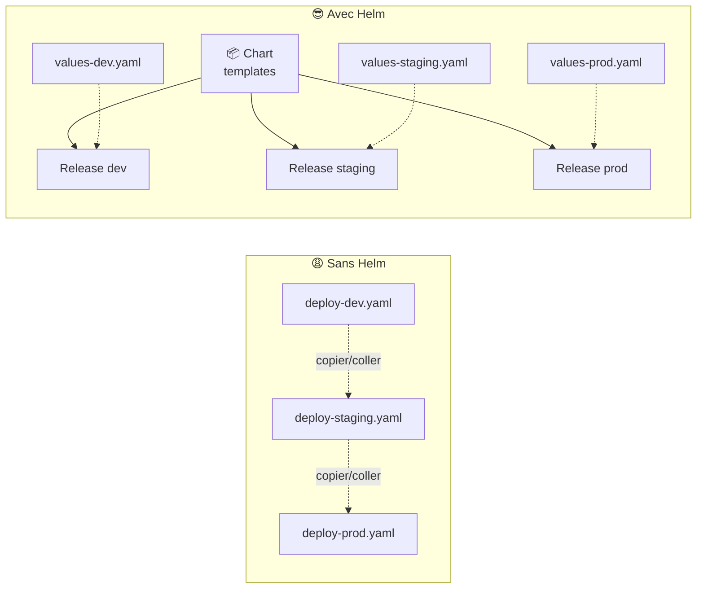
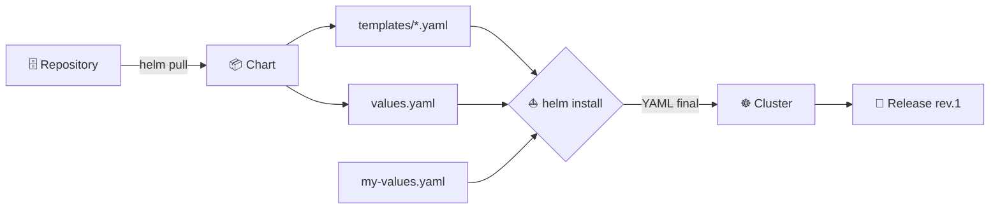
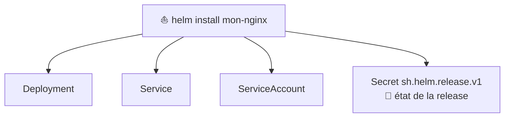
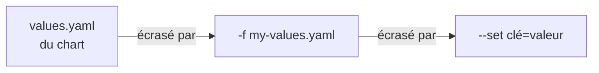

<div align="center">

# ⛵ 106 — Helm pour les nuls

### *Le gestionnaire de paquets de Kubernetes, expliqué simplement*


</div>

---

## 📋 Sommaire

- [🎯 Objectifs](#-objectifs)
- [🤔 Pourquoi Helm ?](#-pourquoi-helm-)
- [📖 Vocabulaire](#-vocabulaire)
- [1️⃣ Installation](#1️⃣-installation)
- [2️⃣ Utiliser un chart existant](#2️⃣-utiliser-un-chart-existant)
- [3️⃣ Personnaliser avec les values](#3️⃣-personnaliser-avec-les-values)
- [4️⃣ Upgrade & rollback](#4️⃣-upgrade--rollback)
- [5️⃣ Créer son premier chart](#5️⃣-créer-son-premier-chart)
- [6️⃣ Templating : les bases](#6️⃣-templating--les-bases)
- [7️⃣ Transformer l'appli 105 en chart](#7️⃣-transformer-lappli-105-en-chart)
- [🧪 Exercices](#-exercices)
- [🩺 Dépannage](#-dépannage)
- [📝 Mémo](#-mémo)
- [✅ Checklist](#-checklist)

---

## 🎯 Objectifs

> [!NOTE]
> À la fin de ce module, vous saurez :

- ✅ Expliquer ce qu'est Helm et pourquoi on l'utilise
- ✅ Installer Helm et ajouter des dépôts de charts
- ✅ Installer, mettre à jour et supprimer une **release**
- ✅ Personnaliser une installation avec un fichier `values.yaml`
- ✅ Revenir en arrière avec `helm rollback`
- ✅ Créer un chart simple et comprendre son arborescence
- ✅ Lire et écrire un template de base

---

## 🤔 Pourquoi Helm ?

Dans le module 105, nous avons écrit **6 fichiers YAML** à la main. Imaginez maintenant :

- 🔁 déployer la même appli en `dev`, `staging` et `prod` avec des valeurs différentes ;
- 📦 installer PostgreSQL, Redis ou Grafana **sans écrire une ligne de YAML** ;
- ⏪ revenir à la version précédente en **une commande**.



> [!IMPORTANT]
> **Helm est à Kubernetes ce que `apt`, `brew` ou `npm` sont à votre système.**
> Un *chart* est un paquet, une *release* est une installation de ce paquet.

---

## 📖 Vocabulaire

| Terme | Analogie | Définition |
|-------|----------|------------|
| 📦 **Chart** | Le paquet `.deb` / le package npm | Un ensemble de templates YAML + valeurs par défaut |
| 🗄️ **Repository** | Le dépôt apt / npmjs.com | Un serveur qui héberge des charts |
| 🚀 **Release** | Le logiciel installé | Une instance d'un chart déployée dans un cluster |
| ⚙️ **Values** | Le fichier de config | Les paramètres qui personnalisent le chart |
| 🔢 **Revision** | L'historique Git | Chaque `install`/`upgrade` crée une nouvelle révision |



---

## 1️⃣ Installation

```bash
# macOS
brew install helm

# Linux
curl https://raw.githubusercontent.com/helm/helm/main/scripts/get-helm-3 | bash

# Vérifier
helm version
```

```
version.BuildInfo{Version:"v3.x.x", ...}
```

> [!TIP]
> Helm v3 n'a **aucun composant côté serveur** (adieu Tiller). Il utilise simplement votre `kubeconfig`, comme `kubectl`.

---

## 2️⃣ Utiliser un chart existant

### 2.1 Ajouter un dépôt

```bash
helm repo add bitnami https://charts.bitnami.com/bitnami
helm repo update
helm repo list
```

### 2.2 Chercher un chart

```bash
helm search repo nginx
helm search hub grafana     # recherche sur artifacthub.io
```

### 2.3 Inspecter avant d'installer

```bash
helm show chart bitnami/nginx       # métadonnées
helm show values bitnami/nginx      # toutes les options configurables
helm show readme bitnami/nginx      # documentation
```

### 2.4 Installer

```bash
kubectl create namespace helm-demo

helm install mon-nginx bitnami/nginx --namespace helm-demo
```

```
NAME: mon-nginx
LAST DEPLOYED: ...
NAMESPACE: helm-demo
STATUS: deployed
REVISION: 1
```

### 2.5 Observer ce que Helm a créé

```bash
helm list -n helm-demo
kubectl get all -n helm-demo
```

> [!NOTE]
> Toutes les ressources portent des labels `app.kubernetes.io/instance=mon-nginx` et `app.kubernetes.io/managed-by=Helm`. Helm sait ainsi ce qui lui appartient.



> [!TIP]
> **Q1. Où Helm stocke-t-il l'historique de la release ?**
> <details><summary>Réponse</summary>
>
> Dans un **Secret** du namespace, nommé `sh.helm.release.v1.<release>.v<revision>`.
> ```bash
> kubectl get secrets -n helm-demo | grep sh.helm
> ```
> </details>

---

## 3️⃣ Personnaliser avec les values

### 3.1 En ligne de commande (`--set`)

```bash
helm upgrade mon-nginx bitnami/nginx -n helm-demo \
  --set replicaCount=3 \
  --set service.type=NodePort
```

### 3.2 Avec un fichier (recommandé)

<details open>
<summary>📄 <code>my-values.yaml</code></summary>

```yaml
replicaCount: 2

service:
  type: NodePort

resources:
  requests:
    cpu: 50m
    memory: 64Mi
  limits:
    cpu: 200m
    memory: 128Mi
```
</details>

```bash
helm upgrade mon-nginx bitnami/nginx -n helm-demo -f my-values.yaml
```

### 3.3 Ordre de priorité



### 3.4 Voir les valeurs effectives

```bash
helm get values mon-nginx -n helm-demo          # ce que VOUS avez fourni
helm get values mon-nginx -n helm-demo --all    # tout, défauts inclus
helm get manifest mon-nginx -n helm-demo        # le YAML réellement appliqué
```

---

## 4️⃣ Upgrade & rollback

```bash
# Historique
helm history mon-nginx -n helm-demo
```

```
REVISION  STATUS      CHART         DESCRIPTION
1         superseded  nginx-x.y.z   Install complete
2         superseded  nginx-x.y.z   Upgrade complete
3         deployed    nginx-x.y.z   Upgrade complete
```

```bash
# ⏪ Revenir à la révision 1
helm rollback mon-nginx 1 -n helm-demo

# 🧹 Désinstaller
helm uninstall mon-nginx -n helm-demo
```

> [!WARNING]
> `helm uninstall` supprime **tout** ce que le chart a créé… sauf les **PVC** dans la plupart des charts (pour protéger vos données). Vérifiez avec `kubectl get pvc`.

> [!TIP]
> Testez toujours un upgrade à blanc avant :
> ```bash
> helm upgrade mon-nginx bitnami/nginx -n helm-demo -f my-values.yaml --dry-run
> ```

---

## 5️⃣ Créer son premier chart

```bash
helm create hello
tree hello
```

```
hello/
├── Chart.yaml            # 🪪 identité du chart (nom, version)
├── values.yaml           # ⚙️ valeurs par défaut
├── charts/               # 📦 dépendances (sous-charts)
├── templates/            # 📝 les YAML à templater
│   ├── _helpers.tpl      #    fonctions réutilisables
│   ├── deployment.yaml
│   ├── service.yaml
│   ├── ingress.yaml
│   ├── serviceaccount.yaml
│   ├── hpa.yaml
│   ├── NOTES.txt         #    message affiché après install
│   └── tests/
└── .helmignore
```

<details>
<summary>📄 <code>Chart.yaml</code></summary>

```yaml
apiVersion: v2
name: hello
description: Mon premier chart Helm
type: application
version: 0.1.0        # version du CHART
appVersion: "1.0.0"   # version de l'APPLICATION
```
</details>

### Tester sans déployer

```bash
helm lint hello                    # ✅ vérifie la syntaxe
helm template hello ./hello        # 👀 affiche le YAML généré
helm install hello ./hello --dry-run --debug
```

### Installer son chart

```bash
helm install hello ./hello -n helm-demo
helm test hello -n helm-demo       # lance templates/tests/
```

---

## 6️⃣ Templating : les bases

Les templates utilisent la syntaxe **Go template** entre `{{ }}`.

### 6.1 Injecter une valeur

```yaml
# values.yaml
replicaCount: 2
image:
  repository: nginx
  tag: "1.27"
```

```yaml
# templates/deployment.yaml
spec:
  replicas: {{ .Values.replicaCount }}
  template:
    spec:
      containers:
        - name: web
          image: "{{ .Values.image.repository }}:{{ .Values.image.tag }}"
```

### 6.2 Les objets disponibles

| Objet | Contient | Exemple |
|-------|----------|---------|
| `.Values` | Le contenu de `values.yaml` | `{{ .Values.replicaCount }}` |
| `.Release` |