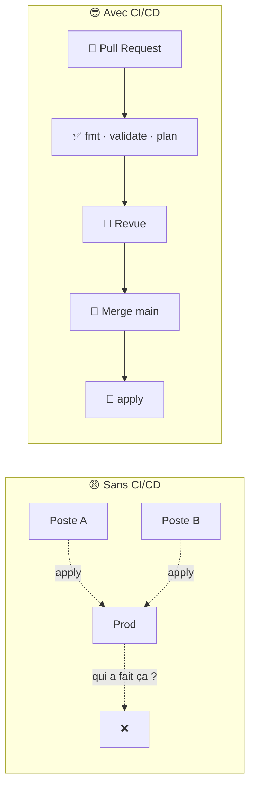
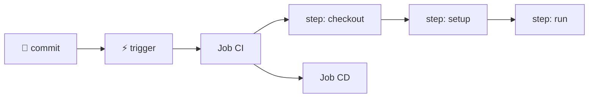
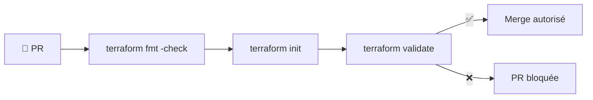
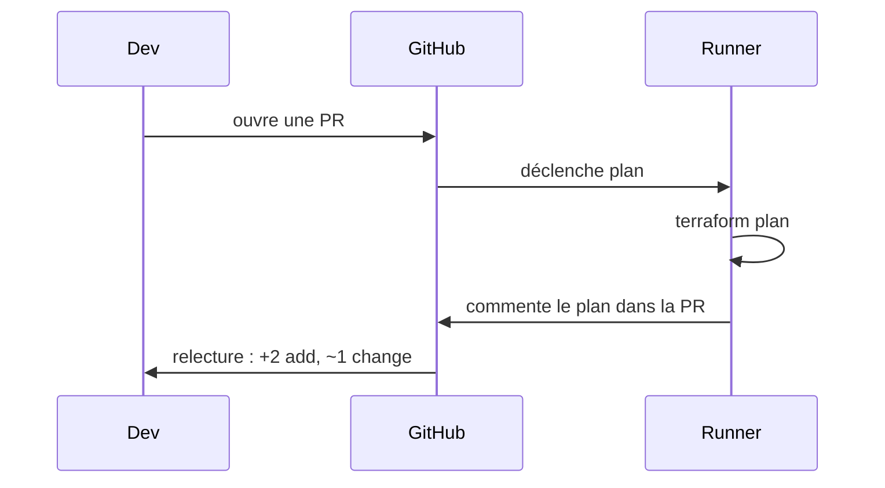
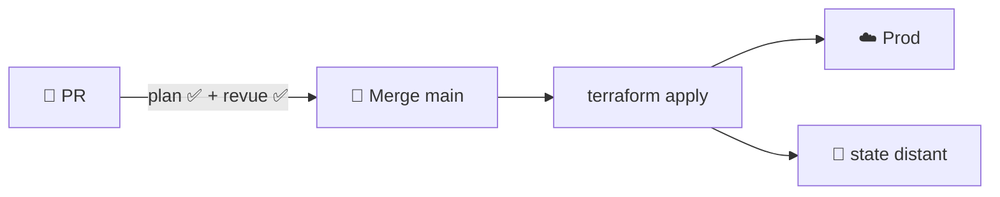
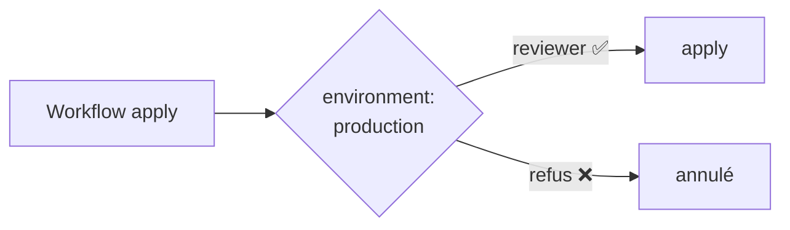
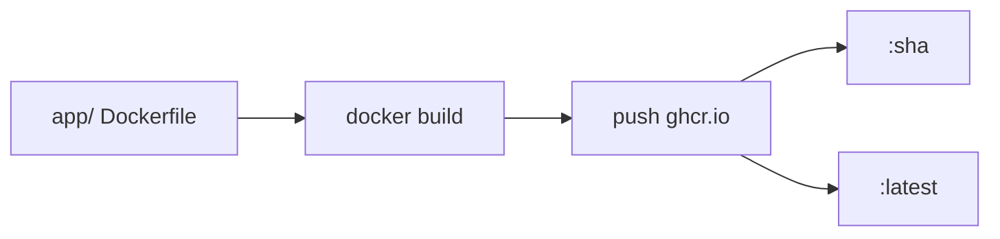

<div align="center">

# 🔁 108 — CI/CD pour les nuls

### *Automatiser `plan` et `apply`, du commit au cluster*


</div>

---

## 📋 Sommaire

- [🎯 Objectifs](#-objectifs)
- [🤔 Pourquoi le CI/CD ?](#-pourquoi-le-cicd-)
- [📖 Vocabulaire](#-vocabulaire)
- [1️⃣ Premier workflow GitHub Actions](#1️⃣-premier-workflow-github-actions)
- [2️⃣ CI : valider le code Terraform](#2️⃣-ci--valider-le-code-terraform)
- [3️⃣ `plan` dans la Pull Request](#3️⃣-plan-dans-la-pull-request)
- [4️⃣ `apply` au merge sur `main`](#4️⃣-apply-au-merge-sur-main)
- [5️⃣ Secrets & environnements](#5️⃣-secrets--environnements)
- [6️⃣ Build & push d'une image Docker](#6️⃣-build--push-dune-image-docker)
- [7️⃣ Déployer le chart Helm du 106](#7️⃣-déployer-le-chart-helm-du-106)
- [🧪 Exercices](#-exercices)
- [🩺 Dépannage](#-dépannage)
- [📝 Mémo](#-mémo)
- [✅ Checklist](#-checklist)

---

## 🎯 Objectifs

> [!NOTE]
> À la fin de ce module, vous saurez :

- ✅ Expliquer la différence entre **CI**, **CD** (delivery) et **CD** (deployment)
- ✅ Écrire un workflow **GitHub Actions** (`on`, `jobs`, `steps`)
- ✅ Lancer `fmt`, `validate` et `plan` automatiquement sur chaque Pull Request
- ✅ Exécuter `terraform apply` **uniquement** au merge sur `main`
- ✅ Gérer les **secrets** et les **environnements** protégés
- ✅ Builder une image Docker et déployer un chart Helm depuis la CI

---

## 🤔 Pourquoi le CI/CD ?

Dans le 107, vous tapiez `terraform apply` sur votre machine. Imaginez :

- 💻 un collègue applique depuis **son** poste avec une autre version de Terraform ;
- 😱 quelqu'un lance `apply` en prod **sans relire le plan** ;
- 🕵️ personne ne sait **qui** a déployé **quoi** vendredi soir.



> [!IMPORTANT]
> **Le dépôt Git devient la seule source de vérité.** Rien n'est déployé qui n'a pas été commité, relu et tracé.

---

## 📖 Vocabulaire

| Terme | Analogie | Définition |
|-------|----------|------------|
| 🔬 **CI** (Intégration Continue) | Le contrôle qualité | À chaque commit : lint, tests, build, `plan` |
| 📦 **CD** (Livraison Continue) | Le colis prêt à partir | Artefact validé, déploiement **manuel** |
| 🚀 **CD** (Déploiement Continu) | Le colis livré tout seul | Déploiement **automatique** après merge |
| 📄 **Workflow** | La recette | Fichier YAML dans `.github/workflows/` |
| ⚡ **Trigger** (`on`) | La sonnette | Événement qui lance le workflow : `push`, `pull_request`… |
| 🏃 **Runner** | Le cuisinier | Machine qui exécute les jobs (`ubuntu-latest`) |
| 🧩 **Action** | Un chart Helm | Étape réutilisable (`actions/checkout`, `hashicorp/setup-terraform`) |
| 🔐 **Secret** | Le coffre | Variable chiffrée, jamais affichée dans les logs |



---

## 1️⃣ Premier workflow GitHub Actions

```bash
mkdir -p .github/workflows
```

<details open>
<summary>📄 <code>.github/workflows/hello.yml</code></summary>

```yaml
name: Hello CI

on:
  push:
    branches: [main]
  pull_request:

jobs:
  hello:
    runs-on: ubuntu-latest
    steps:
      - name: Récupérer le code
        uses: actions/checkout@v4

      - name: Dire bonjour
        run: echo "Bonjour depuis la CI 🔁 (commit ${{ github.sha }})"
```
</details>

```bash
git add .github && git commit -m "ci: premier workflow" && git push
```

Onglet **Actions** du dépôt → le job apparaît en vert ✅.

> [!NOTE]
> Structure à retenir : **`on`** (quand) → **`jobs`** (quoi) → **`steps`** (comment). Un `step` fait soit `uses:` (une action), soit `run:` (une commande shell).

> [!TIP]
> **Q1. Quelle différence entre `on: push` et `on: pull_request` ?**
> <details><summary>Réponse</summary>
>
> `push` se déclenche quand des commits arrivent sur une branche ; `pull_request` quand une PR est ouverte/mise à jour. On utilise la 2ᵉ pour la **validation** et la 1ʳᵉ (sur `main`) pour le **déploiement**.
> </details>

---

## 2️⃣ CI : valider le code Terraform

<details open>
<summary>📄 <code>.github/workflows/terraform-ci.yml</code></summary>

```yaml
name: Terraform CI

on:
  pull_request:
    paths: ["infra/**"]

jobs:
  validate:
    runs-on: ubuntu-latest
    defaults:
      run:
        working-directory: infra
    steps:
      - uses: actions/checkout@v4

      - uses: hashicorp/setup-terraform@v3
        with:
          terraform_version: "1.9.x"

      - name: Format
        run: terraform fmt -check -recursive

      - name: Init (sans backend)
        run: terraform init -backend=false

      - name: Validate
        run: terraform validate
```
</details>



> [!TIP]
> `paths:` évite de lancer Terraform quand seule la doc change. `-backend=false` permet de valider sans accès au state distant.

---

## 3️⃣ `plan` dans la Pull Request

<details open>
<summary>📄 <code>.github/workflows/terraform-plan.yml</code></summary>

```yaml
name: Terraform Plan

on:
  pull_request:
    paths: ["infra/**"]

permissions:
  contents: read
  pull-requests: write   # pour commenter la PR

jobs:
  plan:
    runs-on: ubuntu-latest
    defaults:
      run:
        working-directory: infra
    env:
      AWS_ACCESS_KEY_ID: ${{ secrets.AWS_ACCESS_KEY_ID }}
      AWS_SECRET_ACCESS_KEY: ${{ secrets.AWS_SECRET_ACCESS_KEY }}
    steps:
      - uses: actions/checkout@v4
      - uses: hashicorp/setup-terraform@v3

      - run: terraform init

      - name: Plan
        id: plan
        run: terraform plan -no-color -out=tfplan
        continue-on-error: true

      - name: Commenter la PR
        uses: actions/github-script@v7
        with:
          script: |
            const plan = `${{ steps.plan.outputs.stdout }}`;
            github.rest.issues.createComment({
              ...context.repo,
              issue_number: context.issue.number,
              body: `### 🏗️ Terraform plan\n\`\`\`\n${plan}\n\`\`\``
            });

      - name: Échouer si le plan a échoué
        if: steps.plan.outcome == 'failure'
        run: exit 1
```
</details>



> [!IMPORTANT]
> Le **plan est relu par un humain** dans la PR. C'est la protection n° 1 contre un `-/+ replace` destructeur.

---

## 4️⃣ `apply` au merge sur `main`

<details open>
<summary>📄 <code>.github/workflows/terraform-apply.yml</code></summary>

```yaml
name: Terraform Apply

on:
  push:
    branches: [main]
    paths: ["infra/**"]

concurrency:
  group: terraform-prod
  cancel-in-progress: false   # jamais deux apply en parallèle

jobs:
  apply:
    runs-on: ubuntu-latest
    environment: production      # règles de protection (§5)
    defaults:
      run:
        working-directory: infra
    env:
      AWS_ACCESS_KEY_ID: ${{ secrets.AWS_ACCESS_KEY_ID }}
      AWS_SECRET_ACCESS_KEY: ${{ secrets.AWS_SECRET_ACCESS_KEY }}
    steps:
      - uses: actions/checkout@v4
      - uses: hashicorp/setup-terraform@v3
      - run: terraform init
      - run: terraform apply -auto-approve
```
</details>



> [!WARNING]
> `apply -auto-approve` n'est acceptable **que** parce que : (1) le plan a été relu en PR, (2) `main` est protégée, (3) le state est distant avec verrou, (4) `concurrency` interdit deux applies simultanés.

> [!TIP]
> **Q2. Pourquoi séparer `plan` (PR) et `apply` (main) en deux workflows ?**
> <details><summary>Réponse</summary>
>
> Le workflow PR tourne sur du code **non relu** : il ne doit avoir que des droits de lecture. Le workflow `main` tourne sur du code **approuvé** : lui seul a le droit d'écrire. Principe du moindre privilège.
> </details>

---

## 5️⃣ Secrets & environnements

### 5.1 Ajouter un secret

**Settings → Secrets and variables → Actions → New repository secret**

```yaml
env:
  KUBECONFIG_B64: ${{ secrets.KUBECONFIG_B64 }}
steps:
  - name: Restaurer le kubeconfig
    run: |
      mkdir -p ~/.kube
      echo "$KUBECONFIG_B64" | base64 -d > ~/.kube/config
```

```bash
# Encoder localement
base64 -i ~/.kube/config | pbcopy      # macOS
```

### 5.2 Environnements protégés

**Settings → Environments → `production`** :

- 👥 **Required reviewers** : un humain valide avant `apply`
- ⏱️ **Wait timer** : délai de sécurité
- 🌿 **Deployment branches** : `main` uniquement



### 5.3 Mieux : OIDC, sans clés statiques

```yaml
permissions:
  id-token: write
  contents: read
steps:
  - uses: aws-actions/configure-aws-credentials@v4
    with:
      role-to-assume: arn:aws:iam::123456789012:role/github-terraform
      aws-region: eu-west-3
```

> [!TIP]
> Avec OIDC, GitHub obtient un jeton **temporaire** auprès du cloud : plus de `AWS_SECRET_ACCESS_KEY` à stocker ni à faire tourner.

---

## 6️⃣ Build & push d'une image Docker

<details open>
<summary>📄 <code>.github/workflows/docker.yml</code></summary>

```yaml
name: Docker Build

on:
  push:
    branches: [main]
    paths: ["app/**"]

permissions:
  contents: read
  packages: write

jobs:
  build:
    runs-on: ubuntu-latest
    steps:
      - uses: actions/checkout@v4

      - uses: docker/login-action@v3
        with:
          registry: ghcr.io
          username: ${{ github.actor }}
          password: ${{ secrets.GITHUB_TOKEN }}

      - uses: docker/build-push-action@v6
        with:
          context: app
          push: true
          tags: |
            ghcr.io/${{ github.repository }}/web:${{ github.sha }}
            ghcr.io/${{ github.repository }}/web:latest
```
</details>



> [!NOTE]
> `GITHUB_TOKEN` est fourni automatiquement : aucun secret à créer pour pousser sur **GitHub Container Registry**. Taggez toujours avec le `sha` pour savoir exactement ce qui tourne.

---

## 7️⃣ Déployer le chart Helm du 106

<details open>
<summary>📄 <code>.github/workflows/helm-deploy.yml</code></summary>

```yaml
name: Helm Deploy

on:
  workflow_run:
    workflows: ["Docker Build"]
    types: [completed]

jobs:
  deploy:
    if: ${{ github.event.workflow_run.conclusion == 'success' }}
    runs-on: ubuntu-latest
    environment: production
    steps:
      - uses: actions/checkout@v4

      - uses: azure/setup-helm@v4

      - name: Kubeconfig
        run: |
          mkdir -p ~/.kube
          echo "${{ secrets.KUBECONFIG_B64 }}" | base64 -d > ~/.kube/config

      - name: Lint
        run: helm lint ./charts/mon-app

      - name: Upgrade / install
        run: |
          helm upgrade --install mon-app ./charts/mon-app \
            --namespace prod --create-namespace \
            -f charts/mon-app/values-prod.yaml \
            --set image.tag=${{ github.event.workflow_run.head_sha }} \
            --atomic --timeout 5m
```
</details>

```mermaid
flowchart LR
    PUSH[git push app/] --> DOCKER[🐳 Docker Build]
    DOCKER -->|success| HELM[⛵ Helm Deploy]
    HELM --> K8S[☸️ Cluster prod]
    HELM -.--atomic.-> RB[↩️ rollback auto si échec]
```

> [!IMPORTANT]
> **Qui fait quoi dans la chaîne ?**
> - **Terraform** (107) : le cluster, les namespaces, l'infra.
> - **Docker** : l'image de l'application.
> - **Helm** (106) : le déploiement de l'application.
> - **GitHub Actions** (108) : orchestre le tout, à chaque commit.

---

## 🧪 Exercices

> [!NOTE]
> Faites les exercices dans l'ordre, chacun s'appuie sur le précédent.

### Exercice 1 — Hello
Créez `hello.yml` et faites‑lui afficher le nom de la branche (`${{ github.ref_name }}`).

### Exercice 2 — CI Terraform
Ajoutez le workflow `terraform-ci.yml` sur le dossier `infra/` du 107. Cassez volontairement l'indentation : la PR doit passer au rouge.

### Exercice 3 — Plan commenté
Mettez en place `terraform-plan.yml` et vérifiez que le plan apparaît en commentaire de la PR.

### Exercice 4 — Environnement protégé
Créez l'environnement `production` avec vous‑même comme reviewer. Mergez : le job `apply` doit attendre votre validation.

### Exercice 5 — Chaîne complète
Modifiez `app/index.html`, poussez, et observez : Docker Build → Helm Deploy → nouvelle version en ligne.

<details>
<summary>💡 Solution exercice 1</summary>

```yaml
- run: echo "Branche : ${{ github.ref_name }}"
```
</details>

---

## 🩺 Dépannage

| Symptôme | Cause probable | Solution |
|----------|----------------|----------|
| Workflow **n'apparaît pas** | Mauvais chemin ou YAML invalide | Fichier dans `.github/workflows/`, vérifier l'indentation |
| `Resource not accessible by integration` | `permissions:` insuffisantes | Ajouter `pull-requests: write`, `packages: write`… |
| `Error acquiring the state lock` | Deux applies en parallèle | Bloc `concurrency:` + `force-unlock` si nécessaire |
| Secret vide dans les logs (`***`) | Normal, c'est masqué | Vérifier l'orthographe du nom du secret |
| `terraform fmt -check` échoue | Code non formaté | `terraform fmt -recursive` en local, recommiter |
| `helm upgrade` échoue puis rollback | Image introuvable ou pod en crash | Vérifier le tag `image.tag`, `kubectl describe pod` |
| Job `apply` en attente indéfinie | Reviewer requis sur l'environnement | Approuver dans l'onglet **Actions** |

```bash
# Tester un workflow en local (outil act)
brew install act
act pull_request -W .github/workflows/terraform-ci.yml

# Voir les logs depuis le terminal
gh run list
gh run view --log
```

---

## 📝 Mémo

| Élément | Rôle |
|---------|------|
| `on: pull_request` | Valider (`fmt`, `validate`, `plan`) |
| `on: push: branches: [main]` | Déployer (`apply`, `helm upgrade`) |
| `paths:` | Ne lancer que si certains fichiers changent |
| `uses: actions/checkout@v4` | Récupérer le code |
| `uses: hashicorp/setup-terraform@v3` | Installer Terraform |
| `${{ secrets.X }}` | Lire un secret |
| `environment: production` | Activer les protections (reviewers, branches) |
| `concurrency:` | Interdire les exécutions parallèles |
| `permissions:` | Moindre privilège pour `GITHUB_TOKEN` |
| `--atomic` (Helm) | Rollback automatique si le déploiement échoue |

```yaml
# Squelette minimal
name: Mon workflow
on: [push]
jobs:
  job1:
    runs-on: ubuntu-latest
    steps:
      - uses: actions/checkout@v4
      - run: echo "hello"
```

---

## ✅ Checklist

- [ ] Un workflow `hello.yml` passe au vert dans l'onglet **Actions**
- [ ] `fmt`, `validate` et `plan` tournent sur chaque PR touchant `infra/`
- [ ] Le plan est visible en commentaire de la PR
- [ ] `apply` ne tourne que sur `main`, avec `concurrency`
- [ ] Un environnement `production` protégé par reviewer existe
- [ ] Aucune clé en clair : secrets GitHub ou OIDC
- [ ] Une image Docker est poussée sur `ghcr.io` taggée avec le `sha`
- [ ] `helm upgrade --install --atomic` déploie depuis la CI
- [ ] Je sais expliquer CI vs livraison continue vs déploiement continu

<div align="center">

**➡️ Module suivant : 109 — Observabilité : logs, métriques et alertes**

</div>