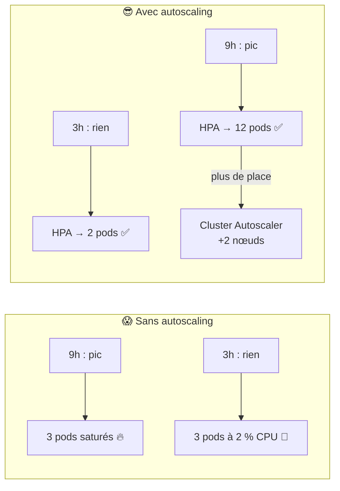
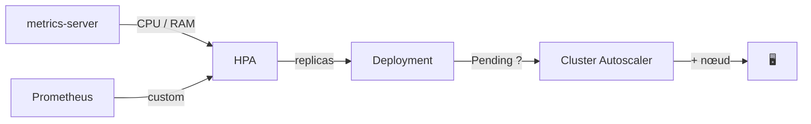
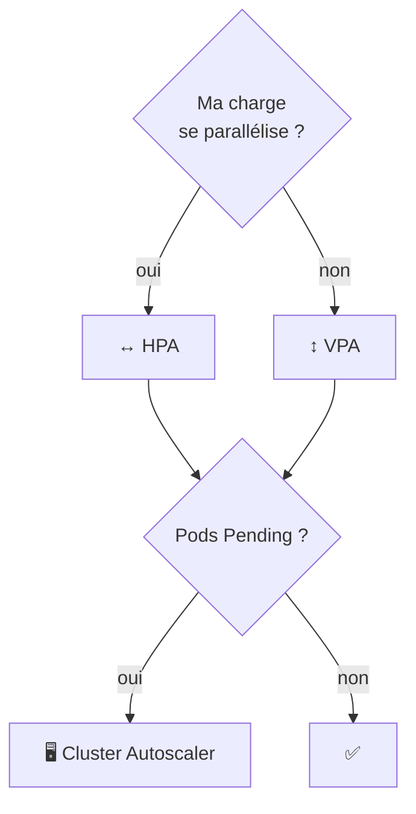
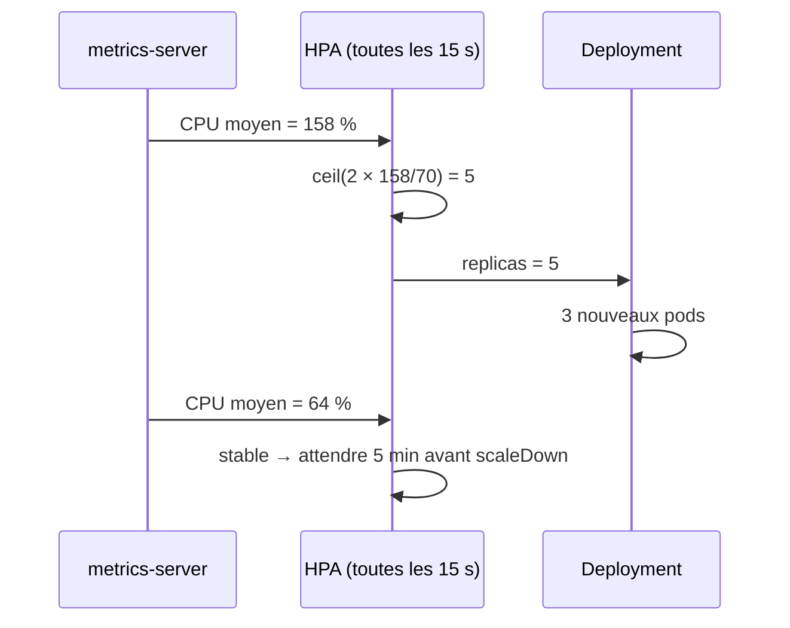
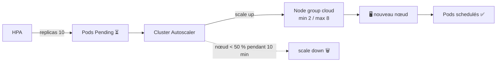
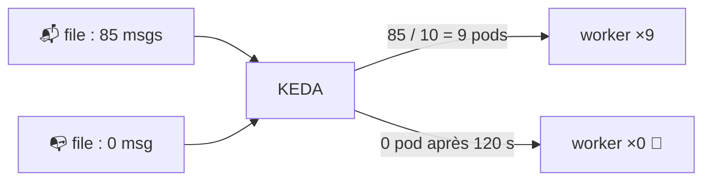

<div align="center">

# 📈 111 — Autoscaling pour les nuls

### *HPA, VPA et Cluster Autoscaler : dimensionner sans veiller la nuit*


</div>

---

## 📋 Sommaire

- [🎯 Objectifs](#-objectifs)
- [🤔 Pourquoi l'autoscaling ?](#-pourquoi-lautoscaling-)
- [📖 Vocabulaire](#-vocabulaire)
- [1️⃣ Les 3 axes de l'autoscaling](#1️⃣-les-3-axes-de-lautoscaling)
- [2️⃣ Prérequis : requests et metrics-server](#2️⃣-prérequis--requests-et-metrics-server)
- [3️⃣ HPA : scaler horizontalement](#3️⃣-hpa--scaler-horizontalement)
- [4️⃣ VPA : scaler verticalement](#4️⃣-vpa--scaler-verticalement)
- [5️⃣ Cluster Autoscaler : scaler les nœuds](#5️⃣-cluster-autoscaler--scaler-les-nœuds)
- [6️⃣ KEDA : scaler sur autre chose que le CPU](#6️⃣-keda--scaler-sur-autre-chose-que-le-cpu)
- [7️⃣ Bonnes pratiques](#7️⃣-bonnes-pratiques)
- [🧪 Exercices](#-exercices)
- [🩺 Dépannage](#-dépannage)
- [📝 Mémo](#-mémo)
- [✅ Checklist](#-checklist)

---

## 🎯 Objectifs

> [!NOTE]
> À la fin de ce module, vous saurez :

- ✅ Distinguer **HPA**, **VPA** et **Cluster Autoscaler** et savoir lequel utiliser
- ✅ Installer **metrics-server** et lire `kubectl top`
- ✅ Écrire un **HPA** sur le CPU, la mémoire et une métrique custom
- ✅ Régler le **comportement** de scaling (stabilisation, vitesse) pour éviter le yo‑yo
- ✅ Utiliser **VPA** en mode recommandation pour dimensionner les `requests`
- ✅ Comprendre comment le **Cluster Autoscaler** ajoute et retire des nœuds
- ✅ Scaler sur une **file de messages** avec **KEDA**

---

## 🤔 Pourquoi l'autoscaling ?

Dans le 110, votre cluster est verrouillé. Mais le lundi matin à 9h, la page d'accueil met 8 secondes à répondre… et le dimanche à 3h, 10 pods tournent pour 0 utilisateur.



> [!IMPORTANT]
> L'autoscaling ne remplace pas le dimensionnement : il **ajuste** autour d'une base saine. Sans `requests` correctes (module 107), aucun autoscaler ne fonctionne.

---

## 📖 Vocabulaire

| Terme | Analogie | Définition |
|-------|----------|------------|
| 📊 **metrics-server** | Le thermomètre | Collecte CPU/mémoire des pods et nœuds pour `kubectl top` et l'HPA |
| ↔️ **HPA** | Ouvrir plus de caisses | *Horizontal Pod Autoscaler* : change le nombre de **replicas** |
| ↕️ **VPA** | Agrandir la caisse | *Vertical Pod Autoscaler* : change les **requests/limits** |
| 🖥️ **Cluster Autoscaler** | Construire un nouveau magasin | Ajoute/retire des **nœuds** selon les pods en attente |
| 🎯 **Utilisation cible** | La température de consigne | % des `requests` visé par l'HPA (ex. 70 %) |
| 🧮 **Métrique custom** | Un autre capteur | RPS, taille de file… exposée via Prometheus Adapter ou KEDA |
| ⏳ **Stabilisation** | Le délai avant d'agir | Fenêtre pendant laquelle l'HPA attend avant de réduire |
| 🧊 **PodDisruptionBudget** | Le service minimum | Nombre de pods à toujours garder pendant un drain |
| ⚡ **KEDA** | Le capteur universel | *Kubernetes Event‑Driven Autoscaling* : scale sur des événements externes |



---

## 1️⃣ Les 3 axes de l'autoscaling

| Axe | Outil | Change quoi | Quand l'utiliser |
|-----|-------|-------------|------------------|
| ↔️ Horizontal | **HPA** | Nombre de pods | App stateless qui encaisse la charge en parallèle |
| ↕️ Vertical | **VPA** | CPU/RAM par pod | App qu'on ne peut pas dupliquer (base, batch) ou pour **trouver les bonnes requests** |
| 🖥️ Infra | **Cluster Autoscaler** | Nombre de nœuds | Quand les pods restent `Pending` faute de place |



> [!WARNING]
> **HPA et VPA sur le CPU d'un même Deployment = conflit.** L'un ajoute des pods, l'autre les grossit, les deux se battent. Utilisez le VPA en mode `Off` (recommandation) si un HPA est actif.

> [!TIP]
> **Q1. Un HPA peut‑il résoudre un pod `Pending` ?**
> <details><summary>Réponse</summary>
>
> Non. `Pending` = plus de place sur les nœuds. L'HPA demande des pods, seul le **Cluster Autoscaler** (ou vous) fournit des nœuds.
> </details>

---

## 2️⃣ Prérequis : requests et metrics-server

### 2.1 Installer metrics-server

```bash
kubectl apply -f https://github.com/kubernetes-sigs/metrics-server/releases/latest/download/components.yaml

# Sur kind / minikube (certificats auto-signés) :
kubectl patch deploy metrics-server -n kube-system --type=json \
  -p='[{"op":"add","path":"/spec/template/spec/containers/0/args/-","value":"--kubelet-insecure-tls"}]'

kubectl top nodes
kubectl top pods -n prod
```

```text
NAME                        CPU(cores)   MEMORY(bytes)
backend-7d9f8b6c4-abcde     120m         180Mi
backend-7d9f8b6c4-fghij     95m          172Mi
```

### 2.2 Des requests réalistes

```yaml
resources:
  requests: { cpu: 200m, memory: 256Mi }   # ← l'HPA calcule en % de CECI
  limits:   { cpu: 500m, memory: 512Mi }
```

> [!IMPORTANT]
> `70 % d'utilisation` signifie **70 % des `requests`**, pas des `limits` ni du nœud. Pas de `requests` → l'HPA affiche `<unknown>` et ne fait rien.

---

## 3️⃣ HPA : scaler horizontalement

### 3.1 Version rapide

```bash
kubectl autoscale deploy backend -n prod --cpu-percent=70 --min=2 --max=10
kubectl get hpa -n prod -w
```

### 3.2 Version déclarative

<details open>
<summary>📄 <code>autoscaling/hpa-backend.yaml</code></summary>

```yaml
apiVersion: autoscaling/v2
kind: HorizontalPodAutoscaler
metadata:
  name: backend
  namespace: prod
spec:
  scaleTargetRef:
    apiVersion: apps/v1
    kind: Deployment
    name: backend
  minReplicas: 2
  maxReplicas: 10
  metrics:
    - type: Resource
      resource:
        name: cpu
        target: { type: Utilization, averageUtilization: 70 }
    - type: Resource
      resource:
        name: memory
        target: { type: Utilization, averageUtilization: 80 }
  behavior:
    scaleUp:
      stabilizationWindowSeconds: 0        # réagir tout de suite
      policies:
        - type: Percent
          value: 100                       # max ×2 par période
          periodSeconds: 30
    scaleDown:
      stabilizationWindowSeconds: 300      # attendre 5 min avant de réduire
      policies:
        - type: Pods
          value: 1                         # -1 pod max par minute
          periodSeconds: 60
```
</details>

```bash
kubectl apply -f autoscaling/hpa-backend.yaml
kubectl describe hpa backend -n prod
```

### 3.3 La formule

```text
replicas_souhaités = ceil( replicas_actuels × utilisation_actuelle / utilisation_cible )

Ex. : 3 pods à 140 % de leurs requests, cible 70 %
→ ceil(3 × 140 / 70) = 6 pods
```

### 3.4 Générer de la charge

```bash
kubectl run -n prod -it --rm load --image=busybox -- \
  /bin/sh -c "while true; do wget -q -O- http://backend:8080/; done"

# Dans un autre terminal
kubectl get hpa backend -n prod -w
```

```text
NAME      REFERENCE            TARGETS          MINPODS  MAXPODS  REPLICAS
backend   Deployment/backend   cpu: 12%/70%     2        10       2
backend   Deployment/backend   cpu: 158%/70%    2        10       2
backend   Deployment/backend   cpu: 158%/70%    2        10       5
backend   Deployment/backend   cpu: 64%/70%     2        10       5
```



> [!TIP]
> **Q2. Pourquoi une fenêtre de stabilisation longue pour le scaleDown et courte pour le scaleUp ?**
> <details><summary>Réponse</summary>
>
> Sous‑capacité = utilisateurs mécontents **tout de suite** ; sur‑capacité = quelques euros. On monte vite, on descend prudemment pour éviter le **flapping** (yo‑yo).
> </details>

---

## 4️⃣ VPA : scaler verticalement

### 4.1 Installation

```bash
git clone https://github.com/kubernetes/autoscaler.git
cd autoscaler/vertical-pod-autoscaler && ./hack/vpa-up.sh
```

### 4.2 Mode recommandation (le plus utile)

<details open>
<summary>📄 <code>autoscaling/vpa-backend.yaml</code></summary>

```yaml
apiVersion: autoscaling.k8s.io/v1
kind: VerticalPodAutoscaler
metadata:
  name: backend
  namespace: prod
spec:
  targetRef:
    apiVersion: apps/v1
    kind: Deployment
    name: backend
  updatePolicy:
    updateMode: "Off"              # recommande, ne touche à rien
  resourcePolicy:
    containerPolicies:
      - containerName: "*"
        minAllowed: { cpu: 50m, memory: 64Mi }
        maxAllowed: { cpu: 2, memory: 2Gi }
```
</details>

```bash
kubectl apply -f autoscaling/vpa-backend.yaml
sleep 300   # laisser observer
kubectl describe vpa backend -n prod
```

```text
Recommendation:
  Container Recommendations:
    Container Name:  app
    Lower Bound:   cpu: 80m    memory: 150Mi
    Target:        cpu: 143m   memory: 210Mi     ← copier dans values.yaml
    Upper Bound:   cpu: 410m   memory: 380Mi
```

| `updateMode` | Comportement |
|--------------|--------------|
| `Off` | Recommande seulement (👍 pour commencer) |
| `Initial` | Applique à la création du pod uniquement |
| `Recreate` / `Auto` | **Redémarre** les pods pour appliquer ⚠️ |

> [!WARNING]
> `Auto` **évince les pods** pour changer leurs ressources. Sur un Deployment à 1 replica, c'est une coupure. Combinez toujours avec un **PodDisruptionBudget** et ≥ 2 replicas.

---

## 5️⃣ Cluster Autoscaler : scaler les nœuds



### 5.1 Ce qu'il fait

| Événement | Action |
|-----------|--------|
| Pods `Pending` par manque de ressources | Ajoute un nœud dans le *node group* |
| Nœud sous‑utilisé (< 50 %) pendant 10 min et pods déplaçables | Draine et supprime le nœud |
| Pod sans contrôleur, avec `hostPath`, ou PDB violé | **Ne** supprime **pas** le nœud |

### 5.2 Installation (exemple cloud)

```bash
# EKS (adapter pour GKE/AKS ; sur GKE il est intégré)
helm repo add autoscaler https://kubernetes.github.io/autoscaler
helm upgrade --install cluster-autoscaler autoscaler/cluster-autoscaler \
  -n kube-system \
  --set autoDiscovery.clusterName=mon-cluster \
  --set awsRegion=eu-west-3 \
  --set extraArgs.scale-down-unneeded-time=10m \
  --set extraArgs.balance-similar-node-groups=true
```

### 5.3 Protéger pendant le scale down

<details open>
<summary>📄 <code>autoscaling/pdb-backend.yaml</code></summary>

```yaml
apiVersion: policy/v1
kind: PodDisruptionBudget
metadata:
  name: backend
  namespace: prod
spec:
  minAvailable: 1                 # ou maxUnavailable: 1
  selector:
    matchLabels: { app: backend }
```
</details>

> [!NOTE]
> En local (kind, minikube) il n'y a pas de Cluster Autoscaler : simulez‑le avec `kind create cluster --config` à 3 nœuds et observez les `Pending` quand l'HPA monte trop haut.

> [!TIP]
> **Karpenter** (AWS) est l'alternative moderne : il choisit lui‑même le type d'instance optimal au lieu de piocher dans des *node groups* fixes.

---

## 6️⃣ KEDA : scaler sur autre chose que le CPU

Un *worker* qui consomme une file RabbitMQ n'a pas besoin de plus de pods quand le CPU monte, mais quand **la file s'allonge**. Et il peut descendre à **0**.

```bash
helm repo add kedacore https://kedacore.github.io/charts
helm upgrade --install keda kedacore/keda -n keda --create-namespace
```

<details open>
<summary>📄 <code>autoscaling/keda-worker.yaml</code></summary>

```yaml
apiVersion: keda.sh/v1alpha1
kind: ScaledObject
metadata:
  name: worker
  namespace: prod
spec:
  scaleTargetRef:
    name: worker                  # le Deployment
  minReplicaCount: 0              # scale-to-zero ✨
  maxReplicaCount: 20
  cooldownPeriod: 120
  triggers:
    - type: rabbitmq
      metadata:
        queueName: emails
        mode: QueueLength
        value: "10"               # 1 pod pour 10 messages
        hostFromEnv: RABBITMQ_URL
```
</details>



> [!TIP]
> KEDA crée en fait un HPA sous le capot. Autres triggers : Kafka, SQS, Prometheus (RPS), cron (« 20 pods de 8h à 19h »), PostgreSQL…

---

## 7️⃣ Bonnes pratiques

| ✅ À faire | ❌ À éviter |
|-----------|-------------|
| `requests` mesurées (VPA `Off`) avant tout HPA | HPA sur un pod sans `requests` |
| `minReplicas: 2` en prod | `minReplicas: 1` (= pas de HA) |
| `scaleDown.stabilizationWindowSeconds: 300` | Scale down immédiat → yo‑yo |
| Un **PDB** par Deployment critique | Laisser le Cluster Autoscaler drainer sans limite |
| Readiness probe fiable (module 107) | Pods « ready » qui ne le sont pas → HPA trompé |
| `maxReplicas` cohérent avec le budget et la base de données | `maxReplicas: 1000` « au cas où » |
| Tester avec un vrai tir de charge (k6, hey) | Se fier au premier `kubectl get hpa` |

```bash
# Tir de charge propre
brew install hey
hey -z 3m -c 50 http://mon-app.local/
```

---

## 🧪 Exercices

> [!NOTE]
> Faites les exercices dans l'ordre, chacun s'appuie sur le précédent.

### Exercice 1 — metrics-server
Installez metrics-server, vérifiez `kubectl top pods -n prod`. Notez la consommation réelle de `backend` au repos.

### Exercice 2 — HPA
Créez un HPA sur `backend` (min 2, max 8, CPU 60 %). Générez de la charge, observez la montée, coupez, chronométrez la descente.

### Exercice 3 — Behavior
Modifiez le `behavior` pour que la descente ne dépasse pas 1 pod toutes les 2 minutes. Vérifiez avec `kubectl get hpa -w`.

### Exercice 4 — VPA
Posez un VPA en mode `Off` sur `frontend`. Après 10 minutes, comparez la recommandation aux `requests` du chart `mon-app` et ajustez `values.yaml`.

### Exercice 5 — KEDA
Ajoutez un trigger `cron` qui force 4 replicas de `frontend` de 8h à 19h en semaine et laisse l'HPA gérer le reste du temps.

<details>
<summary>💡 Solution exercice 3</summary>

```yaml
behavior:
  scaleDown:
    stabilizationWindowSeconds: 300
    policies:
      - type: Pods
        value: 1
        periodSeconds: 120
```
</details>

<details>
<summary>💡 Solution exercice 5</summary>

```yaml
triggers:
  - type: cron
    metadata:
      timezone: Europe/Paris
      start: 0 8 * * 1-5
      end: 0 19 * * 1-5
      desiredReplicas: "4"
  - type: cpu
    metricType: Utilization
    metadata:
      value: "70"
```
</details>

---

## 🩺 Dépannage

| Symptôme | Cause probable | Solution |
|----------|----------------|----------|
| `TARGETS <unknown>/70%` | Pas de `requests` ou metrics-server absent | Ajouter `requests`, `kubectl top pods` doit répondre |
| `kubectl top` → `Metrics API not available` | metrics-server non installé / TLS | Installer, ajouter `--kubelet-insecure-tls` en local |
| HPA monte mais pods `Pending` | Plus de place sur les nœuds | Cluster Autoscaler ou ajouter un nœud |
| Replicas qui oscillent (yo‑yo) | Stabilisation trop courte | `scaleDown.stabilizationWindowSeconds: 300` |
| HPA bloqué à `maxReplicas` mais toujours saturé | Goulot ailleurs (base, réseau) | Regarder les traces du 109, scaler la dépendance |
| VPA redémarre les pods sans arrêt | `updateMode: Auto` + recommandations instables | Passer à `Off` ou `Initial`, poser un PDB |
| Nœud jamais supprimé par le Cluster Autoscaler | Pod sans contrôleur, `hostPath`, PDB trop strict | `kubectl describe node` → annotation `scale-down-disabled`, vérifier le PDB |
| `kubectl scale` ignoré | Un HPA/KEDA repasse derrière | Modifier `minReplicas` ou supprimer l'HPA |
| KEDA ne scale pas à 0 | `minReplicaCount` absent ou HPA classique en parallèle | Un seul autoscaler par Deployment |

```bash
# Pourquoi l'HPA a pris cette décision ?
kubectl describe hpa backend -n prod | sed -n '/Conditions/,$p'

# Le Cluster Autoscaler pense quoi ?
kubectl -n kube-system logs deploy/cluster-autoscaler --tail=50
kubectl get configmap cluster-autoscaler-status -n kube-system -o yaml

# KEDA
kubectl get scaledobject -n prod
kubectl describe scaledobject worker -n prod
```

---

## 📝 Mémo

| Élément | Rôle |
|---------|------|
| `kubectl top nodes / pods` | Lire la conso réelle (metrics-server) |
| `kubectl autoscale deploy X --cpu-percent=70 --min=2 --max=10` | HPA en une ligne |
| `averageUtilization` | % des **requests**, pas des limits |
| `behavior.scaleDown.stabilizationWindowSeconds` | Anti yo‑yo |
| `VPA updateMode: Off` | Recommandation sans risque |
| `PodDisruptionBudget minAvailable` | Service minimum pendant un drain |
| Cluster Autoscaler | Réagit aux pods `Pending` |
| KEDA `ScaledObject` | Scale sur file/cron/Prometheus, jusqu'à 0 |
| `ceil(actuel × utilisation / cible)` | La formule de l'HPA |

```bash
# Les 3 commandes à connaître par cœur
kubectl top pods -n prod                                  # ce que ça consomme
kubectl get hpa -n prod -w                                # ce que l'HPA décide
kubectl describe vpa backend -n prod | grep -A3 Target    # ce qu'il faudrait demander
```

---

## ✅ Checklist

- [ ] metrics-server est installé et `kubectl top` répond
- [ ] Tous mes Deployments ont des `requests` mesurées, pas devinées
- [ ] Mes services web ont un HPA avec `minReplicas ≥ 2`
- [ ] Ma fenêtre de stabilisation scaleDown est ≥ 5 min
- [ ] J'ai fait au moins un tir de charge et vu l'HPA monter puis descendre
- [ ] Un VPA en mode `Off` m'a servi à ajuster `values.yaml`
- [ ] Chaque Deployment critique a un PodDisruptionBudget
- [ ] Je sais lire les logs du Cluster Autoscaler quand un pod reste `Pending`
- [ ] Mes workers asynchrones scalent sur la file, pas sur le CPU

<div align="center">

**➡️ Module suivant : 112 — Stockage : PV, PVC et StorageClasses**

</div>