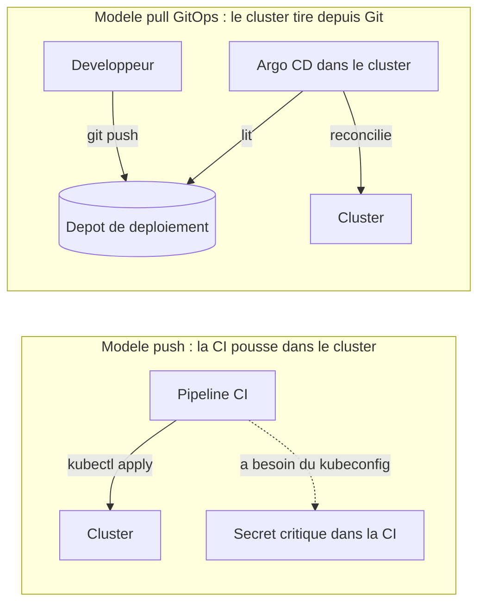
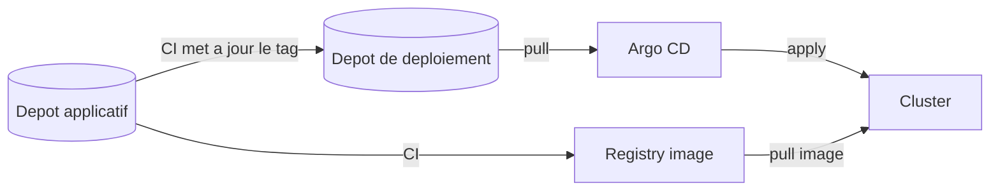
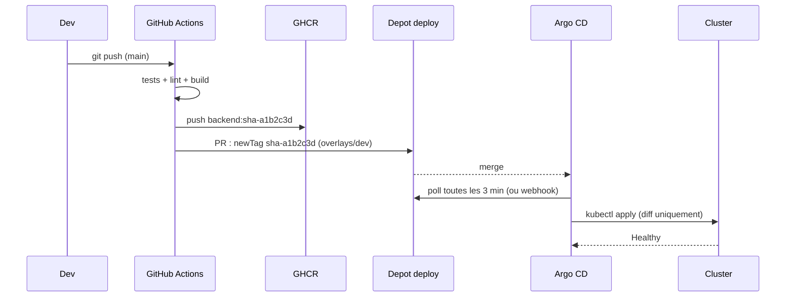
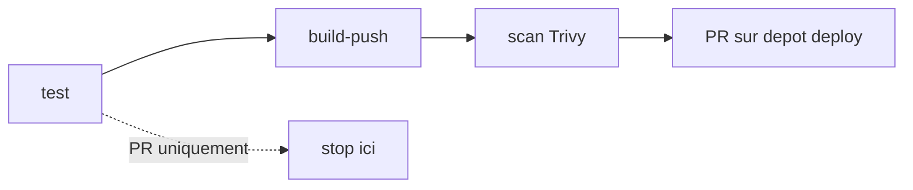
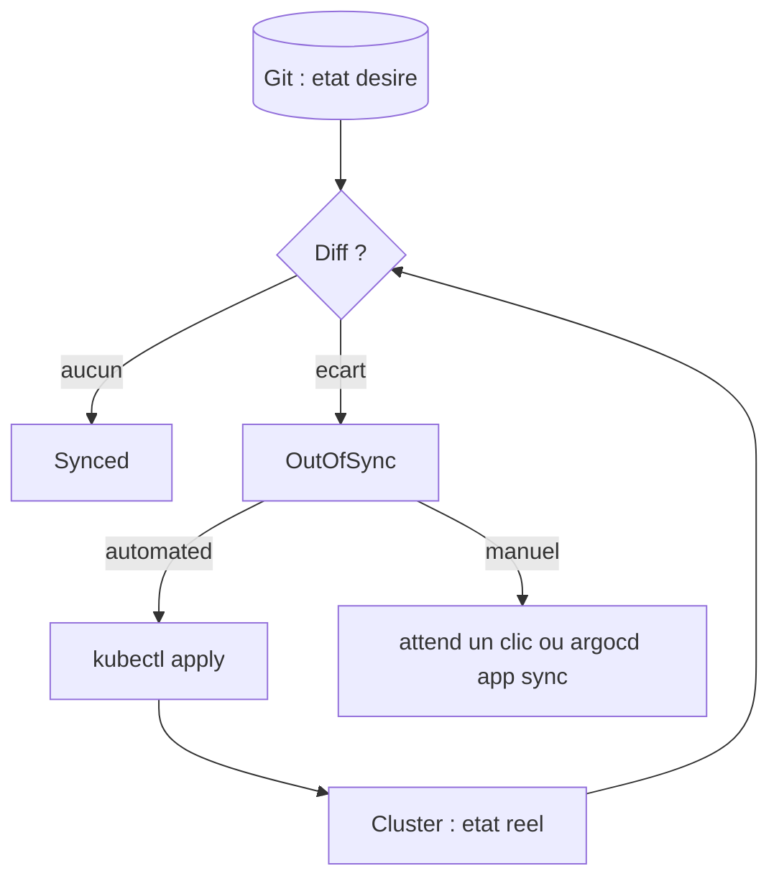
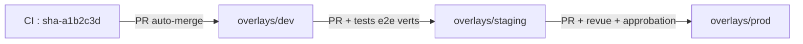
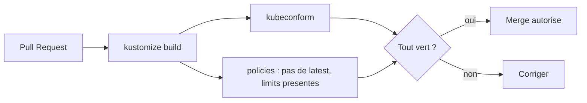

<div align="center">

# 🚀 113 — CI/CD & GitOps pour les nuls

### *Livrer sur Kubernetes sans jamais taper `kubectl apply` en prod*


</div>

---

## 📋 Sommaire

- [🎯 Objectifs](#-objectifs)
- [🤔 Pourquoi CI/CD et GitOps ?](#-pourquoi-cicd-et-gitops-)
- [📖 Vocabulaire](#-vocabulaire)
- [1️⃣ La chaîne complète en une image](#1️⃣-la-chaîne-complète-en-une-image)
- [2️⃣ CI : construire, tester, publier l'image](#2️⃣-ci--construire-tester-publier-limage)
- [3️⃣ Le dépôt de déploiement et Kustomize](#3️⃣-le-dépôt-de-déploiement-et-kustomize)
- [4️⃣ CD : Argo CD réconcilie le cluster](#4️⃣-cd--argo-cd-réconcilie-le-cluster)
- [5️⃣ Promotion dev → staging → prod](#5️⃣-promotion-dev--staging--prod)
- [6️⃣ Secrets, rollback et qualité](#6️⃣-secrets-rollback-et-qualité)
- [7️⃣ Bonnes pratiques](#7️⃣-bonnes-pratiques)
- [🧪 Exercices](#-exercices)
- [🩺 Dépannage](#-dépannage)
- [📝 Mémo](#-mémo)
- [✅ Checklist](#-checklist)

---

## 🎯 Objectifs

> [!NOTE]
> À la fin de ce module, vous saurez :

- ✅ Distinguer **CI** (intégration) et **CD** (livraison / déploiement)
- ✅ Expliquer le principe **GitOps** : *push* vs *pull*
- ✅ Écrire un pipeline **GitHub Actions** qui build, teste, scanne et pousse une image
- ✅ Organiser un dépôt de déploiement avec **Kustomize** (`base` + `overlays`)
- ✅ Installer **Argo CD** et déployer une `Application` qui suit Git
- ✅ **Promouvoir** une version d'un environnement à l'autre par Pull Request
- ✅ Faire un **rollback** en un `git revert`

---

## 🤔 Pourquoi CI/CD et GitOps ?

Dans les modules 105 à 112 vous avez tapé `kubectl apply` et `helm upgrade` à la main. Ça marche pour apprendre. En équipe, en prod, ça devient : « qui a changé ça ? », « quelle version tourne ? », « comment on revient en arrière ? ».



> [!IMPORTANT]
> **GitOps = l'état désiré du cluster est dans Git, un agent le fait converger en boucle.** Git devient la seule porte d'entrée : historique, revue, revert gratuits.

---

## 📖 Vocabulaire

| Terme | Analogie | Définition |
|-------|----------|------------|
| ⚙️ **CI** (Continuous Integration) | Le contrôle qualité en usine | À chaque commit : build, tests, lint, scan, image publiée |
| 🚚 **CD** (Continuous Delivery/Deployment) | La livraison | Mettre la version en environnement, automatiquement ou après validation |
| 🔄 **GitOps** | Le plan de construction officiel | Git = source de vérité, un agent réconcilie le cluster en continu |
| 📦 **Registry** | L'entrepôt d'images | GHCR, Docker Hub, ECR… où sont poussées les images |
| 🏷️ **Tag immuable** | Le numéro de série | `backend:1.4.2` ou `backend:sha-a1b2c3d`, jamais `latest` |
| 📁 **Dépôt applicatif** | L'atelier | Code source + `Dockerfile` + pipeline CI |
| 📁 **Dépôt de déploiement** | Le cahier des charges | Manifests K8s (Kustomize/Helm) par environnement |
| 🧩 **Kustomize** | Le calque | `base` commune + `overlays` par environnement, sans templating |
| 🐙 **Argo CD** | Le contremaître | Agent GitOps : compare Git et cluster, affiche les écarts, synchronise |
| 🧭 **Application** (Argo CD) | La fiche de chantier | CRD : *ce dépôt, ce chemin, cette branche* → *ce cluster, ce namespace* |
| 🟢 **Synced / OutOfSync** | Conforme / écart | L'état Argo CD comparé à Git |
| 💚 **Healthy / Degraded** | Ça tourne / ça boite | L'état de santé des ressources déployées |
| ↩️ **Rollback** | Retour arrière | En GitOps : `git revert` puis sync |



---

## 1️⃣ La chaîne complète en une image



| Étape | Outil | Responsabilité |
|-------|-------|----------------|
| Build & test | GitHub Actions (ou GitLab CI, Jenkins) | Produire un artefact **fiable** |
| Publier | Registry (GHCR) | Stocker l'image **taguée** |
| Décrire | Kustomize / Helm dans le dépôt deploy | *Quoi* déployer, *où* |
| Déployer | Argo CD (ou Flux) | Faire converger le cluster vers Git |

> [!TIP]
> **Q1. Pourquoi deux dépôts (code et déploiement) ?**
> <details><summary>Réponse</summary>
>
> Pour que la CI n'ait **jamais** accès au cluster, pour que la prod change sans recompiler, et pour que les ops puissent revoir les manifests sans toucher au code. Un monorepo fonctionne aussi, mais séparez au minimum les chemins.
> </details>

---

## 2️⃣ CI : construire, tester, publier l'image

### 2.1 Le Dockerfile (rappel du 104)

Multi‑stage, utilisateur non‑root, image de base petite. La CI ne peut pas rattraper un mauvais Dockerfile.

### 2.2 Le pipeline GitHub Actions

<details open>
<summary>📄 <code>.github/workflows/ci.yaml</code> (dépôt applicatif)</summary>

```yaml
name: CI
on:
  push:
    branches: [main]
    tags: ["v*"]
  pull_request:

permissions:
  contents: read
  packages: write        # pousser sur GHCR
  security-events: write # rapport Trivy

env:
  IMAGE: ghcr.io/${{ github.repository }}/backend

jobs:
  test:
    runs-on: ubuntu-latest
    steps:
      - uses: actions/checkout@v4
      - uses: actions/setup-java@v4
        with: { distribution: temurin, java-version: "21", cache: maven }
      - run: ./mvnw -B verify

  build-push:
    needs: test
    if: github.event_name != 'pull_request'
    runs-on: ubuntu-latest
    outputs:
      tag: ${{ steps.meta.outputs.version }}
    steps:
      - uses: actions/checkout@v4
      - uses: docker/setup-buildx-action@v3
      - uses: docker/login-action@v3
        with:
          registry: ghcr.io
          username: ${{ github.actor }}
          password: ${{ secrets.GITHUB_TOKEN }}
      - id: meta
        uses: docker/metadata-action@v5
        with:
          images: ${{ env.IMAGE }}
          tags: |
            type=sha,prefix=sha-
            type=semver,pattern={{version}}
      - uses: docker/build-push-action@v6
        with:
          context: .
          push: true
          tags: ${{ steps.meta.outputs.tags }}
          labels: ${{ steps.meta.outputs.labels }}
          cache-from: type=gha
          cache-to: type=gha,mode=max
      - name: Scan Trivy
        uses: aquasecurity/trivy-action@0.28.0
        with:
          image-ref: ${{ env.IMAGE }}:${{ steps.meta.outputs.version }}
          severity: CRITICAL,HIGH
          exit-code: "1"

  update-deploy-repo:
    needs: build-push
    runs-on: ubuntu-latest
    steps:
      - uses: actions/checkout@v4
        with:
          repository: marwensaid/k8s-deploy
          token: ${{ secrets.DEPLOY_REPO_TOKEN }}
      - name: Bump tag dans overlays/dev
        run: |
          cd apps/backend/overlays/dev
          kustomize edit set image backend=ghcr.io/${{ github.repository }}/backend:${{ needs.build-push.outputs.tag }}
      - uses: peter-evans/create-pull-request@v7
        with:
          token: ${{ secrets.DEPLOY_REPO_TOKEN }}
          branch: bump/backend-${{ needs.build-push.outputs.tag }}
          title: "backend → ${{ needs.build-push.outputs.tag }} (dev)"
          commit-message: "chore(dev): backend ${{ needs.build-push.outputs.tag }}"
```
</details>



> [!WARNING]
> **Jamais `latest` en prod.** Kubernetes ne re‑tire pas une image dont le tag n'a pas changé (`imagePullPolicy: IfNotPresent`). Un tag immuable (`sha-…`, `1.4.2`) garantit que *ce qui est dans Git = ce qui tourne*.

> [!TIP]
> **Q2. Pourquoi la CI ouvre une PR au lieu de commiter directement sur `main` du dépôt deploy ?**
> <details><summary>Réponse</summary>
>
> Pour `dev` on peut auto‑merger. Mais garder le mécanisme de PR partout permet la **revue**, les **checks** (kubeconform, policies) et une trace uniforme pour la promotion vers `prod`.
> </details>

---

## 3️⃣ Le dépôt de déploiement et Kustomize

### 3.1 Arborescence

```text
k8s-deploy/
├── apps/
│   └── backend/
│       ├── base/
│       │   ├── kustomization.yaml
│       │   ├── deployment.yaml
│       │   ├── service.yaml
│       │   └── hpa.yaml
│       └── overlays/
│           ├── dev/
│           │   ├── kustomization.yaml
│           │   └── patch-replicas.yaml
│           ├── staging/
│           │   └── kustomization.yaml
│           └── prod/
│               ├── kustomization.yaml
│               └── patch-resources.yaml
└── argocd/
    ├── project-shop.yaml
    └── app-backend-dev.yaml
```

### 3.2 base et overlays

<details open>
<summary>📄 <code>apps/backend/base/kustomization.yaml</code></summary>

```yaml
apiVersion: kustomize.config.k8s.io/v1beta1
kind: Kustomization
resources:
  - deployment.yaml
  - service.yaml
  - hpa.yaml
commonLabels:
  app.kubernetes.io/name: backend
  app.kubernetes.io/part-of: shop
images:
  - name: backend                       # nom "logique" utilisé dans deployment.yaml
    newName: ghcr.io/marwensaid/shop/backend
    newTag: sha-0000000
```
</details>

<details open>
<summary>📄 <code>apps/backend/overlays/prod/kustomization.yaml</code></summary>

```yaml
apiVersion: kustomize.config.k8s.io/v1beta1
kind: Kustomization
namespace: prod
resources:
  - ../../base
images:
  - name: backend
    newName: ghcr.io/marwensaid/shop/backend
    newTag: "1.4.2"                    # mis à jour par PR de promotion
patches:
  - path: patch-resources.yaml
replicas:
  - name: backend
    count: 3
```
</details>

```bash
# Voir le rendu sans rien déployer
kustomize build apps/backend/overlays/prod | less
kustomize build apps/backend/overlays/prod | kubeconform -strict -summary
```

| Kustomize | Helm |
|-----------|------|
| Pas de templating, YAML pur + patches | Templates Go + `values.yaml` |
| Idéal pour **vos** apps | Idéal pour installer des **tiers** (ingress, monitoring) |
| Natif dans `kubectl -k` | Nécessite le binaire `helm` |
| Argo CD le rend nativement | Argo CD le rend aussi (`helm template`) |

> [!NOTE]
> Les deux se combinent : Argo CD peut appliquer des patches Kustomize sur un chart Helm. Ne choisissez pas une religion, choisissez par cas d'usage.

---

## 4️⃣ CD : Argo CD réconcilie le cluster

### 4.1 Installation

```bash
kubectl create namespace argocd
kubectl apply -n argocd -f https://raw.githubusercontent.com/argoproj/argo-cd/stable/manifests/install.yaml
kubectl -n argocd rollout status deploy/argocd-server

# Mot de passe initial + accès UI
kubectl -n argocd get secret argocd-initial-admin-secret -o jsonpath='{.data.password}' | base64 -d; echo
kubectl -n argocd port-forward svc/argocd-server 8080:443
# https://localhost:8080  (admin / <mot de passe>)
```

### 4.2 Un AppProject pour cadrer

<details open>
<summary>📄 <code>argocd/project-shop.yaml</code></summary>

```yaml
apiVersion: argoproj.io/v1alpha1
kind: AppProject
metadata:
  name: shop
  namespace: argocd
spec:
  description: Boutique en ligne
  sourceRepos:
    - https://github.com/marwensaid/k8s-deploy.git
  destinations:
    - { namespace: dev,     server: https://kubernetes.default.svc }
    - { namespace: staging, server: https://kubernetes.default.svc }
    - { namespace: prod,    server: https://kubernetes.default.svc }
  clusterResourceWhitelist: []          # aucune ressource cluster (pas de ClusterRole, pas de PV)
  namespaceResourceBlacklist:
    - { group: "", kind: ResourceQuota }
    - { group: "", kind: LimitRange }
```
</details>

### 4.3 L'Application

<details open>
<summary>📄 <code>argocd/app-backend-dev.yaml</code></summary>

```yaml
apiVersion: argoproj.io/v1alpha1
kind: Application
metadata:
  name: backend-dev
  namespace: argocd
  finalizers:
    - resources-finalizer.argocd.argoproj.io   # supprimer l'App supprime les ressources
spec:
  project: shop
  source:
    repoURL: https://github.com/marwensaid/k8s-deploy.git
    targetRevision: main
    path: apps/backend/overlays/dev
  destination:
    server: https://kubernetes.default.svc
    namespace: dev
  syncPolicy:
    automated:
      prune: true          # supprime ce qui n'est plus dans Git
      selfHeal: true       # annule les kubectl edit sauvages
    syncOptions:
      - CreateNamespace=true
      - ServerSideApply=true
    retry:
      limit: 3
      backoff: { duration: 10s, factor: 2, maxDuration: 2m }
```
</details>

```bash
kubectl apply -f argocd/project-shop.yaml -f argocd/app-backend-dev.yaml
argocd app get backend-dev
argocd app sync backend-dev
```

```text
Name:               argocd/backend-dev
Project:            shop
Sync Status:        Synced to main (a1b2c3d)
Health Status:      Healthy

GROUP  KIND        NAMESPACE  NAME     STATUS  HEALTH
       Service     dev        backend  Synced  Healthy
apps   Deployment  dev        backend  Synced  Healthy
```



> [!IMPORTANT]
> Avec `selfHeal: true`, un `kubectl scale` à la main est **annulé en quelques secondes**. C'est voulu : la seule façon de changer la prod devient Git.

> [!TIP]
> **Q3. J'ai supprimé un fichier `hpa.yaml` de Git. L'HPA reste dans le cluster. Pourquoi ?**
> <details><summary>Réponse</summary>
>
> `prune: false` (défaut). Argo CD affiche la ressource comme *orphelin à supprimer* mais ne le fait pas sans `prune: true` ou un sync manuel avec `--prune`.
> </details>

---

## 5️⃣ Promotion dev → staging → prod

**Une seule image, trois overlays.** Promouvoir = changer un `newTag` dans un dossier, via PR.



```bash
# Promotion manuelle staging -> prod
git checkout -b promote/backend-1.4.2
cd apps/backend/overlays/prod
kustomize edit set image backend=ghcr.io/marwensaid/shop/backend:1.4.2
git commit -am "promote(prod): backend 1.4.2"
git push -u origin HEAD
gh pr create --fill --reviewer ops-team
```

<details open>
<summary>📄 <code>argocd/app-backend-prod.yaml</code> (différences avec dev)</summary>

```yaml
spec:
  source:
    path: apps/backend/overlays/prod
    targetRevision: main
  destination:
    namespace: prod
  syncPolicy:
    automated:
      prune: false          # jamais de suppression automatique en prod
      selfHeal: true
    syncOptions:
      - ServerSideApply=true
      - PrunePropagationPolicy=foreground
```
</details>

| Environnement | Déclencheur | Sync | Prune | Qui approuve |
|---------------|-------------|------|-------|--------------|
| `dev` | Chaque commit `main` (PR auto‑mergée) | Auto | Oui | Personne |
| `staging` | PR manuelle ou nightly | Auto | Oui | Tests e2e |
| `prod` | PR de promotion | Auto ou **manuel** | Non | 1 reviewer ops + `CODEOWNERS` |

<details>
<summary>📄 <code>.github/CODEOWNERS</code> (dépôt deploy)</summary>

```text
apps/*/overlays/prod/   @marwensaid/ops-team
argocd/                 @marwensaid/ops-team
```
</details>

> [!TIP]
> Pour dizaines d'apps × environnements, remplacez les `Application` unitaires par un **ApplicationSet** avec un générateur `git directories` : un dossier = une App, automatiquement.

---

## 6️⃣ Secrets, rollback et qualité

### 6.1 Secrets : jamais en clair dans Git

| Option | Principe | Quand |
|--------|----------|-------|
| **Sealed Secrets** | Chiffré avec la clé publique du cluster, déchiffré par un contrôleur | Simple, mono‑cluster |
| **External Secrets Operator** | Le `Secret` K8s est synchronisé depuis Vault / AWS SM / GCP SM | Vous avez déjà un coffre |
| **SOPS + age** | Fichiers chiffrés, déchiffrés par Argo CD (plugin) ou Flux (natif) | Multi‑cluster, GitOps pur |

```yaml
# External Secrets : ce fichier peut être commité
apiVersion: external-secrets.io/v1beta1
kind: ExternalSecret
metadata:
  name: postgres-secret
  namespace: prod
spec:
  refreshInterval: 1h
  secretStoreRef: { name: vault, kind: ClusterSecretStore }
  target: { name: postgres-secret }
  data:
    - secretKey: POSTGRES_PASSWORD
      remoteRef: { key: shop/prod/postgres, property: password }
```

### 6.2 Rollback = git revert

```bash
git revert HEAD --no-edit           # annule la promotion
git push                            # Argo CD resynchronise sur l'ancien tag
# ou, en urgence, depuis Argo CD (écart temporaire avec Git) :
argocd app history backend-prod
argocd app rollback backend-prod 12
```

> [!WARNING]
> `argocd app rollback` désactive l'auto‑sync sur l'App pour ne pas être annulé par `selfHeal`. Faites **quand même** le `git revert` ensuite, puis réactivez : `argocd app set backend-prod --sync-policy automated`.

### 6.3 Contrôles qualité sur le dépôt deploy

<details open>
<summary>📄 <code>.github/workflows/validate.yaml</code> (dépôt deploy)</summary>

```yaml
name: Validate manifests
on: [pull_request]
jobs:
  validate:
    runs-on: ubuntu-latest
    steps:
      - uses: actions/checkout@v4
      - uses: yokawasa/action-setup-kube-tools@v0.11.2
        with: { kustomize: "5.4.3", kubeconform: "0.6.7" }
      - name: Render + schema
        run: |
          for d in apps/*/overlays/*; do
            echo "== $d"
            kustomize build "$d" | kubeconform -strict -ignore-missing-schemas -summary
          done
      - name: Policies (pas de latest, resources obligatoires)
        run: |
          for d in apps/*/overlays/*; do
            kustomize build "$d" > /tmp/out.yaml
            ! grep -E 'image: .*:latest' /tmp/out.yaml || { echo "latest interdit"; exit 1; }
          done
```
</details>



---

## 7️⃣ Bonnes pratiques

| ✅ À faire | ❌ À éviter |
|-----------|-------------|
| Tags immuables (`sha-…`, semver) | `latest`, `main`, `dev` comme tag |
| Dépôt deploy séparé (ou chemin dédié) | La CI avec un kubeconfig admin |
| `selfHeal: true` partout | Tolérer les `kubectl edit` en prod |
| `prune: true` en dev, `false` en prod | Prune auto sur des StatefulSets de prod |
| Promotion par PR + `CODEOWNERS` | Copier un tag à la main dans 3 fichiers |
| `kustomize build` + `kubeconform` en PR | Découvrir l'erreur YAML dans Argo CD |
| Secrets via ESO / Sealed Secrets / SOPS | Un `Secret` en base64 commité |
| Un `AppProject` par équipe avec destinations limitées | Tout dans `default` avec droits cluster |
| Webhook Git → Argo CD | Attendre le poll de 3 minutes |
| Notifications Argo CD (Slack) sur `Degraded` | Découvrir la panne par les utilisateurs |

```bash
# Où en est ma livraison ?
argocd app list
argocd app diff backend-prod                 # ce qui changerait au prochain sync
argocd app history backend-prod
kubectl -n prod get deploy backend -o jsonpath='{.spec.template.spec.containers[0].image}'
```

---

## 🧪 Exercices

> [!NOTE]
> Prérequis : un cluster local (kind/minikube), un compte GitHub, `kustomize` et `argocd` CLI installés.

### Exercice 1 — CI minimale
Dans le dépôt de `backend`, ajoutez `ci.yaml` : tests + build + push sur GHCR avec tag `sha-…`. Vérifiez l'image dans *Packages*.

### Exercice 2 — Kustomize
Créez `k8s-deploy` avec `base` + `overlays/{dev,prod}` pour `backend`. `dev` : 1 replica ; `prod` : 3 replicas + limits. Validez avec `kustomize build | kubeconform`.

### Exercice 3 — Argo CD
Installez Argo CD, créez le `AppProject shop` et l'`Application backend-dev` avec auto‑sync. Faites `kubectl scale deploy backend --replicas=5 -n dev` et observez.

### Exercice 4 — Promotion
Ajoutez le job `update-deploy-repo` à la CI. Poussez un commit, mergez la PR sur `dev`, puis promouvez manuellement le tag vers `prod` par PR.

### Exercice 5 — Rollback
Cassez volontairement l'image en prod (tag inexistant). Observez `Degraded` + `ImagePullBackOff`. Revenez en arrière avec `git revert`.

<details>
<summary>💡 Solution exercice 3 (ce qu'on observe)</summary>

Les replicas remontent à 1 en moins de 10 secondes : `selfHeal` détecte l'écart et réapplique Git. Dans l'UI, l'App passe brièvement `OutOfSync` puis `Synced`. C'est le comportement attendu.
</details>

<details>
<summary>💡 Solution exercice 5</summary>

```bash
argocd app get backend-prod          # Health: Degraded, Deployment progressing
kubectl -n prod describe pod -l app.kubernetes.io/name=backend | grep -A2 Failed
git revert HEAD --no-edit && git push
argocd app wait backend-prod --health
```
</details>

---

## 🩺 Dépannage

| Symptôme | Cause probable | Solution |
|----------|----------------|----------|
| CI : `denied: permission_denied` sur GHCR | `permissions.packages: write` manquant | Ajouter la permission au job |
| CI : PR non créée sur le dépôt deploy | `GITHUB_TOKEN` ne peut pas écrire ailleurs | PAT fine‑grained ou GitHub App dans `DEPLOY_REPO_TOKEN` |
| Argo CD `ComparisonError: repository not accessible` | Dépôt privé sans credentials | `argocd repo add … --ssh-private-key-path` |
| App `OutOfSync` en boucle | Champ muté par un contrôleur (HPA `replicas`, webhook) | `ignoreDifferences` sur `/spec/replicas` |
| App `Unknown` / `manifest generation error` | `kustomization.yaml` invalide | `kustomize build` en local |
| Sync refusé : `not permitted in project` | Namespace ou ressource hors `AppProject` | Ajuster `destinations` / whitelist |
| `Healthy` mais ancienne version | Tag identique, image non re‑tirée | Tag immuable, jamais `latest` |
| `ImagePullBackOff` après promotion | Tag inexistant ou registry privée | Vérifier le tag ; `imagePullSecrets` |
| `kubectl edit` annulé instantanément | `selfHeal` | Normal : passer par Git |
| Ressource supprimée à la surprise | `prune: true` + fichier retiré de Git | `prune: false` en prod, revoir la PR |
| Sync bloqué sur un `Job` | Hook `PreSync` en échec | `argocd app get` → logs du Job, `hook-delete-policy` |

```bash
# Le trio de diagnostic
argocd app get backend-prod --refresh          # état, conditions, ressources
argocd app diff backend-prod                   # écart précis
kubectl -n argocd logs deploy/argocd-repo-server --tail=100   # erreurs de rendu Git/Kustomize
```

---

## 📝 Mémo

| Élément | Rôle |
|---------|------|
| **CI** | Build, test, scan, push image taguée |
| **CD / GitOps** | Un agent fait converger le cluster vers Git |
| Tag `sha-…` / semver | Traçabilité, re‑pull garanti |
| `kustomize edit set image` | Changer une version sans toucher aux YAML |
| `base` / `overlays` | Commun / spécifique par environnement |
| `AppProject` | Périmètre : dépôts, namespaces, ressources autorisées |
| `Application` | Dépôt + chemin + branche → cluster + namespace |
| `automated.prune` | Supprimer ce qui n'est plus dans Git |
| `automated.selfHeal` | Annuler les modifications hors Git |
| `git revert` | Le rollback GitOps |
| ESO / Sealed Secrets / SOPS | Secrets sans clair dans Git |

```bash
# Les 3 commandes à connaître par cœur
kustomize build apps/backend/overlays/prod      # que vais-je déployer ?
argocd app get backend-prod                     # est-ce déployé et en bonne santé ?
argocd app diff backend-prod                    # quel écart entre Git et le cluster ?
```

---

## ✅ Checklist

- [ ] Aucune image en prod n'utilise le tag `latest`
- [ ] Ma CI ne possède **aucun** kubeconfig
- [ ] Mes manifests vivent dans un dépôt (ou chemin) de déploiement, rendus par Kustomize/Helm
- [ ] Chaque environnement est un overlay et une `Application` Argo CD
- [ ] `selfHeal: true` est activé ; je ne fais plus de `kubectl edit` en prod
- [ ] Le dossier `overlays/prod` est protégé par `CODEOWNERS` et une revue obligatoire
- [ ] `kustomize build` + `kubeconform` tournent sur chaque PR du dépôt deploy
- [ ] Mes secrets passent par ESO, Sealed Secrets ou SOPS
- [ ] J'ai déjà fait un rollback complet par `git revert`
- [ ] Argo CD me notifie quand une App passe `Degraded`

<div align="center">

**➡️ Module suivant : 114 — Observabilité : logs, métriques et traces avec Prometheus, Grafana et Loki**

</div>