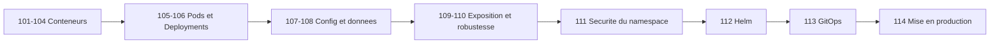
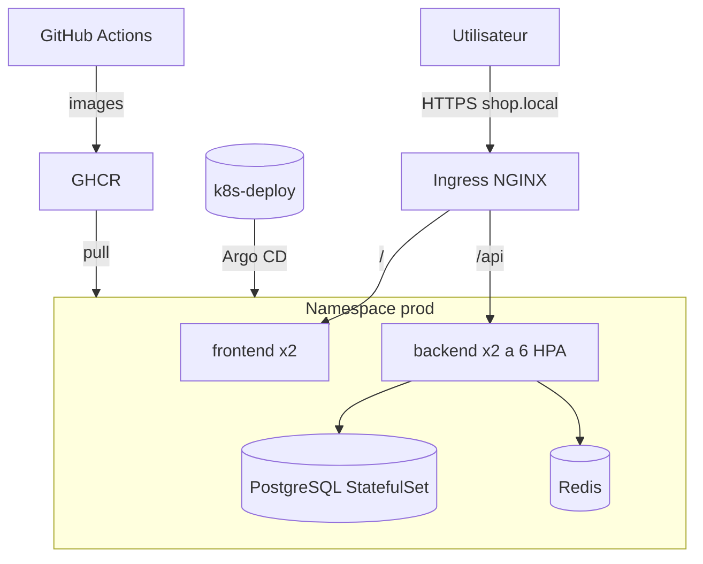
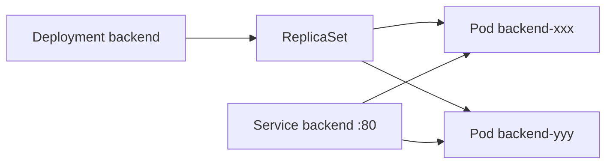
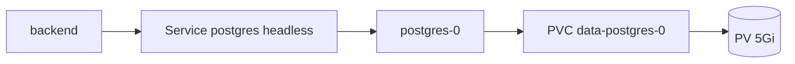
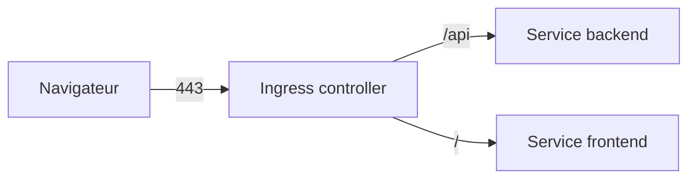
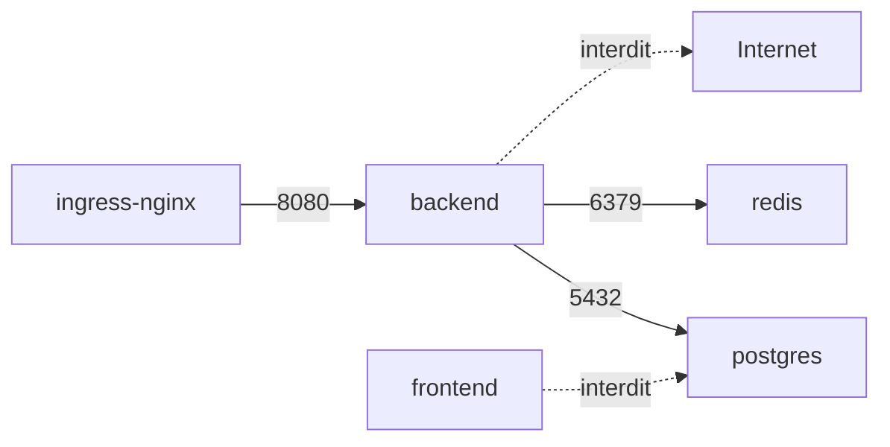
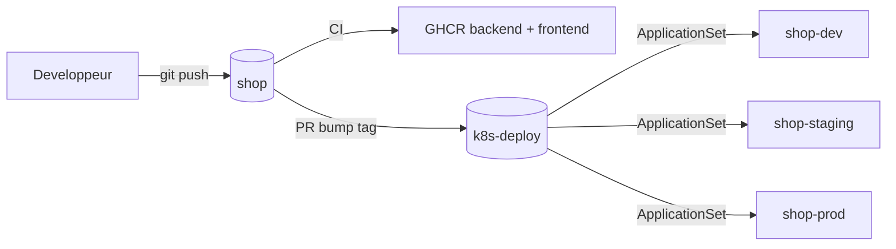

<div align="center">

# 🏗️ 114 — Projet final : la boutique `shop` de bout en bout

### *Du `Dockerfile` au GitOps : une seule application, treize modules réunis*


</div>

---

## 📋 Sommaire

- [🎯 Objectifs](#-objectifs)
- [🗺️ Carte du projet : quel module sert où](#️-carte-du-projet--quel-module-sert-où)
- [🏛️ Architecture cible](#️-architecture-cible)
- [0️⃣ Mise en place](#0️⃣-mise-en-place)
- [1️⃣ Étape 1 — Conteneuriser (101 → 104)](#1️⃣-étape-1--conteneuriser-101--104)
- [2️⃣ Étape 2 — Premiers Pods et Deployments (105, 106)](#2️⃣-étape-2--premiers-pods-et-deployments-105-106)
- [3️⃣ Étape 3 — Configuration et secrets (107)](#3️⃣-étape-3--configuration-et-secrets-107)
- [4️⃣ Étape 4 — Données persistantes (108)](#4️⃣-étape-4--données-persistantes-108)
- [5️⃣ Étape 5 — Exposition et Ingress (109)](#5️⃣-étape-5--exposition-et-ingress-109)
- [6️⃣ Étape 6 — Santé, ressources et autoscaling (110)](#6️⃣-étape-6--santé-ressources-et-autoscaling-110)
- [7️⃣ Étape 7 — Namespaces, RBAC, quotas, NetworkPolicy (111)](#7️⃣-étape-7--namespaces-rbac-quotas-networkpolicy-111)
- [8️⃣ Étape 8 — Packager avec Helm (112)](#8️⃣-étape-8--packager-avec-helm-112)
- [9️⃣ Étape 9 — CI/CD et GitOps (113)](#9️⃣-étape-9--cicd-et-gitops-113)
- [🔟 Étape 10 — Jour de mise en production](#-étape-10--jour-de-mise-en-production)
- [🧪 Défis bonus](#-défis-bonus)
- [🩺 Dépannage transversal](#-dépannage-transversal)
- [📝 Mémo](#-mémo)
- [✅ Checklist finale](#-checklist-finale)

---

## 🎯 Objectifs

> [!NOTE]
> À la fin de ce module, vous aurez **construit, déployé et livré en GitOps** une application complète, et vous saurez :

- ✅ Enchaîner **toutes** les briques vues du 101 au 113 sur un cas réel
- ✅ Structurer un projet en **deux dépôts** : `shop` (code) et `k8s-deploy` (manifests)
- ✅ Faire tourner **frontend + backend + PostgreSQL + Redis** dans un cluster
- ✅ Sécuriser un namespace : RBAC, quotas, NetworkPolicy, secrets hors Git
- ✅ Packager l'application en **chart Helm** et la livrer via **Argo CD**
- ✅ Dérouler un **runbook de mise en production** et un rollback

---

## 🗺️ Carte du projet : quel module sert où

| Module | Ce que vous avez appris | Ce que vous en faites dans `shop` |
|--------|-------------------------|-----------------------------------|
| **101** | Conteneurs, `docker run`, images vs conteneurs | Lancer PostgreSQL et Redis localement pour développer |
| **102** | Images, layers, registry, tags | Publier `shop/backend` et `shop/frontend` sur GHCR |
| **103** | Volumes, réseaux Docker, Compose | `docker-compose.yaml` de développement (4 services) |
| **104** | `Dockerfile` multi‑stage, non‑root, taille | Dockerfiles optimisés du backend Java et du frontend React |
| **105** | Cluster, Pods, `kubectl` de base | Premier Pod `backend`, `logs`, `exec`, `describe` |
| **106** | Deployments, ReplicaSets, Services, rolling update | `Deployment` + `Service` pour backend et frontend |
| **107** | ConfigMap, Secret, variables d'env, `envFrom` | Config Spring via ConfigMap, identifiants BDD via Secret |
| **108** | PV, PVC, StorageClass, StatefulSet | PostgreSQL en `StatefulSet` avec volume persistant |
| **109** | Ingress, contrôleur NGINX, TLS, cert‑manager | `shop.local` en HTTPS : `/` → frontend, `/api` → backend |
| **110** | Probes, `requests/limits`, HPA, PDB | Backend qui scale de 2 à 6 selon la charge |
| **111** | Namespaces, RBAC, ResourceQuota, LimitRange, NetworkPolicy | Namespaces `dev/staging/prod`, équipe `dev` sans droits prod |
| **112** | Helm : chart, `values.yaml`, dépendances, `upgrade` | Chart `shop` avec sous‑charts PostgreSQL et Redis |
| **113** | CI/CD, Kustomize, Argo CD, promotion, rollback | Pipeline GitHub Actions + `Application` Argo CD par environnement |



---

## 🏛️ Architecture cible



| Composant | Techno | Image | Type K8s | Replicas | Stockage |
|-----------|--------|-------|----------|----------|----------|
| `frontend` | React + Nginx | `ghcr.io/marwensaid/shop/frontend` | Deployment | 2 | Aucun |
| `backend` | Spring Boot 3 / Java 21 | `ghcr.io/marwensaid/shop/backend` | Deployment + HPA | 2 → 6 | Aucun |
| `postgres` | PostgreSQL 16 | `postgres:16-alpine` | StatefulSet | 1 | PVC 5 Gi |
| `redis` | Redis 7 | `redis:7-alpine` | Deployment | 1 | Aucun (cache) |

### Endpoints du backend

| Route | Rôle |
|-------|------|
| `GET /api/products` | Liste des produits (cache Redis 60 s) |
| `POST /api/orders` | Créer une commande (écriture PostgreSQL) |
| `GET /actuator/health/liveness` | Probe liveness |
| `GET /actuator/health/readiness` | Probe readiness (vérifie BDD et Redis) |
| `GET /actuator/prometheus` | Métriques (bonus) |

---

## 0️⃣ Mise en place

### Arborescence des deux dépôts

```text
shop/                               # dépôt applicatif
├── backend/
│   ├── Dockerfile
│   ├── pom.xml
│   └── src/main/resources/application.yaml
├── frontend/
│   ├── Dockerfile
│   ├── nginx.conf
│   └── src/
├── docker-compose.yaml
└── .github/workflows/ci.yaml

k8s-deploy/                         # dépôt de déploiement
├── charts/shop/                    # chart Helm (étape 8)
│   ├── Chart.yaml
│   ├── values.yaml
│   └── templates/
├── envs/
│   ├── dev/values.yaml
│   ├── staging/values.yaml
│   └── prod/values.yaml
├── platform/                       # ce qui n'est pas l'app : namespaces, RBAC, quotas
│   ├── namespaces.yaml
│   ├── rbac.yaml
│   ├── quotas.yaml
│   └── networkpolicies.yaml
├── argocd/
│   ├── project-shop.yaml
│   └── applicationset-shop.yaml
└── .github/workflows/validate.yaml
```

### Outils

```bash
# Vérifier que tout est là
docker --version && kubectl version --client && helm version --short && kustomize version && argocd version --client

# Cluster local avec Ingress (kind)
cat <<EOF | kind create cluster --name shop --config=-
kind: Cluster
apiVersion: kind.x-k8s.io/v1alpha4
nodes:
  - role: control-plane
    kubeadmConfigPatches:
      - |
        kind: InitConfiguration
        nodeRegistration:
          kubeletExtraArgs:
            node-labels: "ingress-ready=true"
    extraPortMappings:
      - { containerPort: 80,  hostPort: 80 }
      - { containerPort: 443, hostPort: 443 }
EOF
echo "127.0.0.1 shop.local" | sudo tee -a /etc/hosts
```

> [!TIP]
> Créez une **branche par étape** dans chaque dépôt (`step-1-docker`, `step-2-k8s`, …). Vous aurez un historique pédagogique et pourrez comparer.

---

## 1️⃣ Étape 1 — Conteneuriser (101 → 104)

### 1.1 Dockerfile du backend

<details open>
<summary>📄 <code>backend/Dockerfile</code></summary>

```dockerfile
# --- Étape 1 : build (104 : multi-stage) ---
FROM maven:3.9-eclipse-temurin-21 AS build
WORKDIR /app
COPY pom.xml .
RUN mvn -B dependency:go-offline           # 102 : layer de dépendances mis en cache
COPY src ./src
RUN mvn -B package -DskipTests

# --- Étape 2 : runtime minimal ---
FROM eclipse-temurin:21-jre-alpine
RUN addgroup -S app && adduser -S app -G app   # 104 : non-root
WORKDIR /app
COPY --from=build /app/target/*.jar app.jar
USER app
EXPOSE 8080
ENTRYPOINT ["java", "-XX:MaxRAMPercentage=75", "-jar", "app.jar"]
```
</details>

### 1.2 Dockerfile du frontend

<details open>
<summary>📄 <code>frontend/Dockerfile</code></summary>

```dockerfile
FROM node:20-alpine AS build
WORKDIR /app
COPY package*.json ./
RUN npm ci
COPY . .
RUN npm run build

FROM nginxinc/nginx-unprivileged:1.27-alpine    # 104 : non-root, port 8080
COPY --from=build /app/dist /usr/share/nginx/html
COPY nginx.conf /etc/nginx/conf.d/default.conf
EXPOSE 8080
```
</details>

### 1.3 Compose de développement (103)

<details open>
<summary>📄 <code>docker-compose.yaml</code></summary>

```yaml
services:
  postgres:
    image: postgres:16-alpine
    environment: { POSTGRES_DB: shop, POSTGRES_USER: shop, POSTGRES_PASSWORD: devpass }
    volumes: [pgdata:/var/lib/postgresql/data]          # 103 : volume nommé
    ports: ["5432:5432"]
  redis:
    image: redis:7-alpine
  backend:
    build: ./backend
    environment:
      SPRING_DATASOURCE_URL: jdbc:postgresql://postgres:5432/shop   # 103 : DNS du réseau Compose
      SPRING_DATASOURCE_USERNAME: shop
      SPRING_DATASOURCE_PASSWORD: devpass
      SPRING_DATA_REDIS_HOST: redis
    depends_on: [postgres, redis]
    ports: ["8080:8080"]
  frontend:
    build: ./frontend
    ports: ["3000:8080"]
volumes:
  pgdata:
```
</details>

```bash
docker compose up -d --build
curl -s localhost:8080/api/products | jq length
docker images | grep shop          # 102 : vérifier la taille (< 300 Mo backend, < 60 Mo frontend)
docker compose down -v
```

> [!TIP]
> **Q1. Pourquoi copier `pom.xml` avant `src` ?**
> <details><summary>Réponse</summary>
>
> Pour que le layer des dépendances Maven soit **réutilisé** tant que `pom.xml` ne change pas (102). Un changement de code ne re‑télécharge rien.
> </details>

✅ **Livrable étape 1** : deux images qui tournent en Compose, tag `local`.

---

## 2️⃣ Étape 2 — Premiers Pods et Deployments (105, 106)

### 2.1 Charger les images dans kind (102, 105)

```bash
docker build -t ghcr.io/marwensaid/shop/backend:0.1.0 backend/
docker build -t ghcr.io/marwensaid/shop/frontend:0.1.0 frontend/
kind load docker-image ghcr.io/marwensaid/shop/backend:0.1.0 ghcr.io/marwensaid/shop/frontend:0.1.0 --name shop
```

### 2.2 Un Pod pour comprendre, un Deployment pour de vrai

```bash
kubectl create namespace dev
kubectl -n dev run backend-test --image=ghcr.io/marwensaid/shop/backend:0.1.0 --restart=Never
kubectl -n dev logs backend-test            # 105 : crash attendu, pas de BDD -> on lit le message
kubectl -n dev delete pod backend-test
```

<details open>
<summary>📄 <code>backend-deployment.yaml</code> (version 106, sera enrichie)</summary>

```yaml
apiVersion: apps/v1
kind: Deployment
metadata:
  name: backend
  namespace: dev
  labels: { app.kubernetes.io/name: backend, app.kubernetes.io/part-of: shop }
spec:
  replicas: 2
  selector:
    matchLabels: { app.kubernetes.io/name: backend }
  strategy:
    type: RollingUpdate
    rollingUpdate: { maxSurge: 1, maxUnavailable: 0 }   # 106 : zéro coupure
  template:
    metadata:
      labels: { app.kubernetes.io/name: backend, app.kubernetes.io/part-of: shop }
    spec:
      containers:
        - name: backend
          image: ghcr.io/marwensaid/shop/backend:0.1.0
          ports: [{ containerPort: 8080, name: http }]
---
apiVersion: v1
kind: Service
metadata:
  name: backend
  namespace: dev
spec:
  selector: { app.kubernetes.io/name: backend }
  ports: [{ port: 80, targetPort: http }]
```
</details>

```bash
kubectl apply -f backend-deployment.yaml
kubectl -n dev get deploy,rs,pod,svc -l app.kubernetes.io/part-of=shop
kubectl -n dev rollout status deploy/backend       # échoue encore : normal, pas de BDD -> étape 3 et 4
```



✅ **Livrable étape 2** : `Deployment` + `Service` pour `backend` et `frontend` (même modèle).

---

## 3️⃣ Étape 3 — Configuration et secrets (107)

<details open>
<summary>📄 <code>backend-config.yaml</code></summary>

```yaml
apiVersion: v1
kind: ConfigMap
metadata:
  name: backend-config
  namespace: dev
data:
  SPRING_DATASOURCE_URL: jdbc:postgresql://postgres:5432/shop     # DNS interne du Service (106)
  SPRING_DATA_REDIS_HOST: redis
  SHOP_CACHE_TTL_SECONDS: "60"
  SPRING_PROFILES_ACTIVE: k8s
---
apiVersion: v1
kind: Secret
metadata:
  name: postgres-secret
  namespace: dev
type: Opaque
stringData:                        # 107 : stringData pour lisibilité, encodé automatiquement
  POSTGRES_USER: shop
  POSTGRES_PASSWORD: change-me-in-dev
```
</details>

Dans le `Deployment` :

```yaml
          envFrom:
            - configMapRef: { name: backend-config }
          env:
            - name: SPRING_DATASOURCE_USERNAME
              valueFrom: { secretKeyRef: { name: postgres-secret, key: POSTGRES_USER } }
            - name: SPRING_DATASOURCE_PASSWORD
              valueFrom: { secretKeyRef: { name: postgres-secret, key: POSTGRES_PASSWORD } }
```

> [!WARNING]
> Ce `Secret` en clair est **uniquement pour l'étape 3 en dev**. À l'étape 9 il sera remplacé par un `ExternalSecret` (113) et ne sera jamais commité.

> [!TIP]
> **Q2. Je change une valeur dans la ConfigMap. Le Pod la voit‑il ?**
> <details><summary>Réponse</summary>
>
> Non pour les variables d'environnement (107) : il faut redémarrer les Pods (`kubectl rollout restart deploy/backend`). Helm (112) résoudra cela avec une annotation `checksum/config`.
> </details>

✅ **Livrable étape 3** : le backend démarre avec la bonne config (il attend maintenant la BDD).

---

## 4️⃣ Étape 4 — Données persistantes (108)

<details open>
<summary>📄 <code>postgres-statefulset.yaml</code></summary>

```yaml
apiVersion: v1
kind: Service
metadata:
  name: postgres
  namespace: dev
spec:
  clusterIP: None                      # 108 : headless, identité stable postgres-0.postgres
  selector: { app.kubernetes.io/name: postgres }
  ports: [{ port: 5432 }]
---
apiVersion: apps/v1
kind: StatefulSet
metadata:
  name: postgres
  namespace: dev
spec:
  serviceName: postgres
  replicas: 1
  selector:
    matchLabels: { app.kubernetes.io/name: postgres }
  template:
    metadata:
      labels: { app.kubernetes.io/name: postgres, app.kubernetes.io/part-of: shop }
    spec:
      containers:
        - name: postgres
          image: postgres:16-alpine
          envFrom: [{ secretRef: { name: postgres-secret } }]
          env: [{ name: POSTGRES_DB, value: shop }]
          ports: [{ containerPort: 5432 }]
          volumeMounts:
            - { name: data, mountPath: /var/lib/postgresql/data }
          readinessProbe:
            exec: { command: ["pg_isready", "-U", "shop"] }
            periodSeconds: 5
  volumeClaimTemplates:                 # 108 : un PVC par replica, survit au Pod
    - metadata: { name: data }
      spec:
        accessModes: [ReadWriteOnce]
        resources: { requests: { storage: 5Gi } }
```
</details>

```bash
kubectl apply -f postgres-statefulset.yaml
kubectl -n dev get pvc,pv                                # 108 : Bound
kubectl -n dev rollout status deploy/backend             # enfin Ready

# Preuve de persistance
kubectl -n dev exec postgres-0 -- psql -U shop -c "INSERT INTO products(name,price) VALUES ('Clavier', 49.9);"
kubectl -n dev delete pod postgres-0 && kubectl -n dev wait --for=condition=ready pod/postgres-0 --timeout=60s
kubectl -n dev exec postgres-0 -- psql -U shop -c "SELECT count(*) FROM products;"   # toujours là
```

Redis reste un `Deployment` sans volume : c'est un **cache**, perdre les données est acceptable.



✅ **Livrable étape 4** : la stack complète tourne dans `dev`, les données survivent à la mort du Pod.

---

## 5️⃣ Étape 5 — Exposition et Ingress (109)

```bash
kubectl apply -f https://raw.githubusercontent.com/kubernetes/ingress-nginx/main/deploy/static/provider/kind/deploy.yaml
kubectl -n ingress-nginx wait --for=condition=ready pod -l app.kubernetes.io/component=controller --timeout=120s

# cert-manager + émetteur auto-signé pour le local
kubectl apply -f https://github.com/cert-manager/cert-manager/releases/latest/download/cert-manager.yaml
```

<details open>
<summary>📄 <code>ingress.yaml</code></summary>

```yaml
apiVersion: cert-manager.io/v1
kind: ClusterIssuer
metadata: { name: selfsigned }
spec: { selfSigned: {} }
---
apiVersion: networking.k8s.io/v1
kind: Ingress
metadata:
  name: shop
  namespace: dev
  annotations:
    cert-manager.io/cluster-issuer: selfsigned
    nginx.ingress.kubernetes.io/proxy-body-size: 2m
spec:
  ingressClassName: nginx
  tls:
    - hosts: [shop.local]
      secretName: shop-tls
  rules:
    - host: shop.local
      http:
        paths:
          - path: /api
            pathType: Prefix
            backend: { service: { name: backend, port: { number: 80 } } }
          - path: /
            pathType: Prefix
            backend: { service: { name: frontend, port: { number: 80 } } }
```
</details>

```bash
kubectl apply -f ingress.yaml
curl -sk https://shop.local/api/products | jq '.[0]'
open https://shop.local
```



> [!TIP]
> **Q3. Pourquoi le frontend n'appelle‑t‑il pas `http://backend:80` directement ?**
> <details><summary>Réponse</summary>
>
> Le JavaScript s'exécute dans le **navigateur**, hors du cluster. Il ne connaît que `shop.local`. C'est l'Ingress qui route `/api` vers le backend (109). Le DNS interne ne sert qu'entre Pods.
> </details>

✅ **Livrable étape 5** : `https://shop.local` affiche la boutique.

---

## 6️⃣ Étape 6 — Santé, ressources et autoscaling (110)

Enrichissement du conteneur `backend` :

```yaml
          resources:
            requests: { cpu: 250m, memory: 384Mi }
            limits:   { memory: 512Mi }              # 110 : pas de limit CPU -> pas de throttling
          startupProbe:
            httpGet: { path: /actuator/health/liveness, port: http }
            failureThreshold: 30
            periodSeconds: 2                         # Spring peut mettre 20-40 s
          livenessProbe:
            httpGet: { path: /actuator/health/liveness, port: http }
            periodSeconds: 10
          readinessProbe:
            httpGet: { path: /actuator/health/readiness, port: http }
            periodSeconds: 5
            failureThreshold: 3
```

<details open>
<summary>📄 <code>backend-hpa-pdb.yaml</code></summary>

```yaml
apiVersion: autoscaling/v2
kind: HorizontalPodAutoscaler
metadata: { name: backend, namespace: dev }
spec:
  scaleTargetRef: { apiVersion: apps/v1, kind: Deployment, name: backend }
  minReplicas: 2
  maxReplicas: 6
  metrics:
    - type: Resource
      resource: { name: cpu, target: { type: Utilization, averageUtilization: 70 } }
  behavior:
    scaleDown: { stabilizationWindowSeconds: 120 }
---
apiVersion: policy/v1
kind: PodDisruptionBudget
metadata: { name: backend, namespace: dev }
spec:
  minAvailable: 1
  selector:
    matchLabels: { app.kubernetes.io/name: backend }
```
</details>

```bash
# metrics-server pour kind
kubectl apply -f https://github.com/kubernetes-sigs/metrics-server/releases/latest/download/components.yaml
kubectl -n kube-system patch deploy metrics-server --type=json -p='[{"op":"add","path":"/spec/template/spec/containers/0/args/-","value":"--kubelet-insecure-tls"}]'

kubectl apply -f backend-hpa-pdb.yaml
# Générer de la charge
kubectl -n dev run load --rm -it --image=busybox -- sh -c 'while true; do wget -qO- http://backend/api/products >/dev/null; done'
kubectl -n dev get hpa backend -w        # 2 -> 4 -> 6
```

| Probe | Question posée | Si échec |
|-------|----------------|----------|
| `startup` | « As‑tu fini de démarrer ? » | Attend, protège la liveness |
| `liveness` | « Es‑tu bloqué ? » | Redémarre le conteneur |
| `readiness` | « Peux‑tu recevoir du trafic ? » | Retire du Service, sans redémarrer |

✅ **Livrable étape 6** : le backend scale sous charge et redescend ; un `kubectl drain` ne fait jamais tomber les deux replicas.

---

## 7️⃣ Étape 7 — Namespaces, RBAC, quotas, NetworkPolicy (111)

<details open>
<summary>📄 <code>platform/namespaces.yaml</code> + <code>quotas.yaml</code></summary>

```yaml
apiVersion: v1
kind: Namespace
metadata:
  name: prod
  labels:
    environment: prod
    pod-security.kubernetes.io/enforce: restricted    # 111 : Pod Security Standards
---
apiVersion: v1
kind: ResourceQuota
metadata: { name: shop-quota, namespace: prod }
spec:
  hard:
    requests.cpu: "4"
    requests.memory: 8Gi
    limits.memory: 12Gi
    pods: "30"
    persistentvolumeclaims: "3"
---
apiVersion: v1
kind: LimitRange
metadata: { name: defaults, namespace: prod }
spec:
  limits:
    - type: Container
      default:        { memory: 256Mi }
      defaultRequest: { cpu: 100m, memory: 128Mi }
```
</details>

<details open>
<summary>📄 <code>platform/rbac.yaml</code></summary>

```yaml
# L'équipe dev peut tout faire dans dev, seulement lire en prod
apiVersion: rbac.authorization.k8s.io/v1
kind: RoleBinding
metadata: { name: dev-team-edit, namespace: dev }
subjects: [{ kind: Group, name: dev-team, apiGroup: rbac.authorization.k8s.io }]
roleRef: { kind: ClusterRole, name: edit, apiGroup: rbac.authorization.k8s.io }
---
apiVersion: rbac.authorization.k8s.io/v1
kind: RoleBinding
metadata: { name: dev-team-view, namespace: prod }
subjects: [{ kind: Group, name: dev-team, apiGroup: rbac.authorization.k8s.io }]
roleRef: { kind: ClusterRole, name: view, apiGroup: rbac.authorization.k8s.io }
---
# ServiceAccount du backend : aucun droit API
apiVersion: v1
kind: ServiceAccount
metadata: { name: backend, namespace: prod }
automountServiceAccountToken: false
```
</details>

<details open>
<summary>📄 <code>platform/networkpolicies.yaml</code></summary>

```yaml
apiVersion: networking.k8s.io/v1
kind: NetworkPolicy
metadata: { name: default-deny, namespace: prod }
spec:
  podSelector: {}
  policyTypes: [Ingress, Egress]
---
apiVersion: networking.k8s.io/v1
kind: NetworkPolicy
metadata: { name: backend, namespace: prod }
spec:
  podSelector:
    matchLabels: { app.kubernetes.io/name: backend }
  ingress:
    - from:
        - namespaceSelector: { matchLabels: { kubernetes.io/metadata.name: ingress-nginx } }
      ports: [{ port: 8080 }]
  egress:
    - to: [{ podSelector: { matchLabels: { app.kubernetes.io/name: postgres } } }]
      ports: [{ port: 5432 }]
    - to: [{ podSelector: { matchLabels: { app.kubernetes.io/name: redis } } }]
      ports: [{ port: 6379 }]
    - to: [{ namespaceSelector: {}, podSelector: { matchLabels: { k8s-app: kube-dns } } }]
      ports: [{ port: 53, protocol: UDP }]
---
apiVersion: networking.k8s.io/v1
kind: NetworkPolicy
metadata: { name: postgres, namespace: prod }
spec:
  podSelector:
    matchLabels: { app.kubernetes.io/name: postgres }
  ingress:
    - from: [{ podSelector: { matchLabels: { app.kubernetes.io/name: backend } } }]
      ports: [{ port: 5432 }]
```
</details>

```bash
kubectl apply -f platform/
kubectl auth can-i delete deploy -n prod --as=alice --as-group=dev-team     # no
kubectl auth can-i get pods -n prod --as=alice --as-group=dev-team          # yes
# La NetworkPolicy : le frontend ne peut PAS parler à postgres
kubectl -n prod exec deploy/frontend -- nc -zv postgres 5432               # timeout attendu
```



> [!NOTE]
> kind utilise `kindnet` qui **n'applique pas** les NetworkPolicy. Pour les tester, recréez le cluster avec `disableDefaultCNI: true` et installez Calico ou Cilium.

✅ **Livrable étape 7** : `dev`, `staging`, `prod` existent, cadrés et cloisonnés.

---

## 8️⃣ Étape 8 — Packager avec Helm (112)

Tout ce que vous avez écrit aux étapes 2 à 6 devient un **chart** paramétré par environnement.

<details open>
<summary>📄 <code>charts/shop/Chart.yaml</code></summary>

```yaml
apiVersion: v2
name: shop
version: 1.0.0
appVersion: "0.1.0"
dependencies:
  - name: postgresql
    version: 15.x.x
    repository: https://charts.bitnami.com/bitnami
    condition: postgresql.enabled
  - name: redis
    version: 19.x.x
    repository: https://charts.bitnami.com/bitnami
    condition: redis.enabled
```
</details>

<details open>
<summary>📄 <code>charts/shop/values.yaml</code> (défauts)</summary>

```yaml
image:
  registry: ghcr.io/marwensaid/shop
  tag: ""                       # obligatoire, fourni par l'environnement
backend:
  replicas: 2
  resources:
    requests: { cpu: 250m, memory: 384Mi }
    limits: { memory: 512Mi }
  hpa: { enabled: true, min: 2, max: 6, cpu: 70 }
frontend:
  replicas: 2
ingress:
  host: shop.local
  issuer: selfsigned
postgresql:
  enabled: true
  auth: { database: shop, username: shop, existingSecret: postgres-secret }
  primary:
    persistence: { size: 5Gi }
redis:
  enabled: true
  architecture: standalone
  auth: { enabled: false }
networkPolicy:
  enabled: true
```
</details>

<details open>
<summary>📄 <code>charts/shop/templates/backend-deployment.yaml</code> (extrait)</summary>

```yaml
apiVersion: apps/v1
kind: Deployment
metadata:
  name: {{ include "shop.fullname" . }}-backend
  labels: {{- include "shop.labels" . | nindent 4 }}
spec:
  {{- if not .Values.backend.hpa.enabled }}
  replicas: {{ .Values.backend.replicas }}
  {{- end }}
  template:
    metadata:
      annotations:
        checksum/config: {{ include (print $.Template.BasePath "/backend-configmap.yaml") . | sha256sum }}  # redémarre si la config change (Q2)
    spec:
      serviceAccountName: {{ include "shop.fullname" . }}-backend
      securityContext: { runAsNonRoot: true, seccompProfile: { type: RuntimeDefault } }
      containers:
        - name: backend
          image: "{{ .Values.image.registry }}/backend:{{ required "image.tag est obligatoire" .Values.image.tag }}"
          securityContext: { allowPrivilegeEscalation: false, capabilities: { drop: [ALL] } }
          resources: {{- toYaml .Values.backend.resources | nindent 12 }}
```
</details>

<details open>
<summary>📄 <code>envs/prod/values.yaml</code></summary>

```yaml
image: { tag: "1.0.0" }
backend:
  hpa: { min: 3, max: 10 }
  resources:
    requests: { cpu: 500m, memory: 512Mi }
    limits: { memory: 768Mi }
frontend: { replicas: 3 }
ingress:
  host: shop.example.com
  issuer: letsencrypt-prod
postgresql:
  primary: { persistence: { size: 50Gi } }
```
</details>

```bash
helm dependency update charts/shop
helm lint charts/shop -f envs/dev/values.yaml
helm template shop charts/shop -f envs/prod/values.yaml | kubeconform -strict -ignore-missing-schemas
helm upgrade --install shop charts/shop -n dev -f envs/dev/values.yaml --set image.tag=0.1.0 --atomic
helm -n dev history shop
```

> [!TIP]
> **Q4. Pourquoi `required` sur `image.tag` ?**
> <details><summary>Réponse</summary>
>
> Pour rendre **impossible** un déploiement sans version explicite (113 : jamais `latest`). Le rendu échoue immédiatement plutôt qu'en prod.
> </details>

✅ **Livrable étape 8** : `helm upgrade --install` déploie toute la stack dans n'importe quel namespace avec un seul fichier de valeurs.

---

## 9️⃣ Étape 9 — CI/CD et GitOps (113)

### 9.1 La CI construit **deux** images et bump `envs/dev`

<details open>
<summary>📄 <code>.github/workflows/ci.yaml</code> (dépôt <code>shop</code>, extrait)</summary>

```yaml
jobs:
  build:
    strategy:
      matrix:
        component: [backend, frontend]
    runs-on: ubuntu-latest
    permissions: { contents: read, packages: write }
    outputs:
      tag: ${{ steps.meta.outputs.version }}
    steps:
      - uses: actions/checkout@v4
      - uses: docker/login-action@v3
        with: { registry: ghcr.io, username: "${{ github.actor }}", password: "${{ secrets.GITHUB_TOKEN }}" }
      - id: meta
        uses: docker/metadata-action@v5
        with:
          images: ghcr.io/${{ github.repository }}/${{ matrix.component }}
          tags: |
            type=sha,prefix=sha-
            type=semver,pattern={{version}}
      - uses: docker/build-push-action@v6
        with:
          context: ${{ matrix.component }}
          push: true
          tags: ${{ steps.meta.outputs.tags }}
      - uses: aquasecurity/trivy-action@0.28.0
        with: { image-ref: "ghcr.io/${{ github.repository }}/${{ matrix.component }}:${{ steps.meta.outputs.version }}", severity: "CRITICAL,HIGH", exit-code: "1" }

  bump-dev:
    needs: build
    if: github.ref == 'refs/heads/main'
    runs-on: ubuntu-latest
    steps:
      - uses: actions/checkout@v4
        with: { repository: marwensaid/k8s-deploy, token: "${{ secrets.DEPLOY_REPO_TOKEN }}" }
      - run: yq -i '.image.tag = "${{ needs.build.outputs.tag }}"' envs/dev/values.yaml
      - uses: peter-evans/create-pull-request@v7
        with:
          token: ${{ secrets.DEPLOY_REPO_TOKEN }}
          title: "shop → ${{ needs.build.outputs.tag }} (dev)"
          labels: automerge
```
</details>

### 9.2 Secrets sans clair : External Secrets

```yaml
apiVersion: external-secrets.io/v1beta1
kind: ExternalSecret
metadata: { name: postgres-secret, namespace: prod }
spec:
  refreshInterval: 1h
  secretStoreRef: { name: vault, kind: ClusterSecretStore }
  target: { name: postgres-secret }
  data:
    - { secretKey: postgres-password, remoteRef: { key: shop/prod/postgres, property: password } }
    - { secretKey: password,          remoteRef: { key: shop/prod/postgres, property: password } }
```

### 9.3 Un ApplicationSet pour trois environnements

<details open>
<summary>📄 <code>argocd/applicationset-shop.yaml</code></summary>

```yaml
apiVersion: argoproj.io/v1alpha1
kind: ApplicationSet
metadata: { name: shop, namespace: argocd }
spec:
  generators:
    - list:
        elements:
          - { env: dev,     prune: "true",  autosync: "true" }
          - { env: staging, prune: "true",  autosync: "true" }
          - { env: prod,    prune: "false", autosync: "true" }
  template:
    metadata:
      name: "shop-{{env}}"
    spec:
      project: shop
      source:
        repoURL: https://github.com/marwensaid/k8s-deploy.git
        targetRevision: main
        path: charts/shop
        helm:
          valueFiles: ["../../envs/{{env}}/values.yaml"]
      destination:
        server: https://kubernetes.default.svc
        namespace: "{{env}}"
      syncPolicy:
        automated: { prune: "{{prune}}", selfHeal: true }
        syncOptions: [CreateNamespace=true, ServerSideApply=true]
      ignoreDifferences:
        - group: apps
          kind: Deployment
          jsonPointers: ["/spec/replicas"]      # géré par l'HPA (110)
```
</details>

```bash
kubectl apply -f argocd/project-shop.yaml -f argocd/applicationset-shop.yaml
argocd app list
argocd app get shop-dev
```



✅ **Livrable étape 9** : un `git push` sur `main` finit déployé en `dev` sans une seule commande `kubectl`.

---

## 🔟 Étape 10 — Jour de mise en production

### Runbook de release `1.0.0`

| # | Action | Module | Commande / vérification |
|---|--------|--------|-------------------------|
| 1 | Tagger le code | 102, 113 | `git tag v1.0.0 && git push --tags` → CI publie `backend:1.0.0`, `frontend:1.0.0` |
| 2 | Promouvoir en staging | 113 | PR : `envs/staging/values.yaml` → `image.tag: "1.0.0"` |
| 3 | Tests e2e sur staging | 109 | `curl https://staging.shop.example.com/api/products` + scénario commande |
| 4 | Vérifier les quotas prod | 111 | `kubectl -n prod describe quota shop-quota` : marge suffisante pour `maxSurge` |
| 5 | PR de promotion prod | 113 | `CODEOWNERS` → approbation ops |
| 6 | Observer le rollout | 106, 110 | `argocd app wait shop-prod --health` ; `kubectl -n prod rollout status deploy/shop-backend` |
| 7 | Vérifier les probes | 110 | Aucun `Restart`, tous `Ready` |
| 8 | Vérifier la persistance | 108 | Commandes existantes toujours en base |
| 9 | Annoncer | — | Message d'équipe avec le SHA et le lien Argo CD |

### Rollback d'urgence (5 minutes)

```bash
git -C k8s-deploy revert HEAD --no-edit && git -C k8s-deploy push       # 113
argocd app wait shop-prod --health --timeout 300
kubectl -n prod get deploy shop-backend -o jsonpath='{.spec.template.spec.containers[0].image}'
```

> [!IMPORTANT]
> Sur ce projet, `kubectl apply`, `helm upgrade` et `kubectl edit` sont **interdits en prod**. Si vous y êtes tenté, c'est qu'il manque quelque chose dans Git ou dans le chart.

---

## 🧪 Défis bonus

### Défi A — Observabilité
Ajoutez `kube-prometheus-stack` via Helm (112) dans un namespace `monitoring`, un `ServiceMonitor` sur `/actuator/prometheus` et un dashboard Grafana « commandes par minute ».

### Défi B — Base de données managée
Passez `postgresql.enabled: false` en prod et pointez vers un PostgreSQL externe via un `Service` de type `ExternalName` (106) et un `ExternalSecret` (113).

### Défi C — Canary
Avec Argo Rollouts, déployez le backend en canary 10 % → 50 % → 100 %, avec analyse automatique sur le taux d'erreur.

### Défi D — Multi‑cluster
Créez un second cluster kind `shop-prod`, enregistrez‑le dans Argo CD (`argocd cluster add`) et faites pointer `shop-prod` dessus.

### Défi E — Casser pour apprendre
Choisissez un des chaos suivants et documentez la détection + la correction : supprimer le PVC de postgres, mettre `maxUnavailable: 2`, retirer la règle DNS de la NetworkPolicy, pousser un tag `latest`.

---

## 🩺 Dépannage transversal

| Symptôme | Module | Diagnostic | Solution |
|----------|--------|------------|----------|
| Image `ErrImagePull` dans kind | 102, 105 | `kind load docker-image` oublié | Charger l'image ou pousser sur GHCR |
| Backend `CrashLoopBackOff` au démarrage | 107 | `kubectl logs` → `Connection refused postgres` | ConfigMap : URL du Service ; ordre de démarrage via readiness |
| Backend `Running` mais `0/1 Ready` | 110 | `describe` → readiness échoue | Redis ou BDD injoignable ; vérifier NetworkPolicy DNS |
| Backend tué toutes les 30 s | 110 | Liveness trop agressive | Ajouter `startupProbe` |
| PVC `Pending` | 108 | Pas de StorageClass par défaut | `kubectl get sc` ; kind fournit `standard` |
| `403 Forbidden` pour un dev en prod | 111 | Normal, RBAC `view` | Passer par Git |
| Pod refusé `exceeded quota` | 111 | ResourceQuota atteint | Réduire `requests` ou augmenter le quota (via PR) |
| Pod refusé `violates PodSecurity` | 111 | Conteneur root ou capabilities | `securityContext` du chart (étape 8) |
| `helm upgrade` : `image.tag est obligatoire` | 112 | `required` déclenché | Fournir `-f envs/<env>/values.yaml` |
| Argo CD `OutOfSync` permanent sur `replicas` | 113 | HPA modifie le champ | `ignoreDifferences` (déjà dans l'ApplicationSet) |
| Argo CD `manifest generation error` | 112, 113 | Dépendances Helm non résolues | `helm dependency update` ; commiter `Chart.lock` |
| `502` sur `shop.local` | 109 | Service sans endpoints | `kubectl get endpoints backend` ; labels du selector |

```bash
# Le tour d'horizon en 60 secondes
kubectl -n prod get all,pvc,ingress,hpa,netpol
kubectl -n prod get events --sort-by=.lastTimestamp | tail -20
argocd app get shop-prod --refresh
helm -n prod history shop
```

---

## 📝 Mémo

| Couche | Ressources | Commandes clés |
|--------|------------|----------------|
| Image | `Dockerfile` multi‑stage, tag immuable | `docker build`, `docker images`, `kind load` |
| Exécution | `Deployment`, `StatefulSet`, `Service` | `kubectl rollout status`, `kubectl get endpoints` |
| Configuration | `ConfigMap`, `Secret`, `ExternalSecret` | `kubectl rollout restart`, annotation `checksum/config` |
| Données | `PVC`, `volumeClaimTemplates` | `kubectl get pvc,pv` |
| Exposition | `Ingress`, `Certificate` | `curl -k https://…`, `kubectl describe ingress` |
| Robustesse | probes, `resources`, `HPA`, `PDB` | `kubectl top pod`, `kubectl get hpa -w` |
| Sécurité | `Namespace`, `RoleBinding`, `ResourceQuota`, `NetworkPolicy`, PSS | `kubectl auth can-i`, `describe quota` |
| Packaging | `Chart.yaml`, `values.yaml`, `templates/` | `helm lint`, `helm template`, `helm upgrade --install --atomic` |
| Livraison | GitHub Actions, `ApplicationSet`, `AppProject` | `argocd app get`, `argocd app diff`, `git revert` |

---

## ✅ Checklist finale

- [ ] Les images `backend` et `frontend` sont multi‑stage, non‑root, taguées `sha-…` ou semver
- [ ] `docker compose up` lance la stack complète en local
- [ ] `backend` et `frontend` sont des `Deployment` avec `maxUnavailable: 0`
- [ ] La config vient d'une `ConfigMap`, les identifiants d'un `Secret` jamais commité en clair
- [ ] PostgreSQL est un `StatefulSet` et survit à la suppression de son Pod
- [ ] `https://shop.local` route `/` et `/api` avec un certificat cert‑manager
- [ ] Le backend a trois probes, des `requests/limits`, un HPA 2→6 et un PDB
- [ ] `dev`, `staging`, `prod` ont RBAC, quotas, LimitRange, PSS `restricted` et NetworkPolicy deny‑all
- [ ] Un seul chart Helm + un `values.yaml` par environnement déploie tout
- [ ] La CI publie les images et ouvre une PR de bump sur `k8s-deploy`
- [ ] Un `ApplicationSet` Argo CD gère les trois environnements, `prune: false` en prod
- [ ] J'ai déroulé le runbook de release **et** le rollback au moins une fois
- [ ] Je n'ai tapé aucun `kubectl apply` en prod pendant l'étape 10

<div align="center">

**🎓 Félicitations : vous avez construit `shop` du premier `docker run` au GitOps en production.**

*Module suivant possible : 115 — Observabilité : Prometheus, Grafana et Loki sur `shop`*

</div>