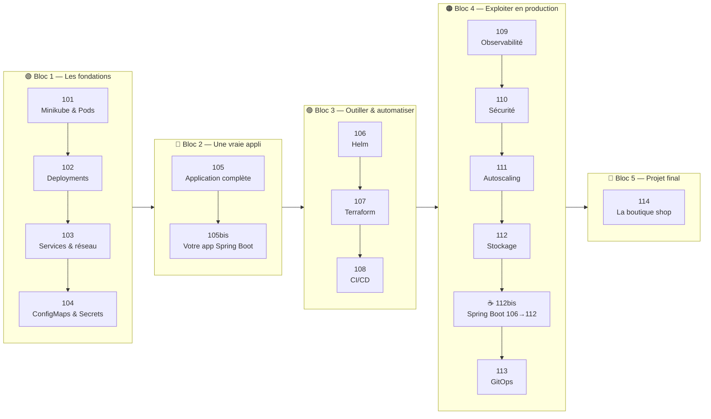
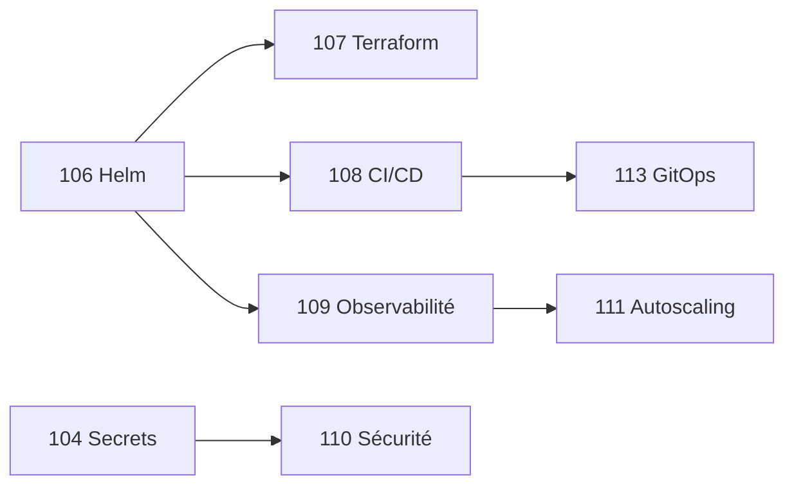

<div align="center">

# ☸️ k8s101 — Kubernetes de zéro à la prod


**Un parcours en 14 travaux dirigés, du premier `kubectl get pods` à une application complète livrée en GitOps.**

*Chaque TD se fait sur votre machine, avec un vrai cluster local. On casse des choses, on observe, on comprend.*

</div>

---

## 📋 Sommaire

- [🎯 Ce que vous saurez faire à la fin](#-ce-que-vous-saurez-faire-à-la-fin)
- [🗺️ Le parcours en un coup d'œil](#️-le-parcours-en-un-coup-dœil)
- [📚 Les 15 modules](#-les-15-modules)
- [🧭 La stratégie pédagogique](#-la-stratégie-pédagogique)
- [🧠 Prérequis de connaissances](#-prérequis-de-connaissances)
- [💻 Prérequis machine](#-prérequis-machine)
- [🛠️ Outils à installer](#️-outils-à-installer)
- [✅ Vérifier que tout est prêt](#-vérifier-que-tout-est-prêt)
- [🚀 Démarrer](#-démarrer)
- [📐 Comment travailler un TD](#-comment-travailler-un-td)
- [🩺 Dépannage transversal](#-dépannage-transversal)
- [📁 Organisation du dépôt](#-organisation-du-dépôt)
- [🤝 Contribuer](#-contribuer)

---

## 🎯 Ce que vous saurez faire à la fin

> [!NOTE]
> Ce module ne vise pas à « connaître Kubernetes » mais à **savoir livrer une application dessus, proprement, et la garder en vie**.

À l'issue des 15 TD, vous serez capable de :

- ☸️ **Comprendre le modèle** : Cluster, Node, Pod, Deployment, Service, Ingress — et surtout *pourquoi* chaque objet existe
- 🔁 **Déployer sans coupure** : rolling update, rollback, self-healing, scaling
- 🔀 **Faire communiquer** des applications : DNS interne, Services, Ingress, NetworkPolicies
- ⚙️ **Externaliser la configuration** : ConfigMaps, Secrets, namespaces par environnement
- 💾 **Garder ses données** : PV, PVC, StorageClass, StatefulSet, snapshots
- ⛵ **Packager** avec Helm et **provisionner** avec Terraform
- 🔭 **Observer** : Prometheus, Grafana, Loki, alertes
- 🔐 **Sécuriser** : RBAC, Pod Security Standards, Sealed Secrets, scan d'images
- 📈 **Dimensionner** : HPA, VPA, Cluster Autoscaler, KEDA
- 🚀 **Livrer en GitOps** : GitHub Actions + Kustomize + Argo CD, promotion dev → staging → prod
- 🏗️ **Assembler tout ça** sur une vraie application (frontend + backend + PostgreSQL + Redis) dans le projet final

---

## 🗺️ Le parcours en un coup d'œil

Le module est construit en **5 blocs progressifs**. Chaque bloc s'appuie sur le précédent : on ne saute pas d'étape.



| Bloc | Question à laquelle il répond | Modules | Durée |
|------|-------------------------------|---------|-------|
| 🟢 **Fondations** | *Comment Kubernetes fait tourner mon conteneur ?* | 101 → 104 | ≈ 9h |
| 🔵 **Une vraie appli** | *Comment j'assemble front, back et base de données… puis mon propre code ?* | 105 → 105bis | ≈ 3h30 |
| 🟣 **Outiller** | *Comment j'arrête de copier-coller du YAML ?* | 106 → 108 | ≈ 6h |
| 🟠 **Exploiter** | *Comment je dors la nuit quand c'est en prod ?* | 109 → 113 | ≈ 13h |
| 🔴 **Projet final** | *Suis-je capable de tout enchaîner seul ?* | 114 | 1 journée |

---

## 📚 Les 15 modules

| # | Module | Niveau | Durée | Vous apprenez à… | Outils clés |
|---|--------|--------|-------|------------------|-------------|
| **101** | [Premier contact : Kubernetes & Minikube](day1/101-k8s-minikube.md) | 🟢 Débutant | 2h–2h30 | Installer un cluster local, créer un Pod, lire ses logs, entrer dedans, utiliser le Dashboard | `kubectl`, `minikube` |
| **102** | [Deployments & ReplicaSets](day1/102-deployments-replicatSets.md) | 🟢 Débutant | 2h–2h30 | Comprendre le self-healing, scaler, faire un rolling update et un rollback, écrire son premier YAML | `kubectl rollout`, YAML |
| **103** | [Services & réseau](day1/103-services-network.md) | 🟢 Débutant | 2h–2h30 | Résoudre le problème des IP éphémères : ClusterIP, NodePort, LoadBalancer, DNS interne, Ingress | Services, CoreDNS, Ingress NGINX |
| **104** | [ConfigMaps & Secrets](day1/104-configmaps-secrets.md) | 🟢 Débutant | 2h | Sortir la config de l'image : variables d'env, fichiers montés, mise à jour à chaud, namespaces | ConfigMap, Secret, Namespace |
| **105** | [Application complète](day1/105-full-appli.md) | 🔵 Intermédiaire | 1h30 | Assembler frontend + backend + PostgreSQL derrière un Ingress, diagnostiquer la chaîne complète | Tout ce qui précède |
| **105bis** | [Votre application Spring Boot](day1/105bis-spring-boot.md) | 🔵 Intermédiaire | 2h | Écrire deux microservices Java (l'un expose une API, l'autre l'appelle), brancher les probes sur Actuator, builder l'image dans Minikube, déployer et exposer | Spring Boot 3, `RestClient`, Actuator, Docker Compose |
| **106** | [Helm pour les nuls](day1/106-helm-beginner.md) | 🟣 Débutant | 2h | Installer un chart, le personnaliser avec des values, upgrader, rollback, créer son propre chart | `helm`, Go templates |
| **107** | [Terraform pour les nuls](day1/107-terrform-beginner.md) | 🟣 Débutant | 2h | Infrastructure as code : `init/plan/apply`, variables, state, modules, provider Kubernetes & Helm | `terraform` / `tofu` |
| **108** | [CI/CD & automatisation](day1/108-cicd-automation.md) | 🟣 Débutant | 2h | Automatiser `plan` en PR et `apply` au merge, gérer les secrets, builder et pousser une image | GitHub Actions, GHCR |
| **109** | [Observabilité](day1/109-observability.md) | 🟠 Débutant | 2h30 | Les 3 piliers : métriques (PromQL), logs (LogQL), alertes ; instrumenter son app | Prometheus, Grafana, Loki, Alertmanager |
| **110** | [Sécurité](day1/110-security.md) | 🟠 Débutant | 2h30 | RBAC, NetworkPolicies, Sealed Secrets, `securityContext`, Pod Security Standards, scan d'images | RBAC, `kubeseal`, `trivy` |
| **111** | [Autoscaling](day1/111-autoscaling.md) | 🟠 Débutant | 2h30 | Scaler horizontalement (HPA), verticalement (VPA), les nœuds (Cluster Autoscaler), sur événements (KEDA) | `metrics-server`, HPA, KEDA |
| **112** | [Stockage](day1/112-storage.md) | 🟠 Débutant | 2h30 | Garder ses données : PV/PVC, StorageClass, modes d'accès, StatefulSet, expansion, snapshots | CSI, StatefulSet |
| **112bis** | [Spring Boot sur K8s, de Helm au stockage](day1/112bis-spring-boot-advanced/README.md) | ☕ Intermédiaire | 1 journée | Appliquer 106 → 112 sur une vraie appli Java : chart Helm unique, Terraform, GitHub Actions, Prometheus/Grafana, PSS + NetworkPolicies + RBAC, HPA/PDB, PostgreSQL en StatefulSet — avec un script qui déploie et teste chaque module | Tout 106 → 112 |
| **113** | [CI/CD & GitOps](day1/113-gitops.md) | 🟠 Débutant | 3h | Livrer sans `kubectl apply` : Kustomize, Argo CD, promotion dev → staging → prod, rollback par `git revert` | Kustomize, Argo CD, External Secrets |
| **114** | [Projet final : la boutique `shop`](day1/114-shop.md) | 🔴 Intermédiaire | 1 journée | Tout enchaîner sur une appli réelle (Java 21 + React + PostgreSQL + Redis), du Dockerfile au runbook de mise en prod | Tout, avec `kind` |

> [!TIP]
> Les niveaux « Débutant » des blocs 🟣 et 🟠 signifient *débutant sur l'outil*, pas débutant Kubernetes : les bases 101 → 105 sont considérées acquises.

---

## 🧭 La stratégie pédagogique

### 1. Le problème avant la solution

Chaque TD commence par **casser quelque chose** ou montrer une limite concrète, *puis* introduit l'objet Kubernetes qui la résout :

| On constate… | …donc on découvre |
|---------------|-------------------|
| Un Pod supprimé ne revient pas | le **Deployment** (102) |
| L'IP d'un Pod change à chaque redémarrage | le **Service** et le DNS interne (103) |
| La config est en dur dans l'image | la **ConfigMap** et le **Secret** (104) |
| On copie-colle 200 lignes de YAML entre environnements | **Helm** (106) puis **Kustomize** (113) |
| On ne sait pas pourquoi ça rame | l'**observabilité** (109) |
| Tout le monde est `cluster-admin` | le **RBAC** (110) |

Vous ne mémorisez pas une liste d'objets : vous retenez **à quel problème chacun répond**.

### 2. Toujours dans cet ordre : CLI → observer → YAML

1. **Impératif d'abord** (`kubectl create`, `kubectl expose`, `kubectl scale`) : le résultat est immédiat, on manipule.
2. **Observer** (`get`, `describe`, `logs`, `-w`, Dashboard) : on relie la commande à ce qui se passe réellement dans le cluster.
3. **Déclaratif ensuite** (`kubectl apply -f`) : on écrit le YAML *en sachant déjà ce qu'il produit*.

C'est l'inverse de la plupart des cours, et c'est volontaire : le YAML n'est pas intimidant quand on a déjà vu l'objet vivre.

### 3. Casser pour comprendre

Vous allez régulièrement **supprimer des Pods, casser des labels, couper le réseau, remplir le CPU**. C'est le meilleur moyen de constater que Kubernetes est un système de *réconciliation* : il compare l'état désiré et l'état réel, et corrige. Cette idée est la clé de tout le module — y compris du GitOps en 113.

### 4. Une structure identique dans chaque TD

Tous les TD suivent le même squelette pour que vous sachiez toujours où vous en êtes :

```
🎯 Objectifs (cases à cocher)   →  ce que vous devez savoir faire à la fin
🏗️ Architecture (schéma)         →  ce qu'on va construire
📖 Vocabulaire                   →  les 5-6 mots à connaître, avec une analogie
Partie 0 — Prérequis            →  l'état attendu du cluster avant de commencer
Parties 1 → N                   →  guidées, avec la sortie attendue de chaque commande
🏆 Challenge / 🧪 Exercices       →  15-25 min en autonomie, sans copier-coller
❓ Quiz                          →  vérifier qu'on a compris, pas juste exécuté
🩺 Dépannage                     →  les erreurs qu'on rencontre vraiment
📝 Mémo                          →  les commandes à connaître par cœur
🧠 À retenir / ✅ Checklist       →  auto-évaluation honnête
```

### 5. Une seule application, du début à la fin

Le 105 assemble une première application complète. Le 114 en reprend une plus ambitieuse (`shop`) et **relie explicitement chaque étape au module qui l'a enseignée**. Rien n'est appris « pour la forme » : tout ressert.

### 6. Les blocs 🟣 et 🟠 sont ré-ordonnables

Une fois 101 → 105 terminés, les modules 106 à 113 sont **relativement indépendants**. Les seules dépendances fortes :



Un formateur peut donc adapter l'ordre à son public (ex. faire 112 Stockage juste après 105 pour un public orienté données).

---

## 🧠 Prérequis de connaissances

> [!IMPORTANT]
> Ce module part de **zéro sur Kubernetes**, mais **pas de zéro en informatique**. Vérifiez honnêtement les cases ci-dessous avant de commencer.

### Indispensables

- [ ] **Terminal** : naviguer (`cd`, `ls`), éditer un fichier, lancer une commande, lire une erreur. Vous passerez 90 % du temps dans un terminal.
- [ ] **Docker / conteneurs** : savoir ce qu'est une image, un conteneur, un `Dockerfile`, un registry. Avoir déjà fait un `docker run` et un `docker build`.
- [ ] **Réseau, les bases** : IP, port, DNS, HTTP, la différence entre `localhost` et une IP de machine.
- [ ] **Git** : `clone`, `commit`, `push`, branches, Pull Request. Indispensable dès le 108.
- [ ] **YAML** : indentation, listes, dictionnaires. 10 minutes de lecture suffisent, mais il faut les avoir faites.

### Recommandés

- [ ] Un langage de programmation (le 109 instrumente une app Python, le 114 utilise Java 21 + React — mais vous ne codez pas l'appli, vous la déployez)
- [ ] Notions Linux : processus, utilisateurs, permissions, `curl`, variables d'environnement
- [ ] Avoir déjà utilisé une application « à plusieurs services » (front + API + base)

### Non requis

- ❌ Aucune expérience Kubernetes, Helm, Terraform, Prometheus ou Argo CD
- ❌ Aucun compte cloud payant : **tout tourne en local** (le 111 mentionne le Cluster Autoscaler sur EKS/GKE à titre illustratif)

<details>
<summary>📖 Ressources pour se mettre à niveau en 1h</summary>

- Docker : [Docker Getting Started](https://docs.docker.com/get-started/) (parties 1 à 4)
- YAML : [Learn YAML in Y minutes](https://learnxinyminutes.com/docs/yaml/)
- Git : [Git Handbook (GitHub)](https://docs.github.com/en/get-started/using-git/about-git)
- Terminal : [The Missing Semester — Shell](https://missing.csail.mit.edu/2020/course-shell/)

</details>

---

## 💻 Prérequis machine

Kubernetes en local, c'est **une VM ou des conteneurs qui font tourner un cluster complet**. Ça consomme. Une machine sous-dimensionnée est la **première cause d'échec** en TD.

### Configuration matérielle

| | Minimum (101 → 108) | Recommandé (109 → 114) | Pourquoi |
|---|---|---|---|
| **CPU** | 4 cœurs | 6–8 cœurs | Le 109 (Prometheus + Grafana + Loki) et le 114 (5 services + Argo CD) font tourner beaucoup de Pods |
| **RAM** | 8 Go | **16 Go** | Le cluster prend 4 à 6 Go, l'IDE et le navigateur le reste. Avec 8 Go, fermez tout le reste. |
| **Disque** | 20 Go libres | 40 Go libres (SSD) | Images Docker, volumes persistants (112), charts Helm |
| **Réseau** | Connexion stable | | Téléchargement d'images (plusieurs Go sur l'ensemble du module). **Prévoyez de pré-tirer les images la veille** si le réseau de la salle est faible. |
| **Virtualisation** | Activée dans le BIOS/UEFI | | Nécessaire à Docker Desktop / Minikube |

> [!WARNING]
> **Machines d'entreprise avec proxy, antivirus agressif ou VPN permanent** : prévoyez une demi-journée de mise en place et testez le [script de vérification](#-vérifier-que-tout-est-prêt) **avant** le premier TD. Le proxy est la seconde cause d'échec.

### Systèmes d'exploitation

| OS | Statut | Notes |
|----|--------|-------|
| 🍎 **macOS** (Intel ou Apple Silicon) | ✅ Référence | Les TD sont écrits et testés sur macOS. Installer via [Homebrew](https://brew.sh). Sur Apple Silicon, certaines images `amd64` sont lentes ou indisponibles : préférez les images multi-arch (toutes celles du module le sont). |
| 🐧 **Linux** (Ubuntu 22.04+, Debian 12+, Fedora) | ✅ Supporté | Le plus léger et le plus rapide. Utilisez le driver `docker` de Minikube. |
| 🪟 **Windows 10/11** | ⚠️ Via WSL2 uniquement | Installez **WSL2 + Ubuntu** et **Docker Desktop avec l'intégration WSL2**, puis suivez les instructions Linux **depuis le terminal Ubuntu**. Ne suivez pas les TD depuis PowerShell : les commandes `bash`, `curl`, `sed`… ne se comporteront pas de la même façon. |

### Droits nécessaires

- Droits **administrateur** sur la machine (installation de Docker, modification de `/etc/hosts` pour le 105 et le 114)
- Accès sortant HTTPS vers : `github.com`, `ghcr.io`, `docker.io`, `registry.k8s.io`, `quay.io`, `charts.helm.sh`, `releases.hashicorp.com`, `storage.googleapis.com`

---

## 🛠️ Outils à installer

### Bloc 🟢 + 🔵 (modules 101 → 105bis) — à avoir dès le jour 1

| Outil | Rôle | Version | macOS | Linux |
|-------|------|---------|-------|-------|
| **Docker** | Moteur de conteneurs, requis par Minikube et kind | ≥ 24 | [Docker Desktop](https://docs.docker.com/desktop/install/mac-install/) ou `brew install --cask docker` | [Docker Engine](https://docs.docker.com/engine/install/) + `sudo usermod -aG docker $USER` |
| **kubectl** | Le client Kubernetes | ≥ 1.29 | `brew install kubectl` | [Doc officielle](https://kubernetes.io/docs/tasks/tools/install-kubectl-linux/) |
| **Minikube** | Cluster local mono-nœud | ≥ 1.33 | `brew install minikube` | [Doc officielle](https://minikube.sigs.k8s.io/docs/start/) |
| **Un éditeur** avec coloration YAML | Écrire des manifestes sans erreur d'indentation | | VS Code + extension *Kubernetes*, ou IntelliJ | idem |
| **curl** | Tester les endpoints HTTP | | préinstallé | préinstallé |

### Bloc 🟣 (modules 106 → 108)

| Outil | Rôle | Module | macOS | Linux |
|-------|------|--------|-------|-------|
| **Helm** | Gestionnaire de paquets K8s | 106 | `brew install helm` | [Doc](https://helm.sh/docs/intro/install/) |
| **Terraform** ou **OpenTofu** | Infrastructure as code | 107 | `brew install hashicorp/tap/terraform` ou `brew install opentofu` | [Doc](https://developer.hashicorp.com/terraform/install) |
| **Compte GitHub** + dépôt personnel | Exécuter des workflows GitHub Actions | 108, 113, 114 | — | — |
| **act** *(optionnel)* | Tester un workflow en local | 108 | `brew install act` | [Doc](https://nektosact.com) |

### Bloc 🟠 + 🔴 (modules 109 → 114)

| Outil | Rôle | Module | macOS | Linux |
|-------|------|--------|-------|-------|
| **kubeseal** | Chiffrer des secrets commitables | 110 | `brew install kubeseal` | [Releases](https://github.com/bitnami-labs/sealed-secrets/releases) |
| **Trivy** | Scanner de vulnérabilités d'images | 110 | `brew install trivy` | [Doc](https://aquasecurity.github.io/trivy/) |
| **kind** | Cluster local multi-nœuds dans Docker | 114 | `brew install kind` | [Doc](https://kind.sigs.k8s.io/docs/user/quick-start/) |
| **kustomize** | Inclus dans `kubectl` (`kubectl kustomize`) | 113 | — | — |
| **Argo CD CLI** *(optionnel)* | Piloter Argo CD en ligne de commande | 113, 114 | `brew install argocd` | [Doc](https://argo-cd.readthedocs.io/en/stable/cli_installation/) |
| **Java 21 + Node 20** *(optionnel)* | Lancer les services Spring Boot en local (105bis) et builder `shop` (114) ; sinon le Dockerfile / la CI compile pour vous | 105bis, 114 | `brew install openjdk@21 node@20` | via sdkman / nvm |

> [!TIP]
> **Tout installer d'un coup sur macOS :**
> ```bash
> brew install kubectl minikube helm kind kubeseal trivy act argocd hashicorp/tap/terraform
> brew install --cask docker
> ```

<details>
<summary>🍬 Confort (fortement recommandé, 5 minutes)</summary>

```bash
# Alias k = kubectl + autocomplétion (zsh)
cat >> ~/.zshrc <<'EOS'
alias k=kubectl
source <(kubectl completion zsh)
compdef k=kubectl
EOS

# Outils qui changent la vie
brew install kubectx   # kubectx / kubens : changer de cluster / namespace en 1 commande
brew install k9s       # k9s : interface TUI pour naviguer dans le cluster
brew install stern     # stern : logs de plusieurs pods en même temps
```

</details>

---

## ✅ Vérifier que tout est prêt

Lancez ce script **la veille du premier TD**. Tout doit être vert.

```bash
#!/usr/bin/env bash
# check-env.sh — vérification de l'environnement k8s101
set -u
ok()   { printf "  ✅ %s\n" "$1"; }
ko()   { printf "  ❌ %s\n" "$1"; FAIL=1; }
warn() { printf "  ⚠️  %s\n" "$1"; }
FAIL=0

echo "🔧 Outils"
for bin in docker kubectl minikube helm; do
  command -v "$bin" >/dev/null 2>&1 && ok "$bin $($bin version --client --short 2>/dev/null | head -1 || $bin --version 2>/dev/null | head -1)" || ko "$bin manquant"
done
for bin in terraform kind kubeseal trivy; do
  command -v "$bin" >/dev/null 2>&1 && ok "$bin (bloc 🟣/🟠)" || warn "$bin absent — nécessaire à partir du 107/110/114"
done

echo "🐳 Docker"
docker info >/dev/null 2>&1 && ok "daemon Docker joignable" || ko "Docker ne répond pas — lancez Docker Desktop"

echo "💻 Ressources"
if [[ "$(uname)" == "Darwin" ]]; then
  CPU=$(sysctl -n hw.ncpu); MEM=$(( $(sysctl -n hw.memsize) / 1024 / 1024 / 1024 ))
else
  CPU=$(nproc); MEM=$(( $(grep MemTotal /proc/meminfo | awk '{print $2}') / 1024 / 1024 ))
fi
[[ $CPU -ge 4 ]] && ok "$CPU cœurs CPU" || ko "$CPU cœurs — 4 minimum"
[[ $MEM -ge 8 ]] && ok "$MEM Go RAM" || ko "$MEM Go RAM — 8 minimum, 16 recommandés"
DISK=$(df -g . 2>/dev/null | awk 'NR==2{print $4}' || df -BG . | awk 'NR==2{print $4}' | tr -d G)
[[ ${DISK:-0} -ge 20 ]] && ok "$DISK Go disque libre" || warn "$DISK Go disque — 20 minimum"

echo "🌐 Réseau"
for host in github.com ghcr.io registry.k8s.io docker.io; do
  curl -sSf --max-time 5 -o /dev/null "https://$host" 2>/dev/null && ok "$host joignable" || warn "$host injoignable — proxy ?"
done

echo
[[ $FAIL -eq 0 ]] && echo "🎉 Environnement prêt pour le TD 101 !" || echo "🛑 Corrigez les ❌ avant de commencer."
```

Puis le **test grandeur nature** (≈ 3 min, télécharge ~1 Go la première fois) :

```bash
minikube start --cpus 4 --memory 6g
kubectl get nodes          # → minikube   Ready
kubectl run hello --image=nginx --rm -it --restart=Never -- echo "Hello k8s101" 
minikube stop
```

Si vous voyez `Hello k8s101`, vous êtes prêt.

---

## 🚀 Démarrer

```bash
git clone https://github.com/marwensaid/k8s101.git
cd k8s101
open day1/101-k8s-minikube.md     # ou lisez-le sur GitHub, le rendu Mermaid est meilleur
```

### Dimensionner le cluster selon le module

Ne démarrez pas toujours Minikube avec les valeurs par défaut (2 CPU / 2 Go) : c'est insuffisant dès le 105.

| Modules | Commande de démarrage conseillée |
|---------|----------------------------------|
| 101 → 104 | `minikube start --cpus 2 --memory 4g` |
| 105 → 108 | `minikube start --cpus 4 --memory 6g --addons ingress` |
| 109 → 113 | `minikube start --cpus 4 --memory 8g --addons ingress,metrics-server` |
| 114 | `kind create cluster --name shop --config …` *(fourni dans le TD)* |

> [!TIP]
> Un cluster Minikube **se conserve entre deux TD** (`minikube stop` / `minikube start`). Ne le supprimez (`minikube delete`) que si un TD le demande ou si vous voulez repartir propre. Pour changer le CPU/RAM d'un cluster existant, il faut `minikube delete` puis recréer.

---

## 📐 Comment travailler un TD

### Le rythme conseillé

| Durée | Quoi | Pourquoi |
|-------|------|----------|
| 10 min | Lire **Objectifs**, **Architecture** et **Vocabulaire** *sans toucher au clavier* | Savoir où on va |
| 60–90 min | Dérouler les parties guidées, **en tapant les commandes** (pas de copier-coller aveugle) et en comparant à la sortie attendue | Ancrer par le geste |
| 20–25 min | **Challenge / exercices** en autonomie, sans regarder les parties précédentes | Vérifier qu'on sait faire, pas seulement suivre |
| 10 min | **Quiz** + **Checklist** — honnêtement | Repérer ce qu'il faut revoir |
| 5 min | **Nettoyage** | Un cluster propre pour le TD suivant |

### Les règles du jeu

1. **Lisez la sortie de chaque commande.** L'erreur que vous ignorez à la Partie 2 vous bloquera à la Partie 5.
2. **`kubectl describe` et `kubectl logs` avant de demander de l'aide.** 80 % des blocages se lisent dans la section `Events`.
3. **Quand ça ne marche pas, c'est une opportunité.** Notez l'erreur, cherchez dans la section 🩺 Dépannage du TD, puis dans celle ci-dessous.
4. **Travaillez en binôme si possible** : un qui tape, un qui lit la doc et vérifie — et on échange à chaque partie.
5. **Ne sautez pas les challenges.** Ce sont eux qui font la différence entre « j'ai suivi » et « je sais faire ».

### Pour les formateurs

<details>
<summary>📅 Découpages possibles</summary>

| Format | Contenu | Public |
|--------|---------|--------|
| **Journée découverte (7h)** | 101 → 104 | Développeurs qui vont *utiliser* un cluster |
| **2 jours (14h)** | 101 → 106 + 109 | Devs full-stack / lead devs |
| **3 jours (21h)** | 101 → 110 | Profils DevOps junior |
| **5 jours (35h)** | 101 → 114 complet | Cursus DevOps / SRE, M2 |
| **Auto-formation** | 1 module par soirée, 114 sur un week-end | À votre rythme |

Le 114 se fait idéalement **en groupe de 2-3**, avec une démo de fin (runbook de release devant la classe).

</details>

<details>
<summary>🎓 Grille d'évaluation suggérée (module 114)</summary>

| Critère | Points |
|---------|--------|
| L'application est accessible en HTTPS via l'Ingress, front et API répondent | 20 |
| Les données PostgreSQL survivent à la suppression du Pod | 15 |
| Le backend scale sous charge (HPA) et revient à la normale | 15 |
| Le frontend **ne peut pas** joindre PostgreSQL (NetworkPolicy) | 10 |
| Aucun secret en clair dans Git | 10 |
| Un `git push` sur `k8s-deploy` déclenche le déploiement via Argo CD | 20 |
| Un `git revert` rollback effectivement la prod | 10 |

</details>

---

## 🩺 Dépannage transversal

Les problèmes qui reviennent dans **tous** les TD, et leur réflexe.

| Symptôme | Réflexe | Cause fréquente |
|----------|---------|-----------------|
| `The connection to the server … was refused` | `minikube status` puis `minikube start` | Le cluster est arrêté (reboot, veille prolongée) |
| `ImagePullBackOff` / `ErrImagePull` | `kubectl describe pod X` → section Events | Faute de frappe dans le nom d'image, tag inexistant, proxy, rate-limit Docker Hub (→ connectez-vous : `docker login`) |
| `CrashLoopBackOff` | `kubectl logs X --previous` | L'appli plante au démarrage : config manquante, variable d'env absente, mauvais port |
| `Pending` qui ne bouge pas | `kubectl describe pod X` → *Insufficient cpu/memory* | Cluster trop petit → `minikube delete && minikube start --cpus 4 --memory 8g` |
| `Pending` avec un PVC | `kubectl get pvc` → *Pending* | Pas de StorageClass par défaut ou driver CSI absent (112) |
| Le Service ne répond pas | `kubectl get endpoints X` → vide ? | Le `selector` du Service ne correspond pas aux `labels` des Pods (103) |
| `curl shop.local` ne résout pas | `cat /etc/hosts` | Entrée DNS locale manquante (105, 114) — `sudo` requis |
| Minikube très lent sur Mac | `minikube start --driver=docker` | Le driver `hyperkit`/`qemu` est plus lent que Docker Desktop |
| `error: You must be logged in to the server (Unauthorized)` | `kubectl config get-contexts` | Mauvais contexte (kind vs minikube) → `kubectl config use-context minikube` |
| Plus de place disque | `docker system prune -a` puis `minikube ssh -- docker system prune -a` | Images accumulées sur plusieurs TD |

> [!TIP]
> **Le trio de diagnostic à connaître par cœur** — 90 % des problèmes se résolvent avec :
> ```bash
> kubectl get all -n <namespace>
> kubectl describe <type> <nom> -n <namespace>     # → lire Events en bas
> kubectl logs <pod> -n <namespace> --previous     # → si le pod redémarre en boucle
> ```

---

## 📁 Organisation du dépôt

```
k8s101/
├── README.md                          ← vous êtes ici
├── LICENSE
├── .github/workflows/spring-demo.yml  CI du fil rouge Spring Boot (module 108)
└── day1/
    ├── 101-k8s-minikube.md            🟢 Fondations
    ├── 102-deployments-replicatSets.md
    ├── 103-services-network.md
    ├── 104-configmaps-secrets.md
    ├── 105-full-appli.md              🔵 Une vraie appli
    ├── 105bis-spring-boot.md          ☕ Votre app Spring Boot
    ├── 105bis-spring-boot/            │  code source : catalog-service, order-service, k8s/, docker-compose
    ├── 106-helm-beginner.md           🟣 Outiller & automatiser
    ├── 107-terrform-beginner.md
    ├── 108-cicd-automation.md
    ├── 109-observability.md           🟠 Exploiter en production
    ├── 110-security.md
    ├── 111-autoscaling.md
    ├── 112-storage.md
    ├── 112bis-spring-boot-advanced/   ☕ TD guidé Spring Boot 106 → 112 (README.md = le TD)
    │   ├── app/                       │  code source + Dockerfiles + manifests + compose
    │   ├── 106-helm/ … 112-storage/   │  chart Helm, Terraform, CI, observabilité, sécurité, HPA, PostgreSQL
    │   └── deploy.sh                  │  déploie / teste / nettoie chaque module
    ├── 113-gitops.md
    └── 114-shop.md                    🔴 Projet final
```

Chaque TD est **autonome et auto-suffisant** : tous les manifestes YAML sont inclus dans le Markdown (à copier dans des fichiers locaux). Aucun autre dépôt n'est nécessaire, sauf votre propre dépôt GitHub pour les modules 108, 113 et 114.

> [!TIP]
> **Fil rouge Spring Boot (optionnel, ☕).** Le module 105bis vous fait écrire deux micro-services Java ; le TD [112bis](day1/112bis-spring-boot-advanced/README.md) les fait traverser les modules 106 → 112 (code, chart Helm, Terraform, CI, observabilité, sécurité, autoscaling, stockage) avec un script `deploy.sh` qui déploie **et** teste chaque étape. Les TD 106 → 112 se terminent chacun par une section « ☕ Fil rouge Spring Boot » qui y renvoie.

### Conventions utilisées dans les TD

| Élément | Signification |
|---------|---------------|
| `# pod/nginx created` sous une commande | La **sortie attendue** — comparez avec la vôtre |
| > [!IMPORTANT] / > [!WARNING] | Concept clé / piège fréquent — **à lire** |
| > [!TIP] | Raccourci ou bonne pratique, optionnel |
| `<details>` repliés | Variantes par OS, solutions des exercices, approfondissements |
| ⏱️ **N minutes en autonomie** | Un challenge : fermez le TD, faites-le, puis comparez |
| Schémas Mermaid | Se lisent sur GitHub ou dans VS Code avec l'extension *Markdown Preview Mermaid* |

---

## 🤝 Contribuer

Une coquille, une commande qui ne marche plus avec la dernière version de Minikube, une explication qui gagnerait en clarté ? **Les Pull Requests sont bienvenues.**

- Ouvrez une *issue* en précisant **le module, la partie, votre OS et la version des outils** (`kubectl version`, `minikube version`)
- Pour un TD, gardez la structure commune (Objectifs → Architecture → Parties → Challenge → Quiz → Mémo)
- Testez vos commandes sur un cluster propre (`minikube delete && minikube start`) avant de proposer

---

<div align="center">

**Bon cluster !** ☸️

*Licence : voir [LICENSE](LICENSE)*

</div>
