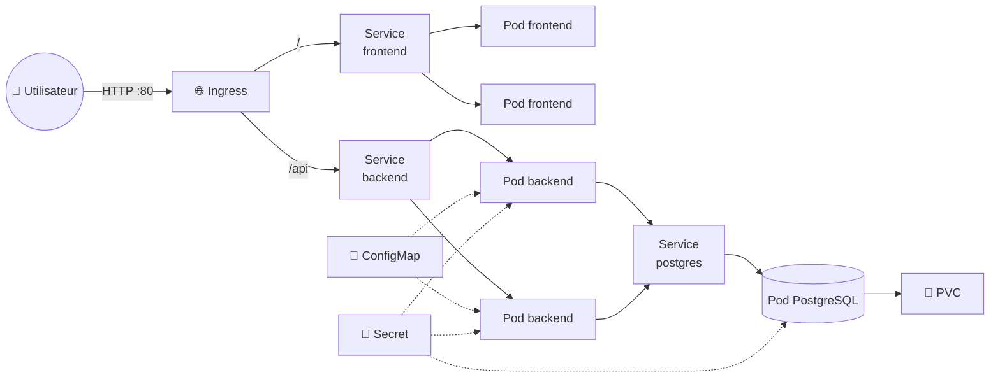
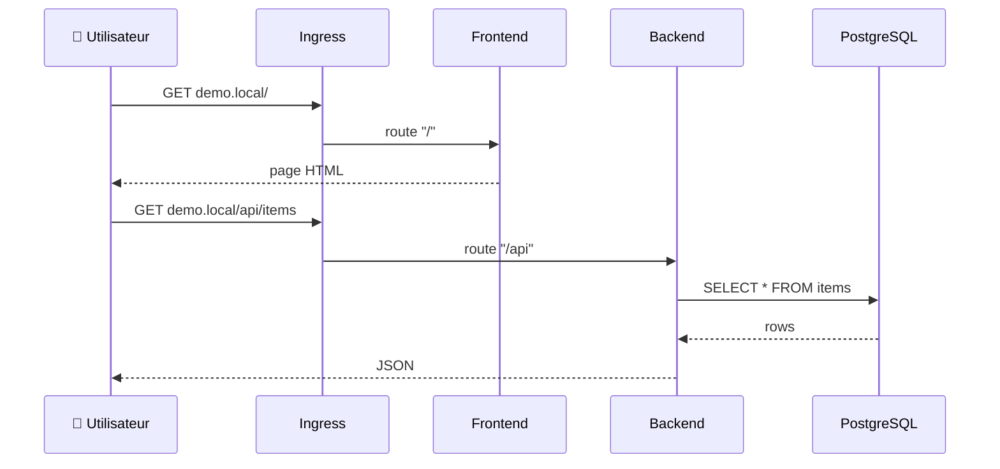
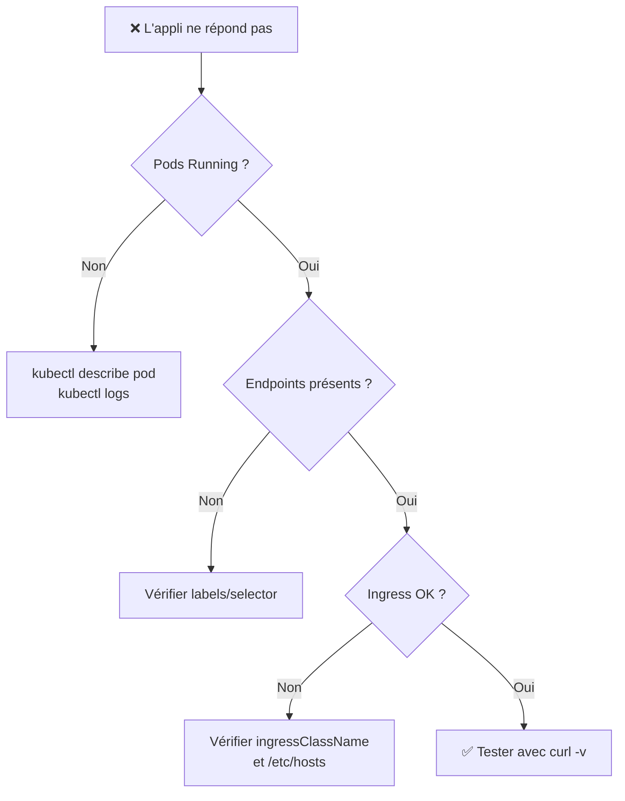

<div align="center">

# 🚀 105 — Application complète

### *Assembler toutes les briques : frontend, backend & base de données*


</div>

---

## 📋 Sommaire

- [🎯 Objectifs](#-objectifs)
- [🏗️ Architecture cible](#️-architecture-cible)
- [1️⃣ Namespace & organisation](#1️⃣-namespace--organisation)
- [2️⃣ Base de données (PostgreSQL)](#2️⃣-base-de-données-postgresql)
- [3️⃣ Backend (API)](#3️⃣-backend-api)
- [4️⃣ Frontend](#4️⃣-frontend)
- [5️⃣ Exposition avec Ingress](#5️⃣-exposition-avec-ingress)
- [6️⃣ Déployer & vérifier](#6️⃣-déployer--vérifier)
- [🧪 Exercices](#-exercices)
- [🩺 Dépannage](#-dépannage)
- [✅ Checklist](#-checklist)

---

## 🎯 Objectifs

> [!NOTE]
> À la fin de ce module, vous saurez :

- ✅ Structurer une application multi-composants dans Kubernetes
- ✅ Faire communiquer plusieurs Deployments via des Services
- ✅ Injecter la configuration avec ConfigMaps et Secrets
- ✅ Persister les données avec un PersistentVolumeClaim
- ✅ Exposer l'application à l'extérieur via un Ingress
- ✅ Diagnostiquer une application complète

---

## 🏗️ Architecture cible



| Composant | Type | Réplicas | Exposition |
|-----------|------|:--------:|------------|
| 🖥️ Frontend | Deployment | 2 | ClusterIP + Ingress |
| ⚙️ Backend | Deployment | 2 | ClusterIP + Ingress |
| 🗄️ PostgreSQL | Deployment | 1 | ClusterIP uniquement |

---

## 1️⃣ Namespace & organisation

> [!TIP]
> Isoler l'application dans son propre namespace facilite le nettoyage et la gestion des droits.

```bash
kubectl create namespace demo-app
kubectl config set-context --current --namespace=demo-app
```

📁 Structure des fichiers :

```
105-full-appli/
├── 00-namespace.yaml
├── 10-config.yaml        # ConfigMap + Secret
├── 20-postgres.yaml      # PVC + Deployment + Service
├── 30-backend.yaml       # Deployment + Service
├── 40-frontend.yaml      # Deployment + Service
└── 50-ingress.yaml
```

<details>
<summary>📄 <code>00-namespace.yaml</code></summary>

```yaml
apiVersion: v1
kind: Namespace
metadata:
  name: demo-app
  labels:
    app.kubernetes.io/part-of: demo-app
```
</details>

---

## 2️⃣ Base de données (PostgreSQL)

### 🔐 Configuration & secrets

<details open>
<summary>📄 <code>10-config.yaml</code></summary>

```yaml
apiVersion: v1
kind: ConfigMap
metadata:
  name: app-config
  namespace: demo-app
data:
  DB_HOST: postgres
  DB_PORT: "5432"
  DB_NAME: demo
  LOG_LEVEL: info
---
apiVersion: v1
kind: Secret
metadata:
  name: app-secret
  namespace: demo-app
type: Opaque
stringData:
  DB_USER: demo
  DB_PASSWORD: S3cr3t!
```
</details>

> [!WARNING]
> `stringData` est pratique pour les TP mais **ne committez jamais** un Secret en clair dans Git. En production : Sealed Secrets, External Secrets ou Vault.

### 🗄️ Déploiement PostgreSQL

<details open>
<summary>📄 <code>20-postgres.yaml</code></summary>

```yaml
apiVersion: v1
kind: PersistentVolumeClaim
metadata:
  name: postgres-data
  namespace: demo-app
spec:
  accessModes: [ReadWriteOnce]
  resources:
    requests:
      storage: 1Gi
---
apiVersion: apps/v1
kind: Deployment
metadata:
  name: postgres
  namespace: demo-app
  labels:
    app: postgres
spec:
  replicas: 1
  strategy:
    type: Recreate          # ⚠️ jamais 2 instances sur le même volume
  selector:
    matchLabels:
      app: postgres
  template:
    metadata:
      labels:
        app: postgres
    spec:
      containers:
        - name: postgres
          image: postgres:16-alpine
          ports:
            - containerPort: 5432
          env:
            - name: POSTGRES_DB
              valueFrom:
                configMapKeyRef:
                  name: app-config
                  key: DB_NAME
            - name: POSTGRES_USER
              valueFrom:
                secretKeyRef:
                  name: app-secret
                  key: DB_USER
            - name: POSTGRES_PASSWORD
              valueFrom:
                secretKeyRef:
                  name: app-secret
                  key: DB_PASSWORD
          volumeMounts:
            - name: data
              mountPath: /var/lib/postgresql/data
          readinessProbe:
            exec:
              command: ["pg_isready", "-U", "demo"]
            initialDelaySeconds: 5
            periodSeconds: 5
          resources:
            requests: { cpu: 100m, memory: 128Mi }
            limits:   { cpu: 500m, memory: 512Mi }
      volumes:
        - name: data
          persistentVolumeClaim:
            claimName: postgres-data
---
apiVersion: v1
kind: Service
metadata:
  name: postgres
  namespace: demo-app
spec:
  selector:
    app: postgres
  ports:
    - port: 5432
      targetPort: 5432
```
</details>

---

## 3️⃣ Backend (API)

<details open>
<summary>📄 <code>30-backend.yaml</code></summary>

```yaml
apiVersion: apps/v1
kind: Deployment
metadata:
  name: backend
  namespace: demo-app
  labels:
    app: backend
spec:
  replicas: 2
  selector:
    matchLabels:
      app: backend
  template:
    metadata:
      labels:
        app: backend
    spec:
      containers:
        - name: api
          image: ghcr.io/your-org/demo-api:1.0.0
          ports:
            - containerPort: 8080
          envFrom:
            - configMapRef:
                name: app-config
            - secretRef:
                name: app-secret
          readinessProbe:
            httpGet:
              path: /health/ready
              port: 8080
            initialDelaySeconds: 5
          livenessProbe:
            httpGet:
              path: /health/live
              port: 8080
            initialDelaySeconds: 15
          resources:
            requests: { cpu: 100m, memory: 128Mi }
            limits:   { cpu: 500m, memory: 256Mi }
---
apiVersion: v1
kind: Service
metadata:
  name: backend
  namespace: demo-app
spec:
  selector:
    app: backend
  ports:
    - port: 80
      targetPort: 8080
```
</details>

> [!TIP]
> `envFrom` injecte **toutes** les clés du ConfigMap/Secret en variables d'environnement d'un coup. Le backend se connecte à la base via le DNS interne : `postgres.demo-app.svc.cluster.local` (ou simplement `postgres`).

---

## 4️⃣ Frontend

<details open>
<summary>📄 <code>40-frontend.yaml</code></summary>

```yaml
apiVersion: apps/v1
kind: Deployment
metadata:
  name: frontend
  namespace: demo-app
  labels:
    app: frontend
spec:
  replicas: 2
  selector:
    matchLabels:
      app: frontend
  template:
    metadata:
      labels:
        app: frontend
    spec:
      containers:
        - name: web
          image: ghcr.io/your-org/demo-front:1.0.0
          ports:
            - containerPort: 80
          env:
            - name: API_URL
              value: "/api"
          readinessProbe:
            httpGet:
              path: /
              port: 80
          resources:
            requests: { cpu: 50m, memory: 64Mi }
            limits:   { cpu: 200m, memory: 128Mi }
---
apiVersion: v1
kind: Service
metadata:
  name: frontend
  namespace: demo-app
spec:
  selector:
    app: frontend
  ports:
    - port: 80
      targetPort: 80
```
</details>

---

## 5️⃣ Exposition avec Ingress

<details open>
<summary>📄 <code>50-ingress.yaml</code></summary>

```yaml
apiVersion: networking.k8s.io/v1
kind: Ingress
metadata:
  name: demo-app
  namespace: demo-app
  annotations:
    nginx.ingress.kubernetes.io/rewrite-target: /$2
spec:
  ingressClassName: nginx
  rules:
    - host: demo.local
      http:
        paths:
          - path: /api(/|$)(.*)
            pathType: ImplementationSpecific
            backend:
              service:
                name: backend
                port:
                  number: 80
          - path: /()(.*)
            pathType: ImplementationSpecific
            backend:
              service:
                name: frontend
                port:
                  number: 80
```
</details>

```bash
# Minikube : activer le contrôleur Ingress
minikube addons enable ingress

# Ajouter l'entrée DNS locale
echo "$(minikube ip) demo.local" | sudo tee -a /etc/hosts
```

---

## 6️⃣ Déployer & vérifier

```bash
# 🚀 Tout déployer (ordre alphabétique = ordre des dépendances)
kubectl apply -f 105-full-appli/

# 👀 Suivre le démarrage
kubectl get pods -n demo-app -w
```

```
NAME                        READY   STATUS    RESTARTS   AGE
postgres-7c9f8d6b4-xk2lp    1/1     Running   0          40s
backend-5d8b9c7f6-9hq4n     1/1     Running   0          40s
backend-5d8b9c7f6-t7v2m     1/1     Running   0          40s
frontend-6f4c8b5d9-2rk8j    1/1     Running   0          40s
frontend-6f4c8b5d9-p5w3z    1/1     Running   0          40s
```

### ✅ Vérifications

```bash
# Vue globale
kubectl get all,cm,secret,pvc,ingress -n demo-app

# Tester la chaîne complète
curl http://demo.local/
curl http://demo.local/api/health/ready

# Tester la connectivité interne backend → postgres
kubectl exec -n demo-app deploy/backend -- nc -zv postgres 5432
```



---

## 🧪 Exercices

<details>
<summary>🟢 <b>Exercice 1 — Scaler le backend</b></summary>

Passez le backend à **4 réplicas** et vérifiez que l'Ingress répartit la charge :

```bash
kubectl scale deploy/backend --replicas=4 -n demo-app
for i in $(seq 1 10); do curl -s http://demo.local/api/hostname; echo; done
```
</details>

<details>
<summary>🟡 <b>Exercice 2 — Changer la configuration</b></summary>

Modifiez `LOG_LEVEL` en `debug` dans le ConfigMap.
Les Pods voient-ils le changement ? Pourquoi ? Comment forcer la prise en compte ?

> 💡 Indice : `kubectl rollout restart deploy/backend`
</details>

<details>
<summary>🟠 <b>Exercice 3 — Rolling update</b></summary>

Mettez à jour l'image du frontend vers `1.1.0` et observez le rollout :

```bash
kubectl set image deploy/frontend web=ghcr.io/your-org/demo-front:1.1.0 -n demo-app
kubectl rollout status deploy/frontend -n demo-app
kubectl rollout history deploy/frontend -n demo-app
```

Puis effectuez un **rollback**.
</details>

<details>
<summary>🔴 <b>Exercice 4 — Persistance</b></summary>

1. Insérez une ligne dans la base via le backend.
2. Supprimez le Pod PostgreSQL : `kubectl delete pod -l app=postgres`.
3. Vérifiez que la donnée est toujours là après redémarrage.
4. Que se passe-t-il si vous supprimez le PVC ?
</details>

---

## 🩺 Dépannage

| Symptôme | Cause probable | Commande de diagnostic |
|----------|----------------|------------------------|
| `CrashLoopBackOff` backend | Variables DB manquantes | `kubectl logs deploy/backend` |
| Backend `0/1 Ready` | Postgres pas encore prêt | `kubectl describe pod -l app=backend` |
| `Pending` sur postgres | Aucun StorageClass / PVC non lié | `kubectl get pvc,sc` |
| `502 Bad Gateway` | Service sans endpoints | `kubectl get endpoints -n demo-app` |
| `404` sur `/api` | Mauvais `rewrite-target` | `kubectl describe ingress demo-app` |



---

## 🧹 Nettoyage

```bash
kubectl delete namespace demo-app
```

---

## ✅ Checklist

- [ ] Namespace dédié créé
- [ ] ConfigMap et Secret séparés (config vs. sensible)
- [ ] PostgreSQL avec PVC et stratégie `Recreate`
- [ ] Backend et frontend avec probes et `resources`
- [ ] Services ClusterIP pour la communication interne
- [ ] Ingress routant `/` et `/api`
- [ ] Application accessible via `http://demo.local`
- [ ] Rolling update et rollback testés

---

<div align="center">

**[⬅️ 104](./104-configmaps-secrets.md)** · **[🏠 Sommaire](../README.md)** · **[➡️ 105bis](./105bis-spring-boot.md)**

<sub>🎉 Félicitations, vous avez déployé votre première application complète sur Kubernetes !</sub>

</div>