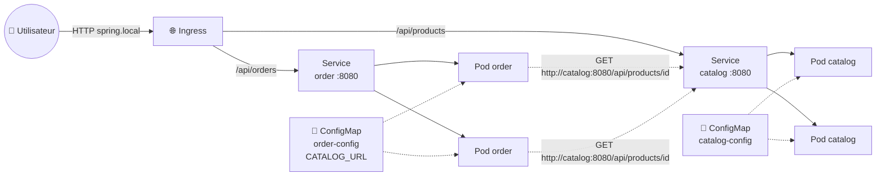
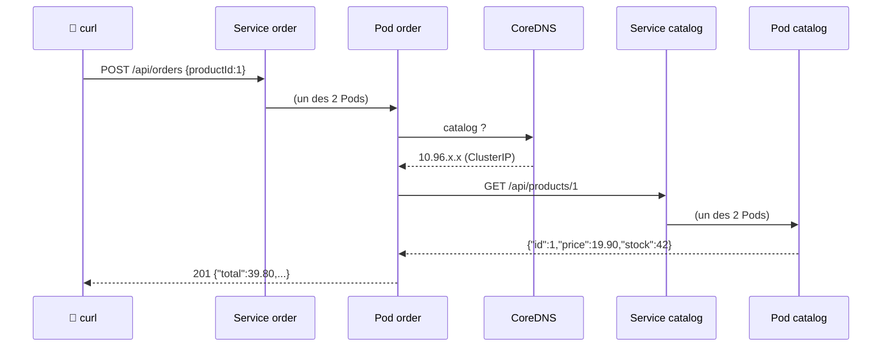
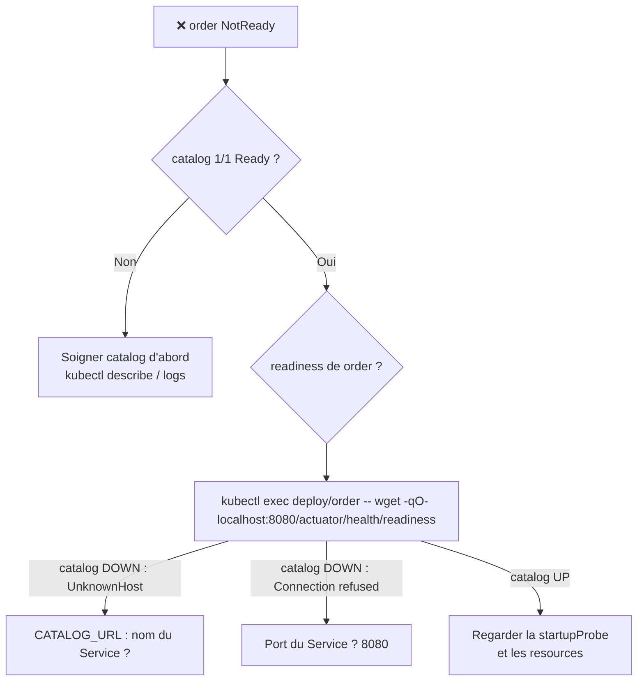

<div align="center">

# ☕ 105bis — Développer et déployer sa propre application Spring Boot

### *Deux microservices Java qui se parlent, du `mvn package` au cluster Kubernetes*


</div>

---

## 📋 Sommaire

- [🎯 Objectifs](#-objectifs)
- [🏗️ Architecture cible](#️-architecture-cible)
- [📁 Le code fourni](#-le-code-fourni)
- [1️⃣ `catalog-service` : exposer une API](#1️⃣-catalog-service--exposer-une-api)
- [2️⃣ `order-service` : appeler une API](#2️⃣-order-service--appeler-une-api)
- [3️⃣ Tester en local, sans Kubernetes](#3️⃣-tester-en-local-sans-kubernetes)
- [4️⃣ Conteneuriser avec un Dockerfile multi-stage](#4️⃣-conteneuriser-avec-un-dockerfile-multi-stage)
- [5️⃣ Déployer sur Minikube](#5️⃣-déployer-sur-minikube)
- [6️⃣ Exposer avec un Ingress](#6️⃣-exposer-avec-un-ingress)
- [7️⃣ Casser pour comprendre](#7️⃣-casser-pour-comprendre)
- [🧪 Exercices](#-exercices)
- [🩺 Dépannage](#-dépannage)
- [🧹 Nettoyage](#-nettoyage)
- [✅ Checklist](#-checklist)

---

## 🎯 Objectifs

> [!NOTE]
> Jusqu'ici vous avez déployé des images **toutes faites**. Dans ce module, c'est **votre** code qui tourne dans le cluster.
> À la fin, vous saurez :

- ✅ Écrire un service Spring Boot qui **expose** une API REST
- ✅ Écrire un second service qui **appelle** le premier avec `RestClient`
- ✅ Rendre l'URL du service appelé **configurable** (variable d'environnement → ConfigMap)
- ✅ Brancher les probes Kubernetes sur **Spring Boot Actuator** (`/actuator/health/liveness` et `/readiness`)
- ✅ Builder une image **multi-stage**, non-root, directement dans Minikube
- ✅ Déployer, exposer via un Ingress, puis **observer** comment Kubernetes réagit quand un service tombe

### Prérequis

| Outil | Pourquoi | Vérifier |
|-------|----------|----------|
| **Java 21+** | Compiler et lancer en local | `java -version` |
| **Maven** *(optionnel)* | Le wrapper `./mvnw` le télécharge tout seul | `./mvnw -v` |
| **Minikube + kubectl** | Le cluster (module 101) | `minikube status` |
| **Addon ingress** | Section 6 (module 103) | `minikube addons list \| grep ingress` |

> [!TIP]
> Pas de Java sur votre machine ? Sautez la section 3 : le `Dockerfile` compile le code **à l'intérieur** de l'image, vous n'avez besoin que de Docker.

---

## 🏗️ Architecture cible



| Service | Rôle | Endpoints | Appelle |
|---------|------|-----------|---------|
| ☕ `catalog-service` | **Expose** un catalogue de produits (en mémoire) | `GET /api/products`, `GET /api/products/{id}`, `GET /api/products/whoami` | personne |
| 🛒 `order-service` | **Appelle** le catalogue pour valider une commande | `POST /api/orders`, `GET /api/orders` | `catalog-service` |

> [!IMPORTANT]
> Le point clé du module : `order-service` ne connaît **pas** l'IP des Pods `catalog`. Il appelle `http://catalog:8080`, le **nom du Service**, résolu par le DNS interne (module 103).

---

## 📁 Le code fourni

Tout est dans [`105bis-spring-boot/`](105bis-spring-boot/) :

```
105bis-spring-boot/
├── catalog-service/                      # projet Maven standard (type Spring Initializr)
│   ├── .mvn/wrapper/maven-wrapper.properties
│   ├── mvnw / mvnw.cmd                   # Maven wrapper : pas besoin d'installer Maven
│   ├── .gitignore                        # target/, fichiers IDE…
│   ├── .dockerignore
│   ├── Dockerfile
│   ├── pom.xml
│   └── src/
│       ├── main/java/fr/k8s101/catalog/
│       │   ├── CatalogApplication.java
│       │   ├── Product.java
│       │   └── ProductController.java    # expose l'API
│       ├── main/resources/application.yaml
│       └── test/java/fr/k8s101/catalog/ProductControllerTest.java
├── order-service/                        # même structure
│   ├── .mvn/wrapper/maven-wrapper.properties
│   ├── mvnw / mvnw.cmd
│   ├── .gitignore
│   ├── .dockerignore
│   ├── Dockerfile
│   ├── pom.xml
│   └── src/
│       ├── main/java/fr/k8s101/order/
│       │   ├── OrderApplication.java
│       │   ├── CatalogClient.java        # appelle catalog-service
│       │   ├── CatalogHealthIndicator.java   # readiness liée au catalogue
│       │   ├── Order.java                # entité JPA (table orders)
│       │   ├── OrderRepository.java      # Spring Data : H2 en mémoire par défaut, PostgreSQL au 112
│       │   └── OrderController.java
│       ├── main/resources/application.yaml
│       └── test/java/fr/k8s101/order/OrderControllerTest.java
├── docker-compose.yaml                   # les 2 services ensemble, sans Kubernetes (section 4)
└── k8s/
    ├── 00-namespace.yaml
    ├── 10-config.yaml                    # 2 ConfigMaps
    ├── 20-catalog.yaml                   # Deployment + Service
    ├── 30-order.yaml                     # Deployment + Service
    └── 40-ingress.yaml
```

```bash
cd day1/105bis-spring-boot
```

---

## 1️⃣ `catalog-service` : exposer une API

### Le contrôleur

Un `@RestController` suffit pour exposer du JSON. Rien de spécifique à Kubernetes ici.

<details open>
<summary>📄 <code>ProductController.java</code> (extrait)</summary>

```java
@RestController
@RequestMapping("/api/products")
public class ProductController {

    private static final List<Product> PRODUCTS = List.of(
            new Product(1, "Casquette Kubernetes", new BigDecimal("19.90"), 42),
            new Product(2, "Mug Helm", new BigDecimal("12.50"), 7),
            new Product(3, "Sticker kubectl", new BigDecimal("1.00"), 1000),
            new Product(4, "T-shirt YAML", new BigDecimal("24.00"), 0));

    @GetMapping
    public List<Product> all() { return PRODUCTS; }

    @GetMapping("/{id}")
    public Product byId(@PathVariable long id) {
        return PRODUCTS.stream().filter(p -> p.id() == id).findFirst()
                .orElseThrow(() -> new ResponseStatusException(HttpStatus.NOT_FOUND, "Produit " + id + " introuvable"));
    }

    // Utile pour voir quel Pod a répondu lorsqu'on scale le Deployment
    @GetMapping("/whoami")
    public Map<String, String> whoami() {
        return Map.of("hostname", hostname(), "environment", environment);
    }
}
```
</details>

### Actuator : les probes « gratuites »

La dépendance `spring-boot-starter-actuator` plus trois lignes de configuration donnent exactement ce que Kubernetes attend :

<details open>
<summary>📄 <code>application.yaml</code></summary>

```yaml
server:
  port: 8080
  shutdown: graceful          # laisse finir les requêtes en cours lors d'un rolling update

catalog:
  environment: local          # surchargé par CATALOG_ENVIRONMENT dans la ConfigMap

management:
  endpoint:
    health:
      probes:
        enabled: true         # active /actuator/health/liveness et /readiness
```
</details>

| Endpoint | Répond `UP` quand… | Probe K8s |
|----------|--------------------|-----------|
| `/actuator/health/liveness` | la JVM et le contexte Spring sont vivants | `livenessProbe` + `startupProbe` |
| `/actuator/health/readiness` | l'application est prête à recevoir du trafic | `readinessProbe` |

> [!TIP]
> **Relaxed binding** : Spring Boot lit la variable d'environnement `CATALOG_ENVIRONMENT` comme la propriété `catalog.environment`. C'est ce qui permet de surcharger **n'importe quelle** propriété depuis une ConfigMap sans toucher au code.

---

## 2️⃣ `order-service` : appeler une API

### Le client HTTP

`RestClient` (Spring 6.1+) est le client synchrone moderne. L'URL de base est **injectée** depuis la propriété `catalog.url`.

<details open>
<summary>📄 <code>CatalogClient.java</code></summary>

```java
@Component
public class CatalogClient {

    public record Product(long id, String name, BigDecimal price, int stock) {}

    private final RestClient restClient;

    public CatalogClient(RestClient.Builder builder, @Value("${catalog.url}") String catalogUrl) {
        this.restClient = builder.baseUrl(catalogUrl).build();
    }

    public Optional<Product> findProduct(long id) {
        try {
            return Optional.ofNullable(restClient.get()
                    .uri("/api/products/{id}", id)
                    .retrieve()
                    .body(Product.class));
        } catch (HttpClientErrorException e) {
            if (e.getStatusCode() == HttpStatus.NOT_FOUND) return Optional.empty();
            throw e;
        }
    }

    /** Appelle le endpoint liveness du catalogue ; lève une exception si injoignable. */
    public void ping() {
        restClient.get().uri("/actuator/health/liveness").retrieve().toBodilessEntity();
    }
}
```
</details>

```yaml
# application.yaml
catalog:
  url: http://localhost:8080   # en local ; dans K8s → CATALOG_URL=http://catalog:8080
```

### Le contrôleur : valider puis enregistrer

<details>
<summary>📄 <code>OrderController.java</code> (extrait)</summary>

```java
@PostMapping
@ResponseStatus(HttpStatus.CREATED)
public Order create(@RequestBody OrderRequest request) {
    CatalogClient.Product product;
    try {
        product = catalogClient.findProduct(request.productId())
                .orElseThrow(() -> new ResponseStatusException(HttpStatus.UNPROCESSABLE_ENTITY,
                        "Produit " + request.productId() + " inconnu du catalogue"));
    } catch (ResourceAccessException e) {
        // Le catalogue ne répond pas (DNS, connexion refusée, timeout…)
        throw new ResponseStatusException(HttpStatus.SERVICE_UNAVAILABLE, "Catalogue injoignable : " + e.getMessage());
    }

    if (product.stock() < request.quantity()) {
        throw new ResponseStatusException(HttpStatus.CONFLICT, "Stock insuffisant pour " + product.name());
    }

    BigDecimal total = product.price().multiply(BigDecimal.valueOf(request.quantity()));
    placed.increment();         // compteur Micrometer orders_placed_total{outcome="success"} (module 109)
    return repository.save(new Order(product.id(), product.name(), request.quantity(), total, Instant.now()));
}
```
</details>

> [!NOTE]
> `OrderRepository` est un `JpaRepository` branché sur une base **H2 en mémoire** (`jdbc:h2:mem:orders`) : simple pour ce module, mais **chaque Pod a sa propre base** et tout disparaît au redémarrage — vous le constaterez à l'exercice 3. Au [module 112](112-storage.md) il suffira de fournir `SPRING_DATASOURCE_URL` pour passer sur PostgreSQL, sans toucher au code.

### Readiness « intelligente » : un `HealthIndicator`

Un `order-service` dont le catalogue est injoignable n'a aucun intérêt à recevoir du trafic. On le dit à Kubernetes **via la readiness**, sans le redémarrer (la liveness, elle, reste `UP`).

<details open>
<summary>📄 <code>CatalogHealthIndicator.java</code></summary>

```java
@Component("catalog")
public class CatalogHealthIndicator implements HealthIndicator {

    private final CatalogClient catalogClient;

    @Override
    public Health health() {
        try {
            catalogClient.ping();
            return Health.up().build();
        } catch (Exception e) {
            return Health.down().withDetail("error", e.getMessage()).build();
        }
    }
}
```
</details>

```yaml
# application.yaml — on ajoute l'indicateur au groupe readiness
management:
  endpoint:
    health:
      group:
        readiness:
          include: readinessState,catalog
```

> [!WARNING]
> **Ne mettez jamais une dépendance externe dans la liveness.** Si le catalogue tombe, Kubernetes redémarrerait tous les Pods `order` en boucle (`CrashLoopBackOff`) alors qu'ils n'ont rien. Dépendance externe ⇒ **readiness** uniquement.

---

## 3️⃣ Tester en local, sans Kubernetes

```bash
# Terminal 1 — le catalogue sur :8080
cd catalog-service && ./mvnw -q package && java -jar target/catalog-service-1.0.0.jar

# Terminal 2 — les commandes sur :8082 (le 8080 est pris)
cd order-service && ./mvnw -q package && SERVER_PORT=8082 java -jar target/order-service-1.0.0.jar
```

```bash
# Terminal 3
curl -s localhost:8080/api/products | jq
curl -s localhost:8080/api/products/whoami
# {"hostname":"mon-mac","environment":"local"}

curl -s -X POST localhost:8082/api/orders \
  -H 'Content-Type: application/json' \
  -d '{"productId":2,"quantity":3}' | jq
# {"id":1,"productId":2,"productName":"Mug Helm","quantity":3,"total":37.50,...}

curl -s localhost:8082/actuator/health/readiness | jq
# {"status":"UP","components":{"catalog":{"status":"UP"},"readinessState":{"status":"UP"}}}
```

🔥 **Coupez le terminal 1** (`Ctrl+C`), puis :

```bash
curl -s localhost:8082/actuator/health/readiness | jq .status     # "DOWN"
curl -s -o /dev/null -w '%{http_code}\n' -X POST localhost:8082/api/orders \
  -H 'Content-Type: application/json' -d '{"productId":2,"quantity":3}'   # 503
```

> [!NOTE]
> Retenez ce comportement : c'est exactement ce que vous observerez dans Kubernetes en section 7, sauf que là, **c'est le cluster qui agira** en retirant le Pod du Service.

---

## 4️⃣ Conteneuriser avec un Dockerfile multi-stage

Le même `Dockerfile` sert aux deux services :

<details open>
<summary>📄 <code>Dockerfile</code></summary>

```dockerfile
# ── Étape 1 : build ─────────────────────────────────────────────────────────
FROM maven:3.9-eclipse-temurin-21 AS build
WORKDIR /app

# On copie d'abord le pom seul pour mettre les dépendances en cache
COPY pom.xml .
RUN mvn -q -B dependency:go-offline

COPY src ./src
RUN mvn -q -B package -DskipTests

# ── Étape 2 : image finale (JRE seulement, non-root) ────────────────────────
FROM eclipse-temurin:21-jre-alpine
WORKDIR /app

RUN addgroup -S spring && adduser -S spring -G spring
USER spring

COPY --from=build /app/target/*.jar app.jar

EXPOSE 8080
ENTRYPOINT ["java", "-XX:MaxRAMPercentage=75", "-jar", "app.jar"]
```
</details>

| Choix | Pourquoi |
|-------|----------|
| **Deux étapes** | L'image finale ne contient ni Maven ni le JDK : ~200 Mo au lieu de ~700 Mo |
| `COPY pom.xml` avant `COPY src` | Les dépendances ne sont re-téléchargées que si le `pom.xml` change |
| `USER spring` | Ne jamais tourner en root dans un conteneur (module 110) |
| `-XX:MaxRAMPercentage=75` | La JVM dimensionne son heap d'après la **limite mémoire du conteneur**, pas la RAM du nœud |

### Première exécution conteneurisée : Docker Compose

Avant Kubernetes, vérifions que les **images** fonctionnent, avec le `docker-compose.yaml` fourni :

<details open>
<summary>📄 <code>docker-compose.yaml</code></summary>

```yaml
services:
  catalog:
    build: ./catalog-service
    image: catalog-service:1.0.0
    ports: ["8080:8080"]
    environment:
      CATALOG_ENVIRONMENT: compose
    healthcheck:
      test: ["CMD", "wget", "-qO-", "http://localhost:8080/actuator/health/liveness"]
      interval: 5s
      retries: 20

  order:
    build: ./order-service
    image: order-service:1.0.0
    ports: ["8082:8080"]
    environment:
      CATALOG_URL: http://catalog:8080     # le nom du service Compose fait office de DNS
    depends_on:
      catalog:
        condition: service_healthy
```
</details>

```bash
docker compose up -d --build          # ~2 min la première fois (téléchargement des dépendances Maven)
docker compose ps                     # catalog (healthy), order
curl -s localhost:8080/api/products/whoami
# {"hostname":"322794f8f4bf","environment":"compose"}   ← la variable d'env a bien surchargé application.yaml
curl -s -X POST localhost:8082/api/orders -H 'Content-Type: application/json' -d '{"productId":2,"quantity":3}'
docker compose down
```

> [!NOTE]
> Vous venez de faire **à la main** ce que Kubernetes fera pour vous : nommer les services (DNS), injecter la config (variables d'env), attendre qu'un service soit prêt (`healthcheck` ≈ readinessProbe). La suite du module, c'est le même schéma… en plus robuste.

### Builder directement dans Minikube

Pas de registre à gérer : on construit les images **dans** le Docker de Minikube.

```bash
# Option A — pointer votre Docker sur celui de Minikube (pour ce terminal)
eval $(minikube docker-env)
docker build -t catalog-service:1.0.0 ./catalog-service
docker build -t order-service:1.0.0   ./order-service

# Option B — sans toucher à votre env
minikube image build -t catalog-service:1.0.0 ./catalog-service
minikube image build -t order-service:1.0.0   ./order-service

# Option C — réutiliser les images déjà buildées par Docker Compose
minikube image load catalog-service:1.0.0
minikube image load order-service:1.0.0

# Vérifier
minikube image ls | grep -E 'catalog|order'
```

> [!IMPORTANT]
> Les manifests utilisent `imagePullPolicy: IfNotPresent`. Sans ça, Kubernetes essaierait de **tirer** `catalog-service:1.0.0` depuis Docker Hub → `ErrImagePull`.

---

## 5️⃣ Déployer sur Minikube

### La configuration

<details open>
<summary>📄 <code>k8s/10-config.yaml</code></summary>

```yaml
apiVersion: v1
kind: ConfigMap
metadata:
  name: catalog-config
  namespace: spring-demo
data:
  CATALOG_ENVIRONMENT: kubernetes
---
apiVersion: v1
kind: ConfigMap
metadata:
  name: order-config
  namespace: spring-demo
data:
  # DNS interne : <service>.<namespace>.svc.cluster.local, ou simplement <service> dans le même namespace
  CATALOG_URL: http://catalog:8080
```
</details>

### Le Deployment du catalogue

<details open>
<summary>📄 <code>k8s/20-catalog.yaml</code> (extrait)</summary>

```yaml
      containers:
        - name: catalog
          image: catalog-service:1.0.0
          imagePullPolicy: IfNotPresent
          ports:
            - name: http
              containerPort: 8080
          envFrom:
            - configMapRef:
                name: catalog-config
          resources:
            requests: { cpu: 250m, memory: 256Mi }
            limits:   { memory: 512Mi }
          startupProbe:                      # Spring Boot peut mettre 10 à 40 s à démarrer
            httpGet: { path: /actuator/health/liveness, port: http }
            periodSeconds: 2
            failureThreshold: 30             # jusqu'à 60 s de grâce
          livenessProbe:
            httpGet: { path: /actuator/health/liveness, port: http }
            periodSeconds: 10
          readinessProbe:
            httpGet: { path: /actuator/health/readiness, port: http }
            periodSeconds: 5
---
apiVersion: v1
kind: Service
metadata:
  name: catalog                              # => http://catalog:8080
spec:
  selector: { app: catalog }
  ports:
    - { name: http, port: 8080, targetPort: http }
```
</details>

> [!TIP]
> **Pourquoi une `startupProbe` ?** Sans elle, il faudrait un `initialDelaySeconds` sur la liveness, trop court → redémarrages en boucle, trop long → détection lente. La startupProbe désactive la liveness **tant que l'appli n'a pas démarré**, puis la liveness prend le relais.

### Appliquer

```bash
kubectl apply -f k8s/
kubectl config set-context --current --namespace=spring-demo
kubectl get pods -w
```

```
NAME                       READY   STATUS    RESTARTS   AGE
catalog-7d9f6c8b5-4xk2p    1/1     Running   0          45s
catalog-7d9f6c8b5-m9qzt    1/1     Running   0          45s
order-6c8d7f9b4-2hl8n      1/1     Running   0          45s
order-6c8d7f9b4-w7r3v      1/1     Running   0          45s
```

> [!NOTE]
> Observez le `READY 0/1` pendant 15–30 s au début : c'est la startupProbe qui attend la JVM. Rien d'anormal.

### Vérifier l'appel inter-services

```bash
# Depuis un Pod order, résoudre et appeler le catalogue par son nom de Service
kubectl exec deploy/order -- wget -qO- http://catalog:8080/api/products/whoami
# {"hostname":"catalog-7d9f6c8b5-4xk2p","environment":"kubernetes"}   ← le Pod, et la ConfigMap !

# La readiness de order voit bien le catalogue
kubectl exec deploy/order -- wget -qO- http://localhost:8080/actuator/health/readiness
```

```bash
# Passer une commande, via un port-forward temporaire
kubectl port-forward svc/order 8082:8080 &
curl -s -X POST localhost:8082/api/orders -H 'Content-Type: application/json' \
  -d '{"productId":1,"quantity":2}' | jq
kill %1
```



---

## 6️⃣ Exposer avec un Ingress

```bash
minikube addons enable ingress
echo "$(minikube ip) spring.local" | sudo tee -a /etc/hosts
```

<details open>
<summary>📄 <code>k8s/40-ingress.yaml</code></summary>

```yaml
apiVersion: networking.k8s.io/v1
kind: Ingress
metadata:
  name: spring-demo
  namespace: spring-demo
spec:
  ingressClassName: nginx
  rules:
    - host: spring.local
      http:
        paths:
          # Pas de rewrite : les deux services servent déjà leurs routes sous /api/...
          - path: /api/products
            pathType: Prefix
            backend:
              service: { name: catalog, port: { name: http } }
          - path: /api/orders
            pathType: Prefix
            backend:
              service: { name: order, port: { name: http } }
```
</details>

```bash
curl -s http://spring.local/api/products | jq '.[].name'
curl -s -X POST http://spring.local/api/orders -H 'Content-Type: application/json' \
  -d '{"productId":3,"quantity":10}' | jq

# Le load-balancing du Service, visible à l'œil nu
for i in $(seq 1 6); do curl -s http://spring.local/api/products/whoami | jq -r .hostname; done
```

> [!TIP]
> Sur **macOS avec le driver docker**, `minikube ip` n'est pas joignable directement. Lancez `minikube tunnel` dans un terminal dédié et utilisez `127.0.0.1 spring.local` dans `/etc/hosts`.

---

## 7️⃣ Casser pour comprendre

### 💥 Le catalogue disparaît

```bash
kubectl scale deploy/catalog --replicas=0
sleep 10
kubectl get pods
```

```
NAME                      READY   STATUS    RESTARTS   AGE
order-6c8d7f9b4-2hl8n     0/1     Running   0          8m     ← NotReady, mais PAS redémarré
order-6c8d7f9b4-w7r3v     0/1     Running   0          8m
```

```bash
kubectl get endpoints order            # <none> : plus aucun Pod derrière le Service
curl -si http://spring.local/api/orders | head -1     # HTTP/1.1 503 Service Temporarily Unavailable (par l'Ingress)
kubectl describe pod -l app=order | grep -A3 Readiness
#   Readiness probe failed: HTTP probe failed with statuscode: 503
```

**Ce qui s'est passé :**
1. Le `CatalogHealthIndicator` ne joint plus `http://catalog:8080` → readiness `DOWN`
2. Kubernetes retire les Pods `order` des **endpoints** du Service
3. L'Ingress n'a plus de backend → `503` **propre**, au lieu d'erreurs applicatives aléatoires
4. La liveness est toujours `UP` → `RESTARTS` reste à `0`

### 🔧 Le catalogue revient

```bash
kubectl scale deploy/catalog --replicas=2
kubectl get pods -w        # order repasse 1/1 tout seul, dès que le catalogue est prêt
```

> [!NOTE]
> Aucune intervention sur `order`. C'est **la réconciliation** : vous décrivez l'état voulu, Kubernetes et vos probes font le reste.

---

## 🧪 Exercices

<details>
<summary>🟢 <b>Exercice 1 — Changer la config sans rebuild</b></summary>

Modifiez `CATALOG_ENVIRONMENT` en `production` dans `10-config.yaml`, puis :

```bash
kubectl apply -f k8s/10-config.yaml
curl -s http://spring.local/api/products/whoami      # toujours "kubernetes" — pourquoi ?
kubectl rollout restart deploy/catalog
curl -s http://spring.local/api/products/whoami      # "production"
```

Les variables d'environnement sont lues **au démarrage** du processus. Un `envFrom` n'est pas rechargé à chaud (module 104).
</details>

<details>
<summary>🟡 <b>Exercice 2 — Casser le DNS</b></summary>

Dans `order-config`, remplacez `CATALOG_URL` par `http://catalogue:8080` (avec un « ue »), appliquez, redémarrez `order`.

1. Quel est l'état des Pods `order` ? (`kubectl get pods`)
2. Trouvez le message d'erreur exact : `kubectl exec deploy/order -- wget -qO- localhost:8080/actuator/health/readiness`
3. Corrigez **sans toucher au code**.
</details>

<details>
<summary>🟠 <b>Exercice 3 — Où sont passées mes commandes ?</b></summary>

```bash
for i in 1 2 3 4; do curl -s -X POST http://spring.local/api/orders \
  -H 'Content-Type: application/json' -d '{"productId":3,"quantity":1}' >/dev/null; done
curl -s http://spring.local/api/orders | jq length    # relancez plusieurs fois…
```

Le nombre change d'un appel à l'autre ! Expliquez pourquoi en relisant `application.yaml` (`jdbc:h2:mem:orders`), puis `kubectl delete pod -l app=order`. Combien de commandes reste-t-il ?

> 💡 Ce problème est **la** raison d'être des bases de données et du module 112 (stockage). Un Pod est jetable : son état doit vivre ailleurs.
</details>

<details>
<summary>🟠 <b>Exercice 4 — Rolling update de votre code</b></summary>

1. Ajoutez un produit dans `ProductController.PRODUCTS`.
2. Buildez `catalog-service:1.1.0` (section 4).
3. `kubectl set image deploy/catalog catalog=catalog-service:1.1.0` puis `kubectl rollout status deploy/catalog`.
4. Pendant le rollout, bouclez sur `curl http://spring.local/api/products | jq length` : voyez-vous une seule erreur ? Pourquoi (`readinessProbe` + `shutdown: graceful`) ?
5. `kubectl rollout undo deploy/catalog`.
</details>

<details>
<summary>🔴 <b>Exercice 5 — La mauvaise idée</b></summary>

Déplacez `catalog` du groupe `readiness` vers le groupe `liveness` dans `application.yaml` de `order-service` :

```yaml
      group:
        liveness:
          include: livenessState,catalog
```

Rebuildez en `order-service:1.0.1`, déployez, puis `kubectl scale deploy/catalog --replicas=0`. Observez `RESTARTS` pendant 2 minutes. Concluez, puis **remettez la configuration d'origine**.
</details>

---

## 🩺 Dépannage

| Symptôme | Cause probable | Commande de diagnostic |
|----------|----------------|------------------------|
| `ErrImagePull` / `ImagePullBackOff` | Image buildée hors de Minikube, ou `imagePullPolicy: Always` | `minikube image ls \| grep catalog` |
| `0/1 Ready` qui dure > 60 s puis `RESTARTS` qui grimpe | JVM trop lente (CPU) : startupProbe dépassée | `kubectl describe pod …` → augmenter `failureThreshold` |
| `OOMKilled` | `limits.memory` trop bas pour la JVM | `kubectl get pod -o jsonpath='{..lastState}'` → monter à `768Mi` |
| `order` `0/1 Ready`, `catalog` `1/1` | `CATALOG_URL` erronée (nom, port, namespace) | `kubectl exec deploy/order -- wget -qO- localhost:8080/actuator/health/readiness` |
| `503` sur `/api/orders` via l'Ingress | Aucun endpoint `order` prêt | `kubectl get endpoints order` |
| `404` via l'Ingress, `200` en port-forward | `path` ou `host` incorrect dans l'Ingress | `kubectl describe ingress spring-demo` |
| `curl: Could not resolve host: spring.local` | `/etc/hosts` non mis à jour (ou `minikube tunnel` absent sur mac) | `cat /etc/hosts \| grep spring` |



---

## 🧹 Nettoyage

```bash
kubectl delete namespace spring-demo
kubectl config set-context --current --namespace=default
minikube image rm catalog-service:1.0.0 order-service:1.0.0
sudo sed -i '' '/spring.local/d' /etc/hosts        # macOS ; sans '' sur Linux
```

---

## ✅ Checklist

- [ ] `catalog-service` expose `/api/products` et répond en local
- [ ] `order-service` appelle le catalogue via une URL **configurable**
- [ ] Les probes K8s pointent sur `/actuator/health/liveness` et `/readiness`
- [ ] La readiness de `order` reflète l'état du catalogue, **pas** la liveness
- [ ] Images buildées en multi-stage, non-root, testées avec `docker compose` puis chargées dans Minikube
- [ ] `CATALOG_URL=http://catalog:8080` fourni par ConfigMap
- [ ] Appel inter-services vérifié avec `kubectl exec … wget`
- [ ] Ingress `spring.local` routant `/api/products` et `/api/orders`
- [ ] Scénario « catalogue à 0 réplica » observé : `0/1 Ready`, `RESTARTS 0`, `503` propre

---

## ☕ Et ensuite ? Le fil rouge 106 → 112

Ces deux services vous suivent jusqu'à la fin du parcours. Le dossier [`112bis-spring-boot-advanced/`](112bis-spring-boot-advanced/) contient, module par module, les fichiers pour les **packager en chart Helm (106)**, les **déployer avec Terraform (107)**, les **tester/builder en CI (108)**, les **observer avec Prometheus/Grafana (109)**, les **durcir (110)**, les **autoscaler (111)** et leur donner une **vraie base PostgreSQL (112)** — plus un script qui déploie et teste tout :

```bash
cd day1/112bis-spring-boot-advanced
./deploy.sh build          # images dans Minikube
./deploy.sh 106            # déploie + teste le module 106 ; idem 107 … 112
./deploy.sh all            # tout enchaîner (≈ 20 min) ; ./deploy.sh all clean pour tout retirer
```

Chaque TD 106 → 112 se termine par une section **☕ Fil rouge Spring Boot** qui vous dit quoi lancer et quoi observer.

---

<div align="center">

**[⬅️ 105](./105-full-appli.md)** · **[🏠 Sommaire](../README.md)** · **[➡️ 106](./106-helm-beginner.md)**

<sub>☕ Votre code tourne dans Kubernetes. La prochaine étape : arrêter de copier-coller ce YAML avec Helm.</sub>

</div>
