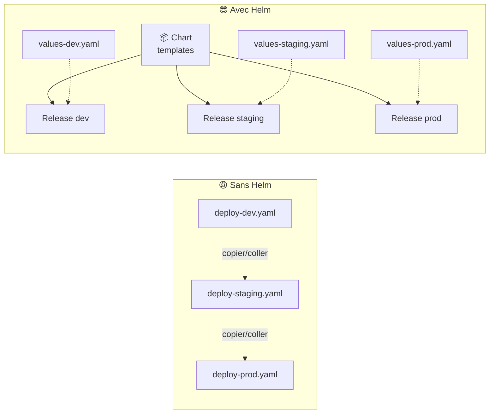
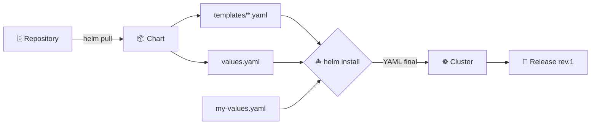
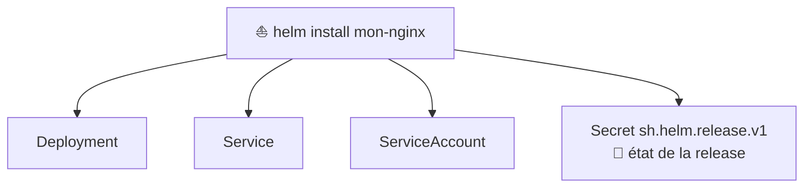
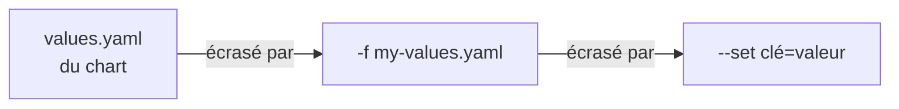

<div align="center">

# ⛵ 106 — Helm pour les nuls

### *Le gestionnaire de paquets de Kubernetes, expliqué simplement*


</div>

---

## 📋 Sommaire

- [🎯 Objectifs](#-objectifs)
- [🤔 Pourquoi Helm ?](#-pourquoi-helm-)
- [📖 Vocabulaire](#-vocabulaire)
- [1️⃣ Installation](#1️⃣-installation)
- [2️⃣ Utiliser un chart existant](#2️⃣-utiliser-un-chart-existant)
- [3️⃣ Personnaliser avec les values](#3️⃣-personnaliser-avec-les-values)
- [4️⃣ Upgrade & rollback](#4️⃣-upgrade--rollback)
- [5️⃣ Créer son premier chart](#5️⃣-créer-son-premier-chart)
- [6️⃣ Templating : les bases](#6️⃣-templating--les-bases)
- [7️⃣ Transformer l'appli 105 en chart](#7️⃣-transformer-lappli-105-en-chart)
- [🧪 Exercices](#-exercices)
- [🩺 Dépannage](#-dépannage)
- [📝 Mémo](#-mémo)
- [✅ Checklist](#-checklist)
- [☕ Fil rouge Spring Boot](#-fil-rouge-spring-boot)

---

## 🎯 Objectifs

> [!NOTE]
> À la fin de ce module, vous saurez :

- ✅ Expliquer ce qu'est Helm et pourquoi on l'utilise
- ✅ Installer Helm et ajouter des dépôts de charts
- ✅ Installer, mettre à jour et supprimer une **release**
- ✅ Personnaliser une installation avec un fichier `values.yaml`
- ✅ Revenir en arrière avec `helm rollback`
- ✅ Créer un chart simple et comprendre son arborescence
- ✅ Lire et écrire un template de base

---

## 🤔 Pourquoi Helm ?

Dans le module 105, nous avons écrit **6 fichiers YAML** à la main. Imaginez maintenant :

- 🔁 déployer la même appli en `dev`, `staging` et `prod` avec des valeurs différentes ;
- 📦 installer PostgreSQL, Redis ou Grafana **sans écrire une ligne de YAML** ;
- ⏪ revenir à la version précédente en **une commande**.



> [!IMPORTANT]
> **Helm est à Kubernetes ce que `apt`, `brew` ou `npm` sont à votre système.**
> Un *chart* est un paquet, une *release* est une installation de ce paquet.

---

## 📖 Vocabulaire

| Terme | Analogie | Définition |
|-------|----------|------------|
| 📦 **Chart** | Le paquet `.deb` / le package npm | Un ensemble de templates YAML + valeurs par défaut |
| 🗄️ **Repository** | Le dépôt apt / npmjs.com | Un serveur qui héberge des charts |
| 🚀 **Release** | Le logiciel installé | Une instance d'un chart déployée dans un cluster |
| ⚙️ **Values** | Le fichier de config | Les paramètres qui personnalisent le chart |
| 🔢 **Revision** | L'historique Git | Chaque `install`/`upgrade` crée une nouvelle révision |



---

## 1️⃣ Installation

```bash
# macOS
brew install helm

# Linux
curl https://raw.githubusercontent.com/helm/helm/main/scripts/get-helm-3 | bash

# Vérifier
helm version
```

```
version.BuildInfo{Version:"v3.x.x", ...}
```

> [!TIP]
> Helm v3 n'a **aucun composant côté serveur** (adieu Tiller). Il utilise simplement votre `kubeconfig`, comme `kubectl`.

---

## 2️⃣ Utiliser un chart existant

### 2.1 Ajouter un dépôt

```bash
helm repo add bitnami https://charts.bitnami.com/bitnami
helm repo update
helm repo list
```

### 2.2 Chercher un chart

```bash
helm search repo nginx
helm search hub grafana     # recherche sur artifacthub.io
```

### 2.3 Inspecter avant d'installer

```bash
helm show chart bitnami/nginx       # métadonnées
helm show values bitnami/nginx      # toutes les options configurables
helm show readme bitnami/nginx      # documentation
```

### 2.4 Installer

```bash
kubectl create namespace helm-demo

helm install mon-nginx bitnami/nginx --namespace helm-demo
```

```
NAME: mon-nginx
LAST DEPLOYED: ...
NAMESPACE: helm-demo
STATUS: deployed
REVISION: 1
```

### 2.5 Observer ce que Helm a créé

```bash
helm list -n helm-demo
kubectl get all -n helm-demo
```

> [!NOTE]
> Toutes les ressources portent des labels `app.kubernetes.io/instance=mon-nginx` et `app.kubernetes.io/managed-by=Helm`. Helm sait ainsi ce qui lui appartient.



> [!TIP]
> **Q1. Où Helm stocke-t-il l'historique de la release ?**
> <details><summary>Réponse</summary>
>
> Dans un **Secret** du namespace, nommé `sh.helm.release.v1.<release>.v<revision>`.
> ```bash
> kubectl get secrets -n helm-demo | grep sh.helm
> ```
> </details>

---

## 3️⃣ Personnaliser avec les values

### 3.1 En ligne de commande (`--set`)

```bash
helm upgrade mon-nginx bitnami/nginx -n helm-demo \
  --set replicaCount=3 \
  --set service.type=NodePort
```

### 3.2 Avec un fichier (recommandé)

<details open>
<summary>📄 <code>my-values.yaml</code></summary>

```yaml
replicaCount: 2

service:
  type: NodePort

resources:
  requests:
    cpu: 50m
    memory: 64Mi
  limits:
    cpu: 200m
    memory: 128Mi
```
</details>

```bash
helm upgrade mon-nginx bitnami/nginx -n helm-demo -f my-values.yaml
```

### 3.3 Ordre de priorité



### 3.4 Voir les valeurs effectives

```bash
helm get values mon-nginx -n helm-demo          # ce que VOUS avez fourni
helm get values mon-nginx -n helm-demo --all    # tout, défauts inclus
helm get manifest mon-nginx -n helm-demo        # le YAML réellement appliqué
```

---

## 4️⃣ Upgrade & rollback

```bash
# Historique
helm history mon-nginx -n helm-demo
```

```
REVISION  STATUS      CHART         DESCRIPTION
1         superseded  nginx-x.y.z   Install complete
2         superseded  nginx-x.y.z   Upgrade complete
3         deployed    nginx-x.y.z   Upgrade complete
```

```bash
# ⏪ Revenir à la révision 1
helm rollback mon-nginx 1 -n helm-demo

# 🧹 Désinstaller
helm uninstall mon-nginx -n helm-demo
```

> [!WARNING]
> `helm uninstall` supprime **tout** ce que le chart a créé… sauf les **PVC** dans la plupart des charts (pour protéger vos données). Vérifiez avec `kubectl get pvc`.

> [!TIP]
> Testez toujours un upgrade à blanc avant :
> ```bash
> helm upgrade mon-nginx bitnami/nginx -n helm-demo -f my-values.yaml --dry-run
> ```

---

## 5️⃣ Créer son premier chart

```bash
helm create hello
tree hello
```

```
hello/
├── Chart.yaml            # 🪪 identité du chart (nom, version)
├── values.yaml           # ⚙️ valeurs par défaut
├── charts/               # 📦 dépendances (sous-charts)
├── templates/            # 📝 les YAML à templater
│   ├── _helpers.tpl      #    fonctions réutilisables
│   ├── deployment.yaml
│   ├── service.yaml
│   ├── ingress.yaml
│   ├── serviceaccount.yaml
│   ├── hpa.yaml
│   ├── NOTES.txt         #    message affiché après install
│   └── tests/
└── .helmignore
```

<details>
<summary>📄 <code>Chart.yaml</code></summary>

```yaml
apiVersion: v2
name: hello
description: Mon premier chart Helm
type: application
version: 0.1.0        # version du CHART
appVersion: "1.0.0"   # version de l'APPLICATION
```
</details>

### Tester sans déployer

```bash
helm lint hello                    # ✅ vérifie la syntaxe
helm template hello ./hello        # 👀 affiche le YAML généré
helm install hello ./hello --dry-run --debug
```

### Installer son chart

```bash
helm install hello ./hello -n helm-demo
helm test hello -n helm-demo       # lance templates/tests/
```

---

## 6️⃣ Templating : les bases

Les templates utilisent la syntaxe **Go template** entre `{{ }}`.

### 6.1 Injecter une valeur

```yaml
# values.yaml
replicaCount: 2
image:
  repository: nginx
  tag: "1.27"
```

```yaml
# templates/deployment.yaml
spec:
  replicas: {{ .Values.replicaCount }}
  template:
    spec:
      containers:
        - name: web
          image: "{{ .Values.image.repository }}:{{ .Values.image.tag }}"
```

### 6.2 Les objets disponibles

| Objet | Contient | Exemple |
|-------|----------|---------|
| `.Values` | Le contenu de `values.yaml` | `{{ .Values.replicaCount }}` |
| `.Release` | Infos sur la release | `{{ .Release.Name }}`, `{{ .Release.Namespace }}` |
| `.Chart` | Le contenu de `Chart.yaml` | `{{ .Chart.Name }}-{{ .Chart.Version }}` |
| `.Capabilities` | Ce que sait faire le cluster | `{{ .Capabilities.KubeVersion }}` |
| `.Files` | Les fichiers du chart (hors templates) | `{{ .Files.Get "config.ini" }}` |

### 6.3 Conditions et boucles

```yaml
# values.yaml
ingress:
  enabled: false
env:
  LOG_LEVEL: info
  TZ: Europe/Paris
```

```yaml
# templates/ingress.yaml — tout le fichier est ignoré si enabled = false
{{- if .Values.ingress.enabled }}
apiVersion: networking.k8s.io/v1
kind: Ingress
metadata:
  name: {{ .Release.Name }}-web
spec:
  # ...
{{- end }}
```

```yaml
# templates/deployment.yaml — une boucle sur une map
          env:
            {{- range $key, $value := .Values.env }}
            - name: {{ $key }}
              value: {{ $value | quote }}
            {{- end }}
```

> [!TIP]
> Le tiret dans `{{-` et `-}}` **avale les espaces et retours à la ligne** autour de l'expression. Sans lui, vous obtenez des lignes vides et parfois un YAML invalide. Vérifiez toujours avec `helm template`.

### 6.4 Les fonctions utiles

| Fonction | Effet | Exemple |
|----------|-------|---------|
| `quote` | Met entre guillemets | `{{ .Values.tag \| quote }}` → `"1.27"` |
| `default` | Valeur de repli | `{{ .Values.port \| default 80 }}` |
| `upper` / `lower` | Casse | `{{ .Values.env \| upper }}` |
| `toYaml` | Sérialise un bloc entier | `{{ toYaml .Values.resources \| nindent 12 }}` |
| `nindent N` | Saut de ligne + indentation de N espaces | indispensable avec `toYaml` |
| `include` | Appelle un template nommé | `{{ include "hello.labels" . }}` |
| `required` | Erreur si la valeur manque | `{{ required "image.tag obligatoire" .Values.image.tag }}` |

### 6.5 Les helpers (`_helpers.tpl`)

Les fichiers commençant par `_` ne produisent pas de manifeste : ils contiennent des **templates nommés** réutilisables.

```yaml
{{/* templates/_helpers.tpl */}}
{{- define "hello.labels" -}}
app.kubernetes.io/name: {{ .Chart.Name }}
app.kubernetes.io/instance: {{ .Release.Name }}
app.kubernetes.io/version: {{ .Chart.AppVersion | quote }}
app.kubernetes.io/managed-by: {{ .Release.Service }}
{{- end }}
```

```yaml
# templates/service.yaml
metadata:
  name: {{ .Release.Name }}-web
  labels:
    {{- include "hello.labels" . | nindent 4 }}
```

### 6.6 Déboguer un template

```bash
helm template hello ./hello                         # YAML généré, sans cluster
helm template hello ./hello --set ingress.enabled=true -s templates/ingress.yaml
helm install hello ./hello --dry-run --debug        # idem, mais validé par l'API server
helm lint ./hello --strict                          # warnings = erreurs
```

---

## 7️⃣ Transformer l'appli 105 en chart

Objectif : reprendre les 6 fichiers du module 105 (`demo-app` : postgres + backend + frontend + ingress) et en faire **un seul chart** paramétrable.

### 7.1 Créer le squelette

```bash
mkdir -p demo-app/templates && cd demo-app
cat > Chart.yaml <<'YAML'
apiVersion: v2
name: demo-app
description: Front + API + PostgreSQL (module 105)
type: application
version: 0.1.0
appVersion: "1.0.0"
YAML
```

### 7.2 Extraire ce qui change dans `values.yaml`

Relisez les manifestes du 105 et demandez-vous : *qu'est-ce qui diffère entre dev et prod ?* → les images, les réplicas, l'hôte d'Ingress, le mot de passe, la taille du volume.

```yaml
# values.yaml
backend:
  image: ghcr.io/your-org/demo-api
  tag: "1.0.0"
  replicas: 2
frontend:
  image: ghcr.io/your-org/demo-front
  tag: "1.0.0"
  replicas: 2
postgres:
  image: postgres:16-alpine
  database: demo
  user: demo
  password: change-me        # ⚠️ à surcharger avec --set ou un fichier non commité
  storage: 1Gi
ingress:
  enabled: true
  host: demo.local
```

### 7.3 Copier les manifestes et remplacer par des `{{ }}`

Prenez les fichiers YAML du 105 **tels quels** dans `templates/`, puis remplacez uniquement les valeurs identifiées :

```yaml
# templates/backend.yaml (extrait)
apiVersion: apps/v1
kind: Deployment
metadata:
  name: {{ .Release.Name }}-backend
  labels:
    {{- include "demo-app.labels" . | nindent 4 }}
    app.kubernetes.io/component: backend
spec:
  replicas: {{ .Values.backend.replicas }}
  selector:
    matchLabels:
      app.kubernetes.io/instance: {{ .Release.Name }}
      app.kubernetes.io/component: backend
  template:
    metadata:
      labels:
        app.kubernetes.io/instance: {{ .Release.Name }}
        app.kubernetes.io/component: backend
    spec:
      containers:
        - name: api
          image: "{{ .Values.backend.image }}:{{ .Values.backend.tag }}"
          envFrom:
            - configMapRef:
                name: {{ .Release.Name }}-config
            - secretRef:
                name: {{ .Release.Name }}-secret
```

```yaml
# templates/secret.yaml
apiVersion: v1
kind: Secret
metadata:
  name: {{ .Release.Name }}-secret
type: Opaque
stringData:
  POSTGRES_USER: {{ .Values.postgres.user | quote }}
  POSTGRES_PASSWORD: {{ required "postgres.password est obligatoire" .Values.postgres.password | quote }}
```

> [!IMPORTANT]
> Préfixez **tous** les noms de ressources par `{{ .Release.Name }}` : c'est ce qui permet d'installer deux fois le même chart dans un namespace (`demo-dev` et `demo-qa`) sans collision.

### 7.4 Installer, upgrader, revenir en arrière

```bash
helm lint ./demo-app
helm install demo ./demo-app -n demo-helm --create-namespace \
  --set postgres.password=S3cret
# NAME: demo … STATUS: deployed

helm upgrade demo ./demo-app -n demo-helm --reuse-values --set backend.replicas=3
helm history demo -n demo-helm
# REVISION  STATUS      DESCRIPTION
# 1         superseded  Install complete
# 2         deployed    Upgrade complete

helm rollback demo 1 -n demo-helm
kubectl -n demo-helm get deploy          # backend revient à 2 réplicas
```

### 7.5 Un fichier de values par environnement

```bash
cat > values-prod.yaml <<'YAML'
backend:  { replicas: 4 }
frontend: { replicas: 3 }
postgres: { storage: 20Gi }
ingress:  { host: demo.example.com }
YAML

helm upgrade --install demo ./demo-app -n demo-helm -f values-prod.yaml --set postgres.password=S3cret
```

---

## 🧪 Exercices

> [!NOTE]
> Faites les exercices dans l'ordre, chacun s'appuie sur le précédent.

### Exercice 1 — Chart public
Installez `bitnami/redis` en désactivant la réplication (`architecture=standalone`) et sans authentification. Retrouvez les valeurs utilisées avec `helm get values`.

### Exercice 2 — Rollback
Sur votre release `hello`, faites un upgrade avec une image qui n'existe pas (`image.tag=nope`). Observez `kubectl get pods`, puis revenez en arrière.

### Exercice 3 — Condition
Ajoutez un bloc `hpa.enabled` à votre chart `hello` : le fichier `templates/hpa.yaml` ne doit être généré que si la valeur est `true`.

### Exercice 4 — `required`
Rendez `image.tag` obligatoire dans `hello`. Vérifiez que `helm install` sans cette valeur échoue avec un message clair.

### Exercice 5 — Test
Écrivez un `templates/tests/test-connection.yaml` (pod `busybox` + `wget` sur le Service) et lancez `helm test hello`.

### Exercice 6 — Deux environnements
Installez `demo-app` deux fois dans le même namespace (`demo-dev`, `demo-qa`) avec des values différentes. Vérifiez qu'aucune ressource ne se marche dessus.

<details>
<summary>💡 Solution exercice 2</summary>

```bash
helm upgrade hello ./hello -n helm-demo --set image.tag=nope
kubectl -n helm-demo get pods        # ImagePullBackOff sur le nouveau pod, l'ancien reste Running
helm history hello -n helm-demo
helm rollback hello -n helm-demo     # sans numéro = révision précédente
```

> Astuce : `helm upgrade --atomic --timeout 2m` fait le rollback **automatiquement** si les pods ne deviennent pas prêts.
</details>

<details>
<summary>💡 Solution exercice 5</summary>

```yaml
# templates/tests/test-connection.yaml
apiVersion: v1
kind: Pod
metadata:
  name: "{{ .Release.Name }}-test-connection"
  annotations:
    "helm.sh/hook": test
    "helm.sh/hook-delete-policy": hook-succeeded
spec:
  restartPolicy: Never
  containers:
    - name: wget
      image: busybox:1.36
      command: ['wget', '-qO-', '{{ .Release.Name }}-web:80']
```
</details>

---

## 🩺 Dépannage

| Symptôme | Cause probable | Solution |
|----------|----------------|----------|
| `Error: INSTALLATION FAILED: cannot re-use a name that is still in use` | Une release du même nom existe déjà | `helm list -A` puis `helm upgrade` ou autre nom |
| `Error: UPGRADE FAILED: another operation is in progress` | Un `upgrade` précédent a été interrompu | `helm rollback <release> <rev>` ou `helm history` puis corriger |
| `Error: YAML parse error on …` | Indentation cassée par un template | `helm template … -s templates/<fichier>` et vérifier `nindent` / `{{-` |
| `nil pointer evaluating interface {}.foo` | Valeur absente de `values.yaml` | Ajouter une valeur par défaut ou utiliser `default` |
| Les pods ne redémarrent pas après un changement de ConfigMap | Le Deployment n'a pas changé | Annotation `checksum/config: {{ include (print $.Template.BasePath "/configmap.yaml") . \| sha256sum }}` |
| `helm test` échoue sans raison claire | Le pod de test est déjà là / a été supprimé | `kubectl -n <ns> logs <release>-test-*` puis `kubectl delete pod` |
| `has no deployed releases` | La 1ʳᵉ install a échoué | `helm uninstall` puis réinstaller (ou `--atomic` dès le départ) |

```bash
helm get manifest demo -n demo-helm      # 📄 YAML réellement appliqué
helm get values demo -n demo-helm -a     # 🔧 toutes les valeurs (défaut + surcharges)
helm status demo -n demo-helm            # 📋 état et NOTES.txt
helm history demo -n demo-helm           # 🕓 révisions
```

---

## 📝 Mémo

| Commande | Action |
|----------|--------|
| `helm repo add/update/search` | Gérer les dépôts |
| `helm show values <chart>` | Voir les valeurs par défaut |
| `helm install <rel> <chart> -n ns --create-namespace` | Installer |
| `helm upgrade --install <rel> <chart> -f values.yaml` | Installer ou mettre à jour (idempotent) |
| `helm upgrade --atomic --timeout 3m` | Rollback automatique si échec |
| `helm rollback <rel> [rev]` | Revenir en arrière |
| `helm history / status / get values / get manifest` | Inspecter une release |
| `helm uninstall <rel>` | Supprimer |
| `helm create / lint / template / test` | Développer un chart |
| `helm package` | Produire un `.tgz` distribuable |

```yaml
# Les 5 constructions à connaître
{{ .Values.x }}                       # valeur
{{ .Values.x | default "y" | quote }} # pipe + fonctions
{{- if .Values.enabled }} … {{- end }} # condition
{{- range .Values.list }} … {{- end }} # boucle
{{- include "chart.labels" . | nindent 4 }} # helper
```

---

## ✅ Checklist

- [ ] `helm version` fonctionne
- [ ] J'ai installé, upgradé, rollbacké et désinstallé une release publique
- [ ] Je sais lire `helm show values` et écrire un fichier de values
- [ ] J'ai créé un chart avec `helm create` et compris chaque fichier
- [ ] `helm lint` et `helm template` passent sur mon chart
- [ ] J'ai utilisé `if`, `range`, `default`, `quote`, `toYaml | nindent`
- [ ] L'appli du 105 est devenue un chart `demo-app` installable deux fois
- [ ] Je sais pourquoi `--atomic` est une bonne habitude

---

## ☕ Fil rouge Spring Boot

> Vous avez suivi le [module 105bis](105bis-spring-boot.md) ? Le chart **`spring-demo`** packagé pour vos deux services Java est prêt dans [`112bis-spring-boot-advanced/106-helm/`](112bis-spring-boot-advanced/106-helm/). Il sert de base à tous les modules suivants (107 → 112) : chaque module n'ajoute qu'un fichier de values.

```bash
cd day1/112bis-spring-boot-advanced
./deploy.sh build          # images catalog/order dans Minikube (une seule fois)
./deploy.sh 106            # helm lint + install dans spring-helm + helm test + appels API
```

**À regarder dans le chart :**

| Fichier | Ce qu'il illustre |
|---------|-------------------|
| `templates/_helpers.tpl` | Un template nommé `spring-demo.component` qui génère Deployment **et** Service pour chaque micro-service — on n'écrit la logique qu'une fois |
| `values.yaml` | Les toggles `metrics.*`, `security.*`, `postgres.enabled`, `*.autoscaling.enabled` (désactivés par défaut) utilisés par les modules 109 à 112 |
| `templates/tests/test-api.yaml` | Un `helm test` qui appelle vraiment `POST /api/orders` |
| `values-dev.yaml` / `values-prod.yaml` | Deux environnements, un seul chart |

```bash
helm template demo 106-helm/spring-demo -f 106-helm/values-prod.yaml | less   # lire le YAML généré
helm get values demo -n spring-helm -a
./deploy.sh 106 clean
```

<div align="center">

**➡️ Module suivant : 107 — Terraform : décrire son infrastructure en code**

</div>
