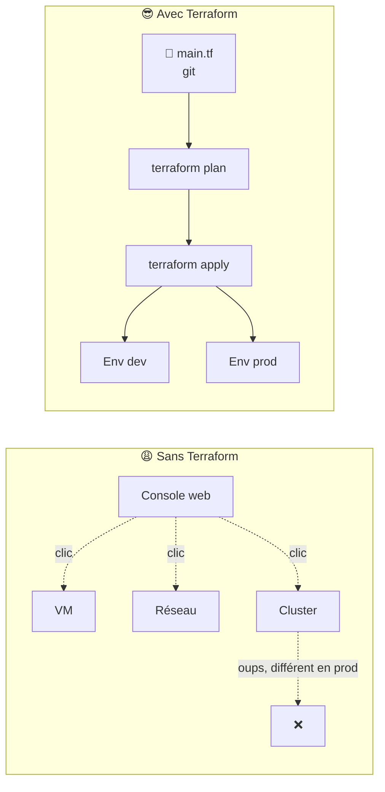
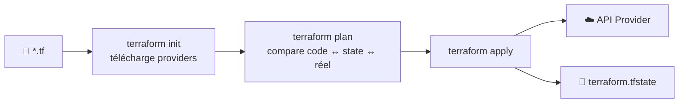
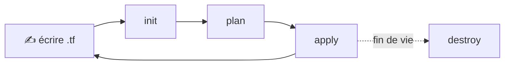
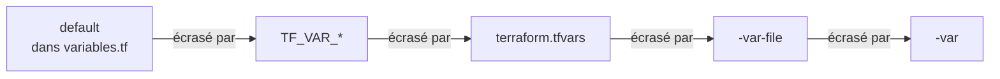
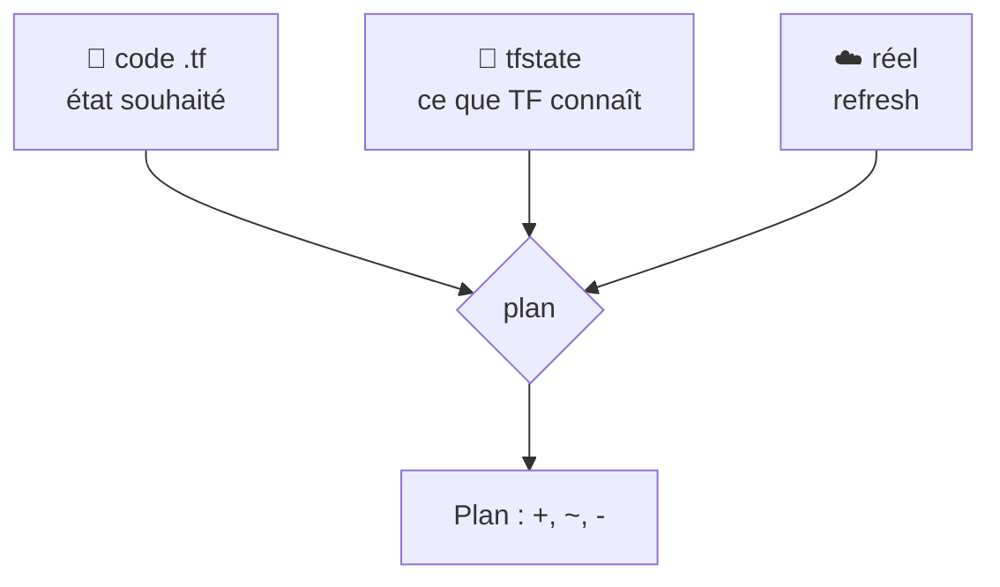
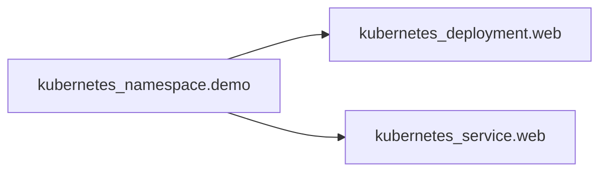
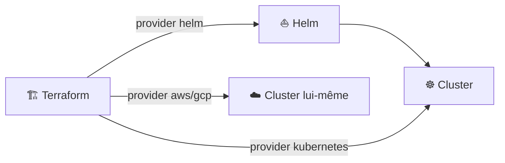

<div align="center">

# 🏗️ 107 — Terraform pour les nuls

### *L'infrastructure as code, expliquée simplement*


</div>

---

## 📋 Sommaire

- [🎯 Objectifs](#-objectifs)
- [🤔 Pourquoi Terraform ?](#-pourquoi-terraform-)
- [📖 Vocabulaire](#-vocabulaire)
- [1️⃣ Installation](#1️⃣-installation)
- [2️⃣ Premier projet : init → plan → apply](#2️⃣-premier-projet--init--plan--apply)
- [3️⃣ Variables & outputs](#3️⃣-variables--outputs)
- [4️⃣ Le state : la mémoire de Terraform](#4️⃣-le-state--la-mémoire-de-terraform)
- [5️⃣ Déployer sur Kubernetes avec Terraform](#5️⃣-déployer-sur-kubernetes-avec-terraform)
- [6️⃣ Modules : réutiliser son code](#6️⃣-modules--réutiliser-son-code)
- [7️⃣ Terraform + Helm : déployer le chart du 106](#7️⃣-terraform--helm--déployer-le-chart-du-106)
- [🧪 Exercices](#-exercices)
- [🩺 Dépannage](#-dépannage)
- [📝 Mémo](#-mémo)
- [✅ Checklist](#-checklist)
- [☕ Fil rouge Spring Boot](#-fil-rouge-spring-boot)

---

## 🎯 Objectifs

> [!NOTE]
> À la fin de ce module, vous saurez :

- ✅ Expliquer ce qu'est l'**Infrastructure as Code** et pourquoi Terraform
- ✅ Installer Terraform et écrire un premier fichier `.tf`
- ✅ Dérouler le cycle `init` → `plan` → `apply` → `destroy`
- ✅ Utiliser des **variables**, des **outputs** et des fichiers `.tfvars`
- ✅ Comprendre le rôle du **state** et pourquoi il est précieux
- ✅ Créer des ressources Kubernetes et des releases Helm avec Terraform
- ✅ Structurer son code avec un **module**

---

## 🤔 Pourquoi Terraform ?

Dans les modules 105 et 106, nous avons déployé **dans** un cluster. Mais qui crée le cluster, le namespace, le bucket, le DNS ? Imaginez :

- 🖱️ recréer 40 ressources cloud **à la main** après un incident ;
- 🔁 avoir un environnement `staging` **identique** à `prod` ;
- 📜 savoir **qui a changé quoi**, et pouvoir revenir en arrière.



> [!IMPORTANT]
> **Terraform décrit l'état souhaité, pas les étapes.** Vous écrivez « je veux 3 VMs », pas « crée une VM, puis une autre… ». Terraform calcule lui‑même la différence avec l'existant.

---

## 📖 Vocabulaire

| Terme | Analogie | Définition |
|-------|----------|------------|
| 📄 **HCL** | Le YAML de Kubernetes | Le langage des fichiers `.tf` |
| 🔌 **Provider** | Le pilote d'imprimante | Plugin qui parle à une API (AWS, Kubernetes, Helm, GitHub…) |
| 🧱 **Resource** | Un objet K8s | Une chose à créer : VM, namespace, bucket… |
| 🔍 **Data source** | Un `kubectl get` | Lit une ressource existante sans la gérer |
| 💾 **State** | La mémoire | Fichier qui associe votre code aux ressources réelles |
| 📦 **Module** | Un chart Helm | Un dossier de `.tf` réutilisable avec des variables |



---

## 1️⃣ Installation

```bash
# macOS
brew tap hashicorp/tap
brew install hashicorp/tap/terraform

# Linux (Debian/Ubuntu)
sudo apt-get install -y gnupg software-properties-common
wget -O- https://apt.releases.hashicorp.com/gpg | sudo gpg --dearmor -o /usr/share/keyrings/hashicorp-archive-keyring.gpg
echo "deb [signed-by=/usr/share/keyrings/hashicorp-archive-keyring.gpg] https://apt.releases.hashicorp.com $(lsb_release -cs) main" | sudo tee /etc/apt/sources.list.d/hashicorp.list
sudo apt update && sudo apt install terraform

# Vérifier
terraform version
```

```
Terraform v1.x.x
```

> [!TIP]
> Alternative 100 % compatible et open source : **OpenTofu** (`brew install opentofu`, commande `tofu`). Tout ce module fonctionne à l'identique.

---

## 2️⃣ Premier projet : init → plan → apply

Pas de cloud nécessaire : on commence avec le provider `local` qui crée… des fichiers.

```bash
mkdir tf-hello && cd tf-hello
```

<details open>
<summary>📄 <code>main.tf</code></summary>

```hcl
terraform {
  required_providers {
    local = {
      source  = "hashicorp/local"
      version = "~> 2.5"
    }
  }
}

resource "local_file" "hello" {
  filename = "${path.module}/hello.txt"
  content  = "Bonjour depuis Terraform 🏗️\n"
}
```
</details>

### 2.1 `init` — télécharger les providers

```bash
terraform init
```

```
Initializing provider plugins...
- Installing hashicorp/local v2.5.x...
Terraform has been successfully initialized!
```

### 2.2 `plan` — voir ce qui va changer

```bash
terraform plan
```

```
  # local_file.hello will be created
  + resource "local_file" "hello" {
      + content  = "Bonjour depuis Terraform 🏗️\n"
      + filename = "./hello.txt"
    }

Plan: 1 to add, 0 to change, 0 to destroy.
```

### 2.3 `apply` — appliquer

```bash
terraform apply        # tapez "yes"
cat hello.txt
```

### 2.4 Modifier et ré‑appliquer

Changez `content`, puis :

```bash
terraform plan         # ~ update in-place  (ou -/+ replace)
terraform apply -auto-approve
```

### 2.5 `destroy` — tout supprimer

```bash
terraform destroy
```



> [!NOTE]
> Symboles du plan : `+` créer · `~` modifier sur place · `-/+` détruire puis recréer · `-` détruire.

> [!TIP]
> **Q1. Que se passe‑t‑il si vous supprimez `hello.txt` à la main puis lancez `terraform plan` ?**
> <details><summary>Réponse</summary>
>
> Terraform détecte la **dérive** (drift) : le state dit que le fichier existe, la réalité non. Le plan propose `+ create` pour le recréer.
> </details>

---

## 3️⃣ Variables & outputs

<details open>
<summary>📄 <code>variables.tf</code></summary>

```hcl
variable "message" {
  description = "Texte écrit dans le fichier"
  type        = string
  default     = "Bonjour"
}

variable "environment" {
  type = string
  validation {
    condition     = contains(["dev", "staging", "prod"], var.environment)
    error_message = "environment doit être dev, staging ou prod."
  }
}
```
</details>

<details open>
<summary>📄 <code>main.tf</code></summary>

```hcl
resource "local_file" "hello" {
  filename = "${path.module}/hello-${var.environment}.txt"
  content  = "${var.message} depuis ${var.environment}\n"
}
```
</details>

<details open>
<summary>📄 <code>outputs.tf</code></summary>

```hcl
output "chemin_fichier" {
  value = local_file.hello.filename
}
```
</details>

### 3.1 Fournir les valeurs

```bash
terraform apply -var="environment=dev"                 # en ligne de commande
terraform apply -var-file="prod.tfvars"                # via un fichier
TF_VAR_environment=staging terraform apply             # via variable d'env
```

<details>
<summary>📄 <code>prod.tfvars</code></summary>

```hcl
environment = "prod"
message     = "Hello"
```
</details>

### 3.2 Ordre de priorité



### 3.3 Lire les outputs

```bash
terraform output
terraform output -raw chemin_fichier
```

> [!TIP]
> Même logique que Helm : `variables.tf` ≈ `values.yaml`, `prod.tfvars` ≈ `values-prod.yaml`.

---

## 4️⃣ Le state : la mémoire de Terraform

```bash
cat terraform.tfstate | head -30
terraform state list
terraform state show local_file.hello
```



> [!WARNING]
> **Ne supprimez jamais `terraform.tfstate`** : Terraform « oublierait » vos ressources et voudrait tout recréer, sans détruire l'ancien. Ne le commitez pas non plus (il peut contenir des secrets en clair).

### 4.1 Backend distant (travail en équipe)

<details>
<summary>📄 <code>backend.tf</code> (exemple S3)</summary>

```hcl
terraform {
  backend "s3" {
    bucket         = "mon-tfstate"
    key            = "hello/terraform.tfstate"
    region         = "eu-west-3"
    dynamodb_table = "tf-lock"   # verrou anti-apply simultané
    encrypt        = true
  }
}
```
</details>

### 4.2 Commandes utiles

```bash
terraform state mv local_file.hello local_file.bonjour   # renommer sans recréer
terraform state rm local_file.hello                      # oublier (sans détruire)
terraform import local_file.hello ./hello.txt            # adopter une ressource existante
```

> [!TIP]
> **Q2. Deux collègues lancent `apply` en même temps sur un backend local. Problème ?**
> <details><summary>Réponse</summary>
>
> Chacun a son propre `tfstate` → ressources dupliquées ou écrasées. D'où le backend distant **avec verrou** (`dynamodb_table`, GCS, Terraform Cloud…).
> </details>

---

## 5️⃣ Déployer sur Kubernetes avec Terraform

<details open>
<summary>📄 <code>k8s/main.tf</code></summary>

```hcl
terraform {
  required_providers {
    kubernetes = {
      source  = "hashicorp/kubernetes"
      version = "~> 2.30"
    }
  }
}

provider "kubernetes" {
  config_path = "~/.kube/config"
}

resource "kubernetes_namespace" "demo" {
  metadata {
    name = "tf-demo"
  }
}

resource "kubernetes_deployment" "web" {
  metadata {
    name      = "web"
    namespace = kubernetes_namespace.demo.metadata[0].name
    labels    = { app = "web" }
  }
  spec {
    replicas = 2
    selector {
      match_labels = { app = "web" }
    }
    template {
      metadata {
        labels = { app = "web" }
      }
      spec {
        container {
          name  = "web"
          image = "nginx:1.27"
          port {
            container_port = 80
          }
        }
      }
    }
  }
}

resource "kubernetes_service" "web" {
  metadata {
    name      = "web"
    namespace = kubernetes_namespace.demo.metadata[0].name
  }
  spec {
    selector = { app = "web" }
    type     = "NodePort"
    port {
      port        = 80
      target_port = 80
    }
  }
}
```
</details>

```bash
cd k8s
terraform init
terraform apply -auto-approve
kubectl get all -n tf-demo
```



> [!NOTE]
> Terraform déduit l'**ordre de création** des dépendances : le namespace est référencé par le deployment → il est créé avant. Pas de `depends_on` à écrire.

---

## 6️⃣ Modules : réutiliser son code

```
infra/
├── main.tf
└── modules/
    └── web-app/
        ├── main.tf
        ├── variables.tf
        └── outputs.tf
```

<details>
<summary>📄 <code>modules/web-app/variables.tf</code></summary>

```hcl
variable "name"      { type = string }
variable "namespace" { type = string }
variable "image"     { type = string }
variable "replicas"  { type = number, default = 1 }
```
</details>

<details>
<summary>📄 <code>modules/web-app/main.tf</code></summary>

```hcl
resource "kubernetes_deployment" "this" {
  metadata {
    name      = var.name
    namespace = var.namespace
  }
  spec {
    replicas = var.replicas
    selector { match_labels = { app = var.name } }
    template {
      metadata { labels = { app = var.name } }
      spec {
        container {
          name  = var.name
          image = var.image
        }
      }
    }
  }
}
```
</details>

<details open>
<summary>📄 <code>main.tf</code> — appel du module</summary>

```hcl
module "web_dev" {
  source    = "./modules/web-app"
  name      = "web-dev"
  namespace = "tf-demo"
  image     = "nginx:1.27"
}

module "web_prod" {
  source    = "./modules/web-app"
  name      = "web-prod"
  namespace = "tf-demo"
  image     = "nginx:1.27"
  replicas  = 3
}
```
</details>

```bash
terraform init      # obligatoire après ajout d'un module
terraform apply
```

> [!TIP]
> Le [Terraform Registry](https://registry.terraform.io/browse/modules) est l'équivalent d'ArtifactHub : des milliers de modules prêts à l'emploi (`source = "terraform-aws-modules/vpc/aws"`).

---

## 7️⃣ Terraform + Helm : déployer le chart du 106

<details open>
<summary>📄 <code>helm/main.tf</code></summary>

```hcl
terraform {
  required_providers {
    helm = {
      source  = "hashicorp/helm"
      version = "~> 2.15"
    }
  }
}

provider "helm" {
  kubernetes {
    config_path = "~/.kube/config"
  }
}

resource "helm_release" "nginx" {
  name             = "mon-nginx"
  repository       = "https://charts.bitnami.com/bitnami"
  chart            = "nginx"
  namespace        = "helm-tf"
  create_namespace = true

  values = [file("${path.module}/my-values.yaml")]

  set {
    name  = "replicaCount"
    value = "2"
  }
}
```
</details>

```bash
cd helm
terraform init && terraform apply -auto-approve
helm list -n helm-tf
```



> [!IMPORTANT]
> **Qui fait quoi ?**
> - **Terraform** : crée le cluster, les réseaux, les namespaces, installe les charts de base.
> - **Helm** : packge une application.
> - **kubectl** : dépanne au quotidien.

---

## 🧪 Exercices

> [!NOTE]
> Faites les exercices dans l'ordre, chacun s'appuie sur le précédent.

### Exercice 1 — Variables
Ajoutez une variable `replicas` (type `number`, défaut `1`) au projet `k8s/` et utilisez‑la dans le deployment. Appliquez avec `-var="replicas=3"`.

### Exercice 2 — Outputs
Exposez en output le `NodePort` du service (`kubernetes_service.web.spec[0].port[0].node_port`).

### Exercice 3 — Drift
Supprimez le deployment avec `kubectl delete deploy web -n tf-demo`, puis lancez `terraform plan`. Que propose Terraform ? Corrigez avec `apply`.

### Exercice 4 — Import
Créez un namespace à la main (`kubectl create ns manuel`), déclarez‑le en HCL puis adoptez‑le avec `terraform import`.

### Exercice 5 — Module
Faites un module `helm-app` qui encapsule `helm_release` et appelez‑le deux fois (nginx + redis).

<details>
<summary>💡 Solution exercice 4</summary>

```hcl
resource "kubernetes_namespace" "manuel" {
  metadata { name = "manuel" }
}
```

```bash
terraform import kubernetes_namespace.manuel manuel
terraform plan   # → No changes.
```
</details>

---

## 🩺 Dépannage

| Symptôme | Cause probable | Solution |
|----------|----------------|----------|
| `Error: Inconsistent dependency lock file` | Provider ajouté sans `init` | `terraform init -upgrade` |
| `Error acquiring the state lock` | Un `apply` a été interrompu | `terraform force-unlock <ID>` (avec prudence) |
| `provider ... not found` | Bloc `required_providers` manquant | Ajouter le bloc puis `init` |
| Plan veut **tout recréer** | State perdu ou renommage de ressource | `terraform state mv` ou restaurer le state |
| `connection refused` avec le provider kubernetes | `kubeconfig` absent ou contexte incorrect | `kubectl config current-context` |
| Le `apply` détruit une ressource inattendue | Changement d'un attribut « ForceNew » | Lire le plan ! Utiliser `lifecycle { prevent_destroy = true }` |

```bash
terraform fmt -recursive          # 🎨 formater
terraform validate                # ✅ syntaxe & types
TF_LOG=DEBUG terraform plan       # 🔍 logs détaillés
terraform graph | dot -Tpng > graph.png   # 🕸️ graphe des dépendances
```

---

## 📝 Mémo

| Commande | Action |
|----------|--------|
| `terraform init` | Télécharger providers et modules |
| `terraform fmt` | Formater le code |
| `terraform validate` | Vérifier la syntaxe |
| `terraform plan` | Prévisualiser les changements |
| `terraform apply` | Appliquer (`-auto-approve` pour ne pas confirmer) |
| `terraform destroy` | Tout supprimer |
| `terraform output` | Afficher les outputs |
| `terraform state list/show/mv/rm` | Manipuler le state |
| `terraform import` | Adopter une ressource existante |
| `terraform workspace new dev` | Un state séparé par environnement |

```hcl
# Squelette minimal
terraform { required_providers { x = { source = "hashicorp/x" } } }
provider "x" {}
variable "v" { type = string }
resource "x_type" "name" { attr = var.v }
output "o" { value = x_type.name.id }
```

---

## ✅ Checklist

- [ ] Terraform installé et `terraform version` fonctionne
- [ ] Projet `tf-hello` : `init`, `plan`, `apply`, `destroy` déroulés
- [ ] Variables via `-var`, `.tfvars` et `TF_VAR_`
- [ ] Au moins un `output` affiché
- [ ] Je sais expliquer ce qu'est le state et pourquoi ne pas le commiter
- [ ] Namespace + Deployment + Service créés via le provider `kubernetes`
- [ ] Un module écrit et appelé deux fois
- [ ] Une `helm_release` déployée avec Terraform
- [ ] `.gitignore` contient `.terraform/`, `*.tfstate*`, `*.tfvars` sensibles

## ☕ Fil rouge Spring Boot

> Suite du [fil rouge Spring Boot](105bis-spring-boot.md) : tout est dans [`112bis-spring-boot-advanced/`](112bis-spring-boot-advanced/) et s'exécute avec `./deploy.sh <module>` (`deploy`, `test`, `clean` ou les deux par défaut). Prérequis : `./deploy.sh build` une fois, puis `./deploy.sh 106`.

```bash
cd day1/112bis-spring-boot-advanced
./deploy.sh 107            # tofu/terraform init + apply, puis tests
```

**Fichiers : [`107-terraform/`](112bis-spring-boot-advanced/107-terraform/)**

| Fichier | Rôle |
|---------|------|
| `versions.tf` | Providers `kubernetes` et `helm`, pointés sur le contexte `minikube` |
| `main.tf` | `kubernetes_namespace_v1` (avec labels Pod Security) + `helm_release` du chart local `../106-helm/spring-demo` |
| `variables.tf` / `terraform.tfvars.example` | `namespace`, `environment`, `replicas`, `image_tag` → injectés dans les values du chart via `set {}` |
| `outputs.tf` | URL interne des services |

**Ce que vérifie `./deploy.sh 107 test` :** 2 ressources dans le state, `plan` idempotent (*No changes*), le label PSS posé par Terraform, la variable `environment` visible dans `/api/products/whoami`, puis `apply -var replicas=3` qui scale les deux Deployments.

```bash
cd 107-terraform
tofu plan -var replicas=1          # lire un plan de changement
tofu state list
tofu destroy -auto-approve         # ou ./deploy.sh 107 clean
```

<div align="center">

**➡️ Module suivant : 108 — CI/CD : automatiser `plan` et `apply`**

</div>