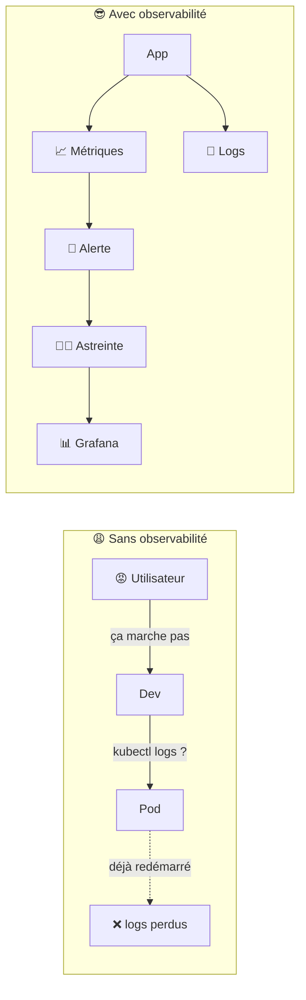
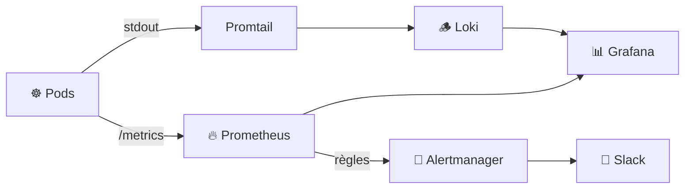
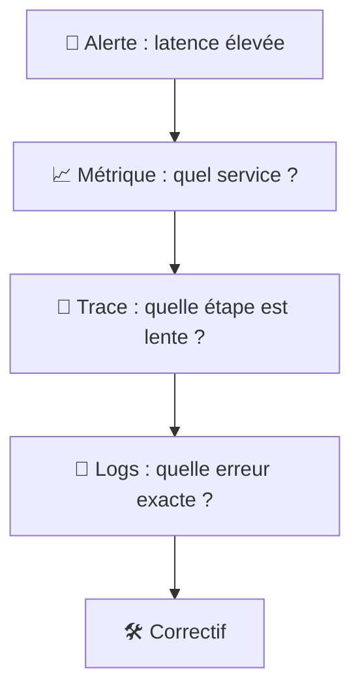
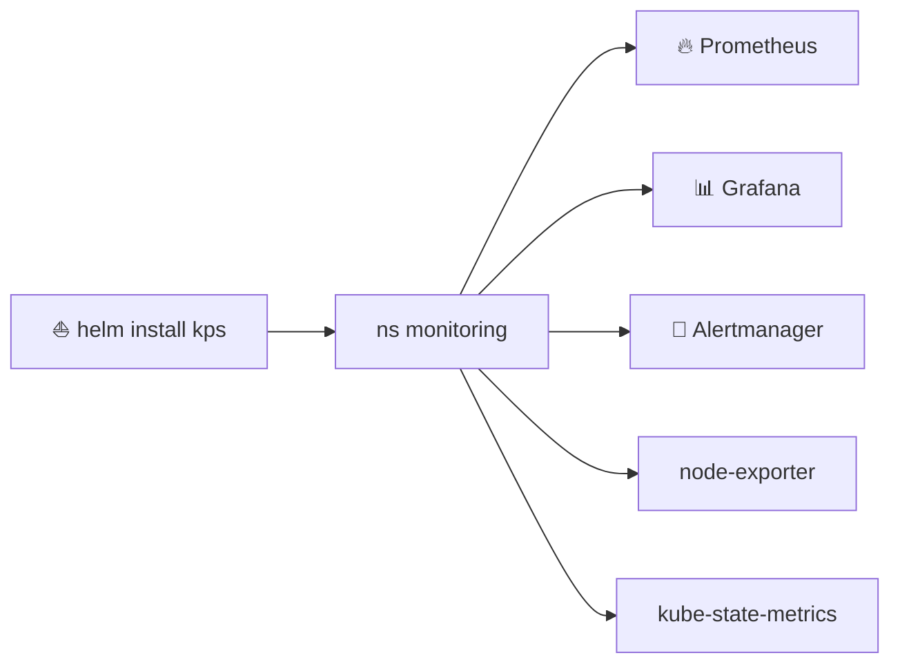
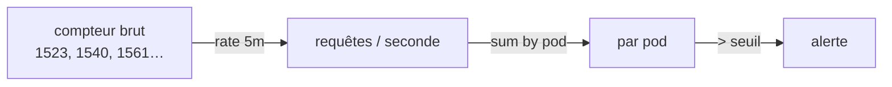
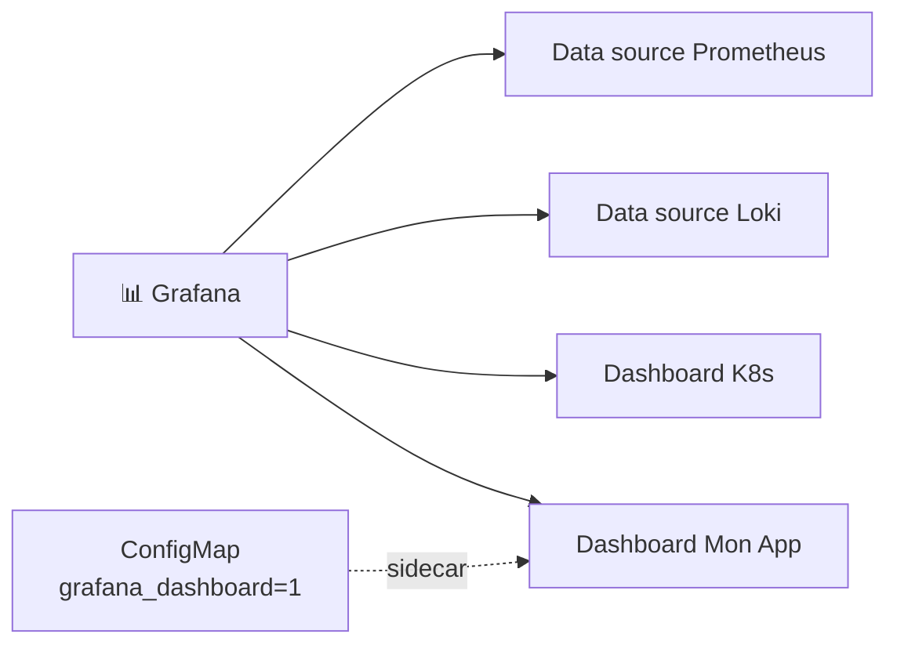
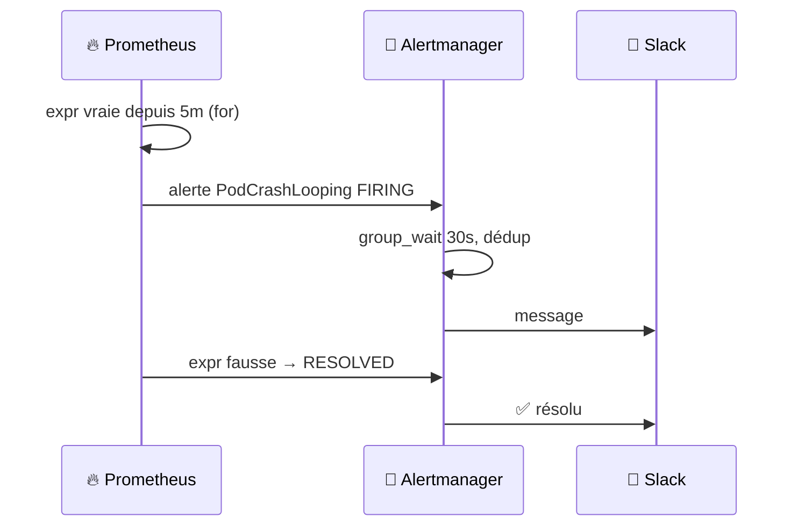
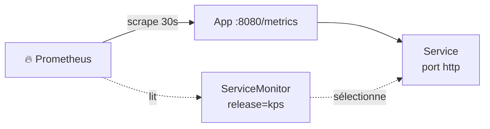

<div align="center">

# 🔭 109 — Observabilité pour les nuls

### *Logs, métriques et alertes : savoir ce qui se passe dans le cluster*


</div>

---

## 📋 Sommaire

- [🎯 Objectifs](#-objectifs)
- [🤔 Pourquoi l'observabilité ?](#-pourquoi-lobservabilité-)
- [📖 Vocabulaire](#-vocabulaire)
- [1️⃣ Les trois piliers](#1️⃣-les-trois-piliers)
- [2️⃣ Installer la stack avec Helm](#2️⃣-installer-la-stack-avec-helm)
- [3️⃣ Métriques : Prometheus & PromQL](#3️⃣-métriques--prometheus--promql)
- [4️⃣ Dashboards Grafana](#4️⃣-dashboards-grafana)
- [5️⃣ Logs centralisés avec Loki](#5️⃣-logs-centralisés-avec-loki)
- [6️⃣ Alertes : PrometheusRule & Alertmanager](#6️⃣-alertes--prometheusrule--alertmanager)
- [7️⃣ Instrumenter son application](#7️⃣-instrumenter-son-application)
- [🧪 Exercices](#-exercices)
- [🩺 Dépannage](#-dépannage)
- [📝 Mémo](#-mémo)
- [✅ Checklist](#-checklist)
- [☕ Fil rouge Spring Boot](#-fil-rouge-spring-boot)

---

## 🎯 Objectifs

> [!NOTE]
> À la fin de ce module, vous saurez :

- ✅ Distinguer **logs**, **métriques** et **traces**, et savoir quand utiliser quoi
- ✅ Installer **Prometheus + Grafana + Alertmanager** avec un chart Helm
- ✅ Écrire vos premières requêtes **PromQL**
- ✅ Créer un **dashboard Grafana** et importer un dashboard communautaire
- ✅ Centraliser les logs des pods avec **Loki** et les interroger en **LogQL**
- ✅ Définir une **alerte** et la router vers Slack / e‑mail
- ✅ Exposer un endpoint `/metrics` et le faire scraper via un **ServiceMonitor**

---

## 🤔 Pourquoi l'observabilité ?

Dans le 108, la CI déploie toute seule à chaque merge. Très bien… mais :

- 🌙 à 3h du matin, l'application répond en 8 secondes : **qui le sait ?**
- 🔥 un pod redémarre en boucle depuis 2 jours : **personne n'a vu** ;
- 🤷 « ça marche chez moi » : impossible de **prouver** ce qui s'est passé en prod.



> [!IMPORTANT]
> **Monitoring** = savoir *que* ça casse. **Observabilité** = comprendre *pourquoi* ça casse, sans redéployer.

---

## 📖 Vocabulaire

| Terme | Analogie | Définition |
|-------|----------|------------|
| 📈 **Métrique** | Le compteur de vitesse | Valeur numérique horodatée : CPU, latence, requêtes/s |
| 📜 **Log** | Le journal de bord | Ligne de texte émise par l'application |
| 🧵 **Trace** | Le suivi de colis | Parcours d'une requête à travers plusieurs services |
| 🔥 **Prometheus** | Le collecteur | Base de données de métriques qui **scrape** des cibles |
| 🎯 **Scrape** | Le relevé de compteur | Prometheus lit `/metrics` toutes les 30 s |
| 🏷️ **Label** | L'étiquette | Paire clé/valeur (`pod="web-1"`, `code="500"`) |
| 📊 **Grafana** | Le tableau de bord | Visualise métriques et logs |
| 🪵 **Loki** | Prometheus pour les logs | Stocke les logs, indexés par labels |
| 🔔 **Alertmanager** | Le bipeur | Regroupe, déduplique et envoie les alertes |
| 📐 **PromQL / LogQL** | Le SQL du monitoring | Langages de requête de Prometheus / Loki |



---

## 1️⃣ Les trois piliers

| Question | Pilier | Exemple |
|----------|--------|---------|
| *Combien ? À quelle vitesse ?* | 📈 Métriques | 95 % des requêtes < 200 ms |
| *Que s'est‑il passé exactement ?* | 📜 Logs | `ERROR db timeout after 5s user=42` |
| *Où le temps est‑il passé ?* | 🧵 Traces | API 20 ms → DB 480 ms → cache 2 ms |



> [!TIP]
> **Q1. Pourquoi ne pas tout mettre dans les logs ?**
> <details><summary>Réponse</summary>
>
> Les logs sont **chers** à stocker et lents à agréger. Une métrique `http_requests_total` occupe quelques octets par point ; les logs de 10 000 requêtes/s occupent des Go. Métriques pour les tendances, logs pour le détail.
> </details>

---

## 2️⃣ Installer la stack avec Helm

Le chart **kube‑prometheus‑stack** installe Prometheus, Grafana, Alertmanager et les exporters système en une commande.

```bash
helm repo add prometheus-community https://prometheus-community.github.io/helm-charts
helm repo add grafana https://grafana.github.io/helm-charts
helm repo update
```

<details open>
<summary>📄 <code>monitoring/values-kps.yaml</code></summary>

```yaml
grafana:
  adminPassword: "admin123"      # ⚠️ secret en prod
  service:
    type: ClusterIP

prometheus:
  prometheusSpec:
    retention: 7d
    # scraper aussi les ServiceMonitor hors du chart (§7)
    serviceMonitorSelectorNilUsesHelmValues: false
    ruleSelectorNilUsesHelmValues: false

alertmanager:
  enabled: true
```
</details>

```bash
helm upgrade --install kps prometheus-community/kube-prometheus-stack \
  --namespace monitoring --create-namespace \
  -f monitoring/values-kps.yaml

kubectl get pods -n monitoring
```

```bash
# Accéder aux interfaces
kubectl port-forward -n monitoring svc/kps-grafana 3000:80          # http://localhost:3000
kubectl port-forward -n monitoring svc/kps-kube-prometheus-stack-prometheus 9090:9090
kubectl port-forward -n monitoring svc/kps-kube-prometheus-stack-alertmanager 9093:9093
```



> [!NOTE]
> **node‑exporter** donne les métriques des nœuds (CPU, RAM, disque). **kube‑state‑metrics** donne l'état des objets Kubernetes (pods en `CrashLoopBackOff`, replicas manquants…).

---

## 3️⃣ Métriques : Prometheus & PromQL

Ouvrez `http://localhost:9090` → onglet **Graph**.

### 3.1 Anatomie d'une métrique

```text
http_requests_total{method="GET", code="200", pod="web-7d9f"}  1523
└── nom ─────────┘└──────────── labels ─────────────────┘  └ valeur
```

### 3.2 Premières requêtes

```promql
# Pods qui ne sont pas Running
kube_pod_status_phase{phase!="Running"} == 1

# Redémarrages de conteneurs sur la dernière heure
increase(kube_pod_container_status_restarts_total[1h]) > 0

# CPU utilisé par namespace (cœurs)
sum(rate(container_cpu_usage_seconds_total{container!=""}[5m])) by (namespace)

# Mémoire par pod (Mo)
sum(container_memory_working_set_bytes{container!=""}) by (pod) / 1024 / 1024

# Taux d'erreurs HTTP 5xx (%)
100 * sum(rate(http_requests_total{code=~"5.."}[5m]))
    / sum(rate(http_requests_total[5m]))
```



> [!IMPORTANT]
> Un compteur (`_total`) ne fait que **monter**. Ne l'affichez jamais brut : utilisez toujours `rate()` ou `increase()` pour obtenir une vitesse.

> [!TIP]
> **Q2. Quelle différence entre `rate()` et `increase()` ?**
> <details><summary>Réponse</summary>
>
> `rate(x[5m])` donne la variation **par seconde** sur 5 minutes. `increase(x[5m])` donne la variation **totale** sur 5 minutes (= `rate × 300`). `rate` pour les graphes, `increase` pour « combien de fois en 1h ».
> </details>

---

## 4️⃣ Dashboards Grafana

Ouvrez `http://localhost:3000` (`admin` / `admin123`).

### 4.1 Dashboards déjà fournis

**Dashboards → Browse** : le chart en installe une vingtaine (*Kubernetes / Compute Resources / Namespace*, *Node Exporter / Nodes*…).

### 4.2 Importer un dashboard communautaire

**Dashboards → New → Import** → ID `15757` (Kubernetes Views / Global) → sélectionner la source `Prometheus`.

### 4.3 Créer son panneau

**New dashboard → Add visualization** :

```promql
sum(rate(container_cpu_usage_seconds_total{namespace="$namespace", container!=""}[5m])) by (pod)
```

- **Legend** : `{{pod}}`
- **Unit** : `Percent (0.0-1.0)` ou `cores`
- **Variable** `$namespace` : *Settings → Variables → Query* `label_values(kube_pod_info, namespace)`

### 4.4 Dashboard en tant que code

<details>
<summary>📄 <code>monitoring/dashboard-cm.yaml</code></summary>

```yaml
apiVersion: v1
kind: ConfigMap
metadata:
  name: dashboard-mon-app
  namespace: monitoring
  labels:
    grafana_dashboard: "1"        # Grafana l'importe automatiquement
data:
  mon-app.json: |
    { "title": "Mon App", "panels": [ ... ] }
```
</details>



> [!TIP]
> Exportez vos dashboards en JSON et commitez‑les : un dashboard qui n'est pas dans Git disparaît avec le pod Grafana.

---

## 5️⃣ Logs centralisés avec Loki

<details open>
<summary>📄 <code>monitoring/values-loki.yaml</code></summary>

```yaml
loki:
  enabled: true
  isDefault: false
promtail:
  enabled: true          # agent qui lit les logs de chaque nœud
grafana:
  enabled: false         # on réutilise le Grafana du §2
```
</details>

```bash
helm upgrade --install loki grafana/loki-stack \
  --namespace monitoring -f monitoring/values-loki.yaml
```

Ajouter la source dans Grafana : **Connections → Data sources → Loki** → URL `http://loki:3100`.

### LogQL, la base

```logql
# Tous les logs d'un namespace
{namespace="prod"}

# Filtrer sur un mot
{namespace="prod", app="mon-app"} |= "ERROR"

# Exclure le bruit
{namespace="prod"} != "healthcheck"

# Parser du JSON et filtrer un champ
{app="mon-app"} | json | status >= 500

# Compter les erreurs par minute (→ métrique depuis les logs !)
sum(rate({app="mon-app"} |= "ERROR" [1m])) by (pod)
```

```mermaid
flowchart LR
    C[Conteneur stdout] --> F[/var/log/pods/…]
    F --> PT[Promtail<br/>DaemonSet]
    PT -->|labels : ns, pod, app| LOKI[🪵 Loki]
    LOKI --> GRAF[📊 Grafana Explore]
```

> [!IMPORTANT]
> Vos applications doivent logger sur **stdout/stderr**, jamais dans un fichier. Kubernetes ne collecte que la sortie standard.

> [!TIP]
> Loggez en **JSON** (`{"level":"error","msg":"db timeout","user":42}`) : Loki pourra filtrer par champ sans regex fragile.

---

## 6️⃣ Alertes : PrometheusRule & Alertmanager

### 6.1 Définir une règle

<details open>
<summary>📄 <code>monitoring/alerts.yaml</code></summary>

```yaml
apiVersion: monitoring.coreos.com/v1
kind: PrometheusRule
metadata:
  name: mon-app-alerts
  namespace: monitoring
  labels:
    release: kps                 # pour être ramassée par Prometheus
spec:
  groups:
    - name: mon-app
      rules:
        - alert: PodCrashLooping
          expr: increase(kube_pod_container_status_restarts_total{namespace="prod"}[15m]) > 3
          for: 5m
          labels:
            severity: critical
          annotations:
            summary: "{{ $labels.pod }} redémarre en boucle"
            description: "{{ $value }} redémarrages en 15 min dans {{ $labels.namespace }}"

        - alert: HighErrorRate
          expr: |
            100 * sum(rate(http_requests_total{code=~"5.."}[5m]))
                / sum(rate(http_requests_total[5m])) > 5
          for: 10m
          labels:
            severity: warning
          annotations:
            summary: "Taux d'erreur 5xx > 5 %"
```
</details>

```bash
kubectl apply -f monitoring/alerts.yaml
# Vérifier : http://localhost:9090/alerts
```

### 6.2 Router vers Slack

<details open>
<summary>📄 ajout dans <code>values-kps.yaml</code></summary>

```yaml
alertmanager:
  config:
    route:
      receiver: slack
      group_by: [alertname, namespace]
      group_wait: 30s
      repeat_interval: 4h
      routes:
        - matchers: [severity="critical"]
          receiver: slack
    receivers:
      - name: slack
        slack_configs:
          - api_url: "https://hooks.slack.com/services/XXX/YYY/ZZZ"   # ⚠️ secret
            channel: "#alertes"
            title: "🔥 {{ .CommonLabels.alertname }}"
            text: "{{ range .Alerts }}{{ .Annotations.summary }}\n{{ end }}"
```
</details>

```bash
helm upgrade kps prometheus-community/kube-prometheus-stack \
  -n monitoring -f monitoring/values-kps.yaml
```



> [!WARNING]
> Une alerte qui sonne trop souvent finit **ignorée**. Le `for:` évite les faux positifs ; `repeat_interval` évite le spam. Une alerte = une action humaine possible.

> [!TIP]
> **Q3. À quoi sert `for: 5m` ?**
> <details><summary>Réponse</summary>
>
> L'alerte ne part que si la condition est vraie **en continu** pendant 5 minutes. Un pic isolé de 10 secondes ne réveille personne.
> </details>

---

## 7️⃣ Instrumenter son application

### 7.1 Exposer `/metrics`

<details open>
<summary>📄 <code>app/main.py</code> (Flask)</summary>

```python
from flask import Flask
from prometheus_client import Counter, Histogram, generate_latest
import time

app = Flask(__name__)
REQUESTS = Counter("http_requests_total", "Requêtes HTTP", ["method", "code"])
LATENCY = Histogram("http_request_duration_seconds", "Latence HTTP")

@app.route("/")
@LATENCY.time()
def index():
    REQUESTS.labels("GET", "200").inc()
    return "Bonjour 🔭"

@app.route("/metrics")
def metrics():
    return generate_latest(), 200, {"Content-Type": "text/plain"}
```
</details>

### 7.2 Dire à Prometheus de scraper

<details open>
<summary>📄 <code>charts/mon-app/templates/servicemonitor.yaml</code></summary>

```yaml
apiVersion: monitoring.coreos.com/v1
kind: ServiceMonitor
metadata:
  name: {{ include "mon-app.fullname" . }}
  labels:
    release: kps
spec:
  selector:
    matchLabels:
      app.kubernetes.io/name: {{ include "mon-app.name" . }}
  endpoints:
    - port: http
      path: /metrics
      interval: 30s
```
</details>

```bash
helm upgrade --install mon-app ./charts/mon-app -n prod
# Vérifier : http://localhost:9090/targets → mon-app UP
```



### 7.3 Les 4 signaux dorés

| Signal | Métrique | PromQL |
|--------|----------|--------|
| 🚦 **Trafic** | requêtes/s | `sum(rate(http_requests_total[5m]))` |
| ❌ **Erreurs** | % de 5xx | `rate(...{code=~"5.."}) / rate(...)` |
| ⏱️ **Latence** | p95 | `histogram_quantile(0.95, sum(rate(http_request_duration_seconds_bucket[5m])) by (le))` |
| 🧯 **Saturation** | CPU / RAM vs limites | `container_memory_working_set_bytes / kube_pod_container_resource_limits` |

> [!NOTE]
> Ces 4 signaux suffisent à savoir si **vos utilisateurs** souffrent. Commencez par eux avant d'ajouter 200 métriques.

---

## 🧪 Exercices

> [!NOTE]
> Faites les exercices dans l'ordre, chacun s'appuie sur le précédent.

### Exercice 1 — Installation
Installez `kube-prometheus-stack`, ouvrez Grafana et trouvez le dashboard qui montre la RAM de vos nœuds.

### Exercice 2 — PromQL
Écrivez une requête qui liste les pods ayant redémarré au moins une fois dans les dernières 24 h.

### Exercice 3 — Logs
Installez Loki, déployez un pod qui écrit `ERROR` toutes les 10 s, retrouvez ces lignes dans **Explore**.

### Exercice 4 — Alerte
Créez un `PrometheusRule` qui se déclenche si un Deployment du namespace `prod` a moins de replicas disponibles que souhaités pendant 5 minutes.

### Exercice 5 — Instrumentation
Ajoutez `/metrics` à l'application du 106, un `ServiceMonitor`, et un panneau Grafana avec le p95 de latence.

<details>
<summary>💡 Solution exercice 2</summary>

```promql
increase(kube_pod_container_status_restarts_total[24h]) >= 1
```
</details>

<details>
<summary>💡 Solution exercice 4</summary>

```yaml
- alert: DeploymentReplicasMismatch
  expr: kube_deployment_status_replicas_available{namespace="prod"}
        < kube_deployment_spec_replicas{namespace="prod"}
  for: 5m
  labels: { severity: warning }
  annotations:
    summary: "{{ $labels.deployment }} n'a pas tous ses replicas"
```
</details>

---

## 🩺 Dépannage

| Symptôme | Cause probable | Solution |
|----------|----------------|----------|
| Target **DOWN** dans `/targets` | Port ou path incorrect | Vérifier `endpoints.port` = nom du port du Service |
| ServiceMonitor **ignoré** | Label `release` manquant ou selector Helm | `release: kps` ou `serviceMonitorSelectorNilUsesHelmValues: false` |
| Grafana : *No data* | Mauvaise data source ou plage temporelle | Vérifier la source et le sélecteur de temps (haut à droite) |
| Loki : aucun log | Promtail non démarré ou app logge en fichier | `kubectl logs -n monitoring ds/loki-promtail`, logger sur stdout |
| Alerte jamais **FIRING** | `for:` trop long ou règle non chargée | Onglet **Alerts** de Prometheus, vérifier `ruleSelector` |
| Alertmanager n'envoie rien | Webhook invalide | `http://localhost:9093/#/status` → config chargée ? |
| Prometheus **OOMKilled** | Trop de séries / rétention | Réduire `retention`, augmenter les `resources.limits` |
| Pods `Pending` après install | PVC sans StorageClass | `kubectl get pvc -n monitoring`, définir une `storageClassName` |

```bash
# Où en est Prometheus ?
kubectl port-forward -n monitoring svc/kps-kube-prometheus-stack-prometheus 9090:9090
open http://localhost:9090/targets
open http://localhost:9090/rules

# Recharger la config Prometheus sans redémarrer
curl -X POST http://localhost:9090/-/reload

# Tester une alerte à la main
amtool alert add test severity=critical --alertmanager.url=http://localhost:9093
```

---

## 📝 Mémo

| Élément | Rôle |
|---------|------|
| `kube-prometheus-stack` | Prometheus + Grafana + Alertmanager en un chart |
| `rate(x[5m])` | Vitesse par seconde d'un compteur |
| `increase(x[1h])` | Variation totale sur une période |
| `sum(...) by (label)` | Agréger par label |
| `histogram_quantile(0.95, ...)` | Percentile depuis un histogramme |
| `{app="x"} \|= "ERROR"` | LogQL : filtrer les logs |
| `PrometheusRule` | Définir des alertes en YAML |
| `for:` | Durée avant de déclencher l'alerte |
| `ServiceMonitor` | Dire à Prometheus quoi scraper |
| `grafana_dashboard: "1"` | ConfigMap importée automatiquement dans Grafana |

```promql
# Les 3 requêtes à connaître par cœur
sum(rate(http_requests_total[5m])) by (code)                     # trafic + erreurs
histogram_quantile(0.95, sum(rate(http_request_duration_seconds_bucket[5m])) by (le))  # latence
kube_pod_status_phase{phase!="Running"} == 1                     # pods en souffrance
```

---

## ✅ Checklist

- [ ] Prometheus, Grafana et Alertmanager tournent dans le namespace `monitoring`
- [ ] J'accède à Grafana et je lis la CPU/RAM de mes nœuds
- [ ] Je sais écrire un `rate()` et un `sum by()` en PromQL
- [ ] Un dashboard perso est commité en JSON dans Git
- [ ] Loki collecte les logs de tous les pods, interrogeables en LogQL
- [ ] Une `PrometheusRule` avec `for:` existe et apparaît dans `/alerts`
- [ ] Alertmanager envoie vers Slack (ou un webhook de test)
- [ ] Mon application expose `/metrics` et est **UP** dans `/targets`
- [ ] Je connais les 4 signaux dorés : trafic, erreurs, latence, saturation

## ☕ Fil rouge Spring Boot

> Suite du [fil rouge Spring Boot](105bis-spring-boot.md) : tout est dans [`112bis-spring-boot-advanced/`](112bis-spring-boot-advanced/) et s'exécute avec `./deploy.sh <module>` (`deploy`, `test`, `clean` ou les deux par défaut). Prérequis : `./deploy.sh build` une fois, puis `./deploy.sh 106`.

Les deux services exposent déjà `/actuator/prometheus` (Micrometer) et un compteur métier `orders_placed_total{outcome="success|rejected"}`.

```bash
cd day1/112bis-spring-boot-advanced
./deploy.sh 109            # installe kube-prometheus-stack (ns monitoring) + active metrics.* dans le chart
kubectl -n monitoring port-forward svc/monitoring-grafana 3000:80      # admin / admin → dashboard « Spring Demo »
kubectl -n monitoring port-forward svc/monitoring-kube-prometheus-prometheus 9090
```

**Fichiers : [`109-observability/`](112bis-spring-boot-advanced/109-observability/)**

| Fichier | Rôle |
|---------|------|
| `values.yaml` | `metrics.serviceMonitor.enabled`, `metrics.prometheusRule.enabled` → le chart génère `ServiceMonitor` + `PrometheusRule` |
| `kube-prometheus-stack-values.yaml` | Stack allégée pour Minikube ; `serviceMonitorSelectorNilUsesHelmValues: false` pour découvrir nos moniteurs |
| `grafana-dashboard.yaml` | ConfigMap labellisée `grafana_dashboard=1` → dashboard auto-provisionné (RPS, p95, commandes/min) |

**Ce que vérifie le test :** targets `up` pour catalog et order, `sum(orders_placed_total) > 0` après quelques `POST /api/orders`, règle `SpringDemoOrderNotReady` chargée, dashboard présent.

> Essayez : `./deploy.sh 105` puis `kubectl -n spring-demo scale deploy/catalog --replicas=0` et regardez l'alerte passer *Pending* → *Firing* dans Prometheus.

<div align="center">

**➡️ Module suivant : 110 — Sécurité : RBAC, NetworkPolicies et secrets**

</div>