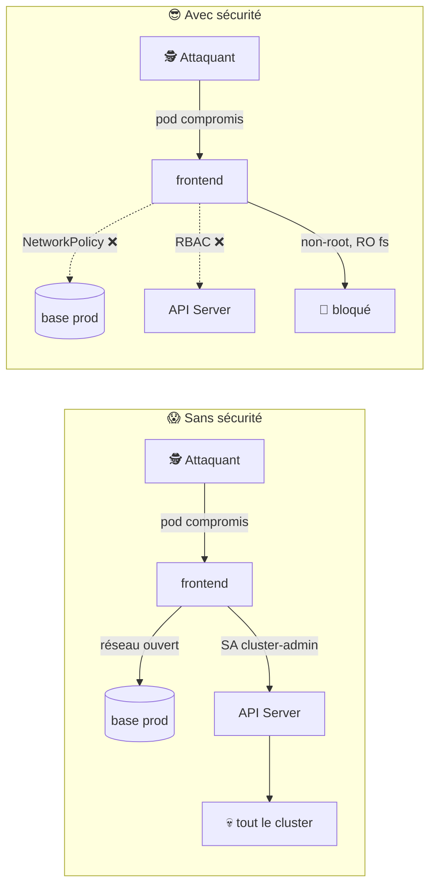
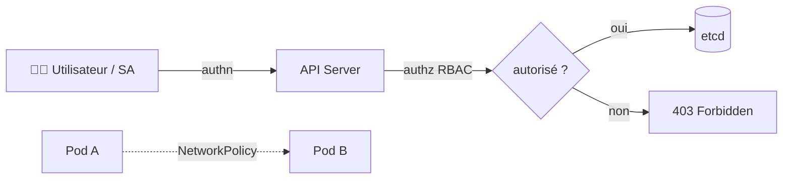
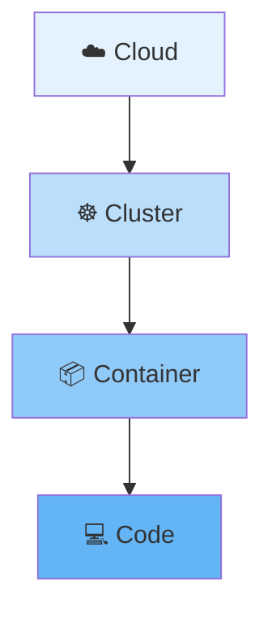
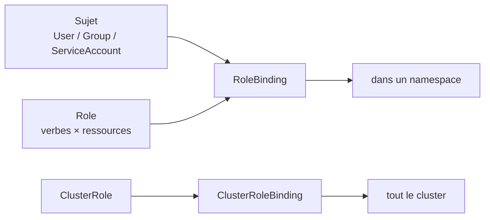
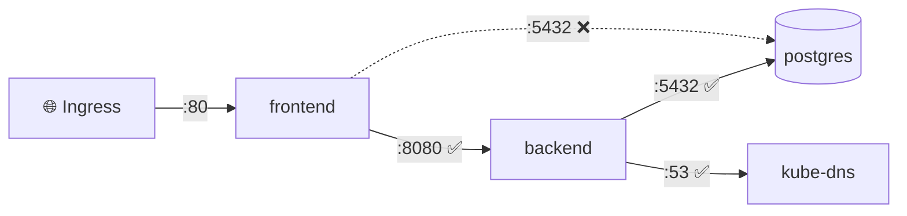
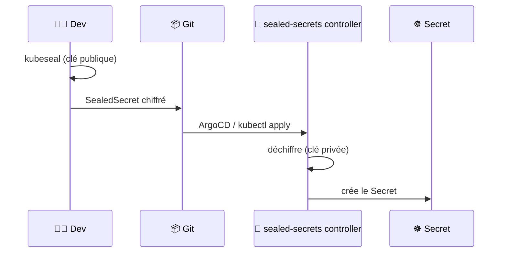
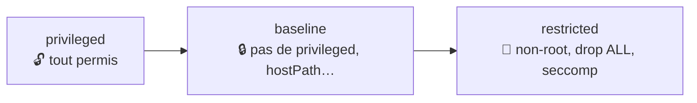
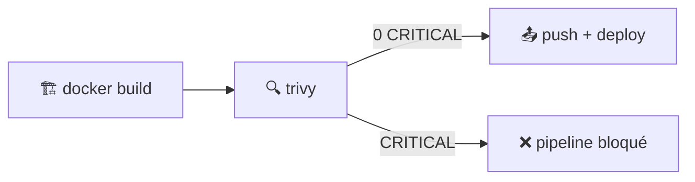

<div align="center">

# 🔐 110 — Sécurité pour les nuls

### *RBAC, NetworkPolicies et Secrets : verrouiller le cluster sans se verrouiller dehors*


</div>

---

## 📋 Sommaire

- [🎯 Objectifs](#-objectifs)
- [🤔 Pourquoi la sécurité ?](#-pourquoi-la-sécurité-)
- [📖 Vocabulaire](#-vocabulaire)
- [1️⃣ Le modèle des 4 C](#1️⃣-le-modèle-des-4-c)
- [2️⃣ RBAC : qui peut faire quoi](#2️⃣-rbac--qui-peut-faire-quoi)
- [3️⃣ NetworkPolicies : qui parle à qui](#3️⃣-networkpolicies--qui-parle-à-qui)
- [4️⃣ Secrets : stocker sans exposer](#4️⃣-secrets--stocker-sans-exposer)
- [5️⃣ Durcir les pods : securityContext & PSS](#5️⃣-durcir-les-pods--securitycontext--pss)
- [6️⃣ Scanner les images avec Trivy](#6️⃣-scanner-les-images-avec-trivy)
- [7️⃣ Audit et bonnes pratiques](#7️⃣-audit-et-bonnes-pratiques)
- [🧪 Exercices](#-exercices)
- [🩺 Dépannage](#-dépannage)
- [📝 Mémo](#-mémo)
- [✅ Checklist](#-checklist)
- [☕ Fil rouge Spring Boot](#-fil-rouge-spring-boot)

---

## 🎯 Objectifs

> [!NOTE]
> À la fin de ce module, vous saurez :

- ✅ Situer une menace dans le modèle **4 C** (Cloud, Cluster, Container, Code)
- ✅ Créer un **ServiceAccount**, un **Role** et un **RoleBinding** au plus juste
- ✅ Vérifier des droits avec `kubectl auth can-i`
- ✅ Isoler un namespace avec une **NetworkPolicy** *deny‑all* puis ouvrir le strict nécessaire
- ✅ Gérer des **Secrets** sans jamais les commiter en clair (Sealed Secrets)
- ✅ Durcir un pod : `runAsNonRoot`, `readOnlyRootFilesystem`, **Pod Security Standards**
- ✅ Scanner une image avec **Trivy** et bloquer la CI si une CVE critique apparaît

---

## 🤔 Pourquoi la sécurité ?

Dans le 109, vous voyez enfin ce qui se passe dans le cluster. Et vous découvrez que :

- 🧑‍💻 tous les devs sont `cluster-admin` « parce que c'était plus simple » ;
- 🌐 le pod `frontend` peut se connecter **directement** à la base de données de prod ;
- 🔑 le mot de passe PostgreSQL est dans `values.yaml`… sur GitHub, en public.



> [!IMPORTANT]
> La sécurité Kubernetes, c'est du **moindre privilège** en couches : si une couche cède, la suivante retient. Un pod compromis ne doit pas devenir un cluster compromis.

---

## 📖 Vocabulaire

| Terme | Analogie | Définition |
|-------|----------|------------|
| 🪪 **ServiceAccount** | Le badge d'un robot | Identité d'un pod auprès de l'API Server |
| 📜 **Role / ClusterRole** | La liste des portes autorisées | Ensemble de permissions (verbes × ressources) |
| 🔗 **RoleBinding** | L'attribution du badge | Lie un Role à un utilisateur / groupe / ServiceAccount |
| 🧱 **NetworkPolicy** | Le pare‑feu entre bureaux | Règles réseau ingress/egress entre pods |
| 🔑 **Secret** | Le coffre‑fort | Objet K8s contenant des données sensibles (base64, **pas chiffré**) |
| 📦 **Sealed Secret** | Le coffre scellé | Secret chiffré commitable dans Git, déchiffré par le cluster |
| 🛡️ **securityContext** | Les règles de la maison | Contraintes d'exécution d'un pod / conteneur |
| 📏 **PSS** | Le règlement intérieur | *Pod Security Standards* : `privileged`, `baseline`, `restricted` |
| 🔍 **Trivy** | Le détecteur de métaux | Scanner de vulnérabilités d'images |
| 🐛 **CVE** | La fiche de faille | Identifiant public d'une vulnérabilité |



---

## 1️⃣ Le modèle des 4 C

| Couche | Question | Outils de ce module |
|--------|----------|---------------------|
| ☁️ **Cloud** | Qui accède aux machines et à l'API ? | IAM, groupes de sécurité *(hors scope)* |
| ☸️ **Cluster** | Qui peut faire quoi dans K8s ? | **RBAC**, **NetworkPolicy**, **Secrets** |
| 📦 **Container** | L'image et le runtime sont‑ils sains ? | **Trivy**, **securityContext**, **PSS** |
| 💻 **Code** | L'application a‑t‑elle des failles ? | Dépendances à jour, tests *(module 108)* |



> [!TIP]
> **Q1. Une faille dans le code peut‑elle être compensée par le cluster ?**
> <details><summary>Réponse</summary>
>
> Partiellement. Une injection dans l'app reste exploitable, mais RBAC + NetworkPolicy + `runAsNonRoot` limitent **le rayon d'explosion** : l'attaquant est coincé dans un pod sans droits ni réseau.
> </details>

---

## 2️⃣ RBAC : qui peut faire quoi

### 2.1 Les 4 briques



| Objet | Portée | Exemple |
|-------|--------|---------|
| `Role` | Un namespace | lire les pods de `prod` |
| `ClusterRole` | Tout le cluster | lire les nœuds |
| `RoleBinding` | Un namespace | donner `Role` à `dev-team` dans `prod` |
| `ClusterRoleBinding` | Tout le cluster | donner `cluster-admin` à `ops` |

### 2.2 Un lecteur de pods

<details open>
<summary>📄 <code>security/rbac-readonly.yaml</code></summary>

```yaml
apiVersion: v1
kind: ServiceAccount
metadata:
  name: lecteur
  namespace: prod
---
apiVersion: rbac.authorization.k8s.io/v1
kind: Role
metadata:
  name: pod-reader
  namespace: prod
rules:
  - apiGroups: [""]                       # "" = core (pods, services…)
    resources: ["pods", "pods/log"]
    verbs: ["get", "list", "watch"]
---
apiVersion: rbac.authorization.k8s.io/v1
kind: RoleBinding
metadata:
  name: lecteur-pods
  namespace: prod
subjects:
  - kind: ServiceAccount
    name: lecteur
    namespace: prod
roleRef:
  kind: Role
  name: pod-reader
  apiGroup: rbac.authorization.k8s.io
```
</details>

```bash
kubectl apply -f security/rbac-readonly.yaml

# Tester les droits SANS se connecter en tant que lecteur
kubectl auth can-i list pods -n prod --as=system:serviceaccount:prod:lecteur      # yes
kubectl auth can-i delete pods -n prod --as=system:serviceaccount:prod:lecteur    # no
kubectl auth can-i list secrets -n prod --as=system:serviceaccount:prod:lecteur   # no
```

### 2.3 Attacher le ServiceAccount à un pod

```yaml
spec:
  serviceAccountName: lecteur
  automountServiceAccountToken: false   # true seulement si le pod parle à l'API
```

> [!WARNING]
> Par défaut, chaque pod utilise le SA `default` **avec un token monté**. Si votre app n'appelle jamais l'API Kubernetes, mettez `automountServiceAccountToken: false`.

> [!TIP]
> **Q2. Pourquoi `pods/log` est‑il une ressource à part ?**
> <details><summary>Réponse</summary>
>
> C'est une **sous‑ressource**. Lire un pod ≠ lire ses logs (qui peuvent contenir des données sensibles). RBAC vous force à l'accorder explicitement.
> </details>

---

## 3️⃣ NetworkPolicies : qui parle à qui

Par défaut, **tous les pods peuvent parler à tous les pods**. Une NetworkPolicy ne fonctionne que si le CNI la supporte (Calico, Cilium… ✅ ; Flannel seul ❌).

### 3.1 Tout fermer

<details open>
<summary>📄 <code>security/np-deny-all.yaml</code></summary>

```yaml
apiVersion: networking.k8s.io/v1
kind: NetworkPolicy
metadata:
  name: deny-all
  namespace: prod
spec:
  podSelector: {}              # tous les pods du namespace
  policyTypes: [Ingress, Egress]
```
</details>

### 3.2 Ouvrir le strict nécessaire

<details open>
<summary>📄 <code>security/np-app.yaml</code></summary>

```yaml
# frontend → backend :8080
apiVersion: networking.k8s.io/v1
kind: NetworkPolicy
metadata:
  name: allow-frontend-to-backend
  namespace: prod
spec:
  podSelector:
    matchLabels: { app: backend }
  policyTypes: [Ingress]
  ingress:
    - from:
        - podSelector:
            matchLabels: { app: frontend }
      ports:
        - port: 8080
---
# backend → postgres :5432 + DNS
apiVersion: networking.k8s.io/v1
kind: NetworkPolicy
metadata:
  name: allow-backend-egress
  namespace: prod
spec:
  podSelector:
    matchLabels: { app: backend }
  policyTypes: [Egress]
  egress:
    - to:
        - podSelector:
            matchLabels: { app: postgres }
      ports:
        - port: 5432
    - to:                                   # DNS obligatoire !
        - namespaceSelector:
            matchLabels: { kubernetes.io/metadata.name: kube-system }
      ports:
        - port: 53
          protocol: UDP
```
</details>

```bash
kubectl apply -f security/np-deny-all.yaml -f security/np-app.yaml

# Tester depuis un pod frontend
kubectl exec -n prod deploy/frontend -- curl -s -m 3 backend:8080     # OK
kubectl exec -n prod deploy/frontend -- nc -zv -w 3 postgres 5432     # timeout ✅
```



> [!IMPORTANT]
> Dès qu'un pod est **sélectionné** par une NetworkPolicy avec `Egress`, tout l'egress non listé est bloqué… **y compris le DNS**. Oublier la règle port 53 est l'erreur n°1.

> [!TIP]
> **Q3. Les NetworkPolicies s'additionnent ou s'écrasent ?**
> <details><summary>Réponse</summary>
>
> Elles **s'additionnent** (union). Il n'y a pas de règle « deny » explicite : on part d'un deny‑all et chaque policy **ajoute** des autorisations.
> </details>

---

## 4️⃣ Secrets : stocker sans exposer

### 4.1 Le Secret natif

```bash
kubectl create secret generic db-creds -n prod \
  --from-literal=username=app \
  --from-literal=password='S3cr3t!'

kubectl get secret db-creds -n prod -o jsonpath='{.data.password}' | base64 -d
# S3cr3t!  ← base64 n'est PAS du chiffrement
```

```yaml
# Consommer dans un pod
env:
  - name: DB_PASSWORD
    valueFrom:
      secretKeyRef: { name: db-creds, key: password }
# ou en fichier (préféré : pas visible dans `kubectl describe`)
volumes:
  - name: creds
    secret: { secretName: db-creds }
```

> [!WARNING]
> Un Secret K8s est du **base64 dans etcd**. Toute personne avec `get secrets` le lit en clair. Trois réflexes : RBAC strict sur `secrets`, chiffrement etcd activé, **jamais de Secret en clair dans Git**.

### 4.2 Sealed Secrets : des secrets commitables

```bash
helm repo add sealed-secrets https://bitnami-labs.github.io/sealed-secrets
helm upgrade --install sealed-secrets sealed-secrets/sealed-secrets -n kube-system
brew install kubeseal
```

```bash
# 1. Créer le secret EN LOCAL (sans l'appliquer)
kubectl create secret generic db-creds -n prod \
  --from-literal=password='S3cr3t!' --dry-run=client -o yaml > /tmp/secret.yaml

# 2. Le sceller avec la clé publique du cluster
kubeseal --controller-namespace kube-system --format yaml \
  < /tmp/secret.yaml > security/sealed-db-creds.yaml

# 3. Commiter security/sealed-db-creds.yaml → ✅ illisible sans le cluster
kubectl apply -f security/sealed-db-creds.yaml
kubectl get secret db-creds -n prod        # créé par le contrôleur
```



> [!TIP]
> Alternative en entreprise : **External Secrets Operator** qui synchronise depuis Vault, AWS Secrets Manager ou GCP Secret Manager. Même principe : Git ne contient qu'une **référence**, jamais la valeur.

---

## 5️⃣ Durcir les pods : securityContext & PSS

### 5.1 Un pod « restricted »

<details open>
<summary>📄 <code>security/pod-hardened.yaml</code></summary>

```yaml
apiVersion: v1
kind: Pod
metadata:
  name: hardened
  namespace: prod
spec:
  serviceAccountName: lecteur
  automountServiceAccountToken: false
  securityContext:
    runAsNonRoot: true
    runAsUser: 10001
    seccompProfile: { type: RuntimeDefault }
  containers:
    - name: app
      image: ghcr.io/moi/mon-app:1.4.2       # tag figé, pas :latest
      securityContext:
        allowPrivilegeEscalation: false
        readOnlyRootFilesystem: true
        capabilities:
          drop: ["ALL"]
      volumeMounts:
        - name: tmp
          mountPath: /tmp                    # l'app a besoin d'écrire quelque part
      resources:
        limits: { cpu: 500m, memory: 256Mi }
  volumes:
    - name: tmp
      emptyDir: {}
```
</details>

| Champ | Protège contre |
|-------|----------------|
| `runAsNonRoot` | Un `root` dans le conteneur = root potentiel sur le nœud |
| `allowPrivilegeEscalation: false` | `sudo`, binaires `setuid` |
| `readOnlyRootFilesystem` | Un attaquant qui installe des outils dans le conteneur |
| `capabilities.drop: ALL` | `NET_RAW`, `SYS_ADMIN`… dont l'app n'a pas besoin |
| `seccompProfile` | Appels système dangereux |
| `resources.limits` | Déni de service par épuisement du nœud |

### 5.2 Imposer un standard au namespace

```bash
kubectl label ns prod \
  pod-security.kubernetes.io/enforce=restricted \
  pod-security.kubernetes.io/warn=restricted

# Tester : un pod root est refusé
kubectl run test --image=nginx -n prod
# Error: pods "test" is forbidden: violates PodSecurity "restricted:latest"…
```



> [!NOTE]
> Commencez par `warn=restricted` pour voir ce qui casserait, puis passez à `enforce` namespace par namespace.

---

## 6️⃣ Scanner les images avec Trivy

```bash
brew install trivy
trivy image --severity HIGH,CRITICAL ghcr.io/moi/mon-app:1.4.2
```

```text
ghcr.io/moi/mon-app:1.4.2 (debian 12.4)
Total: 3 (HIGH: 2, CRITICAL: 1)
┌──────────┬────────────────┬──────────┬───────────────────┬───────────────┐
│ Library  │ Vulnerability  │ Severity │ Installed Version │ Fixed Version │
├──────────┼────────────────┼──────────┼───────────────────┼───────────────┤
│ openssl  │ CVE-2024-XXXX  │ CRITICAL │ 3.0.11-1          │ 3.0.13-1      │
└──────────┴────────────────┴──────────┴───────────────────┴───────────────┘
```

### Dans la CI du 108

<details open>
<summary>📄 ajout dans <code>.github/workflows/ci.yaml</code></summary>

```yaml
      - name: Scan image
        uses: aquasecurity/trivy-action@master
        with:
          image-ref: ghcr.io/${{ github.repository }}:${{ github.sha }}
          severity: CRITICAL
          exit-code: "1"            # ❌ pipeline rouge si CRITICAL
          ignore-unfixed: true      # ignorer ce qu'on ne peut pas encore corriger
```
</details>



> [!TIP]
> Réduisez la surface d'attaque à la source : images **distroless** ou `alpine`, multi‑stage build, pas de `curl`/`bash` dans l'image finale.

---

## 7️⃣ Audit et bonnes pratiques

```bash
# Qui est cluster-admin ?
kubectl get clusterrolebindings -o json | jq -r \
  '.items[] | select(.roleRef.name=="cluster-admin") | .metadata.name + " → " + (.subjects[]?.name // "")'

# Pods qui tournent en root
kubectl get pods -A -o json | jq -r \
  '.items[] | select(.spec.securityContext.runAsNonRoot != true) | .metadata.namespace + "/" + .metadata.name'

# Namespaces sans NetworkPolicy
for ns in $(kubectl get ns -o name | cut -d/ -f2); do
  [ "$(kubectl get netpol -n $ns --no-headers 2>/dev/null | wc -l)" -eq 0 ] && echo "⚠️  $ns"
done

# Audit automatique
kubectl apply -f https://raw.githubusercontent.com/aquasecurity/kube-bench/main/job.yaml
kubectl logs job/kube-bench
```

| ✅ À faire | ❌ À éviter |
|-----------|-------------|
| Un ServiceAccount **par application** | Tout sur le SA `default` |
| `Role` par namespace | `ClusterRoleBinding` → `cluster-admin` pour les devs |
| Deny‑all + ouvertures explicites | Aucune NetworkPolicy |
| Sealed Secrets / External Secrets | Secrets en clair dans `values.yaml` |
| Tags d'image figés (`1.4.2`, digest) | `:latest` |
| `enforce=restricted` en prod | Pods `privileged: true` « pour debug » |
| Scan Trivy bloquant en CI | « On corrigera plus tard » |

---

## 🧪 Exercices

> [!NOTE]
> Faites les exercices dans l'ordre, chacun s'appuie sur le précédent.

### Exercice 1 — RBAC
Créez un ServiceAccount `deployer` dans `staging` qui peut créer/modifier des Deployments et lire les pods, **mais pas** lire les Secrets. Vérifiez avec `kubectl auth can-i`.

### Exercice 2 — NetworkPolicy
Dans `prod`, appliquez un deny‑all puis autorisez uniquement : Ingress → frontend :80, frontend → backend :8080, backend → postgres :5432. N'oubliez pas le DNS.

### Exercice 3 — Secrets
Convertissez le mot de passe de la base de l'application du 106 en **SealedSecret** commité dans Git. Supprimez la valeur en clair de `values.yaml`.

### Exercice 4 — Durcissement
Rendez le chart `mon-app` compatible `restricted` : non‑root, FS en lecture seule, capabilities droppées. Activez `enforce=restricted` sur `prod`.

### Exercice 5 — CI
Ajoutez Trivy dans le pipeline du 108 avec `exit-code: 1` sur CRITICAL. Faites échouer volontairement le build avec une vieille image `nginx:1.14`, puis corrigez.

<details>
<summary>💡 Solution exercice 1</summary>

```yaml
apiVersion: rbac.authorization.k8s.io/v1
kind: Role
metadata: { name: deployer, namespace: staging }
rules:
  - apiGroups: ["apps"]
    resources: ["deployments"]
    verbs: ["get", "list", "watch", "create", "update", "patch"]
  - apiGroups: [""]
    resources: ["pods", "pods/log"]
    verbs: ["get", "list", "watch"]
```
```bash
kubectl auth can-i get secrets -n staging --as=system:serviceaccount:staging:deployer   # no
```
</details>

<details>
<summary>💡 Solution exercice 2 (ingress → frontend)</summary>

```yaml
apiVersion: networking.k8s.io/v1
kind: NetworkPolicy
metadata: { name: allow-ingress-to-frontend, namespace: prod }
spec:
  podSelector:
    matchLabels: { app: frontend }
  policyTypes: [Ingress]
  ingress:
    - from:
        - namespaceSelector:
            matchLabels: { kubernetes.io/metadata.name: ingress-nginx }
      ports:
        - port: 80
```
</details>

---

## 🩺 Dépannage

| Symptôme | Cause probable | Solution |
|----------|----------------|----------|
| `Error from server (Forbidden)` | RBAC insuffisant | `kubectl auth can-i <verbe> <ressource> --as=...`, ajouter la règle |
| `pods is forbidden: User "system:serviceaccount:..."` | Pod utilise le mauvais SA | Vérifier `spec.serviceAccountName` |
| Plus rien ne résout après une NetworkPolicy | Egress DNS bloqué | Ajouter la règle UDP 53 vers `kube-system` |
| NetworkPolicy sans effet | CNI ne supporte pas | `kubectl get pods -n kube-system` : Calico / Cilium présent ? |
| `violates PodSecurity "restricted"` | Pod root ou capabilities | Ajouter `securityContext` (§5.1) |
| Conteneur crash `Read-only file system` | `readOnlyRootFilesystem` sans volume | Monter un `emptyDir` sur `/tmp`, `/var/cache`… |
| SealedSecret créé mais pas de Secret | Mauvais namespace / nom au scellement | `kubectl describe sealedsecret`, resceller avec `-n` correct |
| `kubeseal: cannot fetch certificate` | Contrôleur dans un autre namespace | `--controller-namespace kube-system` |
| Trivy bloque sur une CVE sans correctif | Pas de version fixée disponible | `ignore-unfixed: true` ou `.trivyignore` documenté |

```bash
# Débugger RBAC : quels droits a un SA ?
kubectl auth can-i --list -n prod --as=system:serviceaccount:prod:lecteur

# Débugger réseau : pod jetable avec outils
kubectl run -n prod -it --rm debug --image=nicolaka/netshoot -- bash
# puis : curl backend:8080 / nc -zv postgres 5432 / nslookup backend

# Voir les événements PodSecurity
kubectl get events -n prod --field-selector reason=FailedCreate
```

---

## 📝 Mémo

| Élément | Rôle |
|---------|------|
| `ServiceAccount` | Identité d'un pod |
| `Role` / `ClusterRole` | Permissions (namespace / cluster) |
| `RoleBinding` / `ClusterRoleBinding` | Attribue un Role à un sujet |
| `kubectl auth can-i` | Tester un droit sans se connecter |
| `automountServiceAccountToken: false` | Pas de token API dans le pod |
| `NetworkPolicy podSelector: {}` | Cible tous les pods du namespace |
| Règle egress UDP 53 | Ne pas casser le DNS |
| `kubeseal` | Chiffrer un Secret pour Git |
| `runAsNonRoot` + `drop: ALL` + `readOnlyRootFilesystem` | Trio du durcissement |
| `pod-security.kubernetes.io/enforce=restricted` | Imposer le standard au namespace |
| `trivy image --exit-code 1 --severity CRITICAL` | Bloquer la CI |

```bash
# Les 3 commandes à connaître par cœur
kubectl auth can-i --list --as=system:serviceaccount:prod:mon-sa -n prod   # RBAC
kubectl label ns prod pod-security.kubernetes.io/enforce=restricted        # PSS
trivy image --severity HIGH,CRITICAL mon-image:tag                          # CVE
```

---

## ✅ Checklist

- [ ] Aucun dev n'est `cluster-admin` ; chaque appli a son ServiceAccount
- [ ] Je sais vérifier un droit avec `kubectl auth can-i`
- [ ] Chaque namespace de prod a un deny‑all + des ouvertures explicites (DNS inclus)
- [ ] Aucun Secret en clair dans Git : Sealed Secrets ou External Secrets
- [ ] Mes pods tournent non‑root, FS en lecture seule, capabilities droppées
- [ ] `enforce=restricted` est actif sur `prod`
- [ ] Trivy bloque la CI sur les CVE critiques
- [ ] Mes images ont un tag figé, pas `:latest`
- [ ] J'ai lancé `kube-bench` au moins une fois et lu le rapport

## ☕ Fil rouge Spring Boot

> Suite du [fil rouge Spring Boot](105bis-spring-boot.md) : tout est dans [`112bis-spring-boot-advanced/`](112bis-spring-boot-advanced/) et s'exécute avec `./deploy.sh <module>` (`deploy`, `test`, `clean` ou les deux par défaut). Prérequis : `./deploy.sh build` une fois, puis `./deploy.sh 106`.

```bash
cd day1/112bis-spring-boot-advanced
./deploy.sh 110            # PSS restricted sur le namespace, securityContext durci, NetworkPolicies, RBAC lecture seule
```

**Fichiers : [`110-security/`](112bis-spring-boot-advanced/110-security/)**

| Fichier | Rôle |
|---------|------|
| `values.yaml` | `security.hardened: true` → `runAsNonRoot`, `runAsUser: 10001`, `readOnlyRootFilesystem` (+ `emptyDir` sur `/tmp` pour la JVM), `capabilities: drop ALL`, `seccompProfile: RuntimeDefault` ; `security.networkPolicy.enabled: true` → default-deny + flux autorisés (ingress-nginx → order → catalog, monitoring, DNS) |
| `rbac-readonly.yaml` | ServiceAccount `dev-readonly` + Role/RoleBinding `get/list/watch` sans accès aux Secrets |
| `scan-images.sh` | `trivy image` sur les deux images (échoue sur CVE HIGH/CRITICAL corrigeables) |

**Ce que vérifie le test :** UID 10001, `touch /app/x` → *Read-only file system*, un Pod `nginx` root refusé par PSS, `order → catalog` OK mais `catalog → order` bloqué par NetworkPolicy (si CNI Calico/Cilium), `kubectl auth can-i … --as=system:serviceaccount:spring-helm:dev-readonly`.

> [!NOTE]
> Les NetworkPolicies ne sont appliquées que si le CNI les supporte : `minikube start --cni=calico`. Sans cela, `deploy.sh` affiche un avertissement et saute ce test.

<div align="center">

**➡️ Module suivant : 111 — Autoscaling : HPA, VPA et Cluster Autoscaler**

</div>