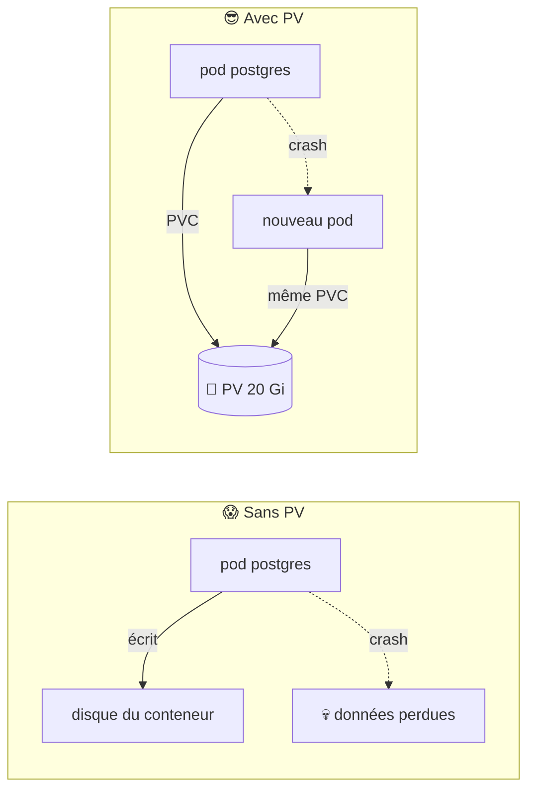
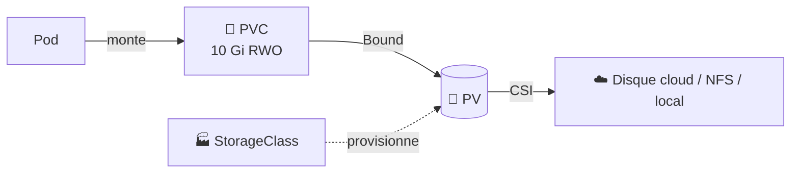
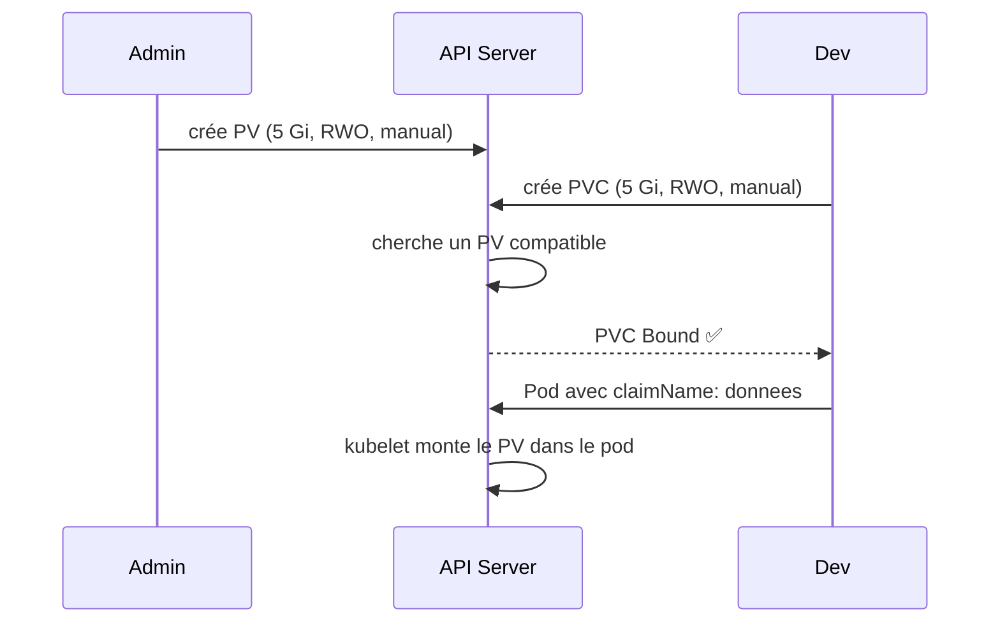
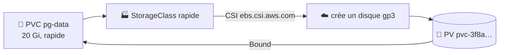
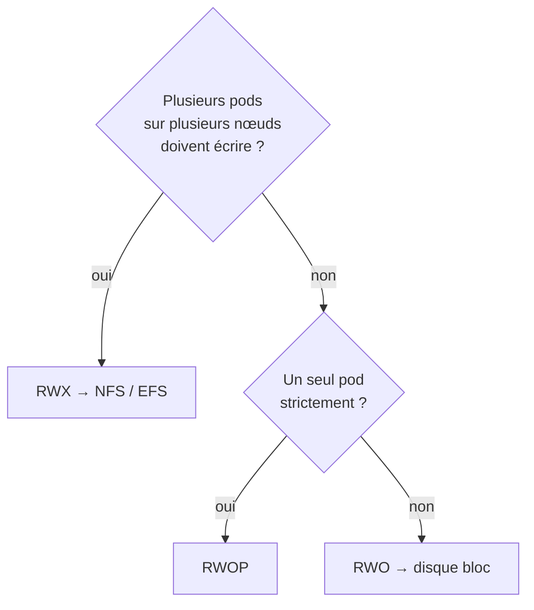
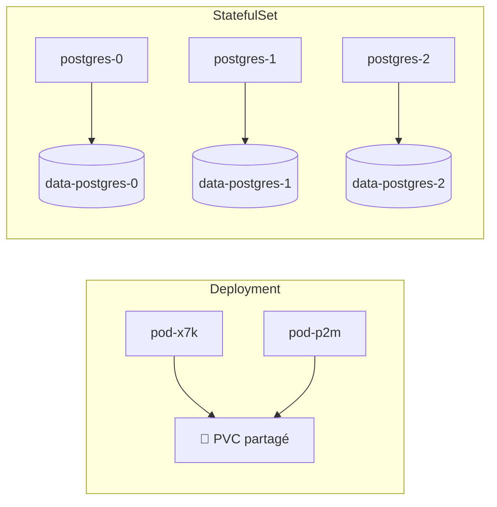
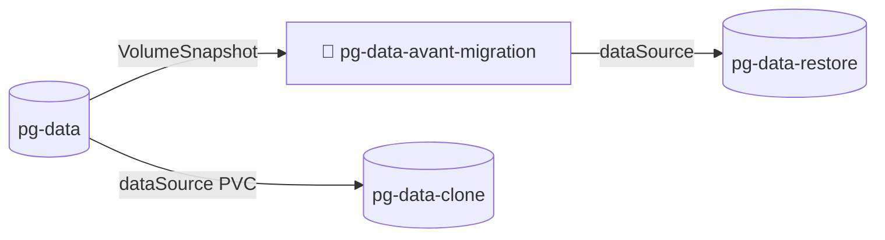

<div align="center">

# 💾 112 — Stockage pour les nuls

### *PV, PVC et StorageClasses : garder ses données quand les pods meurent*


</div>

---

## 📋 Sommaire

- [🎯 Objectifs](#-objectifs)
- [🤔 Pourquoi le stockage persistant ?](#-pourquoi-le-stockage-persistant-)
- [📖 Vocabulaire](#-vocabulaire)
- [1️⃣ Les volumes éphémères](#1️⃣-les-volumes-éphémères)
- [2️⃣ PV et PVC : le disque et le ticket](#2️⃣-pv-et-pvc--le-disque-et-le-ticket)
- [3️⃣ StorageClass : provisionnement dynamique](#3️⃣-storageclass--provisionnement-dynamique)
- [4️⃣ Modes d'accès et politiques](#4️⃣-modes-daccès-et-politiques)
- [5️⃣ StatefulSet : un disque par pod](#5️⃣-statefulset--un-disque-par-pod)
- [6️⃣ Redimensionner, snapshoter, cloner](#6️⃣-redimensionner-snapshoter-cloner)
- [7️⃣ Bonnes pratiques](#7️⃣-bonnes-pratiques)
- [🧪 Exercices](#-exercices)
- [🩺 Dépannage](#-dépannage)
- [📝 Mémo](#-mémo)
- [✅ Checklist](#-checklist)
- [☕ Fil rouge Spring Boot](#-fil-rouge-spring-boot)

---

## 🎯 Objectifs

> [!NOTE]
> À la fin de ce module, vous saurez :

- ✅ Distinguer un volume **éphémère** (`emptyDir`) d'un volume **persistant**
- ✅ Expliquer le trio **PV / PVC / StorageClass** et qui crée quoi
- ✅ Demander un disque avec un **PVC** et le monter dans un pod
- ✅ Choisir le bon **accessMode** et la bonne **reclaimPolicy**
- ✅ Déployer une base de données avec un **StatefulSet** et `volumeClaimTemplates`
- ✅ **Agrandir** un volume et faire un **VolumeSnapshot**
- ✅ Diagnostiquer un PVC bloqué en `Pending`

---

## 🤔 Pourquoi le stockage persistant ?

Dans le 111, l'HPA crée et supprime des pods à volonté. Très bien pour `backend`… catastrophique pour PostgreSQL : chaque redémarrage = base vide.



> [!IMPORTANT]
> Le système de fichiers d'un conteneur est **jetable**. Tout ce qui doit survivre au pod doit être sur un volume persistant.

---

## 📖 Vocabulaire

| Terme | Analogie | Définition |
|-------|----------|------------|
| 📦 **Volume** | Le tiroir | Un répertoire monté dans un ou plusieurs conteneurs du pod |
| 🗑️ **emptyDir** | Le brouillon | Volume vide créé avec le pod, supprimé avec lui |
| 💾 **PV** (PersistentVolume) | Le disque physique | Ressource cluster représentant un espace de stockage réel |
| 🎫 **PVC** (PersistentVolumeClaim) | Le ticket de demande | « Je veux 10 Gi en lecture/écriture » — namespacé |
| 🏭 **StorageClass** | Le catalogue | Décrit un **type** de stockage et comment le provisionner automatiquement |
| 🔌 **CSI** | La prise universelle | *Container Storage Interface* : le driver qui parle au stockage (EBS, Ceph, NFS…) |
| 🔗 **Bound** | Ticket honoré | État d'un PVC rattaché à un PV |
| ♻️ **reclaimPolicy** | Que faire du disque après | `Retain` (garder) ou `Delete` (supprimer) quand le PVC disparaît |
| 🔐 **accessMode** | Qui peut ouvrir le tiroir | `RWO`, `ROX`, `RWX`, `RWOP` |
| 📸 **VolumeSnapshot** | La photo | Copie instantanée d'un PVC |



---

## 1️⃣ Les volumes éphémères

Avant de persister, sachez ce qui **ne** persiste **pas**.

```yaml
apiVersion: v1
kind: Pod
metadata:
  name: demo-emptydir
spec:
  containers:
    - name: writer
      image: busybox
      command: ["sh", "-c", "while true; do date >> /cache/log; sleep 5; done"]
      volumeMounts:
        - { name: cache, mountPath: /cache }
    - name: reader
      image: busybox
      command: ["sh", "-c", "tail -f /cache/log"]
      volumeMounts:
        - { name: cache, mountPath: /cache }
  volumes:
    - name: cache
      emptyDir:
        sizeLimit: 500Mi
        # medium: Memory   ← tmpfs en RAM
```

| Type | Vit tant que | Usage |
|------|--------------|-------|
| `emptyDir` | Le **pod** existe | Cache, partage entre conteneurs d'un pod |
| `configMap` / `secret` | Le pod existe | Config injectée (module 105) |
| `hostPath` | Le **nœud** existe | ⚠️ Debug, agents système uniquement |

> [!WARNING]
> `hostPath` lie le pod au nœud et ouvre le système de fichiers hôte. Bloqué par les Pod Security Standards `restricted` du 110. Ne l'utilisez jamais pour des données applicatives.

> [!TIP]
> **Q1. Un conteneur redémarre (`CrashLoopBackOff`) : le contenu de son `emptyDir` est‑il perdu ?**
> <details><summary>Réponse</summary>
>
> Non. `emptyDir` survit aux redémarrages de **conteneur** ; il est perdu quand le **pod** est supprimé ou déplacé.
> </details>

---

## 2️⃣ PV et PVC : le disque et le ticket

### 2.1 Provisionnement statique (pour comprendre)

L'admin crée le disque, le dev le réclame.

<details open>
<summary>📄 <code>storage/pv-manuel.yaml</code> (admin)</summary>

```yaml
apiVersion: v1
kind: PersistentVolume
metadata:
  name: pv-donnees-01
spec:
  capacity:
    storage: 5Gi
  accessModes: [ReadWriteOnce]
  persistentVolumeReclaimPolicy: Retain
  storageClassName: manual
  hostPath:                       # uniquement pour la démo locale
    path: /mnt/data/pv-01
```
</details>

<details open>
<summary>📄 <code>storage/pvc-donnees.yaml</code> (dev)</summary>

```yaml
apiVersion: v1
kind: PersistentVolumeClaim
metadata:
  name: donnees
  namespace: prod
spec:
  accessModes: [ReadWriteOnce]
  storageClassName: manual
  resources:
    requests:
      storage: 5Gi
```
</details>

```bash
kubectl apply -f storage/pv-manuel.yaml
kubectl apply -f storage/pvc-donnees.yaml
kubectl get pv,pvc -n prod
```

```text
NAME                            CAPACITY  ACCESS MODES  RECLAIM POLICY  STATUS  CLAIM
persistentvolume/pv-donnees-01  5Gi       RWO           Retain          Bound   prod/donnees

NAME                            STATUS  VOLUME         CAPACITY  ACCESS MODES  STORAGECLASS
persistentvolumeclaim/donnees   Bound   pv-donnees-01  5Gi       RWO           manual
```

### 2.2 Monter le PVC dans un pod

```yaml
spec:
  containers:
    - name: app
      image: nginx
      volumeMounts:
        - name: data
          mountPath: /usr/share/nginx/html
  volumes:
    - name: data
      persistentVolumeClaim:
        claimName: donnees
```



> [!NOTE]
> Le PV est une ressource **cluster** (pas de namespace), le PVC est **namespacé**. Un PV ne peut être lié qu'à **un seul** PVC.

---

## 3️⃣ StorageClass : provisionnement dynamique

Créer les PV à la main ne passe pas à l'échelle. La **StorageClass** les crée à la demande.

```bash
kubectl get storageclass
```

```text
NAME                 PROVISIONER             RECLAIMPOLICY  VOLUMEBINDINGMODE     ALLOWVOLUMEEXPANSION
standard (default)   rancher.io/local-path   Delete         WaitForFirstConsumer  false
```

<details open>
<summary>📄 <code>storage/sc-rapide.yaml</code> (exemple AWS)</summary>

```yaml
apiVersion: storage.k8s.io/v1
kind: StorageClass
metadata:
  name: rapide
  annotations:
    storageclass.kubernetes.io/is-default-class: "false"
provisioner: ebs.csi.aws.com          # gce: pd.csi.storage.gke.io / azure: disk.csi.azure.com
parameters:
  type: gp3
  iops: "6000"
  encrypted: "true"
reclaimPolicy: Retain
allowVolumeExpansion: true
volumeBindingMode: WaitForFirstConsumer
```
</details>

Un PVC sans PV pré‑existant → la StorageClass crée le PV :

```yaml
apiVersion: v1
kind: PersistentVolumeClaim
metadata:
  name: pg-data
  namespace: prod
spec:
  accessModes: [ReadWriteOnce]
  storageClassName: rapide          # omis = classe par défaut
  resources:
    requests:
      storage: 20Gi
```



| `volumeBindingMode` | Quand le PV est créé | Pourquoi |
|---------------------|----------------------|----------|
| `Immediate` | Dès le PVC | Simple, mais le disque peut être dans la mauvaise zone |
| `WaitForFirstConsumer` | Quand un pod l'utilise | Le disque est créé **dans la zone du nœud** 👍 |

> [!TIP]
> **Q2. Mon PVC reste `Pending` avec `WaitForFirstConsumer`, est‑ce un bug ?**
> <details><summary>Réponse</summary>
>
> Non, c'est normal tant qu'aucun pod ne le monte. Créez le pod, le PVC passera `Bound`.
> </details>

---

## 4️⃣ Modes d'accès et politiques

### 4.1 accessModes

| Mode | Abrégé | Signifie | Exemple de stockage |
|------|--------|----------|---------------------|
| `ReadWriteOnce` | RWO | Un **nœud** en lecture/écriture | EBS, GCE PD, Azure Disk |
| `ReadOnlyMany` | ROX | Plusieurs nœuds en lecture | NFS, assets statiques |
| `ReadWriteMany` | RWX | Plusieurs nœuds en lecture/écriture | NFS, EFS, CephFS, Azure Files |
| `ReadWriteOncePod` | RWOP | Un **seul pod** | Bases de données (verrou strict) |



> [!WARNING]
> **RWO ≠ un seul pod.** Deux pods sur le **même nœud** peuvent monter un RWO. Un Deployment à 2 replicas avec un PVC RWO échoue dès que le scheduler les place sur deux nœuds différents (`Multi-Attach error`).

### 4.2 reclaimPolicy

| Politique | Suppression du PVC → | Usage |
|-----------|----------------------|-------|
| `Delete` | PV **et disque** supprimés | Dev, données recalculables |
| `Retain` | PV passe en `Released`, disque conservé | **Prod** : récupération manuelle possible |

```bash
# Changer la politique d'un PV existant (avant qu'il soit trop tard)
kubectl patch pv pvc-3f8a… -p '{"spec":{"persistentVolumeReclaimPolicy":"Retain"}}'
```

> [!IMPORTANT]
> Un PV `Released` ne se re‑lie **pas** automatiquement. Pour le réutiliser : `kubectl edit pv` et supprimer le bloc `spec.claimRef`.

---

## 5️⃣ StatefulSet : un disque par pod

Un Deployment partage **un** PVC entre tous ses replicas. Une base répliquée (PostgreSQL, Kafka, Elasticsearch) veut **un PVC par pod**, stable dans le temps : c'est le **StatefulSet**.

<details open>
<summary>📄 <code>storage/statefulset-postgres.yaml</code></summary>

```yaml
apiVersion: v1
kind: Service
metadata:
  name: postgres
  namespace: prod
spec:
  clusterIP: None                 # headless : DNS par pod
  selector: { app: postgres }
  ports: [{ port: 5432 }]
---
apiVersion: apps/v1
kind: StatefulSet
metadata:
  name: postgres
  namespace: prod
spec:
  serviceName: postgres
  replicas: 3
  selector:
    matchLabels: { app: postgres }
  template:
    metadata:
      labels: { app: postgres }
    spec:
      securityContext: { fsGroup: 999 }       # le volume appartient au groupe postgres
      containers:
        - name: postgres
          image: postgres:16
          envFrom:
            - secretRef: { name: postgres-secret }
          ports: [{ containerPort: 5432 }]
          volumeMounts:
            - name: data
              mountPath: /var/lib/postgresql/data
          resources:
            requests: { cpu: 250m, memory: 512Mi }
            limits:   { cpu: "1",  memory: 1Gi }
  volumeClaimTemplates:                        # ← un PVC par pod, créé automatiquement
    - metadata:
        name: data
      spec:
        accessModes: [ReadWriteOnce]
        storageClassName: rapide
        resources:
          requests: { storage: 20Gi }
```
</details>

```bash
kubectl apply -f storage/statefulset-postgres.yaml
kubectl get pods,pvc -n prod -l app=postgres
```

```text
NAME             READY  STATUS   RESTARTS
pod/postgres-0   1/1    Running  0
pod/postgres-1   1/1    Running  0
pod/postgres-2   1/1    Running  0

NAME              STATUS  VOLUME      CAPACITY
pvc/data-postgres-0  Bound   pvc-a1…  20Gi
pvc/data-postgres-1  Bound   pvc-b2…  20Gi
pvc/data-postgres-2  Bound   pvc-c3…  20Gi
```



| Deployment | StatefulSet |
|------------|-------------|
| Noms aléatoires | Noms stables `postgres-0`, `-1`, `-2` |
| Démarrage parallèle | Démarrage **ordonné** (0 puis 1 puis 2) |
| Un PVC partagé (ou aucun) | `volumeClaimTemplates` = un PVC par pod |
| DNS du Service | DNS par pod : `postgres-0.postgres.prod.svc` |

> [!WARNING]
> Supprimer un StatefulSet **ne supprime pas** ses PVC (sécurité). Pour repartir de zéro : `kubectl delete pvc -l app=postgres -n prod`. Depuis K8s 1.27, `persistentVolumeClaimRetentionPolicy` permet de régler ça.

> [!TIP]
> Pour une vraie base en prod, préférez un **opérateur** (CloudNativePG, Zalando, Strimzi pour Kafka) qui gère réplication, failover et sauvegardes au‑dessus du StatefulSet.

---

## 6️⃣ Redimensionner, snapshoter, cloner

### 6.1 Agrandir un volume

Condition : `allowVolumeExpansion: true` sur la StorageClass.

```bash
kubectl patch pvc pg-data -n prod -p '{"spec":{"resources":{"requests":{"storage":"40Gi"}}}}'
kubectl get pvc pg-data -n prod -w
kubectl describe pvc pg-data -n prod | grep -A3 Conditions
```

```text
Conditions:
  Type                      Status
  FileSystemResizePending   True     ← redémarrer le pod si le driver ne fait pas online
```

> [!NOTE]
> On peut **agrandir**, jamais **réduire**. Pour un StatefulSet, patcher chaque PVC individuellement (le `volumeClaimTemplates` est immuable).

### 6.2 Snapshot

<details open>
<summary>📄 <code>storage/snapshot-pg.yaml</code></summary>

```yaml
apiVersion: snapshot.storage.k8s.io/v1
kind: VolumeSnapshot
metadata:
  name: pg-data-avant-migration
  namespace: prod
spec:
  volumeSnapshotClassName: csi-snapclass
  source:
    persistentVolumeClaimName: pg-data
```
</details>

### 6.3 Restaurer ou cloner

```yaml
apiVersion: v1
kind: PersistentVolumeClaim
metadata:
  name: pg-data-restore
  namespace: prod
spec:
  accessModes: [ReadWriteOnce]
  storageClassName: rapide
  resources: { requests: { storage: 20Gi } }
  dataSource:
    kind: VolumeSnapshot            # ou kind: PersistentVolumeClaim pour un clone direct
    apiGroup: snapshot.storage.k8s.io
    name: pg-data-avant-migration
```



> [!IMPORTANT]
> Un snapshot n'est pas une sauvegarde : il vit dans le même cloud/cluster. Pour une vraie sauvegarde, exportez (`pg_dump` en CronJob vers S3) ou utilisez **Velero**.

---

## 7️⃣ Bonnes pratiques

| ✅ À faire | ❌ À éviter |
|-----------|-------------|
| `reclaimPolicy: Retain` en prod | `Delete` sur des données métier |
| `WaitForFirstConsumer` sur les disques bloc | `Immediate` en multi‑zones |
| `allowVolumeExpansion: true` | Devoir migrer pour 5 Gi de plus |
| StatefulSet (ou opérateur) pour les bases | Deployment + PVC RWO à 2 replicas |
| `fsGroup` dans le `securityContext` | `runAsUser: 0` pour « régler » les permissions |
| Snapshots + sauvegarde externe (Velero, dump) | Se croire sauvegardé grâce au snapshot |
| Mettre les `requests.storage` dans `values.yaml` | Tailles en dur dans les templates |
| Une StorageClass **par défaut**, bien nommée | Deux classes par défaut (le PVC échoue) |

```bash
# Où en est mon stockage ?
kubectl get pvc -A
kubectl get pv --sort-by=.spec.capacity.storage
kubectl exec -n prod postgres-0 -- df -h /var/lib/postgresql/data
```

---

## 🧪 Exercices

> [!NOTE]
> Faites les exercices dans l'ordre, chacun s'appuie sur le précédent.

### Exercice 1 — Éphémère vs persistant
Déployez `demo-emptydir`, écrivez un fichier, supprimez le pod, recréez‑le. Le fichier est‑il là ? Refaites la même chose avec un PVC.

### Exercice 2 — PVC dynamique
Créez un PVC `uploads` de 2 Gi avec la classe par défaut et montez‑le dans `backend` sur `/data/uploads`. Vérifiez `Bound` et `df -h` dans le pod.

### Exercice 3 — Multi‑Attach
Passez `backend` à 3 replicas avec ce PVC RWO. Observez l'erreur, expliquez‑la, puis corrigez (RWX ou suppression du volume partagé).

### Exercice 4 — StatefulSet
Déployez le StatefulSet `postgres` à 1 replica. Insérez une ligne, supprimez le pod, vérifiez que la ligne est toujours là.

### Exercice 5 — Expansion et snapshot
Agrandissez `data-postgres-0` de 20 à 30 Gi. Prenez un snapshot, créez un PVC `pg-data-restore` depuis ce snapshot et montez‑le dans un pod `busybox` pour lister les fichiers.

<details>
<summary>💡 Solution exercice 3</summary>

```text
Warning  FailedAttachVolume  Multi-Attach error for volume "pvc-…"
Volume is already used by pod(s) backend-…
```

Le PVC RWO est déjà attaché à un autre nœud. Solutions : une StorageClass RWX (NFS/EFS), ou externaliser les uploads (S3/MinIO) et supprimer le volume du Deployment.
</details>

<details>
<summary>💡 Solution exercice 4 (vérification)</summary>

```bash
kubectl exec -n prod postgres-0 -- psql -U app -c "CREATE TABLE t(x int); INSERT INTO t VALUES (42);"
kubectl delete pod postgres-0 -n prod
kubectl wait -n prod --for=condition=Ready pod/postgres-0
kubectl exec -n prod postgres-0 -- psql -U app -c "SELECT * FROM t;"
```
</details>

---

## 🩺 Dépannage

| Symptôme | Cause probable | Solution |
|----------|----------------|----------|
| PVC `Pending`, aucun événement | `WaitForFirstConsumer` sans pod | Créer le pod qui monte le PVC |
| PVC `Pending` + `no persistent volumes available` | Statique : aucun PV compatible (taille, mode, classe) | Créer un PV ou passer en dynamique |
| PVC `Pending` + `storageclass not found` | Nom de classe erroné / aucune classe par défaut | `kubectl get sc`, corriger `storageClassName` |
| `Multi-Attach error` | PVC RWO monté depuis 2 nœuds | Un seul pod, ou RWX, ou StatefulSet |
| Pod `ContainerCreating` très long | Disque en cours d'attache / mauvaise zone | `kubectl describe pod`, vérifier la zone du nœud vs disque |
| `permission denied` dans le volume | UID du process ≠ propriétaire des fichiers | `securityContext.fsGroup` |
| PV `Released` non réutilisable | `claimRef` encore présent | `kubectl edit pv` → supprimer `spec.claimRef` |
| Expansion sans effet | `allowVolumeExpansion: false` ou driver sans resize online | Activer sur la SC, redémarrer le pod |
| Données perdues après `helm uninstall` | `reclaimPolicy: Delete` | `Retain` en prod, `helm.sh/resource-policy: keep` sur le PVC |
| StatefulSet bloqué sur `postgres-1` | `postgres-0` jamais `Ready` (démarrage ordonné) | Corriger le pod 0 en premier |

```bash
# Le trio de diagnostic
kubectl describe pvc <nom> -n prod          # événements de binding / provisionnement
kubectl describe pv <nom>                   # claimRef, reclaimPolicy, source CSI
kubectl get events -n prod --field-selector reason=FailedAttachVolume

# Le driver CSI est-il en vie ?
kubectl get pods -n kube-system -l app.kubernetes.io/component=csi-driver
kubectl get csidrivers
```

---

## 📝 Mémo

| Élément | Rôle |
|---------|------|
| `emptyDir` | Volume jetable, vit avec le pod |
| `PersistentVolume` | Le disque (ressource cluster) |
| `PersistentVolumeClaim` | La demande (namespacée), montée par le pod |
| `StorageClass` | Provisionne les PV à la demande via CSI |
| `accessModes: RWO / ROX / RWX / RWOP` | Qui peut monter, depuis combien de nœuds |
| `persistentVolumeReclaimPolicy: Retain` | Garder le disque après suppression du PVC |
| `volumeBindingMode: WaitForFirstConsumer` | Créer le disque dans la bonne zone |
| `volumeClaimTemplates` | Un PVC par pod (StatefulSet) |
| `securityContext.fsGroup` | Permissions correctes sur le volume |
| `VolumeSnapshot` + `dataSource` | Photo et restauration/clone |

```bash
# Les 3 commandes à connaître par cœur
kubectl get sc                                  # quelles classes j'ai
kubectl get pvc -n prod                         # mes demandes et leur état
kubectl describe pvc <nom> -n prod              # pourquoi ça bloque
```

---

## ✅ Checklist

- [ ] Je sais dire ce qui est perdu quand un pod meurt et ce qui ne l'est pas
- [ ] Je connais la StorageClass par défaut de mon cluster et son `reclaimPolicy`
- [ ] Mes PVC de prod sont sur une classe `Retain` et `allowVolumeExpansion: true`
- [ ] Je n'ai aucun Deployment multi‑replicas avec un PVC RWO
- [ ] Mes bases tournent en StatefulSet (ou via un opérateur) avec `volumeClaimTemplates`
- [ ] `fsGroup` est défini sur tous mes pods qui écrivent dans un volume
- [ ] J'ai déjà agrandi un PVC et restauré depuis un snapshot
- [ ] J'ai une sauvegarde **hors cluster** de mes données critiques
- [ ] Je sais lire `kubectl describe pvc` pour un `Pending`

## ☕ Fil rouge Spring Boot

> Suite du [fil rouge Spring Boot](105bis-spring-boot.md) : tout est dans [`112bis-spring-boot-advanced/`](112bis-spring-boot-advanced/) et s'exécute avec `./deploy.sh <module>` (`deploy`, `test`, `clean` ou les deux par défaut). Prérequis : `./deploy.sh build` une fois, puis `./deploy.sh 106`.

Jusqu'ici `order-service` stocke ses commandes dans **H2 en mémoire** : chaque Pod a sa propre base et tout disparaît au redémarrage. Ce module branche un **PostgreSQL en StatefulSet** avec un PVC.

```bash
cd day1/112bis-spring-boot-advanced
./deploy.sh 112
```

**Fichiers : [`112-storage/values.yaml`](112bis-spring-boot-advanced/112-storage/values.yaml)** → `postgres.enabled: true` : le chart crée un Secret, un Service headless, un StatefulSet `demo-postgres` avec `volumeClaimTemplates` (1 Gi), et injecte `SPRING_DATASOURCE_URL` + identifiants dans `order` (template `postgres.yaml` du chart).

**Ce que vérifie le test :** PVC `data-demo-postgres-0` *Bound*, readiness d'order qui annonce `"database":"PostgreSQL"`, les 2 Pods order voient le **même** nombre de commandes, et après `kubectl delete pod demo-postgres-0` les commandes sont toujours là sur le même PVC.

```bash
kubectl -n spring-helm get pvc,pv
kubectl -n spring-helm exec demo-postgres-0 -- psql -U demo -d orders -c 'select * from orders;'
./deploy.sh 112 clean      # retour à H2, PVC supprimé
./deploy.sh all clean      # tout nettoyer (105 → 112)
```

<div align="center">

**➡️ Module suivant : 113 — CI/CD : livrer sur Kubernetes avec GitOps** · *ou le TD ☕ [112bis — Spring Boot de Helm au stockage](112bis-spring-boot-advanced/README.md)*

</div>