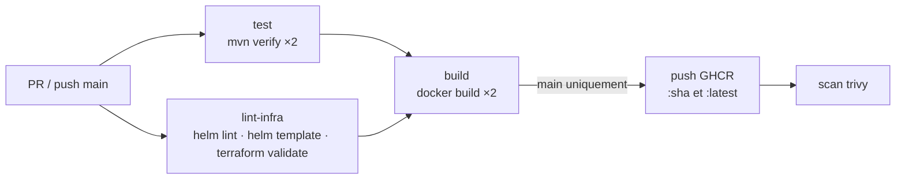

# 108 — CI/CD : le workflow GitHub Actions

Le fichier **`spring-demo.yml`** de ce dossier est une copie de lecture ; celui qui s'exécute est
[`.github/workflows/spring-demo.yml`](../../../.github/workflows/spring-demo.yml) (GitHub n'exécute que ce chemin).

## Ce que fait le pipeline



| Job | Déclencheur | Détail |
|-----|-------------|--------|
| `test` | PR + main | matrice `catalog-service` / `order-service`, JDK 21, `./mvnw -B verify`, rapports Surefire en artefacts |
| `lint-infra` | PR + main | `helm lint`, `helm template` avec **toutes** les briques 109→112 activées, `terraform fmt -check` + `validate` |
| `build` | PR + main | `docker/build-push-action` multi-stage ; **push seulement sur `main`** vers `ghcr.io/<owner>/<service>` |
| `scan` | main | `trivy image` HIGH/CRITICAL sur l'image publiée |

Le workflow ne se déclenche que si des fichiers de `day1/112bis-spring-boot-advanced/**` changent (`paths:`).

## Rejouer la CI en local

```bash
cd day1/112bis-spring-boot-advanced
./deploy.sh 108            # mvn verify ×2, helm lint/template, terraform validate, YAML du workflow
```

## Déployer l'image publiée par la CI

```bash
helm upgrade --install demo 106-helm/spring-demo -n spring-helm \
  --set catalog.image.repository=ghcr.io/<owner>/catalog-service \
  --set order.image.repository=ghcr.io/<owner>/order-service \
  --set catalog.image.tag=<sha> --set order.image.tag=<sha> --atomic
```

> Les paquets GHCR sont privés par défaut : rendez-les publics (Package settings) ou créez un
> `imagePullSecret` (`kubectl create secret docker-registry ghcr --docker-server=ghcr.io …`).
