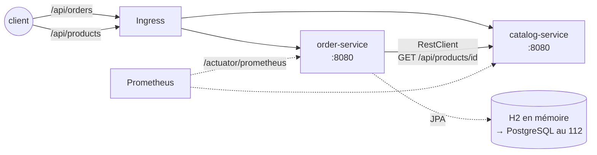
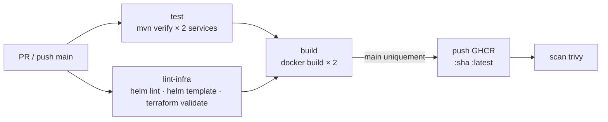

<div align="center">

# ☕ 112bis — Spring Boot sur Kubernetes, de Helm au stockage

### *Un TD guidé : vos deux micro-services traversent les modules 106 → 112*


</div>

---

## 📋 Sommaire

- [🎯 Objectifs](#-objectifs)
- [🧭 Comment travailler avec ce TD](#-comment-travailler-avec-ce-td)
- [📁 Contenu du dossier](#-contenu-du-dossier)
- [0️⃣ Préparation : cluster, images, premier déploiement](#0️⃣-préparation--cluster-images-premier-déploiement)
- [1️⃣ L'application : deux services Spring Boot](#1️⃣-lapplication--deux-services-spring-boot)
- [2️⃣ Module 106 — Packager avec Helm](#2️⃣-module-106--packager-avec-helm)
- [3️⃣ Module 107 — Déployer avec Terraform](#3️⃣-module-107--déployer-avec-terraform)
- [4️⃣ Module 108 — CI/CD avec GitHub Actions](#4️⃣-module-108--cicd-avec-github-actions)
- [5️⃣ Module 109 — Observabilité : Prometheus & Grafana](#5️⃣-module-109--observabilité--prometheus--grafana)
- [6️⃣ Module 110 — Sécurité : PSS, NetworkPolicies, RBAC](#6️⃣-module-110--sécurité--pss-networkpolicies-rbac)
- [7️⃣ Module 111 — Autoscaling : HPA & PDB](#7️⃣-module-111--autoscaling--hpa--pdb)
- [8️⃣ Module 112 — Stockage : PostgreSQL en StatefulSet](#8️⃣-module-112--stockage--postgresql-en-statefulset)
- [🤖 Le script `deploy.sh`](#-le-script-deploysh)
- [🧪 Exercices](#-exercices)
- [🩺 Dépannage](#-dépannage)
- [🧹 Nettoyage](#-nettoyage)
- [✅ Checklist](#-checklist)

---

## 🎯 Objectifs

> [!NOTE]
> Les TD 106 → 112 enseignent chaque outil sur des exemples simples (nginx, redis…). Ici, vous appliquez **tout** sur une **vraie application Java** que vous pouvez lire, modifier et casser.

À la fin de ce TD, vous saurez :

- ✅ Lire deux micro-services Spring Boot « cloud-ready » (Actuator, probes, métriques, config par env)
- ✅ Les packager dans **un seul chart Helm** paramétrable par environnement
- ✅ Les déployer avec **Terraform** (namespace + `helm_release`)
- ✅ Les tester, builder et publier avec **GitHub Actions**
- ✅ Les observer dans **Prometheus / Grafana** avec une métrique métier et des alertes
- ✅ Les **durcir** : Pod Security Standards, `securityContext`, NetworkPolicies, RBAC
- ✅ Les **autoscaler** avec un HPA et les protéger avec un PDB
- ✅ Leur donner une **vraie base de données** persistante (StatefulSet + PVC)

---

## 🧭 Comment travailler avec ce TD

Chaque module suit le même rythme :

1. **Lire** — l'explication et les fichiers concernés (tout est commenté).
2. **Faire** — les commandes à la main, pour comprendre.
3. **Vérifier** — `./deploy.sh <module> test` rejoue les vérifications automatiquement.

Pressé, ou bloqué ? `./deploy.sh <module>` fait **déployer + tester** d'un coup, et `./deploy.sh all` enchaîne tout (≈ 20 min). Voir [🤖 Le script](#-le-script-deploysh).

> [!IMPORTANT]
> **Un seul chart pour tout le parcours.** Le chart du module 106 contient déjà, *désactivés*, les objets des modules 109 → 112 (`ServiceMonitor`, `NetworkPolicy`, `HPA`, `StatefulSet`…). Chaque module n'ajoute qu'un fichier **`values.yaml`** qui en active une partie. C'est exactement ainsi qu'on fait évoluer une application en production : le code du chart grandit, les environnements choisissent.

---

## 📁 Contenu du dossier

```
112bis-spring-boot-advanced/
├── README.md                      ← ce TD
├── deploy.sh                      ← déploie / teste / nettoie chaque module
│
├── app/                           ☕ LE CODE  (voir app/README.md)
│   ├── catalog-service/           expose GET /api/products  (Spring Web + Actuator + Micrometer)
│   ├── order-service/             appelle catalog, POST /api/orders (Spring Data JPA : H2 → PostgreSQL)
│   ├── docker-compose.yaml        les deux services ensemble, sans Kubernetes
│   └── k8s/                       manifests bruts (point de départ, = module 105bis)
│
├── 106-helm/
│   ├── spring-demo/               le chart (Chart.yaml, values.yaml, templates/)
│   ├── values-dev.yaml            1 réplica, peu de ressources
│   └── values-prod.yaml           3 réplicas + toutes les briques 109→112
├── 107-terraform/                 namespace + helm_release (terraform ou tofu)
├── 108-cicd/                      README du pipeline + copie du workflow (.github/workflows/spring-demo.yml)
├── 109-observability/             values (ServiceMonitor, PrometheusRule), kube-prometheus-stack, dashboard Grafana
├── 110-security/                  values (hardened, NetworkPolicy), RBAC lecture seule, scan trivy
├── 111-autoscaling/               values (HPA, PDB, requests) + générateur de charge
└── 112-storage/                   values (PostgreSQL)
```

**Namespaces utilisés** : `spring-demo` (manifests bruts), `spring-helm` (release Helm `demo`, modules 106 et 109→112), `spring-tf` (Terraform), `monitoring` (Prometheus/Grafana).

---

## 0️⃣ Préparation : cluster, images, premier déploiement

### Prérequis

| Outil | Pour | macOS |
|-------|------|-------|
| Minikube ≥ 1.33, kubectl | le cluster | `brew install minikube kubectl` |
| Docker Desktop | builder les images | — |
| Helm ≥ 3.14 | 106 → 112 | `brew install helm` |
| `terraform` **ou** `tofu` | 107 | `brew install opentofu` |
| Java 21 *(optionnel)* | lancer/tester en local, `./deploy.sh 108` ; les Dockerfiles compilent sans | `brew install openjdk@21` |
| `trivy` *(optionnel)* | scan d'images (110) | `brew install trivy` |

### Démarrer le cluster

```bash
minikube start --cpus 4 --memory 6g --cni=calico     # calico : indispensable pour les NetworkPolicies du 110
minikube addons enable ingress
minikube addons enable metrics-server
```

> [!WARNING]
> Sans `--cni=calico` (ou cilium), les NetworkPolicies sont **acceptées mais ignorées**. Si votre cluster existe déjà sans CNI : `minikube delete && minikube start --cni=calico`.

### Builder les images dans Minikube

Les Dockerfiles sont **multi-stage** (build Maven → image JRE minimale, utilisateur non-root). On construit directement dans le démon Docker de Minikube : pas de registre à gérer.

```bash
cd day1/112bis-spring-boot-advanced
./deploy.sh build
#   ✅ catalog-service:1.0.0, order-service:1.0.0
```

<details>
<summary>À la main (équivalent)</summary>

```bash
eval "$(minikube docker-env)"
docker build -t catalog-service:1.0.0 app/catalog-service
docker build -t order-service:1.0.0   app/order-service
```
</details>

### Premier déploiement : les manifests bruts

Avant Helm, déployons l'application telle qu'elle sort du module 105bis — 5 fichiers YAML dans `app/k8s/` :

```bash
kubectl apply -f app/k8s/
kubectl -n spring-demo get pods -w        # attendez 2/2 Running… Ctrl-C
kubectl -n spring-demo exec deploy/order -- wget -qO- http://catalog:8080/api/products/whoami
# {"hostname":"catalog-7c…","environment":"kubernetes"}
```

```bash
./deploy.sh 105 test
#   ✅ catalog répond et lit la ConfigMap
#   ✅ order appelle catalog
#   ✅ catalog à 0 → order NotReady (readiness)
#   ✅ …mais pas redémarré (liveness OK)
#   ✅ catalog revenu → order Ready
```

Ce dernier test est **le** comportement à retenir : quand sa dépendance tombe, `order` sort du Service (readiness `DOWN`) **sans être redémarré** (liveness `UP`). On y revient dans la section suivante.

---

## 1️⃣ L'application : deux services Spring Boot



| Service | Rôle | Endpoints | Dépend de |
|---------|------|-----------|-----------|
| `catalog-service` | **Expose** un catalogue de 4 produits (en mémoire) | `GET /api/products`, `/api/products/{id}`, `/api/products/whoami` | personne |
| `order-service` | **Appelle** le catalogue pour valider une commande, puis l'enregistre | `POST /api/orders`, `GET /api/orders`, `/api/orders/{id}`, `/api/orders/whoami` | catalog (+ base) |

### Ce qui rend ces services « Kubernetes-ready »

| Besoin K8s | Côté Spring Boot | Fichier |
|------------|------------------|---------|
| Config par environnement | `catalog.url: ${CATALOG_URL:http://localhost:8080}` — surchargée par une variable d'env | `order-service/.../application.yaml` |
| Probes liveness / readiness | `management.endpoint.health.probes.enabled: true` → `/actuator/health/{liveness,readiness}` | `application.yaml` des deux |
| Readiness qui reflète les dépendances | `CatalogHealthIndicator` ajouté au groupe `readiness` (+ `db`) | `order-service/.../CatalogHealthIndicator.java` |
| Arrêt propre au `SIGTERM` | `server.shutdown: graceful` | `application.yaml` |
| Métriques Prometheus (109) | `micrometer-registry-prometheus` + compteur métier `orders.placed{outcome}` | `pom.xml`, `OrderController.java` |
| Base de données interchangeable (112) | Spring Data JPA ; H2 par défaut, PostgreSQL dès que `SPRING_DATASOURCE_URL` est fourni | `OrderRepository.java`, `application.yaml` |
| Image légère et non-root | Dockerfile multi-stage, `USER spring`, `-XX:MaxRAMPercentage` pour respecter les limites mémoire | `Dockerfile` |

<details>
<summary>📄 <code>CatalogHealthIndicator.java</code> — la readiness « intelligente »</summary>

```java
@Component("catalog")
public class CatalogHealthIndicator implements HealthIndicator {
    private final CatalogClient client;
    public CatalogHealthIndicator(CatalogClient client) { this.client = client; }

    @Override
    public Health health() {
        try {
            client.ping();                                   // GET /actuator/health/liveness du catalogue
            return Health.up().withDetail("catalog", "reachable").build();
        } catch (Exception e) {
            return Health.down().withDetail("catalog", e.getMessage()).build();
        }
    }
}
```

```yaml
# application.yaml (order-service)
management:
  endpoint:
    health:
      group:
        readiness:
          include: readinessState,catalog,db     # ← la readiness tombe si le catalogue OU la base tombe
```
</details>

<details>
<summary>📄 <code>Dockerfile</code> (identique pour les deux services)</summary>

```dockerfile
# ── Étape 1 : build (image Maven + JDK 21, jamais livrée) ───────────────────
FROM maven:3.9-eclipse-temurin-21 AS build
WORKDIR /app
COPY pom.xml .
RUN mvn -q -B dependency:go-offline        # cache des dépendances séparé du code
COPY src ./src
RUN mvn -q -B package -DskipTests

# ── Étape 2 : image finale (JRE seulement, non-root) ────────────────────────
FROM eclipse-temurin:21-jre-alpine
WORKDIR /app
RUN addgroup -S spring && adduser -S spring -G spring
USER spring
COPY --from=build /app/target/*.jar app.jar
EXPOSE 8080
ENTRYPOINT ["java", "-XX:MaxRAMPercentage=75", "-jar", "app.jar"]   # 75 % de la limite mémoire du conteneur
```
</details>

### Lancer en local (sans Kubernetes)

```bash
cd app && docker compose up --build
curl -s localhost:8082/api/orders -X POST -H 'Content-Type: application/json' -d '{"productId":2,"quantity":1}'
# {"id":1,"productId":2,"productName":"Mug Helm","quantity":1,"total":12.50,...}
docker compose down
```

Le détail du code (structure Maven, tests, endpoints, variables d'environnement) est dans **[`app/README.md`](app/README.md)**.

---

## 2️⃣ Module 106 — Packager avec Helm

> 📚 Prérequis : [TD 106 — Helm pour les nuls](../106-helm-beginner.md)

### Le problème

`app/k8s/` fonctionne, mais : namespace et hôte d'Ingress codés en dur, impossible d'installer l'appli deux fois, pas de rollback, et les Deployments de `catalog` et `order` sont **copiés-collés à 90 %**.

### La solution : un chart avec un *template nommé*

```
106-helm/spring-demo/
├── Chart.yaml              version 0.1.0, appVersion 1.0.0 (= tag d'image par défaut)
├── values.yaml             TOUS les réglages, commentés, briques 109→112 désactivées
└── templates/
    ├── _helpers.tpl        ★ "spring-demo.component" : Deployment + Service d'un micro-service
    ├── catalog.yaml        3 lignes : include "spring-demo.component" avec .Values.catalog
    ├── order.yaml          idem avec .Values.order
    ├── configmaps.yaml     CATALOG_URL, CATALOG_ENVIRONMENT, SPRING_DATASOURCE_URL (si postgres)
    ├── ingress.yaml
    ├── NOTES.txt           affiché après install : récapitule les briques actives
    ├── tests/test-api.yaml helm test : POST /api/orders depuis l'intérieur du cluster
    ├── hpa.yaml · pdb.yaml · networkpolicy.yaml · serviceaccount.yaml      (110-111, désactivés)
    └── servicemonitor.yaml · prometheusrule.yaml · postgres.yaml           (109, 112, désactivés)
```

```yaml
# templates/catalog.yaml — tout le Deployment + Service tient là
{{- include "spring-demo.component" (dict "root" . "name" "catalog" "svc" .Values.catalog) }}
```

Ouvrez **`templates/_helpers.tpl`** et repérez :

- `spring-demo.component` : le Deployment (probes startup/liveness/readiness, `envFrom` ConfigMap, resources) **et** le Service, écrits une fois pour deux services ;
- l'annotation `checksum/config` : hachage des `env` → un changement de ConfigMap **redémarre les Pods** (sinon ils gardent l'ancien environnement) ;
- les blocs `{{- if .root.Values.security.hardened }}`, `{{- if not .svc.autoscaling.enabled }}`, `{{- if … postgres.enabled }}` : les crochets des modules suivants.

### À faire

```bash
cd day1/112bis-spring-boot-advanced
helm lint 106-helm/spring-demo
helm template demo 106-helm/spring-demo | less              # le YAML généré (8 objets)
helm template demo 106-helm/spring-demo -f 106-helm/values-prod.yaml | grep ^kind:   # 22 objets !

helm install demo 106-helm/spring-demo -n spring-helm --create-namespace \
  --set catalog.image.tag=1.0.0 --set order.image.tag=1.0.0 --set ingress.host=spring-helm.local --wait
helm test demo -n spring-helm                                # ✅ spring-demo OK
```

Upgrade, rollback, historique :

```bash
helm upgrade demo 106-helm/spring-demo -n spring-helm --reuse-values --set catalog.env.CATALOG_ENVIRONMENT=upgraded --wait
kubectl -n spring-helm exec deploy/demo-order -- wget -qO- http://demo-catalog:8080/api/products/whoami
# {"environment":"upgraded"}  ← grâce à checksum/config
helm rollback demo -n spring-helm --wait
helm history demo -n spring-helm
```

```bash
./deploy.sh 106 test
```

> [!TIP]
> `--set ingress.host=spring-helm.local` : l'admission webhook d'ingress-nginx refuse deux Ingress avec le **même hôte + chemin**, même dans des namespaces différents. Chaque namespace a donc son hôte (`spring.local`, `spring-helm.local`, `spring-tf.local`).

---

## 3️⃣ Module 107 — Déployer avec Terraform

> 📚 Prérequis : [TD 107 — Terraform pour les nuls](../107-terrform-beginner.md)

### Pourquoi, puisque Helm suffit ?

Helm déploie *l'application*. Terraform déploie **tout ce qu'il y a autour** (namespaces, quotas, labels de sécurité, bases managées, DNS…) **et** l'application, dans un seul `plan` relu avant `apply`. En 4 fichiers :

| Fichier | Contenu |
|---------|---------|
| `versions.tf` | providers `kubernetes` + `helm`, lisant le kubeconfig (contexte `minikube`) |
| `main.tf` | `kubernetes_namespace_v1` (avec labels Pod Security `warn/audit=restricted`) puis `helm_release` du chart local `../106-helm/spring-demo`, `atomic = true` |
| `variables.tf` | `namespace`, `environment`, `replicas` (validé 1–10), `image_tag`, `ingress_host` → injectés dans les values du chart avec des blocs `set {}` |
| `outputs.tf` | URLs internes des services |

```hcl
resource "helm_release" "spring_demo" {
  name      = var.release_name
  namespace = kubernetes_namespace_v1.app.metadata[0].name   # ← dépendance implicite : le namespace d'abord
  chart     = "${path.module}/../106-helm/spring-demo"
  atomic    = true                                            # rollback auto si les pods ne sont pas prêts
  set { name = "catalog.env.CATALOG_ENVIRONMENT"  value = var.environment }
  set { name = "catalog.replicaCount"             value = var.replicas }
  # …
}
```

### À faire

```bash
cd 107-terraform
tofu init                                 # ou terraform init
tofu plan                                 # lisez : + 2 ressources
tofu apply -auto-approve
tofu output
kubectl get ns spring-tf --show-labels    # pod-security.kubernetes.io/warn=restricted

tofu plan                                 # No changes. ← idempotence
tofu apply -auto-approve -var replicas=3  # un changement de variable = un rollout
kubectl -n spring-tf get deploy
cd ..
./deploy.sh 107 test
```

> [!NOTE]
> Le `terraform.tfstate` est écrit **en local** (ignoré par git). En équipe, on le met dans un backend distant (S3 + verrou, GCS, Terraform Cloud) — voir TD 107 §4.

---

## 4️⃣ Module 108 — CI/CD avec GitHub Actions

> 📚 Prérequis : [TD 108 — CI/CD & automatisation](../108-cicd-automation.md)

Le workflow [`.github/workflows/spring-demo.yml`](../../.github/workflows/spring-demo.yml) (copie commentée dans [`108-cicd/`](108-cicd/)) se déclenche sur toute modification de ce dossier :



Points à remarquer dans le YAML :

- `strategy.matrix.service: [catalog-service, order-service]` → les deux services testés **en parallèle** ;
- `lint-infra` rend le chart avec **toutes** les values 109 → 112 : on détecte un template cassé avant de déployer ;
- `push: ${{ github.event_name != 'pull_request' }}` : une PR builde sans publier ;
- `permissions: packages: write` + `GITHUB_TOKEN` : aucun secret à créer pour pousser sur GHCR ;
- tags d'image `:<sha>` (immuable, pour déployer) **et** `:latest` (pratique, jamais en prod).

### À faire

```bash
./deploy.sh 108            # rejoue la CI en local : mvn verify, helm lint/template, tf validate
```

Puis sur GitHub : poussez une branche qui modifie `app/catalog-service/src/.../ProductController.java` (cassez un test exprès), ouvrez une PR, observez l'onglet *Actions*. Une fois mergé sur `main`, déployez l'image publiée (voir [`108-cicd/README.md`](108-cicd/README.md)).

---

## 5️⃣ Module 109 — Observabilité : Prometheus & Grafana

> 📚 Prérequis : [TD 109 — Observabilité](../109-observability.md)

### Côté application : déjà fait

Le `pom.xml` contient `micrometer-registry-prometheus`, `application.yaml` expose `/actuator/prometheus` et active les histogrammes de latence ; `OrderController` incrémente un compteur **métier** :

```java
this.placed   = Counter.builder("orders.placed").tag("outcome", "success").register(registry);
this.rejected = Counter.builder("orders.placed").tag("outcome", "rejected").register(registry);
```

→ exposé comme `orders_placed_total{outcome="success"}`. Les 4 signaux dorés viennent *gratuitement* de `http_server_requests_seconds_*` (trafic, erreurs, latence) et de cAdvisor (saturation).

### Côté cluster : trois fichiers

| Fichier | Rôle |
|---------|------|
| `kube-prometheus-stack-values.yaml` | installe Prometheus Operator + Grafana + Alertmanager, allégés pour Minikube ; `serviceMonitorSelectorNilUsesHelmValues: false` pour que Prometheus découvre **nos** `ServiceMonitor` |
| `values.yaml` | `metrics.serviceMonitor.enabled` + `metrics.prometheusRule.enabled` → le chart génère les deux objets (templates `servicemonitor.yaml`, `prometheusrule.yaml`) |
| `grafana-dashboard.yaml` | ConfigMap labellisée `grafana_dashboard: "1"` : le sidecar Grafana l'importe tout seul |

Les alertes définies (`templates/prometheusrule.yaml`) : `SpringDemoHighErrorRate` (5xx > 5 %), `SpringDemoOrderNotReady` (aucun Pod `order` disponible), `SpringDemoNoOrders` (plus aucune commande depuis 10 min — une alerte **métier**).

### À faire

```bash
helm repo add prometheus-community https://prometheus-community.github.io/helm-charts
helm upgrade --install monitoring prometheus-community/kube-prometheus-stack -n monitoring --create-namespace \
  -f 109-observability/kube-prometheus-stack-values.yaml --wait --timeout 10m
kubectl apply -f 109-observability/grafana-dashboard.yaml

helm upgrade demo 106-helm/spring-demo -n spring-helm --reuse-values -f 109-observability/values.yaml --wait
kubectl -n spring-helm get servicemonitor,prometheusrule
```

Générez quelques commandes, puis regardez :

```bash
kubectl -n monitoring port-forward svc/monitoring-kube-prometheus-prometheus 9090 &
open http://localhost:9090/targets                       # catalog + order en UP
# PromQL : sum(rate(orders_placed_total[1m])) by (outcome)
kubectl -n monitoring port-forward svc/monitoring-grafana 3000:80 &
open http://localhost:3000                               # admin / admin → Dashboards → ☕ spring-demo
```

```bash
./deploy.sh 109 test
```

> Déclenchez une alerte : `kubectl -n spring-helm scale deploy/demo-catalog --replicas=0`, attendez 2 min, onglet *Alerts* de Prometheus → `SpringDemoOrderNotReady` passe *Pending* puis *Firing*. Remettez `--replicas=2`.

---

## 6️⃣ Module 110 — Sécurité : PSS, NetworkPolicies, RBAC

> 📚 Prérequis : [TD 110 — Sécurité](../110-security.md)

Quatre couches, du Pod au cluster :

| Couche | Mécanisme | Où |
|--------|-----------|----|
| **Le conteneur** | `security.hardened: true` → `runAsNonRoot`, `runAsUser: 10001`, `readOnlyRootFilesystem`, `drop: [ALL]`, `seccompProfile: RuntimeDefault`, pas de privilege escalation ; `emptyDir` sur `/tmp` car la JVM écrit dedans | `templates/_helpers.tpl` |
| **Le namespace** | labels Pod Security Standards `enforce=restricted` : tout Pod non conforme est **refusé** à la création | `kubectl label ns …` |
| **Le réseau** | `security.networkPolicy.enabled` → *default-deny* puis flux explicites : ingress-nginx → catalog/order, order → catalog, order → postgres, monitoring → `/actuator/prometheus`, tous → DNS | `templates/networkpolicy.yaml` |
| **L'API Kubernetes** | ServiceAccount dédié sans token monté (`automountServiceAccountToken: false`) ; un compte `dev-readonly` (Role `get/list/watch`, **sans** Secrets) | `templates/serviceaccount.yaml`, `rbac-readonly.yaml` |

```yaml
# templates/networkpolicy.yaml (extrait) : qui a le droit de parler à order ?
spec:
  podSelector: { matchLabels: { app.kubernetes.io/name: order } }
  policyTypes: [Ingress, Egress]
  ingress:
    - from:
        - namespaceSelector: { matchLabels: { kubernetes.io/metadata.name: ingress-nginx } }
        - namespaceSelector: { matchLabels: { kubernetes.io/metadata.name: monitoring } }
  egress:
    - to: [{ podSelector: { matchLabels: { app.kubernetes.io/name: catalog } } }]
    - to: [{ podSelector: { matchLabels: { app.kubernetes.io/name: postgres } } }]
```

### À faire

```bash
kubectl label ns spring-helm pod-security.kubernetes.io/enforce=restricted pod-security.kubernetes.io/warn=restricted --overwrite
helm upgrade demo 106-helm/spring-demo -n spring-helm --reuse-values -f 110-security/values.yaml --wait
kubectl -n spring-helm apply -f 110-security/rbac-readonly.yaml

# 1. le conteneur
kubectl -n spring-helm exec deploy/demo-order -- id                 # uid=10001
kubectl -n spring-helm exec deploy/demo-order -- touch /app/x       # Read-only file system
# 2. le namespace
kubectl -n spring-helm run bad --image=nginx --restart=Never        # violates PodSecurity "restricted"
# 3. le réseau
kubectl -n spring-helm exec deploy/demo-order   -- wget -qO- -T5 http://demo-catalog:8080/api/products/whoami   # OK
kubectl -n spring-helm exec deploy/demo-catalog -- wget -qO- -T5 http://demo-order:8080/api/orders              # timeout ✋
# 4. l'API
kubectl -n spring-helm auth can-i list pods   --as=system:serviceaccount:spring-helm:dev-readonly   # yes
kubectl -n spring-helm auth can-i get secrets --as=system:serviceaccount:spring-helm:dev-readonly   # no
# bonus : CVE des images
110-security/scan-images.sh
```

```bash
./deploy.sh 110 test
```

> [!IMPORTANT]
> Pourquoi `readOnlyRootFilesystem` casse souvent les applis Java : la JVM, Tomcat et les bibliothèques natives écrivent dans `/tmp`. La solution n'est **pas** de désactiver l'option, mais de monter un `emptyDir` sur `/tmp` — c'est ce que fait le chart.

---

## 7️⃣ Module 111 — Autoscaling : HPA & PDB

> 📚 Prérequis : [TD 111 — Autoscaling](../111-autoscaling.md)

`111-autoscaling/values.yaml` fait trois choses :

1. `catalog.autoscaling.enabled: true` → le chart **retire `spec.replicas`** du Deployment (sinon chaque `helm upgrade` écraserait la décision de l'HPA) et crée un `HorizontalPodAutoscaler` (2 → 6 Pods, cible 50 % CPU, `stabilizationWindowSeconds: 60` à la descente) ;
2. `catalog.resources.requests.cpu: 100m` → **sans request, pas d'HPA** : le pourcentage est calculé par rapport à la request ;
3. `podDisruptionBudget.enabled: true, minAvailable: 1` → un `kubectl drain` ne pourra jamais évincer le dernier Pod de chaque service.

### À faire

```bash
helm upgrade demo 106-helm/spring-demo -n spring-helm --reuse-values -f 111-autoscaling/values.yaml --wait
kubectl -n spring-helm get hpa,pdb
kubectl -n spring-helm top pods                                  # metrics-server fonctionne ?

kubectl -n spring-helm apply -f 111-autoscaling/load-generator.yaml   # 5 Pods busybox, 3 minutes
kubectl -n spring-helm get hpa demo-catalog -w
# NAME           REFERENCE                 TARGETS        MINPODS   MAXPODS   REPLICAS
# demo-catalog   Deployment/demo-catalog   cpu: 272%/50%  2         6         2
# demo-catalog   Deployment/demo-catalog   cpu: 180%/50%  2         6         4      ← scale-up
kubectl -n spring-helm delete job load-generator
# … 1 à 2 minutes plus tard : REPLICAS 2                                     ← scale-down
```

```bash
./deploy.sh 111 test          # ≈ 5 min
```

> [!NOTE]
> Le Job de charge porte le label `app.kubernetes.io/name: test` : c'est le seul moyen pour lui de traverser les NetworkPolicies du module 110, et il respecte le profil PSS *restricted*.

---

## 8️⃣ Module 112 — Stockage : PostgreSQL en StatefulSet

> 📚 Prérequis : [TD 112 — Stockage](../112-storage.md)

### Le problème

Jusqu'ici `order-service` utilise **H2 en mémoire** : chaque Pod a *sa* base. Faites le test : `curl …/api/orders/whoami` plusieurs fois → le compteur `orders` change selon le Pod qui répond, et tout disparaît à chaque redémarrage.

### La solution : zéro ligne de Java

`postgres.enabled: true` dans `112-storage/values.yaml` déclenche dans le chart (`templates/postgres.yaml`) :

- un **Secret** (`POSTGRES_DB/USER/PASSWORD`) ;
- un **Service headless** (`clusterIP: None`, requis par un StatefulSet → DNS stable `demo-postgres-0.demo-postgres`) ;
- un **StatefulSet** à 1 réplica avec `volumeClaimTemplates` (→ PVC `data-demo-postgres-0`, 1 Gi, StorageClass par défaut) et des probes `pg_isready` ;
- et dans `order` : `SPRING_DATASOURCE_URL=jdbc:postgresql://demo-postgres:5432/orders` via la ConfigMap, user/password via `secretKeyRef`.

Spring Boot détecte le driver PostgreSQL (déjà dans le `pom.xml`) et Hibernate crée la table `orders`. La readiness d'`order` inclut `db` : si la base tombe, le Pod sort du Service.

### À faire

```bash
helm upgrade demo 106-helm/spring-demo -n spring-helm --reuse-values -f 112-storage/values.yaml --wait
kubectl -n spring-helm get sts,pvc,pv
kubectl -n spring-helm exec deploy/demo-order -- wget -qO- http://localhost:8080/actuator/health/readiness
# …"db":{"status":"UP","details":{"database":"PostgreSQL"…

# créez des commandes, puis tuez la base
kubectl -n spring-helm exec deploy/demo-order -- wget -qO- --post-data='{"productId":1,"quantity":2}' \
  --header='Content-Type: application/json' http://demo-order:8080/api/orders
kubectl -n spring-helm delete pod demo-postgres-0
kubectl -n spring-helm rollout status sts/demo-postgres
kubectl -n spring-helm exec deploy/demo-order -- wget -qO- http://demo-order:8080/api/orders   # toujours là ✅
kubectl -n spring-helm exec demo-postgres-0 -- psql -U orders -d orders -c 'select id, product_name, total from orders;'
```

```bash
./deploy.sh 112 test
```

> [!WARNING]
> Un PVC survit à la suppression du Pod **et** du StatefulSet, mais pas à `kubectl delete pvc` ni à la suppression du namespace. Et un volume n'est pas une sauvegarde : voir TD 112 §snapshots.

---

## 🤖 Le script `deploy.sh`

```bash
./deploy.sh build                 # images dans Minikube (FORCE_BUILD=1 pour reconstruire)
./deploy.sh 106                   # deploy + test du module
./deploy.sh 109 deploy            # déployer seulement
./deploy.sh 111 test              # tester seulement
./deploy.sh all                   # 105 → 112 enchaînés (≈ 20 min)
./deploy.sh status                # vue d'ensemble
./deploy.sh 112 clean             # revient à l'état du 111
./deploy.sh all clean             # tout retirer
```

Comment il est écrit (lisez-le, c'est un bon exemple de script d'exploitation) :

- `set -euo pipefail` et des helpers `step / ok / fail / run` ;
- `expect "<description>" "<regex>" cmd…` : exécute et vérifie la sortie — chaque ✅ du TD est un `expect` ;
- `wait_for <timeout> "<description>" cmd…` : boucle jusqu'au succès (rollouts, HPA, Prometheus) ;
- `helm_apply <module>` : **empile** les values 109 → 112 jusqu'au module demandé, sur la même release ;
- `kcurl` : un `curl` lancé dans un Pod éphémère du namespace `ingress-nginx` — le seul autorisé à entrer par les NetworkPolicies ;
- les modules 109 → 112 installent automatiquement le 106 si la release n'existe pas.

Variables : `NS` (défaut `spring-helm`), `RELEASE` (`demo`), `TAG` (`1.0.0`), `INGRESS_HOST` (`spring-helm.local`).

---

## 🧪 Exercices

<details>
<summary>🟢 <b>Exercice 1 — Un troisième environnement</b></summary>

Créez `106-helm/values-staging.yaml` (2 réplicas, hôte `spring-staging.local`, métriques activées, pas de durcissement) et installez-le dans un namespace `spring-staging` sous le nom de release `staging`. Vérifiez que les Services s'appellent `staging-catalog` / `staging-order`.
</details>

<details>
<summary>🟢 <b>Exercice 2 — Une variable Terraform de plus</b></summary>

Ajoutez `variable "ingress_enabled"` (bool, défaut `true`) à `107-terraform/` et passez-la au chart (`ingress.enabled`). `tofu apply -var ingress_enabled=false` doit supprimer l'Ingress et rien d'autre (lisez le plan !).
</details>

<details>
<summary>🟠 <b>Exercice 3 — Une nouvelle métrique</b></summary>

Dans `OrderController`, ajoutez un `DistributionSummary` `orders.amount` (montant des commandes). Rebuildez (`FORCE_BUILD=1 ./deploy.sh build`), redéployez, et ajoutez un panneau « panier moyen » au dashboard (`grafana-dashboard.yaml`) : `sum(rate(orders_amount_sum[5m])) / sum(rate(orders_amount_count[5m]))`.
</details>

<details>
<summary>🟠 <b>Exercice 4 — Casser la NetworkPolicy, puis la réparer</b></summary>

Supprimez la règle egress `order → catalog` dans `templates/networkpolicy.yaml`, faites `helm upgrade`. Que devient la readiness d'`order` ? (`kubectl get pods`, `/actuator/health/readiness`). Pourquoi est-ce une bonne nouvelle ? Remettez la règle.
</details>

<details>
<summary>🔴 <b>Exercice 5 — HPA sur une métrique métier</b></summary>

Avec le Prometheus Adapter (`prometheus-community/prometheus-adapter`), exposez `orders_placed_total` comme métrique custom et faites scaler `order` sur « plus de 2 commandes/s par Pod ». Indice : TD 111 §KEDA pour une alternative plus simple.
</details>

<details>
<summary>🔴 <b>Exercice 6 — Sauvegarde</b></summary>

Écrivez un `CronJob` dans le chart (`backup.enabled`) qui exécute `pg_dump` toutes les heures vers un second PVC. Vérifiez qu'il respecte le profil PSS *restricted* et les NetworkPolicies.
</details>

---

## 🩺 Dépannage

| Symptôme | Cause probable | Solution |
|----------|----------------|----------|
| `ImagePullBackOff` / `ErrImageNeverPull` | images absentes du Docker de Minikube | `./deploy.sh build` ; vérifier `eval $(minikube docker-env); docker images` |
| Pod `0/1 Running` longtemps | JVM lente à démarrer, startupProbe insuffisante | `kubectl describe pod` ; augmenter `probes.startupFailureThreshold` |
| `order` `0/1` alors que `catalog` est `1/1` | readiness `catalog` ou `db` DOWN | `kubectl exec … wget -qO- localhost:8080/actuator/health/readiness` |
| `admission webhook … denied … host … and path … is already defined` | même hôte d'Ingress dans deux namespaces | `--set ingress.host=<unique>` |
| `helm test` échoue : pod `demo-test-api` *already exists* | reliquat d'un test échoué | `kubectl -n spring-helm delete pod demo-test-api` |
| `CreateContainerConfigError: runAsNonRoot … non-numeric user` | image avec `USER nom` + `runAsNonRoot` | préciser `runAsUser: <uid>` (le chart le fait : 10001, test : 100) |
| Les tests du 110 « catalog → order interdit » échouent | CNI sans NetworkPolicy (bridge par défaut) | `minikube delete && minikube start --cni=calico` |
| HPA `TARGETS <unknown>` | metrics-server absent ou `requests.cpu` manquant | `minikube addons enable metrics-server` ; vérifier les values du 111 |
| `ServiceMonitor` créé mais target absente | label `release: monitoring` manquant ou sélecteur Prometheus | `kubectl -n monitoring get prometheus -o yaml \| grep -A3 serviceMonitorSelector` |
| PVC `Pending` | pas de StorageClass par défaut | `kubectl get sc` ; Minikube : `minikube addons enable default-storageclass storage-provisioner` |
| `tofu plan` veut recréer la release | state perdu (dossier `.terraform` supprimé ?) | `helm uninstall demo -n spring-tf` puis `apply`, ou `tofu import helm_release.spring_demo spring-tf/demo` |

```bash
./deploy.sh status
kubectl -n spring-helm get events --sort-by=.lastTimestamp | tail -20
kubectl -n spring-helm logs deploy/demo-order --tail=50
helm get values demo -n spring-helm -a          # toutes les values effectives
```

---

## 🧹 Nettoyage

```bash
./deploy.sh all clean                         # releases, namespaces, PVC, state Terraform, target/
minikube image rm catalog-service:1.0.0 order-service:1.0.0
# ou tout simplement : minikube delete
```

---

## ✅ Checklist

- [ ] Je sais expliquer pourquoi la readiness d'`order` dépend du catalogue et de la base, mais pas la liveness
- [ ] Un seul chart installe l'appli dans `dev`, `prod`, `spring-tf`… avec des values différentes
- [ ] `checksum/config` : je sais pourquoi un changement de ConfigMap redémarre les Pods
- [ ] `tofu plan` est idempotent et une variable Terraform pilote un rollout
- [ ] La CI teste, linte, builde et publie ; je sais déployer une image `:<sha>`
- [ ] `orders_placed_total` apparaît dans Prometheus et sur le dashboard Grafana ; une alerte métier existe
- [ ] Mes Pods tournent en 10001, rootfs en lecture seule, dans un namespace `restricted`, isolés par NetworkPolicy
- [ ] `dev-readonly` peut lister les Pods mais pas lire les Secrets
- [ ] L'HPA monte sous charge et redescend ; le PDB protège le dernier Pod
- [ ] Les commandes survivent à la suppression du Pod PostgreSQL grâce au PVC

---

<div align="center">

**[⬅️ 112 Stockage](../112-storage.md)** · **[🏠 Sommaire](../../README.md)** · **[➡️ 113 GitOps](../113-gitops.md)**

<sub>☕ Le même code, du `kubectl apply` à la prod : c'est tout l'intérêt de Kubernetes.</sub>

</div>
